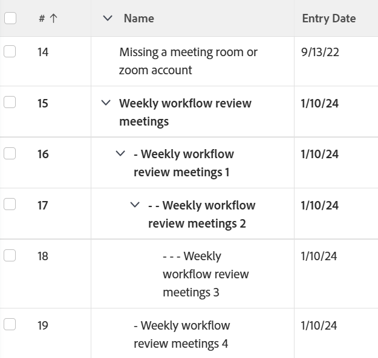

# 보기: 작업을 들여써서 작업의 상위-하위 관계를 표시합니다.

<!--Audited: 11/2024-->

작업 목록에 사용자 정의 보기를 추가하고 목록을 내보내기 전에 이 보기를 선택하여 내보낸 작업 목록에서 상위-하위 관계를 구분할 수 있습니다.



## 액세스 요구 사항

+++ 을 확장하여 이 문서의 기능에 대한 액세스 요구 사항을 봅니다.

<table style="table-layout:auto"> 
 <col> 
 <col> 
 <tbody> 
  <tr> 
   <td role="rowheader">Adobe Workfront 패키지</td> 
   <td> <p>임의</p> </td> 
  </tr> 
  <tr> 
   <td role="rowheader">Adobe Workfront 라이선스</td> 
   <td> 
   <p>보기를 수정하기 위한 기여자 또는 요청 </p>
   <p>표준 또는 보고서 수정 계획</p>
  </tr> 
  <tr> 
   <td role="rowheader">액세스 수준 구성</td> 
   <td> <p>보고서, 대시보드, 캘린더에 대한 액세스 권한을 편집하여 보고서 수정</p> <p>필터, 보기, 그룹화에 대한 액세스 권한을 편집하여 보기 수정</p> </td> 
  </tr> 
  <tr> 
   <td role="rowheader">개체 권한</td> 
   <td> <p>보고서에 대한 권한 관리</p>  </td> 
  </tr> 
 </tbody> 
</table>

이 표의 정보에 대한 자세한 내용은 [Workfront 설명서의 액세스 요구 사항](/help/quicksilver/administration-and-setup/add-users/access-levels-and-object-permissions/access-level-requirements-in-documentation.md)을 참조하십시오.


+++

## 작업을 들여써서 작업에 상위-하위 관계 표시

1. 내보낼 작업 목록이 있는 프로젝트로 이동합니다.
1. **보기** 드롭다운 메뉴를 클릭하고 **새 보기**&#x200B;를 선택합니다.
1. **작업 이름** 열 머리글을 클릭합니다.
1. 오른쪽 상단에서 **텍스트 모드로 전환**&#x200B;을 선택합니다.
1. **텍스트 모드 편집**&#x200B;을 클릭하고 기존 텍스트를 모두 제거합니다.
1. 다음 텍스트를 붙여넣습니다.


   ```
   displayname=
   linkedname=direct
   namekey=name
   querysort=name
   textmode=true
   valueexpression=IF({indent}<1,{name},IF({indent}<2,CONCAT(" - ",{name}),IF({indent}<3,CONCAT(" - - ",{name}),IF({indent}<4,CONCAT(" - - - ",{name}),CONCAT(" - - - - ",{name})))))
   valueformat=HTML
   ```

1. **완료** > **보기 저장**&#x200B;을 클릭합니다.
