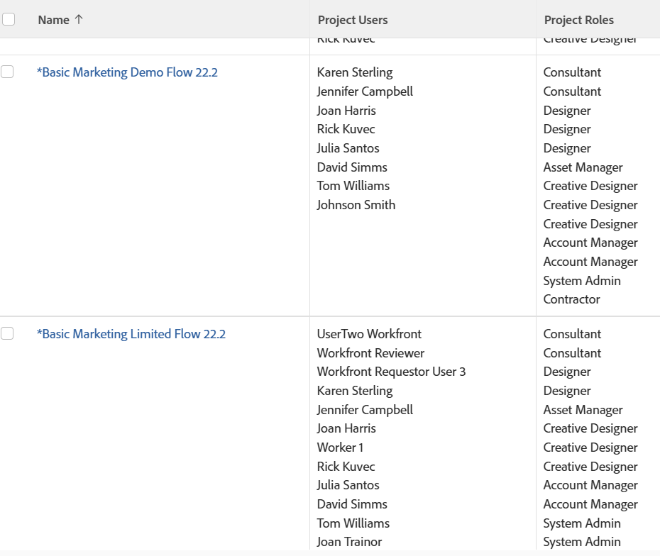

# 보기: 작업 역할이 있는 프로젝트 사용자 목록

프로젝트 목록 또는 보고서에서 이 보기를 적용하여 프로젝트와 연결된 사용자 목록과 프로젝트에서 수행 중인 작업 역할 목록을 표시할 수 있습니다.

이 보고서의 정보는 프로젝트의 사용자 영역에서도 찾을 수 있습니다.

>[!TIP]
>
>사용자에 대해 작업 역할이 나열되지 않지만 사용자 프로필에서 작업 역할과 연관되어 있다는 것을 알고 있는 경우, 이는 작업 및 문제에 할당되지만 작업 또는 문제에 대한 작업 역할과 연관되지 않을 수 있거나 보고서에 나열된 사용자가 작업 및 문제에 대한 책임이 아니라 프로젝트에서 다른 역할을 수행하는 것을 의미합니다(예: 소유자 또는 스폰서).

## 액세스 요구 사항

이 문서의 절차를 수행하려면 다음 액세스 권한이 있어야 합니다.

<table style="table-layout:auto"> 
 <col> 
 <col> 
 <tbody> 
  <tr> 
   <td role="rowheader">Adobe Workfront 플랜*</td> 
   <td> 
모든
 </td> 
  </tr> 
  <tr> 
   <td role="rowheader">Adobe Workfront 라이선스*</td> 
   <td> 
플랜 
 </td> 
  </tr> 
  <tr> 
   <td role="rowheader">액세스 수준 구성*</td> 
   <td> 
보고서, 대시보드, 달력에 대한 액세스 편집
 
필터, 보기, 그룹화에 대한 액세스 편집
 
참고: 여전히 액세스 권한이 없는 경우 Workfront 관리자에게 액세스 수준에서 추가 제한 사항을 설정하는지 문의하십시오. Workfront 관리자가 액세스 수준을 수정하는 방법에 대한 자세한 내용은 <a href="../../../administration-and-setup/add-users/configure-and-grant-access/create-modify-access-levels.md" class="MCXref xref">사용자 정의 액세스 수준 만들기 또는 수정</a>.
 </td> 
  </tr> 
  <tr> 
   <td role="rowheader">개체 권한</td> 
   <td> 
보고서에 대한 권한 관리
 
추가 액세스 요청에 대한 자세한 내용은 <a href="../../../workfront-basics/grant-and-request-access-to-objects/request-access.md" class="MCXref xref">개체에 대한 액세스 요청 </a>.
 </td> 
  </tr> 
 </tbody> 
</table>

&#42;어떤 계획, 라이선스 유형 또는 액세스 권한을 보유하고 있는지 알아보려면 Workfront 관리자에게 문의하십시오.

## 작업 역할이 있는 프로젝트 사용자 목록 보기

1. 프로젝트 목록으로 이동합니다.
1. 에서 **보기** 드롭다운 메뉴에서 **새 보기**.

1. 에서&#x200B;**열 미리 보기** 영역을 제외한 모든 열을 제거합니다.
1. 나머지 열의 헤더를 클릭한 다음 **텍스트 모드로 전환**.
1. 텍스트 모드 영역 위로 마우스를 가져간 후 **텍스트를 편집하려면 클릭하십시오.**.
1. 에서 찾을 텍스트를 제거합니다. **텍스트 모드** 상자를 열고 다음 코드로 바꿉니다.
   <pre>column.0.link.valueformat=val column.0.linkedname=direct column.0.listsort=string(name) column.0.namekey=name.abbr column.0.querysort=name column.0.section=0 column.0.shortview=false column.0.stretch=100 column.0.valufield=name column.0.valueformat=HTML column.0.width=200 column.1.displayname=Project Users column.1.list구분 기호=&lt;br&gt; column.1.listmethod=nested(projectUsers).lists column.1.textmode=true column.1.type=iterate column.1.valueexpression={user}.{name} column.1.valueformat=HTML column.2.displayname=프로젝트 역할 column.2.list구분 기호=&lt;br&gt; column.2.listmethod=nested(projectUserRoles).lists column.2.textmode=true column.2.type=iterate column.2.valueexpression={role}.{name} column.2.valueformat=HTML</pre>

1. 클릭 **보기 저장**.
