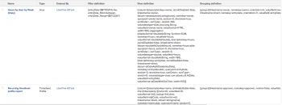

# 보기: 보고서에 사용된 보고 요소

이 보기는 보고서 목록에서 각 보고서를 사용할 때 Adobe Workfront에서 빌드하는 데 사용되는 보기, 필터 및 그룹화를 표시합니다.

다음을 볼 수 있습니다.

```
valuefields
```

또는

```
valueexpressions
```

보고서의 모든 요소에 사용됩니다.



## 액세스 요구 사항

이 문서의 단계를 수행하려면 다음 액세스 권한이 있어야 합니다.

<table style="table-layout:auto"> 
 <col> 
 <col> 
 <tbody> 
  <tr> 
   <td role="rowheader">Adobe Workfront 플랜*</td> 
   <td> <p>임의</p> </td> 
  </tr> 
  <tr> 
   <td role="rowheader">Adobe Workfront 라이센스*</td> 
   <td> <p>보기 수정 요청 </p>
   <p>보고서 수정 계획</p> </td> 
  </tr> 
  <tr> 
   <td role="rowheader">액세스 수준 구성*</td> 
   <td> <p>보고서, 대시보드, 캘린더에 대한 액세스 권한을 편집하여 보고서 수정</p> <p>필터, 보기, 그룹화에 대한 액세스 권한을 편집하여 보기 수정</p> <p><b>메모</b>

여전히 액세스 권한이 없는 경우 Workfront 관리자에게 액세스 수준에 추가 제한을 설정하는지 문의하십시오. Workfront 관리자가 액세스 수준을 수정하는 방법에 대한 자세한 내용은 <a href="../../../administration-and-setup/add-users/configure-and-grant-access/create-modify-access-levels.md" class="MCXref xref">사용자 지정 액세스 수준 만들기 또는 수정</a>을 참조하십시오.</p> </td>
</tr>  
  <tr> 
   <td role="rowheader">개체 권한</td> 
   <td> <p>보고서에 대한 권한 관리</p> <p>추가 액세스 요청에 대한 자세한 내용은 <a href="../../../workfront-basics/grant-and-request-access-to-objects/request-access.md" class="MCXref xref">개체 </a>에 대한 액세스 요청 을 참조하십시오.</p> </td> 
  </tr> 
 </tbody> 
</table>

&#42;보유 중인 플랜, 라이선스 유형 또는 액세스 권한을 확인하려면 Workfront 관리자에게 문의하십시오.

## 보고서에 사용된 보고 요소 보기

1. 보고서 목록으로 이동합니다.
1. **보기** 드롭다운 메뉴에서 **새 보기**&#x200B;를 선택합니다.

1. **열 미리 보기** 영역에서 열을 제외한 모든 열을 제거하십시오.
1. 나머지 열의 머리글을 클릭한 다음 **텍스트 모드로 전환**&#x200B;을 클릭합니다.
1. 텍스트 모드 영역 위로 마우스를 가져간 후 **텍스트를 편집하려면 클릭하세요**.
1. **텍스트 모드** 상자에서 찾은 텍스트를 제거하고 다음 코드로 바꿉니다.
   <pre>column.0.descriptionkey=name<br>column.0.link.linkproperty.0.name=ID<br>column.0.link.linkproperty.0.valuefield=ID<br>column.0.link.linkproperty.0.valueformat=string<br>column.0.link.lookup=link.run<br>column.0.link.value=val(objCode)<br>column.0.listsort=string(name)<br>column.0.namekey=name.abbr<br>column.0.querysort=name<br>column.0.valuefield=name<br>column.0.valueformat=HTML<br>column.description=key ttype<br>column.1.listsort=nested(view).string(uiObjCode)<br>column.1.namekey=objecttype.abbr<br>column.1.querysort=uiObjCode<br>column.1.valuefield=uiObjCode<br>column.1.valueformat=objCodeMessage<br>column.1.width=80<br>column.2.descriptionkey=enteredby<br>column.2.listsort=nested(enteredBy).string(lastName)<br>column.namekey=enteredby.abbr<br>column.querysort By:lastName<br>열.2.valuefield=enteredBy:name<br>열.2.valueformat=HTML<br>열.2.width=130<br>열.3.displayname=필터 정의<br>열.3.textmode=true<br>열.3.valuefield=filter:정의<br>열.3.valueformat=HTML<br>열.4.displayname=보기 정의<br>열.4.textmode=true<br>열.4.valuefield=view:정의<br>열.4.valueformat=HTML<br>열.5.displayname=Grouping<br>열.textcolumn.5 mode=true<br>column.5.valuefield=groupBy:definition<br>column.5.valueformat=HTML<br><br></pre>

1. **보기 저장**&#x200B;을 클릭합니다.
