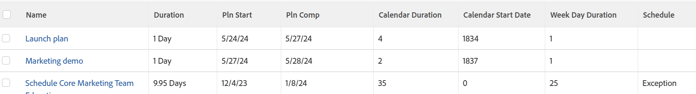

# 보기: 일정 예외의 영향을 받는 작업

<!--Audited: 11/2024-->

이 작업 보기는 주말, 개인 휴무 또는 기타 일정 예외로 인해 늦게 완료해야 하는 작업을 식별합니다.

이 보기는 다음을 표시합니다.

* 작업 기간
* 작업의 계획된 시작 및 계획된 완료 일자
* 작업의 계획된 시작 일자와 계획된 완료 일자 사이의 일수에 따른 작업 기간(달력 기간)
* 작업이 시작되는 프로젝트 일정의 일 수(달력 시작 일자)
* 작업의 계획된 시작 일자와 계획된 완료 일자 사이의 평일 수에 따른 작업의 요일 기간(요일 기간)
* 주중 근무일 기간이 작업 기간보다 길 경우 작업 기간에 예외 일자가 있으면 작업이 &quot;예외&quot;로 표시됩니다.\
  

## 액세스 요구 사항

+++ 을 확장하여 이 문서의 기능에 대한 액세스 요구 사항을 봅니다.

이 문서의 단계를 수행하려면 다음 액세스 권한이 있어야 합니다.

<table style="table-layout:auto"> 
 <col> 
 <col> 
 <tbody> 
  <tr> 
   <td role="rowheader">Adobe Workfront 플랜</td> 
   <td> <p>임의</p> </td> 
  </tr> 
  <tr> 
   <td role="rowheader">Adobe Workfront 라이선스</td> 
   <td> <p> 현재: 
   <ul>
   <li>보기 수정 요청</li> 
   <li>보고서 수정 계획</li>
   </ul>
     </p>
     <p> 신규: 
   <ul>
   <li>보기를 수정하는 기여자</li> 
   <li>보고서를 수정하는 표준</li>
   </ul>
     </p>
    </td> 
  </tr> 
  <tr> 
   <td role="rowheader">액세스 수준 구성*</td> 
   <td> <p>보고서, 대시보드, 캘린더에 대한 액세스 권한을 편집하여 보고서 수정</p> <p>필터, 보기, 그룹화에 대한 액세스 권한을 편집하여 보기 수정</p> </td> 
  </tr> 
  <tr> 
   <td role="rowheader">개체 권한</td> 
   <td> <p>보고서에 대한 권한 관리</p> </td> 
  </tr> 
 </tbody> 
</table>

이 표의 정보에 대한 자세한 내용은 [Workfront 설명서의 액세스 요구 사항](/help/quicksilver/administration-and-setup/add-users/access-levels-and-object-permissions/access-level-requirements-in-documentation.md)을 참조하십시오.

+++

## 일정 예외의 영향을 받는 작업 보기

1. 작업 목록으로 이동합니다.
1. **보기** 드롭다운 메뉴에서 **새 보기**&#x200B;를 선택합니다.
1. **열 미리 보기** 영역에서 열을 제외한 모든 열을 제거하십시오.
1. 나머지 열의 헤더를 클릭한 다음 **텍스트 모드로 전환** > **텍스트 모드 편집**&#x200B;을 클릭합니다.
1. **텍스트 모드 편집** 상자에서 찾은 텍스트를 제거하고 다음 코드로 바꿉니다.

   ```
   column.0.descriptionkey=name
   column.0.link.linkproperty.0.name=ID
   column.0.link.linkproperty.0.valuefield=ID
   column.0.link.linkproperty.0.valueformat=int
   column.0.link.lookup=link.view
   column.0.link.valuefield=objCode
   column.0.link.valueformat=val
   column.0.linkedname=direct
   column.0.listsort=string(name)
   column.0.namekey=name.abbr
   column.0.querysort=name
   column.0.shortview=false
   column.0.stretch=100
   column.0.valuefield=name
   column.0.valueformat=HTML
   column.0.width=150
   column.1.descriptionkey=duration
   column.1.linkedname=direct
   column.1.listsort=intAsInt(durationMinutes)
   column.1.namekey=duration.abbr
   column.1.querysort=durationMinutes
   column.1.shortview=false
   column.1.stretch=0
   column.1.valuefield=durationFieldLong
   column.1.valueformat=compound
   column.1.viewalias=duration
   column.1.width=80
   column.2.descriptionkey=plannedstartdate
   column.2.linkedname=direct
   column.2.listsort=atDateAsAtDate(plannedStartDate)
   column.2.namekey=plannedstartdate.abbr
   column.2.querysort=plannedStartDate
   column.2.shortview=false
   column.2.stretch=0
   column.2.valuefield=plannedStartDate
   column.2.valueformat=atDate
   column.2.width=80
   column.3.descriptionkey=plannedcompletiondate
   column.3.linkedname=direct
   column.3.listsort=atDateAsAtDate(plannedCompletionDate)
   column.3.namekey=plannedcompletiondate.abbr
   column.3.querysort=plannedCompletionDate
   column.3.shortview=false
   column.3.stretch=0
   column.3.valuefield=plannedCompletionDate
   column.3.valueformat=atDate
   column.3.width=80
   column.4.aggregator.displayformat=int
   column.4.aggregator.function=SUM
   column.4.aggregator.namekey=id
   column.4.aggregator.valueexpression=DATEDIFF({plannedCompletionDate},
   {plannedStartDate})+1
   column.4.aggregator.valueformat=intAsInt
   column.4.descriptionkey=id
   column.4.linkedname=direct
   column.4.listsort=intAsInt(ID)
   column.4.name=Calendar Duration
   column.4.querysort=ID
   column.4.shortview=false
   column.4.stretch=0
   column.4.valueexpression=DATEDIFF({plannedCompletionDate},{plannedStartDate})+1
   column.4.valueformat=int
   column.4.width=80
   column.5.aggregator.displayformat=int
   column.5.aggregator.function=SUM
   column.5.aggregator.namekey=id
   column.5.aggregator.valueexpression=DATEDIFF({plannedStartDate},{project}.
   {plannedStartDate})+0
   column.5.aggregator.valueformat=intAsInt
   column.5.descriptionkey=id
   column.5.linkedname=direct
   column.5.listsort=intAsInt(ID)
   column.5.name=Calendar Start Date
   column.5.querysort=ID
   column.5.shortview=false
   column.5.stretch=0
   column.5.valueexpression=DATEDIFF({plannedStartDate},{project}.{plannedStartDate})+0
   column.5.valueformat=int
   column.5.width=80
   column.6.aggregator.displayformat=int
   column.6.aggregator.function=SUM
   column.6.aggregator.namekey=id
   column.6.aggregator.valueexpression=WEEKDAYDIFF({plannedStartDate},
   {plannedCompletionDate})+0
   column.6.aggregator.valueformat=HTML
   column.6.descriptionkey=id
   column.6.linkedname=direct
   column.6.listsort=intAsInt(ID)
   column.6.name=Week Day Duration
   column.6.querysort=ID
   column.6.shortview=false
   column.6.stretch=0
   column.6.valueexpression=WEEKDAYDIFF({plannedStartDate},{plannedCompletionDate})+0
   column.6.valueformat=int
   column.6.width=80
   column.7.aggregator.displayformat=int
   column.7.aggregator.expression=IF((WEEKDAYDIFF({plannedStartDate},{plannedCompletionDate}))>({duration}/480),"Exception","")
   column.7.aggregator.function=SUM
   column.7.aggregator.namekey=id
   column.7.aggregator.valueformat=HTML
   column.7.linkedname=direct
   column.7.listsort=intAsInt(ID)
   column.7.name=Schedule
   column.7.querysort=ID
   column.7.shortview=false
   column.7.stretch=0
   column.7.valueexpression=IF((WEEKDAYDIFF({plannedStartDate},{plannedCompletionDate}))>({duration}/480),"Exception","")
   column.7.valueformat=HTML
   column.7.width=80
   ```

1. **완료** > **보기 저장**&#x200B;을 클릭합니다.
