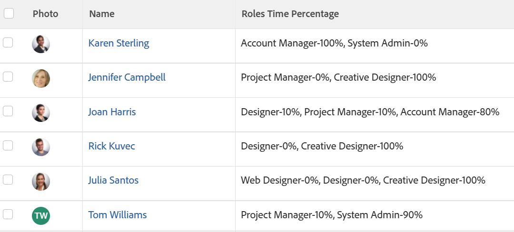

# 보기: FTE 가용성의 사용자 작업 역할 백분율

<!--Audited: 11/2024-->

사용자 목록 보기에 열을 추가하여 사용자와 연관된 작업 역할 목록과 사용자 프로필에 정의된 대로 각 작업 역할에 대한 FTE 가용성 비율을 표시할 수 있습니다.

사용자의 FTE 사용 가능 비율을 정의하는 방법에 대한 자세한 내용은 [사용자 프로필 편집](../../../administration-and-setup/add-users/create-and-manage-users/edit-a-users-profile.md)을 참조하세요.



## 액세스 요구 사항

+++ 을 확장하여 이 문서의 기능에 대한 액세스 요구 사항을 봅니다.

<table style="table-layout:auto"> 
 <col> 
 <col> 
 <tbody> 
  <tr> 
   <td role="rowheader">Adobe Workfront 패키지</td> 
   <td> <p>임의</p> </td> 
  </tr> 
  <tr> 
   <td role="rowheader">Adobe Workfront 라이선스</td> 
   <td> 
   <p>보기를 수정하기 위한 기여자 또는 요청 </p>
   <p>표준 또는 보고서 수정 계획</p>
  </tr> 
  <tr> 
   <td role="rowheader">액세스 수준 구성</td> 
   <td> <p>보고서, 대시보드, 캘린더에 대한 액세스 권한을 편집하여 보고서 수정</p> <p>필터, 보기, 그룹화에 대한 액세스 권한을 편집하여 보기 수정</p> </td> 
  </tr> 
  <tr> 
   <td role="rowheader">개체 권한</td> 
   <td> <p>보고서에 대한 권한 관리</p>  </td> 
  </tr> 
 </tbody> 
</table>

이 표의 정보에 대한 자세한 내용은 [Workfront 설명서의 액세스 요구 사항](/help/quicksilver/administration-and-setup/add-users/access-levels-and-object-permissions/access-level-requirements-in-documentation.md)을 참조하십시오.


+++

## FTE 가용성의 사용자 작업 역할 백분율 보기

1. 사용자 목록으로 이동합니다.
1. **보기** 드롭다운 메뉴에서 **새 보기**&#x200B;를 선택합니다.

1. **열 미리 보기** 영역에서 **열 추가**&#x200B;를 클릭합니다.

1. 새 열의 헤더를 클릭한 다음 **텍스트 모드로 전환** > **텍스트 모드 편집**&#x200B;을 클릭합니다.
1. **텍스트 모드 편집** 상자에서 찾은 텍스트를 제거하고 다음 코드로 바꿉니다.

   ```
   displayname=Roles Time Percentage
   listdelimiter=
   listmethod=nested(userRoles).lists
   textmode=true
   type=iterate
   valueexpression=CONCAT({role},'-',{timePercentage},'%')
   valueformat=HTML
   ```

1. **완료**&#x200B;를 클릭한 다음 **보기 저장**&#x200B;을 클릭합니다.

1. (선택 사항) 보기 이름을 업데이트한 다음 **보기 저장**&#x200B;을 클릭합니다.
