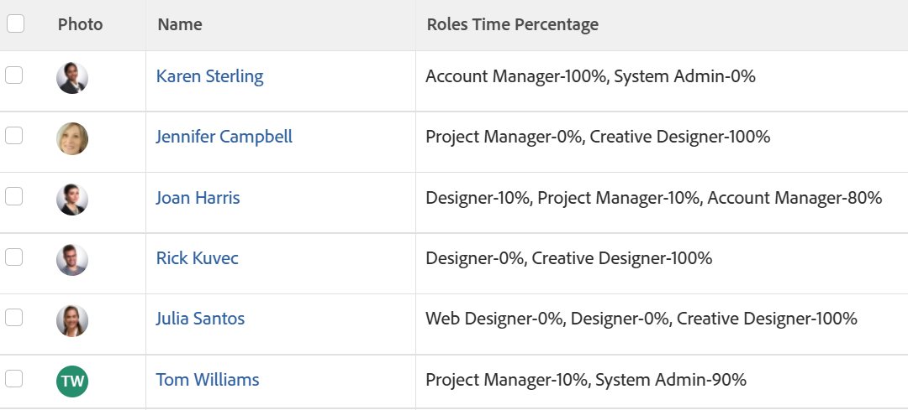

# 보기: FTE 가용성의 사용자 작업 역할 백분율

<!--Audited: 11/2024-->

You can add a column to the view of a user list to display a list of the Job Roles the user is associated with as well as the percentage of FTE availability for each job role, as defined in the user profile.

For information about defining the percentage of FTE availability for users, see [Edit a user&#39;s profile](../../../administration-and-setup/add-users/create-and-manage-users/edit-a-users-profile.md).



## 액세스 요구 사항

+++ 이 문서의 기능에 대한 액세스 요구 사항을 보려면 확장하십시오.

<table style="table-layout:auto"> 
 <col> 
 <col> 
 <tbody> 
  <tr> 
   <td role="rowheader">Adobe Workfront 패키지</td> 
   <td> <p>Any</p> </td> 
  </tr> 
  <tr> 
   <td role="rowheader">Adobe Workfront 라이선스</td> 
   <td> 
   <p>보기를 수정하기 위한 기여자 또는 요청 </p>
   <p>표준 또는 보고서 수정 계획</p>
  </tr> 
  <tr> 
   <td role="rowheader">액세스 수준 구성</td> 
   <td> <p>보고서, 대시보드, 캘린더에 대한 액세스 권한을 편집하여 보고서 수정</p> <p>필터, 보기, 그룹화에 대한 액세스 권한을 편집하여 보기 수정</p> </td> 
  </tr> 
  <tr> 
   <td role="rowheader">개체 권한</td> 
   <td> <p>보고서에 대한 권한 관리</p>  </td> 
  </tr> 
 </tbody> 
</table>

이 표의 정보에 대한 자세한 내용은 [Workfront 설명서의 액세스 요구 사항](/help/quicksilver/administration-and-setup/add-users/access-levels-and-object-permissions/access-level-requirements-in-documentation.md)을 참조하십시오.


+++

## View user Job Role percentage of FTE availability

1. Go to a list of users.
1. From the  **View**  drop-down menu, select  **New View**.

1. In the **Column Preview**  area, click **Add Column**.

1. Click the header of the new column, then click **Switch to Text Mode** > **Edit Text Mode**.
1. Remove the text you find in the  **Edit Text Mode**  box, and replace it with the following code:

   ```
   displayname=Roles Time Percentage
   listdelimiter=
   listmethod=nested(userRoles).lists
   textmode=true
   type=iterate
   valueexpression=CONCAT({role},'-',{timePercentage},'%')
   valueformat=HTML
   ```

1. **완료**&#x200B;를 클릭한 다음 **보기 저장**&#x200B;을 클릭합니다.

1. (선택 사항) 보기 이름을 업데이트한 다음 **보기 저장**&#x200B;을 클릭합니다.
