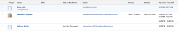

# 보기: 사용자 개인 휴무

<!--Audited: 11/2024-->

<!--

(NOTE: consider hiding this article because this is not a custom view anymore.)

-->

You can build a Time Off report to capture users&#39; time off information.

## 액세스 요구 사항

+++ 이 문서의 기능에 대한 액세스 요구 사항을 보려면 확장하십시오.

<table style="table-layout:auto"> 
 <col> 
 <col> 
 <tbody> 
  <tr> 
   <td role="rowheader">Adobe Workfront 패키지</td> 
   <td> 
Any
 </td> 
  </tr> 
  <tr> 
   <td role="rowheader">Adobe Workfront 라이선스</td> 
   <td> 
   
보기를 수정하기 위한 기여자 또는 요청 

   
표준 또는 보고서 수정 계획

  </tr> 
  <tr> 
   <td role="rowheader">액세스 수준 구성</td> 
   <td> 
보고서, 대시보드, 캘린더에 대한 액세스 권한을 편집하여 보고서 수정
 
필터, 보기, 그룹화에 대한 액세스 권한을 편집하여 보기 수정
 </td> 
  </tr> 
  <tr> 
   <td role="rowheader">개체 권한</td> 
   <td> 
보고서에 대한 권한 관리
  </td> 
  </tr> 
 </tbody> 
</table>

이 표의 정보에 대한 자세한 내용은 [Workfront 설명서의 액세스 요구 사항](/help/quicksilver/administration-and-setup/add-users/access-levels-and-object-permissions/access-level-requirements-in-documentation.md)을 참조하십시오.

+++

## View user personal time off

1. Click the **Main Menu** icon  in the upper-right corner, then click **Reports > New Report**.
1. From the drop-down menu, select **Time Off**.
1. **저장 및 닫기**&#x200B;를 클릭합니다.

   The report displays the following fields in the view by default:

   | 사용자 | The name of the user who indicated the time off in their profile. |
   |---|---|
   | 시작 일자 | The Start Date of the period of time off that the user indicated. |
   | 종료 일자 | The End Date of the period of time off that the user indicated. |

   {style="table-layout:auto"}

1. (Optional) Finish creating the report by editing any of the following tabs:

   * 열(조회)
   * 그룹화
   * 필터
   * 차트

   For information about creating reports, see the article [Create a custom report](../../../reports-and-dashboards/reports/creating-and-managing-reports/create-custom-report.md).

   >[!TIP]
   >
   >We recommend adding a grouping for the User object, to make the report easier to read.

<!--
<h2 data-mc-conditions="QuicksilverOrClassic.Draft mode">Add Time Off information to a user report</h2>
-->

<!--

(NOTE: old way of doing this, not working anymore)

-->

<!--

To add a column to a user view or report to display a list of future days which have been marked for time off by users:

-->

<!--

  

-->

<!--
   <li value="1" data-mc-conditions="QuicksilverOrClassic.Draft mode">  Click the <strong>Main Menu</strong> icon  in the upper-right corner, then click&nbsp;<strong>Reports > New Report.</strong> </li>
   -->

<!--
   <li value="2" data-mc-conditions="QuicksilverOrClassic.Draft mode">From the&nbsp;<strong>New Report</strong> drop-down menu, select&nbsp;<strong>User Report</strong>.</li>
   -->

<!--
   <li value="3" data-mc-conditions="QuicksilverOrClassic.Draft mode">Click <strong>Add Column</strong>.</li>
   -->

<!--
   <li value="4" data-mc-conditions="QuicksilverOrClassic.Draft mode">From the <strong>View</strong> drop-down menu, select <strong>New View</strong>.</li>
   -->

<!--
   <li value="5" data-mc-conditions="QuicksilverOrClassic.Draft mode">Click the header of the new column, then click<strong>Switch to Text Mode</strong>.</li>
   -->

<!--
   <li value="6" data-mc-conditions="QuicksilverOrClassic.Draft mode">Mouse over the text mode area, and click <strong>Click to edit text</strong>.</li>
   -->

<!--
   <li value="7" data-mc-conditions="QuicksilverOrClassic.Draft mode">Remove the text you find in the <strong>Text Mode</strong> box, and replace it with the following code: <!--
   <pre data-mc-conditions="QuicksilverOrClassic.Draft mode">displayname=Personal Time Off listdelimiter= listmethod=nested(reservedTimes).lists name=Upcoming Time Off stretch=0 textmode=true type=iterate valueexpression=IF({startDate}>$$TODAY,CONCAT({startDate}," - ",{endDate}),'') valueformat=HTML width=150</pre>
   </li>
   -->

<!--
   <li value="8" data-mc-conditions="QuicksilverOrClassic.Draft mode"> Click <strong>Save</strong>+<strong>Close</strong>.</li>
   -->
