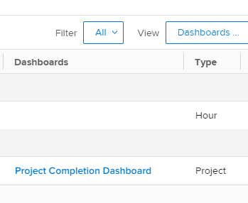

# 대시보드에서 보고서를 구성하는 방법 이해

## 보고서 목록의 대시보드 정보에 액세스

Adobe Workfront에서 보고서가 대시보드에 추가되었는지 여부를 확인할 수 있습니다. 이 기능은 유지할 수 있는 보고서와 시스템에서 삭제할 수 있는 보고서를 결정할 때 유용할 수 있습니다. 보고서가 대시보드에 있는 경우 사용자가 여전히 대시보드에 의존할 수 있습니다. 사용자가 사용 중인 대시보드에 나열된 보고서는 삭제하지 않는 것이 좋습니다.\
대시보드에 보고서를 추가하는 방법에 대한 자세한 내용은 문서 [대시보드에 보고서 추가](../../../reports-and-dashboards/dashboards/creating-and-managing-dashboards/add-report-dashboard.md)를 참조하십시오.

다음 중 하나를 수행하여 보고서가 대시보드에 추가되었는지 여부를 확인할 수 있습니다.

* 보고서 목록에 대한 보기 작성 및 열에 대시보드 정보 포함
* 사용 중인 것으로 알고 있는 하나 또는 여러 개의 특정 대시보드별로 보고서 목록 필터링
* 보고서 객체에 대한 보고서 작성 및 대시보드 정보가 포함된 보기 또는 필터 사용

누구나 보기 또는 필터를 빌드할 수 있지만 보고서를 빌드하려면 액세스 수준의 보고서에 대한 편집 액세스 권한이 있어야 합니다.\
보고서 액세스에 대한 자세한 내용은 문서 [보고서, 대시보드 및 일정에 대한 액세스 권한 부여](../../../administration-and-setup/add-users/configure-and-grant-access/grant-access-reports-dashboards-calendars.md)를 참조하십시오.\
보고서 작성에 대한 자세한 내용은 문서 [사용자 지정 보고서 만들기](../../../reports-and-dashboards/reports/creating-and-managing-reports/create-custom-report.md)를 참조하세요.

## 액세스 요구 사항

이 문서의 단계를 수행하려면 다음 액세스 권한이 있어야 합니다.

<table style="table-layout:auto"> 
 <col> 
 <col> 
 <tbody> 
  <tr> 
   <td role="rowheader">Adobe Workfront 플랜*</td> 
   <td> 
임의
 </td> 
  </tr> 
  <tr> 
   <td role="rowheader">Adobe Workfront 라이센스*</td> 
   <td> 
플랜 
 </td> 
  </tr> 
  <tr> 
   <td role="rowheader">액세스 수준 구성*</td> 
   <td> 
보고서, 대시보드, 캘린더에 대한 액세스 편집
 
필터, 보기, 그룹화에 대한 액세스 편집
 
참고: 여전히 액세스 권한이 없는 경우 Workfront 관리자에게 액세스 수준에서 추가 제한을 설정하는지 문의하십시오. Workfront 관리자가 액세스 수준을 수정하는 방법에 대한 자세한 내용은 <a href="../../../administration-and-setup/add-users/configure-and-grant-access/create-modify-access-levels.md" class="MCXref xref">사용자 지정 액세스 수준 만들기 또는 수정</a>을 참조하십시오.
 </td> 
  </tr> 
  <tr> 
   <td role="rowheader">개체 권한</td> 
   <td> 
보고서에 대한 권한 관리
 
추가 액세스 요청에 대한 자세한 내용은 <a href="../../../workfront-basics/grant-and-request-access-to-objects/request-access.md" class="MCXref xref">개체 </a>에 대한 액세스 요청 을 참조하십시오.
 </td> 
  </tr> 
 </tbody> 
</table>

&#42;보유 중인 플랜, 라이선스 유형 또는 액세스 권한을 확인하려면 Workfront 관리자에게 문의하십시오.

## 보고서 목록 보기에 대시보드 정보 표시

>[!WARNING]
>
>보고서 목록에 대시보드 열을 포함하면 특히 긴 보고서 목록의 경우 로드 시간이 크게 늘어날 수 있습니다.

보고서 목록에 대한 대시보드 정보로 보기를 만들려면 다음 작업을 수행하십시오.

1. Workfront 오른쪽 상단의 **기본 메뉴** 아이콘 을(를) 클릭한 다음 **보고서**&#x200B;를 클릭합니다.
1. 보고서 목록에서 **보기** 드롭다운 메뉴를 클릭합니다.
1. **새 보기**&#x200B;를 클릭합니다.
1. **열 추가**&#x200B;를 클릭합니다.
1. **필드 이름 입력** 필드에 &quot;대시보드&quot;를 입력하십시오.
1. **보고서** 개체 아래에서 **대시보드**&#x200B;를 선택합니다.

1. **보기 저장**&#x200B;을 클릭합니다.\
   보고서가 표시되는 대시보드가 보고서 목록의 대시보드 열에 표시됩니다.\
   

## 대시보드 정보로 보고서 목록 필터링

대시보드 정보로 보고서 목록을 필터링하려면 다음을 수행합니다.

1. Workfront 오른쪽 상단의 **기본 메뉴** 아이콘 을(를) 클릭한 다음 **보고서**&#x200B;를 클릭합니다.

1. 보고서 목록에서 **필터** 드롭다운 메뉴를 클릭합니다.
1. **새 필터**&#x200B;를 클릭한 다음 **필터 규칙 추가**&#x200B;를 클릭합니다.

1. **필드 이름 입력** 필드에 &quot;대시보드&quot;를 입력하십시오.

1. **대시보드** 개체 아래에서 **이름**&#x200B;을(를) 선택합니다.

1. 수정자 드롭다운 메뉴에서 **같음**&#x200B;을 선택한 다음 필터링할 대시보드 이름을 입력하세요. 필터에 대해 여러 대시보드를 선택할 수 있습니다.\
   

1. **저장 및 닫기**&#x200B;를 클릭합니다.\
   지정된 대시보드에만 나열되는 보고서 목록이 표시됩니다.\
   보고서 개체에 대한 보고서를 작성하고 보고서에서 이 필터를 사용할 수도 있습니다.
