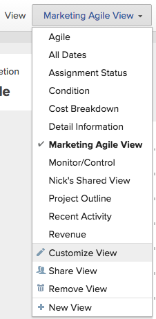
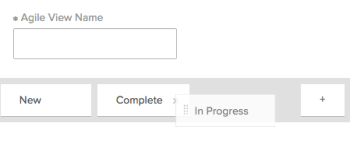

# Adobe Workfront에서 보기 만들기 또는 편집

<!-- Audited: 11/2024 -->

You can customize the type of information you display on the screen using views. Adobe Workfront에서 여러 유형의 보기를 사용할 수 있습니다.

This article describes how to create and edit standard views for lists and reports.

For more information, see [Views overview in Adobe Workfront](../../../reports-and-dashboards/reports/reporting-elements/views-overview.md).

## 액세스 요구 사항

+++ 이 문서의 기능에 대한 액세스 요구 사항을 보려면 확장하십시오.

<table style="table-layout:auto"> 
 <col> 
 <col> 
 <tbody> 
  <tr> 
   <td role="rowheader">Adobe Workfront 패키지</td> 
   <td> 
Any
 </td> 
  </tr> 
  <tr> 
   <td role="rowheader">Adobe Workfront 라이센스</strong></td> 
   <td> 
    
기여자 이상

    
요청 이상

   </td>
  </tr> 
  <tr> 
   <td role="rowheader">액세스 수준 구성</td> 
   <td> 
필터, 보기, 그룹화에 대한 액세스 편집
 
보고서, 대시보드, 달력에 대한 액세스 권한을 편집하여 보고서에서 보기 만들기

   </td> 
  </tr> 
  <tr> 
   <td role="rowheader">개체 권한</td> 
   <td> 
보고서에 대한 권한 관리를 통해 보고서에서 보기를 생성하거나 편집합니다
 
편집할 보기에 대한 권한 관리

   </td> 
  </tr> 
 </tbody> 
</table>

이 표에 있는 정보에 대한 자세한 내용은 [Workfront 설명서의 액세스 요구 사항](/help/quicksilver/administration-and-setup/add-users/access-levels-and-object-permissions/access-level-requirements-in-documentation.md)을 참조하십시오.
+++

## Create or customize a view

The process for creating or customizing a view differs depending on whether you are creating or customizing a standard view or a Board view.

### Create or customize a standard view {#create-or-customize-a-standard-view}

새 표준 보기를 만들거나 이전에 만든 기존 표준 보기를 사용자 지정할 수 있습니다.

1. 보기를 만들거나 사용자 지정할 목록에서 **보기** 드롭다운 메뉴를 클릭합니다.

1. 새 보기를 만들려면 **+ 새 보기** 단추를 클릭하십시오.
또는
Click the **Edit** icon  that appears on mouseover to the right of an existing view you want to edit.
The **Customize View** dialog box displays.

1. In the **Column Preview** section, do any of the following:

   * Modify the value of any column by clicking the column title and then selecting a new field.
   * Add a column by clicking **Add Column**, begin typing the name of the column that you want to add, then click it when it appears in the drop-down list.
   * Adjust the order that columns appear by dragging the column title to a new location.

   * **열 설정** 영역에서 **이 열 요약 기준**&#x200B;을 클릭하고 열에 표시할 데이터를 선택하십시오. 이 옵션은 다음 열 유형에 사용할 수 있습니다.
     <table style="table-layout:auto"> 
         <col> 
         <col> 
         <tbody> 
          <tr> 
           <td role="rowheader"><strong>날짜 필드</strong></td> 
           <td><ul>
           <li>최대</li>
         <li>최소</li>
           </ul></td> 
          </tr> 
          <tr>
           <td role="rowheader"><strong>통화 필드</strong></td> 
           <td><ul>
           <li>계수</li>
         <li>Sum</li>
           <li>평균</li>
         <li>최대</li>
           <li>최소</li>
         </ul></td> 
          </tr> 
         <tr>
           <td role="rowheader"><strong>문자열 및 부울 필드</strong></td> 
           <td><ul><li>계수</li></ul>
           
참고: 값이 항상 true/false이므로 Workfront에서는 일반적으로 부울 필드를 횟수로 요약하는 것을 권장하지 않습니다.
</td> 
          </tr> 
         </tbody> 
        </table>

     >[!NOTE]
     >
     >그룹화에서 다음 필드에 대한 값을 요약할 때 상위 객체(예: 상위 작업)에는 다음과 같은 예외가 적용됩니다.
     >   
     > * 실제 시간을 제외한 모든 숫자 및 통화 필드(예: 계획/실제 노무비, 계획/실제 경비, 계획/실제 원가, 계획 시간)는 하위 태스크 및 독립형 태스크에 대한 값만 요약합니다. 상위 작업 또는 상위 작업의 상위 값을 요약하지 않습니다.
     > * [실제 시간]은 기본 상위 작업과 독립형 작업의 값을 요약하며 상위 작업이나 하위 작업의 상위 작업에 대한 숫자를 요약하지 않습니다.
     > * 숫자 및 통화 값에 대한 사용자 지정 데이터 필드는 모든 작업(상위, 하위, 상위 및 독립형 작업)을 요약합니다.
     >
     >보고서에서 그룹화를 사용하는 방법에 대한 자세한 내용은 문서 [Adobe Workfront의 그룹화 개요](../../../reports-and-dashboards/reports/reporting-elements/groupings-overview.md)를 참조하십시오.

      * (선택 사항) 열에 대해 다음 정보를 지정하려면 **고급 옵션**&#x200B;을 클릭하십시오.

        <table style="table-layout:auto"> 
         <col> 
         <col> 
         <tbody> 
          <tr> 
           <td role="rowheader"><strong>사용자 정의 열 레이블</strong></td> 
           <td>
열에 대한 사용자 지정 레이블을 지정합니다. 이 레이블은 기본 레이블을 대체합니다. 호환성 문제를 방지하려면 UTF-8 문자만 사용하는 것이 좋습니다.
</td> 
          </tr> 
          <tr> 
           <td role="rowheader"><strong>필드 형식</strong></td> 
           <td>열의 필드에 대해 값을 표시할 형식을 선택하십시오.</td> 
          </tr> 
          <tr> 
           <td role="rowheader"><strong>대시보드에 있을 때 이 열 표시</strong></td> 
           <td>
보고서가 다른 보고서와 나란히 표시될 때 대시보드에 이 열을 표시하려면 이 옵션을 선택합니다. 이 옵션을 선택하지 않으면 보고서가 나란히 표시되는 대시보드에서 보고서를 볼 때 이 열이 표시되지 않습니다.
</td> 
          </tr> 
          <tr> 
           <td role="rowheader"><strong>열 규칙</strong></td> 
           <td>
Click <strong>+ Add a Rule for this Column</strong> to define a rule for the column. After you add a rule, you can define field and text styles for how fields that match that rule are displayed. Click <strong>Add Rule</strong> after you have finished defining the rule.
</td> 
          </tr> 
         </tbody> 
        </table>

        For more information about conditionally formatting views in reports, see the article [Use conditional formatting in Text Mode](../../../reports-and-dashboards/reports/text-mode/use-conditional-formatting-text-mode.md).

1. (조건부) **고급 옵션**&#x200B;을 클릭한 경우 **완료**&#x200B;를 클릭합니다.

1. 새 보기를 만들거나 현재 보기를 변경 내용으로 바꾸려면 **보기 저장**&#x200B;을 클릭하십시오.\
   또는\
   Click **Save as New View** to save your changes as a new view.

   >[!TIP]
   >
   >The **Save as New View** is the only option available when you customize a built-in Workfront view.

   Your access dictates how the view is saved. If you created the view originally, you can save the changes; otherwise, you are prompted to save a version. Keep in mind that changes you make to the view impact users with whom the view has been shared.

### 보드 보기 만들기 또는 사용자 지정 {#create-or-customize-an-agile-view}

보드 보기를 사용하여 애자일 방법론에 따라 프로젝트를 관리할 수 있습니다.

보드 보기는 프로젝트의 작업 및 문제 목록에만 사용할 수 있습니다.

미리 구성되어 있지만 특정 설정을 수정할 수 있습니다.

애자일 또는 보드 보기에 대한 자세한 내용은 문서 [보드 보기에서 애자일 프로젝트 관리](../../../manage-work/projects/manage-projects/manage-projects-in-agile-view.md)를 참조하십시오.

<!-- Legacy Agile views were deprecated with 25.3. This is old: 

>[!NOTE]
>
>This procedure only applies to the legacy Agile view, not to the board view of a project.

To create or customize an Agile view:

1. Go to the list of tasks on a project.
1. Click the **Board** icon , and then click **Use legacy agile** on the board view.

1. (Conditional) To customize an existing Agile view:

   1. Click the **View** drop-down menu, then select the Agile view you want to customize.  
      You cannot customize the default Agile view.
   
   1. Click the **View** drop-down menu again, then click **Customize View**.  
      

1. (Conditional) To create a new Agile view, click **New View**.  
   The **Customize Agile View** dialog box displays.  

1. In the **Customize Agile View** dialog box, specify a name for the Agile view.  
   We recommend that you include the word "Agile" in your view name, so users know this is an Agile view.  
   This name is displayed in the **View** drop-down menu when selecting a view.

1. Define the status columns to display on the story board in the Agile view. These are the task statuses that are defined by the Workfront administrator, as described in [Create or edit a status](../../../administration-and-setup/customize-workfront/creating-custom-status-and-priority-labels/create-or-edit-a-status.md).

   Only system statuses are available to use on the Agile story board. If a status is available only for an individual group you are a member of, the status is not available on the Agile story board. Furthermore, tasks that are in a status that is available only to a custom group are not visible when viewing the project in an Agile view.

   Users can move stories among these status columns on the Agile story board.  
   When defining status columns, you can do the following:

   <table style="table-layout:auto"> 
    <col> 
    <col>
    <tbody> 
     <tr> 
      <td role="rowheader"><strong>Reorder status columns:</strong> </td> 
      <td> Drag a status column to the order where you want it to appear. </td> 
     </tr> 
     <tr> 
      <td role="rowheader"><strong>Remove status columns:</strong> </td> 
      <td>Click the (x) icon on the column that you want to remove. You cannot remove the "New" status unless a custom status has been added to the view and that custom status equates with "New." For information about creating a custom status, see <a href="../../../administration-and-setup/customize-workfront/creating-custom-status-and-priority-labels/create-or-edit-a-status.md" class="MCXref xref">Create or edit a status</a>.</td> 
     </tr> 
     <tr> 
      <td role="rowheader"><strong>Add status columns:</strong> </td> 
      <td> 
Click the <strong>Plus</strong> icon, then select the status you want to add. All default system statuses are displayed, as well as any custom statuses that have been shared with you. You can configure up to 10 statuses to display.
</td> 
     </tr> 
    </tbody> 
   </table>

   *********   
(NOTE FOR ADD STATUS COLUMNS: research this and add: [! What if the status has been shared with me or a group I'm in (so I can see it here), but the status hasn't been shared with another user who also has access to a project where I later apply this view? Can that user still see this status on the project?]) 

       *************

1. In the **Associate Card Color to** area, select from the following options:

   <table style="table-layout:auto"> 
    <col> 
    <col>
    <tbody> 
     <tr> 
      <td role="rowheader"><strong>Story:</strong> </td> 
      <td>Any subtasks match the color of the parent task, so that the colors of all stories in any given swimlane are the same. Colors are randomly assigned to tasks when they are created if the task does not have any subtasks or does not have a parent task.</td> 
     </tr> 
     <tr> 
      <td role="rowheader"><strong>Free Form:</strong> </td> 
      <td> All cards are displayed as blue by default until a user changes the color manually, as described in the article <a href="../../../agile/use-scrum-in-an-agile-team/scrum-board/categorize-stories-by-color.md" class="MCXref xref">Categorize stories by color on the Scrum board</a>. </td> 
     </tr> 
     <tr> 
      <td role="rowheader"><strong>Priority:</strong> </td> 
      <td> 
 Colors are associated with the story priority, as follows:
 
       <ul> 
        <li>High = Red</li> 
        <li>Medium = Yellow</li> 
        <li>Low = Green If your Workfront administrator has configured custom priorities for your Workfront system, the highest priority is red, the second-highest is yellow, and the remaining are green.</li> 
       </ul> </td> 
     </tr> 
     <tr> 
      <td role="rowheader"><strong>Task Owner:</strong> </td> 
      <td> All stories with the same primary assignee are the same color. The primary assignee is the user who was first assigned to the task. </td> 
     </tr> 
    </tbody> 
   </table>

1. In the **Additional Fields** area, click **Add Field**, then select the field you want to add to story cards. (These are the same fields you can add when creating customizing a view or creating columns for a report.)  
   Repeat this process to add up to three additional fields to the story cards.  
   When you add fields to story cards, fields are view-only and display only when the field is populated.

   By default, the following types of data is displayed on the story card:

   * Story name with a link directly to the task
   * The project name with a link directly to the project  
     This link is displayed only when using the Agile view on an iteration; it is not displayed when using an Agile view on a project.
   * The task description
   * Current commitment
   * View and edit the percent complete either by adjusting the percent complete itself or by adjusting the number of points or hours that are complete
   * Assigned Users

   You can display additional data (including custom data) on story cards. You might want to display additional fields on story cards for any number of reasons. For example, you might want to display the Customer ID if you are working on stories for multiple customers within the project, or you might want to display the Task Start Date.

1. Click **Save**.  
   Your access dictates how the view is saved. If you created the view originally, you can save the changes; otherwise, you are prompted to save a version. Keep in mind that changes you make to the view impact users with whom the view has been shared.

1. (Optional) Click the **List** icon to return to the list of tasks.

-->
