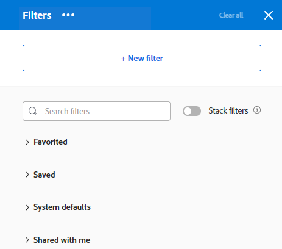
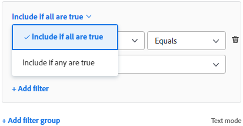

# Adobe Workfront에서 필터 만들기 또는 편집

필터가 있는 항목 목록의 화면에 표시하는 정보의 양을 제한할 수 있습니다. 객체에 대한 특정 정보를 기준으로 특정 기준을 정의하고 해당 기준을 충족하는 객체만 표시할 수 있습니다.

Adobe Workfront에서 다음 유형의 필터를 적용할 수 있습니다.

* 키워드를 사용하여 항목을 찾는 개체 목록의 빠른 필터. 나중에 사용할 수 있도록 저장할 수 없는 임시 필터입니다.

   빠른 필터에 대한 자세한 내용은 [목록에 빠른 필터 적용](../../../workfront-basics/navigate-workfront/use-lists/apply-quick-filter-list.md).

* 여러 목록 및 보고서에서 여러 시간을 저장하고 사용할 수 있는 영구 필터입니다. 이 문서에서는 목록 또는 보고서에서 영구 필터를 만들거나 기존 필터를 편집하는 방법에 대해 설명합니다.

* 목록 및 보고서 외부의 Workfront의 다른 영역에 있는 필터입니다.

   Workfront의 모든 필터 목록과 필터를 적용할 수 있는 영역에 대해서는 다음을 참조하십시오 [Adobe Workfront의 필터 개요](../../../reports-and-dashboards/reports/reporting-elements/filters-overview.md).

## 액세스 요구 사항

이 문서의 절차를 수행하려면 다음 액세스 권한이 있어야 합니다.

<table style="table-layout:auto"> 
 <col> 
 <col> 
 <tbody> 
  <tr> 
   <td role="rowheader"><strong>Adobe Workfront 플랜*</strong></td> 
   <td> 
모든
 </td> 
  </tr> 
  <tr> 
   <td role="rowheader"><strong>Adobe Workfront 라이선스*</strong></td> 
   <td> 
요청 이상
 </td> 
  </tr> 
  <tr> 
   <td role="rowheader"><strong>액세스 수준 구성*</strong></td> 
   <td> 
필터, 보기 및 그룹화에 대한 액세스 편집
 
참고: 여전히 액세스 권한이 없는 경우 Workfront 관리자에게 액세스 수준에서 추가 제한 사항을 설정하는지 문의하십시오. Workfront 관리자가 액세스 수준을 수정하는 방법에 대한 자세한 내용은 <a href="../../../administration-and-setup/add-users/configure-and-grant-access/create-modify-access-levels.md" class="MCXref xref">사용자 정의 액세스 수준 만들기 또는 수정</a>.
 </td> 
  </tr> 
  <tr> 
   <td role="rowheader"><strong>개체 권한</strong></td> 
   <td> 
필터에 대한 권한 관리
 
추가 액세스 요청에 대한 자세한 내용은 <a href="../../../workfront-basics/grant-and-request-access-to-objects/request-access.md" class="MCXref xref">개체에 대한 액세스 요청 </a>.
 </td> 
  </tr> 
 </tbody> 
</table>

&#42;어떤 계획, 라이선스 유형 또는 액세스 권한을 보유하고 있는지 알아보려면 Workfront 관리자에게 문의하십시오.

## 필터 구축 인터페이스 유형

아래 표에 설명된 필터 빌더 유형을 사용하여 필터를 만들 수 있습니다.

<table style="table-layout:auto">
<col>
<col>
<col>
<tbody>
<tr>
<td><strong>빌더 유형</strong></td>
<td><strong>필터 개체</strong></td>
<td><strong>사용 가능한 위치</strong></td>
</tr>
<tr>
<td>표준 빌더</td>
<td>
<ul>
<li> 
프로젝트
 </li>
<li> 
작업 
 </li>
<li> 
문제
 </li>
<li> 
포트폴리오
 </li>
<li> 
프로그램
 </li>
<li> 
사용자
 </li>
<li> 
템플릿
 </li>
<li> 
그룹
 </li>
</ul>
</td>
<td>
<ul>
<li> 
목록 
 </li>
</ul>
<ul>
<li> 
시나리오 플래너의 프로젝트 목록
 
시나리오 플래너는 추가 라이센스가 필요합니다. Workfront 시나리오 플래너에 대한 자세한 내용은 <a href="../../../scenario-planner/scenario-planner-overview.md">시나리오 계획자 개요</a>. 
 </li>
</ul>

참고: 필터에 대한 표준 빌더는 보고서에서 사용할 수 없습니다.
</td>
</tr>
<tr>
<td>기존 빌더</td>
<td>모든 오브젝트 </td>
<td>목록 및 보고서</td>
</tr>
</tbody>
</table>

Workfront 개체에 대한 자세한 내용은 [Adobe Workfront의 개체 이해](/help/quicksilver/workfront-basics/navigate-workfront/workfront-navigation/understand-objects.md).

다양한 인터페이스를 사용하여 필터를 만들 때에는 다음 사항을 고려하십시오.

* 위의 표에 나열된 영역에 대한 기존 필터 인터페이스를 찾는 동일한 위치에서 표준 빌더를 찾을 수 있습니다.
* 표준 빌더는 사용 가능한 모든 영역에 대한 기본 경험입니다. 기존 필터 빌더로 전환하려면 **자세히** 메뉴 옆에 있는 메뉴 [!UICONTROL **필터**] 을(를) 선택합니다. [!UICONTROL **기존 필터로 돌아가기**].

   

* 저장된 필터는 원래 빌드했던 경험에 관계없이 두 빌더에서 모두 사용할 수 있습니다. 예를 들어 기존 빌더를 사용하여 필터를 만든 경우 표준 빌더 인터페이스에서도 찾아 수정할 수 있습니다.

   >[!TIP]
   >
   >필터가 적용되지 않으면 모든 목록 항목이 표시되므로 &quot;모두&quot; 필터는 표준 빌더에 포함되지 않습니다. 클릭 [!UICONTROL **모두 지우기**] 빌더 오른쪽 상단에서 클릭하여 활성 필터를 지우고 모든 항목을 표시합니다. If [!UICONTROL **모두 지우기**] 이 흐리게 표시되어 있으면 필터가 적용되지 않습니다.

* AND 및 OR 연산자를 결합하는 여러 문 필터를 작성할 때 표준 빌더와 레거시 빌더에는 약간 다른 구문이 있습니다. 따라서 빌더에서 다른 빌더로 전환할 때 이러한 필터가 다르게 표시될 수 있습니다.

   >[!INFO]
   >
   >다음 시나리오가 있습니다.
   >
   >1. 표준 빌더를 사용하여 다음 구문을 사용하는 필터를 만듭니다.
   >
   >   `(A OR B) AND C`
   >
   >1. 에 설명된 대로 레거시 빌더로 전환하고 레거시 빌더의 구문을 사용하여 필터를 편집합니다. [기존 빌더에서 필터 만들기 또는 편집](#create-filter-in-legacy-builder) 섹션에 자세히 설명되어 있습니다. 기존 빌더에 대한 구문은 다음과 같이 필터 구문을 표시합니다.
   >
   >   `A AND C`
   >   `OR`
   >   `B AND C`
   >
   >1. 레거시 인터페이스의 필터를 변경합니다.
   >1. 표준 빌더로 다시 전환합니다. 필터 문은 위에 설명된 대로 레거시 빌더에서 지원되는 논리에 따라 표시됩니다.

   >
   >   이 필터는 표준 빌더 인터페이스에 다음과 같이 표시됩니다.
   >  
   >   `A AND C`
   >   `OR`
   >   `B AND C`
   > 
   >   이 문제는 필터가 기존 인터페이스에서 수정되었기 때문에 발생합니다.

## 표준 빌더에서 필터 만들기 또는 편집

다음과 같은 방법으로 표준 빌더 인터페이스를 사용하여 필터를 만들 수 있습니다.

* 처음부터
* 기존 필터 편집
* 기존 필터 복제
* 기존 필터를 복제하고 편집하고 새 필터로 저장합니다

표준 빌더 인터페이스를 사용하여 필터를 만듭니다.

1. 필터를 만들거나 사용자 지정할 필터가 포함된 목록으로 이동합니다.
1. 을(를) 클릭합니다. **필터** 아이콘  빌더 인터페이스를 엽니다.

   

1. 다음 필터 목록을 검토하십시오.

   <table style="table-layout:auto">
   <col>
   <col>
   <tbody>
   <tr>
   <td role="rowheader"><strong>즐겨찾기에 추가됨</strong></td>
   <td>즐겨찾기로 표시한 필터입니다. 필터를 즐겨찾으면 원래 위치가 필터 이름 아래에 표시되고, 즐겨찾기로 제거하지 않으면 원래 목록에서 숨겨집니다.</td>
   </tr>
   <tr>
   <td role="rowheader"><strong>저장됨</strong></td>
   <td>직접 빌드하고 저장한 필터.</td>
   </tr>
   <tr>
   <td role="rowheader"><strong>시스템 기본값</strong></td>
   <td>Workfront 시스템 기본 필터와 Workfront 관리자가 시스템 수준 또는 레이아웃 템플릿에서 필터 목록에 추가한 필터.</td>
   </tr>
   <tr>
   <td role="rowheader"><strong>나와 공유됨</strong></td>
   <td>다른 사용자가 만들고 공유했거나 시스템 전체에서 공유한 필터입니다.</td>
   </tr>
   </tbody>
   </table>

1. 다음 중 하나를 수행하십시오.

   * 클릭 **새 필터** 필터를 처음부터 만드는 방법
   * 관리할 권한이 있는 기존 필터를 마우스로 가리키고 를 클릭합니다. **편집** 아이콘  편집

      또는

      볼 권한이 있는 기존 필터를 마우스로 가리킨 다음 **자세히** 메뉴 를 클릭하고 **복제** 기존 필터를 복사하고 복사본을 편집하려면 다음을 수행하십시오.
   

1. (조건부) 필터 그룹의 모든 문과 일치하는 객체를 찾을지 아니면 임의의 문과 일치하는지 여부에 따라 다음 옵션 중에서 선택합니다.

   <table style="table-layout:auto">
   <col>
   <col>
   <tbody>
   <tr>
   <td role="rowheader"><strong>모두 true이면 포함</strong></td>
   <td>필터에서 찾은 개체는 필터 그룹의 모든 필터 기준과 일치해야 합니다. 이 경우 필터 문은 AND 연산자로 연결됩니다. 기본 선택 사항입니다.</td>
   </tr>
   <tr>
   <td role="rowheader"><strong>true인 경우 포함</strong></td>
   <td>필터에서 찾은 개체는 필터 그룹의 모든 필터 기준과 일치해야 합니다. 이 경우 필터 문은 OR 연산자로 연결됩니다.</td>
   </tr>
   </tbody>
   </table>

   

   필터 연산자에 대한 자세한 내용은 [Adobe Workfront의 필터 개요](/help/quicksilver/reports-and-dashboards/reports/reporting-elements/filters-overview.md).

1. 최근에 사용한 필드 목록과 필터링할 추천 필드 목록을 보려면 필드 드롭다운 메뉴를 클릭하십시오. 현재 필터링하고 있는 목록에 제안된 필드가 표시됩니다.

   선택할 수도 있습니다 **필드 찾아보기** 모든 필드 목록을 보려면 다음을 기준으로 필터링할 수 있습니다. 고급 검색의 필드는 개체 카테고리별로 그룹화됩니다.

   

1. 수정자 드롭다운 메뉴를 눌러 수정자를 선택합니다. 기본 수정자는 &quot;같음&quot;입니다.

   자세한 내용은 [필터 및 조건 수정자](/help/quicksilver/reports-and-dashboards/reports/reporting-elements/filter-condition-modifiers.md).

   >[!TIP]
   >
   >필터를 빌드하면 결과가 목록에 즉시 나타납니다. 필터 패널이 목록을 포함하는 경우 필터를 닫아서 디스플레이를 볼 수 있습니다. 입력한 정보는 패널을 다시 열 때 빌더에 유지됩니다.

1. 필터링할 필드 값을 입력하기 시작합니다. 예를 들어 다음을 기준으로 필터링하려면 문제 이름을 입력합니다 `Issue:Name`. 목록에 표시될 때 값을 선택합니다.

   >[!TIP]
   >
   >선택한 수정자에 따라 여러 값을 선택할 수 있습니다.

1. 클릭 **필터 추가** 다른 필드를 선택하고 필터 문에 새 필터링 기준을 추가하려면 를 클릭합니다.
1. (선택 사항) **삭제** 아이콘  기존 필터 문을 제거하려면 다음을 수행하십시오.

   또는

   클릭 **모두 지우기** 을 눌러 모든 필터링 기준을 지웁니다.

1. (선택 사항) **필터 그룹 추가** 을 추가하여 다른 필터링 기준 세트를 추가합니다. 세트 사이의 기본 연산자는 AND입니다. 연산자를 클릭하여 OR로 변경합니다.

   >[!TIP]
   >
   >필터 문의 연산자와 다른 연산자로 그룹을 연결하려는 경우 다른 필터 그룹을 사용할 수 있습니다.

   >[!INFO]
   >
   >완료되지 않고 보류 중이 아닌 이름에 &quot;마케팅&quot;이 포함된 프로젝트를 필터링하는 경우 다음 여러 필터 그룹을 사용할 수 있습니다.
   >`(Project: Name Contains Marketing AND Project: Percent Complete Does not equal 100)`
   >`OR`
   >`(Project: Name Contains Marketing AND Project: Status Does not equal On Hold)`
   >이 경우 각 필터 문은 AND로 연결되고 필터 그룹은 OR로 연결됩니다.

1. (선택 사항) **텍스트 모드** 텍스트 모드를 사용하여 필터를 계속 빌드하려면 다음을 수행하십시오.

   

   텍스트 모드 인터페이스가 열립니다.

   

   >[!TIP]
   >
   >텍스트 모드에서만 지원되는 필터를 수정해야 하는 경우 표준 빌더 인터페이스를 사용하여 텍스트 모드만 사용하고 필터를 가능한 한 많이 빌드하는 것이 좋습니다.

   텍스트 모드 인터페이스를 사용하여 필터를 만드는 방법에 대한 자세한 내용은 [텍스트 모드를 사용하여 필터 편집](/help/quicksilver/reports-and-dashboards/reports/text-mode/edit-text-mode-in-filter.md).

1. 클릭 **종료 텍스트 모드** 를 입력하여 표준 빌더 인터페이스로 돌아갑니다.

   >[!WARNING]
   >
   >일부 텍스트 모드 문은 표준 빌더 또는 레거시 인터페이스에서 지원되지 않습니다. 이러한 유형의 문을 만든 경우 텍스트 모드를 종료하면 경고 메시지가 생성됩니다.

1. (선택 사항) **적용** 필터를 목록에 적용하고 결과를 확인합니다.

   필터에 결과가 없으면 목록이 비어 있습니다.

1. 클릭 **새 이름으로 저장** 나중에 사용할 수 있도록 필터를 저장합니다.

   

1. 선택 **제목 없는 필터** 새 필터 이름을 대신 입력합니다.

   >[!TIP]
   >
   >나중에 찾을 수 있도록 필터의 이름을 지정하십시오. 필터에 이름을 지정하지 않으면 시스템에서 제목 없는 필터라고 합니다.

1. 새 필터의 아이콘을 **아이콘** 드롭다운 메뉴

   

1. (선택 사항) 필터에 대한 설명을 추가하여 고유한 사항을 나타냅니다. 설명은 필터 목록의 필터 이름 아래에 표시됩니다.

   >[!TIP]
   >
   >클릭 **취소** 언제든지 필터 빌딩 영역으로 돌아갑니다.

1. 클릭 **저장**. 필터가 저장된 목록에 저장되고 항목 목록에 적용됩니다.
1. (선택 사항) 필터를 즐겨찾는 목록으로 이동하려면 필터 서랍의 필터를 마우스로 가리킨 다음 즐겨찾기 아이콘을 클릭합니다 .

   또는

   필터 서랍의 필터 위로 마우스를 가져간 다음 자세히 메뉴를 클릭합니다 를 클릭하고 **즐겨찾기**.

1. (선택 사항) **스택 필터** 스택 필터를 활성화하는 단추. 이 옵션을 사용하면 두 개 이상의 저장된 필터를 적용할 수 있습니다. 필터 규칙은 선택한 순서대로 적용됩니다.

   >[!TIP]
   >
   >선택할 수 있는 필터 수에는 제한이 없습니다.
   >
   >여러 필터를 선택하는 경우 일치 결과를 표시하려면 해당 조건을 모두 동시에 충족해야 합니다.

   

   선택한 필터 수가 항목 목록 맨 위의 필터 아이콘 옆에 표시됩니다.

   

1. (선택 사항) 다음 중 하나를 수행합니다.

   * 필터를 다른 사용자와 공유하거나 시스템 전체에서 사용할 수 있도록 합니다. 자세한 내용은 [필터, 보기 또는 그룹화 공유](/help/quicksilver/reports-and-dashboards/reports/reporting-elements/share-filter-view-grouping.md).

   * 더 이상 유효하지 않거나 중복되는 경우 필터를 삭제합니다. 소유한 필터만 삭제할 수 있습니다. 공유된 필터를 제거할 수 있습니다. 자세한 내용은 [필터, 보기 및 그룹화 제거](/help/quicksilver/reports-and-dashboards/reports/reporting-elements/remove-filters-views-groupings.md).

## 기존 빌더에서 필터 만들기 또는 편집 {#create-filter-in-legacy-builder}

다음과 같은 방법으로 목록 및 보고서에서 이전 필터를 만들 수 있습니다.

* 처음부터
* 기존 필터를 편집하고 새 필터로 저장

필터를 만드는 데 사용하는 방법에 관계없이 필터를 처음부터 만들거나 기존 필터에서 만드는 것은 유사합니다.

1. 사용자 지정할 필터가 포함된 목록 또는 보고서로 이동합니다.
1. 을(를) 클릭합니다. **필터** 아이콘 .

   >[!TIP]
   >
   >보고서 작성자는 보고서에서 필터 드롭다운 목록을 보려면 필터를 편집할 수 있도록 허용해야 합니다. 보고서 기본값 필터는 기본적으로 보고서에 적용됩니다. 보고서 기본값 필터는 보고서를 편집할 때만 사용자 지정할 수 있습니다.

   

1. 클릭 **새 필터** 을 클릭합니다.

   또는

   수정할 필터를 마우스로 가리키고 를 클릭합니다. **편집** 아이콘 .

   필터 시작을 사용자 지정하는 빌더.

1. 다음 중 하나를 수행합니다.

   * 기존 규칙을 클릭하고 새 옵션을 선택하여 기존 필터 규칙을 수정합니다.
   * 을 클릭하여 필터 규칙 추가 **다른 필터 규칙 추가**&#x200B;에서 규칙을 추가할 옵션의 이름을 입력합니다 **필드 이름 입력 시작** 상자를 클릭한 다음 드롭다운 목록에 나타나면 클릭합니다.

      필터 개체와 연결된 필드는 **필드 이름 입력 시작** 상자.

   * 클릭 **및** 또는 **또는** 새 필터 규칙을 추가할 때.\
      필터 규칙을 추가할 때 필터 한정자를 사용하여 필터의 조건을 설정합니다. 필터 수정자에 대한 자세한 내용은 [필터 및 조건 수정자](../../../reports-and-dashboards/reports/reporting-elements/filter-condition-modifiers.md).

      >[!NOTE]
      >
      >여러 OR 문으로 AND 문 그룹을 연결할 때 각 명령문 그룹의 OR 문 간에 변경되지 않는 필드를 반복해야 합니다.
      >
      >
      >
      >&quot;marketing&quot;이라는 단어를 포함하고 현재 또는 Planning 상태의 프로젝트에 있는 작업에 대한 필터를 작성하는 경우 다음 필터 규칙이 있어야 합니다.
      >
      >`Task: Name Contains Marketing`
      >`AND`
      >`Project: Status Equals Current`
      >`OR`
      >`Task: Name Contains Marketing`
      >`AND`
      >`Project: Status Equals Planning`
      >
      >작업: 이름 &quot;마케팅&quot;이 두 AND 필터 그룹 간에 변경되지 않으므로 두 번째 그룹에서 반복되어야 합니다.

   * &quot;X&quot; 아이콘을 클릭하여 기존 필터 규칙을 삭제합니다.

1. (선택 사항) **텍스트 모드로 전환** 텍스트 모드 인터페이스를 사용하여 필터를 추가하려면 다음을 수행하십시오.

   텍스트 모드 인터페이스를 사용하여 필터를 만드는 방법에 대한 자세한 내용은 [텍스트 모드를 사용하여 필터 편집](../../../reports-and-dashboards/reports/text-mode/edit-text-mode-in-filter.md).

1. 클릭 **필터 저장** 새 필터를 만들거나 선택한 필터를 변경 사항으로 바꿉니다.

   또는

   클릭 **새 필터로 저장** 선택한 필터에서 새 필터를 만듭니다.

   새 필터는 필터 목록에 표시되며 선택한 목록 또는 보고서에 자동으로 적용됩니다.

1. (선택 사항) 다음 중 하나를 수행합니다.

   * 만든 필터를 다른 사용자와 공유하거나 시스템 전체에서 사용할 수 있도록 합니다. 자세한 내용은 [필터, 보기 또는 그룹화 공유](/help/quicksilver/reports-and-dashboards/reports/reporting-elements/share-filter-view-grouping.md).
   * 목록에 더 이상 표시하지 않을 필터를 제거합니다. 자세한 내용은 [필터, 보기 및 그룹화 제거](/help/quicksilver/reports-and-dashboards/reports/reporting-elements/remove-filters-views-groupings.md).

