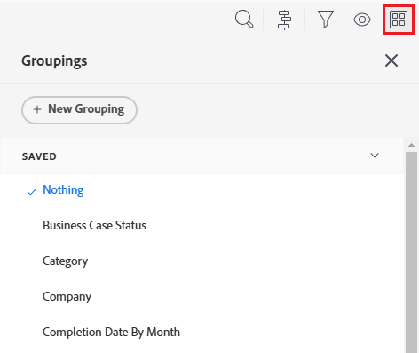

# Adobe Workfront에서 그룹화 만들기

<!-- Audited: 11/2024 -->

<!--(NOTE: This is a third part of an article split in 3 about creating and customizing groupings (2 how-tos and one reference)-->

보고서 또는 목록의 결과를 그룹화하여 구성할 수 있습니다. 그룹화는 특정 정보에 따라 정보를 분류합니다.

사용자 지정 그룹화를 처음부터 만들거나 기존 그룹화를 사용자 지정할 수 있습니다. 아래 단계에 따라 그룹화를 처음부터 만듭니다.

## 액세스 요구 사항

+++ 을 확장하여 이 문서의 기능에 대한 액세스 요구 사항을 봅니다. 

<table style="table-layout:auto"> 
 <col> 
 <col> 
 <tbody> 
  <tr> 
   <td role="rowheader">Adobe Workfront 패키지</td> 
   <td> 
임의
 </td> 
  </tr> 
  <tr> 
   <td role="rowheader">Adobe Workfront 라이선스</strong></td> 
   <td> 
    
기여자

    
요청

   </td>
  </tr> 
  <tr> 
   <td role="rowheader">액세스 수준 구성</td> 
   <td> 
필터, 보기, 그룹화에 대한 액세스 편집
 
보고서, 대시보드, 캘린더에 대한 액세스 권한을 편집하여 보고서에서 그룹화를 만들 수 있습니다.

   </td> 
  </tr> 
  <tr> 
   <td role="rowheader">개체 권한</td> 
   <td>
보고서에서 그룹화를 편집하려면 보고서에 대한 권한 관리
</td> 
   </td> 
  </tr> 
 </tbody> 
</table>

이 표의 정보에 대한 자세한 내용은 [Workfront 설명서의 액세스 요구 사항](/help/quicksilver/administration-and-setup/add-users/access-levels-and-object-permissions/access-level-requirements-in-documentation.md)을 참조하십시오.

+++

## 그룹화 만들기

1. 사용자 지정 그룹화를 만들 보고서 또는 목록으로 이동합니다.
1. **그룹화** 아이콘 을 클릭합니다.

   

1. **+ 새 그룹화**&#x200B;을(를) 클릭합니다.
그룹화 시작을 만들기 위한 인터페이스 빌더입니다.

1. **그룹화 미리 보기** 영역에서 **그룹화 추가**&#x200B;를 클릭하여 보고서의 정보를 구성하는 방법을 정의합니다. 보고서에서 그룹화가 표시되는 모양에 대한 미리보기가 아래에 표시되어 있습니다.

1. 보고서에서 정보를 구성하는 방법을 나타내는 필드 이름을 입력한 다음 드롭다운 목록에 나타나면 해당 필드 이름을 클릭합니다.
1. (선택 사항 및 조건부) 업데이트된 목록에서 그룹화를 작성할 때 그룹화의 결과를 확장하지 않고 축소되게 표시하려면 **기본적으로 이 그룹화를 축소**&#x200B;를 선택합니다. 이 설정은 기본적으로 비활성화되며 그룹화 결과는 항상 확장된 목록에 표시됩니다.

   업데이트된 목록과 기존 목록에 대한 자세한 내용은 문서 [Adobe Workfront 목록 시작](../../../workfront-basics/navigate-workfront/use-lists/view-items-in-a-list.md#updated)에서 [업데이트된 목록과 기존 목록의 차이점](../../../workfront-basics/navigate-workfront/use-lists/view-items-in-a-list.md) 섹션을 참조하십시오.

   <!--
   
(NOTE: the tips repeat in the Edit existing grouping article and Common uses of text mode)

   -->

   >[!TIP]
   >
   >* 목록을 볼 때 수동으로 그룹화를 조정하면 Workfront은 로그아웃하기 전까지 수동 기본 설정을 기억합니다. 다시 로그인하면 이 설정에 따라 목록이 표시됩니다.
   >* 차트 요소나 레거시 목록에서 그룹화에 액세스하면 그룹화 결과가 항상 확장되어 표시됩니다. 이러한 경우 이 설정은 무시됩니다.

1. 4, 5, 6단계를 반복하여 추가 그룹화를 정의합니다.\
   정보 구성을 위해 최대 3개의 그룹화를 정의할 수 있습니다. 매트릭스 보고서를 만들어 최대 4개의 그룹화로 정보를 추가로 구성할 수 있습니다. 매트릭스 보고서에 대한 자세한 내용은 [매트릭스 보고서 만들기](../../../reports-and-dashboards/reports/creating-and-managing-reports/create-matrix-report.md)를 참조하십시오.

1. **그룹화 저장**&#x200B;을 클릭합니다.

## 추가 정보

다음도 참조하십시오.

* Adobe Workfront의 [그룹화 개요](../../../reports-and-dashboards/reports/reporting-elements/groupings-overview.md)
* [보고 요소: 필터, 보기 및 그룹화](../../../reports-and-dashboards/reports/reporting-elements/reporting-elements-filters-views-groupings.md)
* [기존 그룹화 편집](../../../reports-and-dashboards/reports/reporting-elements/edit-existing-groupings.md)

<!--

<h1>Create or edit groupings in Adobe Workfront</h1>

The highlighted information on this page refers to functionality not yet generally available. It is available only in the Preview Sandbox environment.

You can organize the results of a report or list with a grouping. Groupings categorize data based on a particular piece of information. For more information on groupings, see <a href="../../../reports-and-dashboards/reports/reporting-elements/groupings-overview.md" class="MCXref xref">Groupings overview in Adobe Workfront</a>.

You can create groupings in lists and reports in the following ways:

<ul>
<li> 
From scratch
 </li>
<li> 
Edit an existing grouping that you originally created or that was shared with you
 </li>
<li> 
Copy an existing grouping
 
To copy an existing grouping, you can edit it and save it as a new grouping.
 </li>
</ul>
<h2>Types of grouping-building interfaces</h2>

You can create groupings using the types of grouping builders described in the table below.

<table style="table-layout:auto">
<col>
</col>
<col>
</col>
<col>
</col>
<tbody>
<tr>
<td><strong>Builder type</strong> </td>
<td><strong>Grouping object</strong> </td>
<td><strong>Where available</strong> </td>
</tr>
<tr>
<td><strong>Standard builder</strong> </td>
<td>All objects</td>
<td>Reports and lists</td>
</tr>
<tr data-mc-conditions="QuicksilverOrClassic.Quicksilver">
<td rowspan="2">

<strong>Beta builder</strong> 

 </td>
<td>

Projects

Tasks

Issues

 </td>
<td>

Lists

 </td>
</tr>
<tr data-mc-conditions="QuicksilverOrClassic.Quicksilver">
<td colspan="2"> <note type="note">
Beta builders for groupings are not available in reports.
</note> </td>
</tr>
</tbody>
</table>

Consider the following when creating groupings using the different builders:

<ul data-mc-conditions="QuicksilverOrClassic.Quicksilver">
<li>

You can switch back and forth between the standard builder and the beta builder, where the beta option is available.

 </li>
<li>

After you have enabled the beta builder in one area, it is the default experience for all areas where it is available.

 
Example: </b>"><b>Example: </b>If you enable the beta builder in a project list, it is the default experience for building task and issue groupings in lists as well. 
 </li>
<li> 
Groupings are available in both builders, regardless of which experience you used to originally build them. 
 
Example: </b>"><b>Example: </b>If you created a grouping using the standard builder, you can find and modify it in the beta builder interface as well. 
 </li>
</ul>
<h2>Access requirements</h2>

You must have the following access to perform the steps in this article:

<table style="table-layout:auto">
<col>
</col>
<col>
</col>
<tbody>
<tr>
<td role="rowheader">Adobe Workfront plan*</td>
<td> 
Any
 </td>
</tr>
<tr>
<td role="rowheader">Adobe Workfront license*</td>
<td> 
Request or higher
 </td>
</tr>
<tr>
<td role="rowheader">Access level configurations*</td>
<td> 
Edit access to&nbsp;filters, views, and groupings
 <note type="note">
If you still don't have access, ask your Workfront administrator if they set additional restrictions in your access level. For information on how a Workfront administrator can modify your access level, see
<a href="../../../administration-and-setup/add-users/configure-and-grant-access/create-modify-access-levels.md" class="MCXref xref">Create or modify custom access levels</a>.
</note> </td>
</tr>
<tr>
<td role="rowheader">Object permissions</td>
<td> 
Manage access to a grouping to be able to modify or copy it
 
For information on requesting additional access, see <a href="../../../workfront-basics/grant-and-request-access-to-objects/request-access.md" class="MCXref xref">Request access to objects </a>.
 </td>
</tr>
</tbody>
</table>

*To find out what plan, license type, or access you have, contact your Workfront administrator.

<h2>Create a grouping in the standard builder</h2>

Regardless of the method you use to create groupings, creating a grouping from scratch or from an existing grouping is similar.

<ol>
<li value="1"> 
Go to a list or a report where you want to create a grouping or that contains the grouping that you want to customize.
 </li>
<li value="2"> 
Click the <strong>Grouping</strong> icon .
 
  
 </li>
<li value="3">

Click <strong>New Grouping</strong> at the top of the list of groupings.

Or

Hover over the grouping you want to modify and click the <strong>Edit</strong> icon .

 
The builder for customizing the grouping opens.
 </li>
<li value="4"> 
In the <strong>Grouping Preview</strong> section, click <strong>Add Grouping</strong> to define how you want information in the report to be organized. A preview of what the grouping looks like in the report is shown below.
 </li>
<li value="5"> 
Begin typing the name of the field that represents the way that you want to organize information in the report, then click it when it appears in the drop-down list.
 </li>
<li value="6"> 
(Optional and conditional) When customizing a grouping in an updated list, select <strong>Collapse this grouping by default</strong> if you want the results in the grouping to display collapsed rather than expanded.&nbsp;This setting is disabled by default and the results of the grouping always display in the expanded list.
 
 For information about updated and legacy lists, see the section <a href="../../../workfront-basics/navigate-workfront/use-lists/view-items-in-a-list.md#updated" class="MCXref xref">The difference between the updated and the legacy lists</a>&nbsp;in the article <a href="../../../workfront-basics/navigate-workfront/use-lists/view-items-in-a-list.md" class="MCXref xref">Get started with lists in&nbsp;Adobe Workfront</a>.

(NOTE: the tips repeat in the Edit existing grouping article and Common uses of text mode)

<note type="tip">  
<ul>
<li>When you manually adjust groupings when viewing a list, Workfront remembers your manual preference until you log out. When you log back in, the list displays according to this setting.</li>
<li> 
The results of a grouping always display expanded after accessing them from a chart element or in a legacy list. In these cases, this setting is ignored.
 

(NOTE: Legacy lists in classic do NOT have this option; legacy lists in NWE DO have this option but it's not functional; this is conditioned only for QS)

</li>
</ul>
</note> </li>
<li value="7"> 
Repeat Steps  4, 5, and 6  to define additional groupings.
 
You can define up to three groupings for organizing information. You can further organize your information with up to four groupings by creating a matrix report. For more information on matrix reports, see <a href="../../../reports-and-dashboards/reports/creating-and-managing-reports/create-matrix-report.md" class="MCXref xref">Create a matrix report</a>.
 </li>
<li value="8"> 
(Optional) Click <strong>Switch to Text Mode</strong> to add a grouping using the Text Mode interface.
 
For more information about creating a grouping using the text mode interface, see <a href="../../../reports-and-dashboards/reports/text-mode/edit-text-mode-in-grouping.md" class="MCXref xref">Edit text mode in a grouping</a>.
 </li>
<li value="9"> 
Click <strong>Save Grouping</strong> to create a new grouping.
 
Or
 
Click <strong>Save as New Grouping</strong> to create a new grouping from the selected one.
 
The new grouping displays in the list of groupings.
 </li>
<li value="10"> 
(Optional) Remove groupings you no longer want to display in the list.
 
For information, see <a href="../../../reports-and-dashboards/reports/reporting-elements/remove-filters-views-groupings.md" class="MCXref xref">Remove filters, views, and groupings</a>.
 </li>
</ol>

<h2>Create a grouping in the beta builder</h2>
<h3>Enable the beta builder</h3>

The beta builder toggle is disabled by default. You must enable it to use the beta builder.

<ol>
<li value="1">Go to a project, task, or issue list.</li>
<li value="2"> 
Click the <strong>Grouping</strong> icon , then enable the beta builder toggle.
 
The beta builder interface opens.
 <note type="tip">
The header of the grouping builder interface is blue when the beta builder is enabled. This enables the beta builder for all areas of Workfront where it is available.
</note> 

(NOTE: replace shot below!)

  
 </li>
<li value="3"> 
Continue with <a href="#create-a-grouping-in-the-beta-builder" class="MCXref xref">Create a grouping in the beta builder</a>, below.
 </li>
</ol>

<strong>Create a grouping in the beta builder</strong>

<ol>
<li value="1"> 
Go to a project, task, or issue list where you want to create a grouping, and click the <strong>Grouping</strong> icon .
 </li>
<li value="2"> 
Click <strong>New Grouping</strong> to create a new grouping.
 
Or
 
Hover over an existing grouping in the My groupings area, then click the <strong>Edit</strong> icon  to edit an existing grouping.
 
Or
 
Hover over an existing grouping in the My groupings area, select the <strong>More</strong> icon , and select <strong>Duplicate</strong> to copy a grouping.
 </li>
<li value="3"> 
Start typing the name of a field in the Group by area, then select it when it displays in the list.
 
You can also select <strong>Search all fields</strong> to view a list of all fields to group by. The fields in the advanced search are grouped by object category.
 <note type="tip">
As you build the grouping, the results appear immediately in the list.
</note> </li>
<li value="4"> 
(Optional) Click <strong>Add grouping</strong> to add a second or third grouping.
 
  
 </li>
<li value="5"> 
(Optional) To reorder the groupings, select a grouping and drag it to the new position.
 
Or
 
Select a grouping and use the keyboard arrow keys to change the order.
 </li>
<li value="6"> 
(Optional) Make other selections for the groupings as needed:

<ul>
<li> 
When grouping by date you must choose a date option such as week, month, or quarter.
 </li>
<li> 
Select  to set a grouping to be expanded by default.
 </li>
<li> 
Select  to delete a grouping.
 </li>
</ul> 
  
 </li>
<li value="7"> 
(Optional) Select <strong>Text Mode</strong> to continue building the grouping using the Text Mode interface.
 
For more information about creating a grouping using the text mode interface, see <a href="../../../reports-and-dashboards/reports/text-mode/edit-text-mode-in-grouping.md" class="MCXref xref">Edit text mode in a grouping</a>.
 </li>
<li value="8"> 
(Optional) To use the grouping as an ad hoc grouping without saving it:

<ul>
<li> 
When working in a new grouping, close the beta builder.
 </li>
<li> 
When editing an existing grouping, select <strong>Apply</strong>.
 </li>
</ul> </li>
<li value="9"> 
Select <strong>Save as new</strong> for a new grouping, or <strong>Save</strong> for an existing grouping.
 </li>
<li value="10"> 
Type a name for the grouping.
 </li>
<li value="11"> 
(Optional) Select an icon for the grouping to represent the field type.
 </li>
<li value="12"> 
(Optional) Type a description of the grouping.
 </li>
<li value="13"> 
Select <strong>Save</strong>.
 
The grouping is saved in the My groupings list.
 </li>
</ol>

-->
