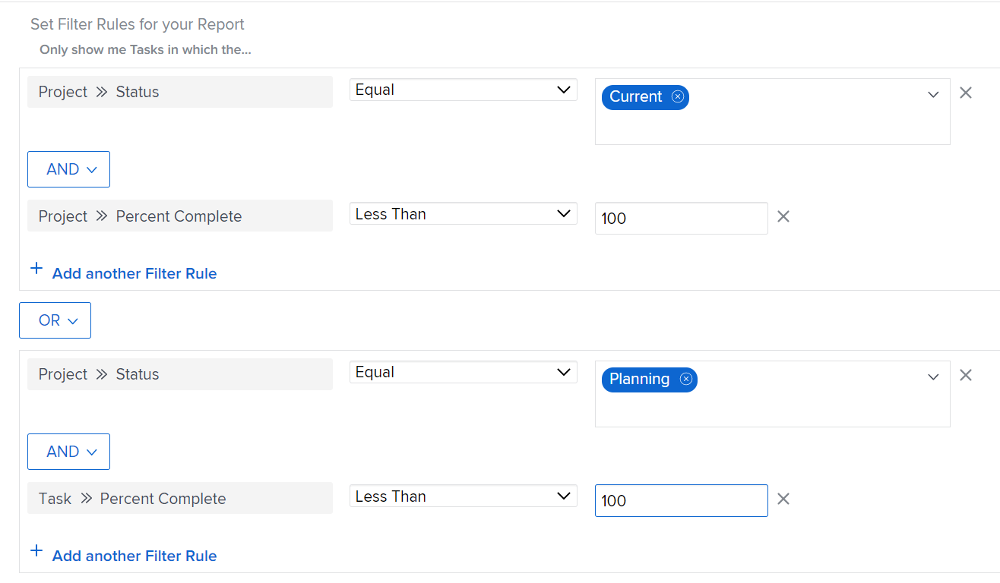

# Adobe Workfront의 필터 개요

Adobe Workfront의 필터를 사용하여 목록, 보고서 또는 기타 영역에서 화면에 표시하는 정보의 양을 줄일 수 있습니다.

>[!NOTE]
>
>이 문서에서는 Workfront에서 필터를 적용할 수 있는 모든 영역과 목록 및 보고서의 필터에 대한 일반 정보에 대해 설명합니다. 목록 및 보고서 이외의 특정 영역에서 필터에 대한 정보를 알아보려면 아래 링크된 문서를 참조하십시오.

## Workfront 필터 유형

Workfront에는 몇 가지 유형의 필터가 있습니다. 모든 필터는 화면에 표시하는 정보의 양을 제한하는 동일한 목적을 충족합니다.

다음은 Workfront에서 사용할 수 있는 필터 유형입니다.

<table style="table-layout:auto"> 
 <col> 
 <col> 
 <tbody> 
  <tr> 
   <td><strong>임시 필터</strong></td> 
   <td> 
키워드 검색을 기반으로 한 일회성 빠른 필터로 목록에서 항목을 신속하게 찾을 수 있습니다. 
 </td> 
  </tr> 
  <tr> 
   <td><strong>목록 및 보고서에 대한 영구 필터</strong></td> 
   <td>Workfront에 의해 구축되거나 사용자 또는 다른 사용자가 사용자 지정. 두 번 이상 사용할 수 있습니다. 올바른 액세스 및 권한이 있는 경우 여러 영역에서 이름을 지정하고 저장 및 재사용할 수 있습니다. 이러한 필터를 다른 사용자와 공유할 수도 있습니다. 객체 목록이나 보고서에서 사용할 수 있습니다. </td> 
  </tr> 
  <tr> 
   <td><strong>특수 영역에 대한 임시 또는 영구 필터</strong></td> 
   <td>Workfront에 의해 구축되거나 사용자 또는 다른 사용자가 사용자 지정. 영구 필터를 저장하고 두 번 이상 사용하거나, 저장하지 않고 즉시 필요한 사항을 제공하기 위해 일시적으로 적용할 수 있습니다. 저장하지 않은 필터는 공유하거나 삭제할 수 없습니다. 섹션에 설명된 대로 특수 영역에서 사용할 수 있습니다 <a href="#workfront-filters-for-special-areas" class="MCXref xref">특수 영역에 대한 Workfront 필터</a> 참조하십시오. </td> 
  </tr> 
 </tbody> 
</table>

## Workfront 임시 필터

빠른 필터를 사용하면 키워드를 사용하여 화면에서 항목을 검색할 수 있습니다. 페이지를 새로 고치면 임시 빠른 필터가 지워집니다. 임시 필터를 저장하여 다시 사용할 수 없습니다.

빠른 필터에 대한 자세한 내용은 [목록에 빠른 필터 적용](../../../workfront-basics/navigate-workfront/use-lists/apply-quick-filter-list.md).

## 목록 및 보고서에 대한 Workfront 영구 필터

객체 목록이나 보고서에서 만든 영구 필터를 사용할 수 있습니다.

Workfront의 개체 및 보고서를 작성할 수 있는 개체에 대한 자세한 내용은 [Adobe Workfront의 개체 이해](../../../workfront-basics/navigate-workfront/workfront-navigation/understand-objects.md).

목록 및 보고서의 필터에 대한 자세한 내용은 다음 문서를 참조하십시오.

* [Adobe Workfront에서 필터 만들기 또는 편집](../../../reports-and-dashboards/reports/reporting-elements/create-filters.md)
* [필터, 보기 및 그룹화 제거](../../../reports-and-dashboards/reports/reporting-elements/remove-filters-views-groupings.md)
* [필터, 보기 또는 그룹화 공유](../../../reports-and-dashboards/reports/reporting-elements/share-filter-view-grouping.md)

## 특수 영역에 대한 Workfront 필터 {#workfront-filters-for-special-areas}

Workfront의 다음 영역에서 내장 필터를 사용하거나 사용자 지정 필터를 빌드할 수 있습니다.

* 홈\
   자세한 내용은 [작업 목록 필터링](../../../workfront-basics/using-home/using-the-home-area/display-items-in-home-work-list.md#filtering-by-item-type) 문서의 섹션 [홈 영역의 작업 목록에 항목을 표시합니다.](../../../workfront-basics/using-home/using-the-home-area/display-items-in-home-work-list.md).
* 요청 영역. 요청 영역에서 필터를 사용자 지정할 수 없습니다.

   자세한 내용은 [제출된 요청 찾기](../../../manage-work/requests/create-requests/locate-submitted-requests.md).

* 리소스 플래너\
   자세한 내용은 문서를 참조하십시오 [리소스 계획자에서 정보 필터링](../../../resource-mgmt/resource-planning/filter-resource-planner.md).

* 활용률 보고서

   자세한 내용은 섹션을 참조하십시오 [사용률 정보 필터링](../../../resource-mgmt/resource-utilization/view-utilization-information.md#filtering-utilization-information) 기사 [자원 사용률 정보 보기](../../../resource-mgmt/resource-utilization/view-utilization-information.md).

* 워크로드 밸런서

   자세한 내용은 [작업 로드 밸런서에서 정보 필터링](../../../resource-mgmt/workload-balancer/filter-information-workload-balancer.md).

* Analytics 영역

   자세한 내용은 [고급 분석에서 필터 적용](../../../enhanced-analytics/use-enhanced-analytics-filters.md).

* 청사진 영역

   자세한 내용은 [블루프린트 설치](../../../administration-and-setup/blueprints/blueprints-install.md).

* 시나리오 플래너

   시나리오 플래너는 추가 라이센스가 필요합니다. Workfront 시나리오 플래너에 대한 자세한 내용은 [시나리오 계획자 개요](../../../scenario-planner/scenario-planner-overview.md).

   >[!TIP]
   >
   >시나리오 플래너에서는 필터를 사용자 지정할 수 없습니다.

   <!--
  
(NOTE: the tip above: this might change with the beta filters??)

  -->

   계획, 이니셔티브 또는 프로젝트에 내장 필터를 사용할 수 있으며 시나리오 플래너에서 프로젝트 필터를 사용자 지정할 수 있습니다.

   자세한 내용은 다음 문서를 참조하십시오.

   * [시나리오 계획자에서 계획 생성 및 편집](../../../scenario-planner/create-and-edit-plans.md)
   * [시나리오 계획자에서 이니셔티브를 게시하여 프로젝트를 업데이트하거나 생성합니다](../../../scenario-planner/publish-scenarios-update-projects.md)
   * [시나리오 플래너의 계획에 프로젝트 가져오기](../../../scenario-planner/import-projects-to-plans.md)

* 목표

   목표를 위해서는 추가 라이센스가 필요합니다. Workfront 목표에 대한 자세한 내용은 [Adobe Workfront 목표 개요](../../../workfront-goals/goal-management/wf-goals-overview.md).

   기본 제공 필터링 기준을 사용할 수 있지만 목표 영역에 대해 재사용하기 위해 사용자 지정 필터를 빌드할 수 없습니다.

   자세한 내용은 [Adobe Workfront 목표에서 정보 필터링](../../../workfront-goals/goal-management/filter-information-wf-goals.md).

* 보드

   기본 제공 필터를 적용할 수 있지만 보드 영역에서 재사용할 사용자 지정 필터를 작성할 수 없습니다.

   자세한 내용은 [보드에서 필터링 및 검색](../../../agile/get-started-with-boards/filter-search-in-board.md).

## 목록 및 보고서의 필터 개요

목록 및 보고서 작업 시 다음 유형의 필터를 사용하여 화면에서 정보를 필터링할 수 있습니다.

* 내장 필터
* 다른 사용자가 처음부터 새로 만든 필터
* 다른 사용자가 만들고 공유한 사용자 지정된 기존 필터
* 기존 필터를 기반으로 필터를 복사하고 편집했습니다.

>[!IMPORTANT]
>
>보고서에서 필터를 만들거나 편집할 때 새 필터가 보고서의 기본 필터가 되도록 보고서를 편집해야 합니다. Report Builder 외부에서 필터만 편집하면 보고서의 기본 필터가 업데이트되지 않습니다.\
>보고서 편집에 대한 자세한 내용은 문서를 참조하십시오 [사용자 지정 보고서 만들기](../../../reports-and-dashboards/reports/creating-and-managing-reports/create-custom-report.md).

Workfront 목록에 대한 자세한 내용은 문서를 참조하십시오 [Adobe Workfront에서 목록 시작](../../../workfront-basics/navigate-workfront/use-lists/view-items-in-a-list.md).\
Workfront 보고서에 대한 자세한 내용은 문서를 참조하십시오 [Adobe Workfront에서 보고서 시작](../../../reports-and-dashboards/reports/reporting/get-started-reports-workfront.md).

목록 또는 보고서에서 필터를 사용할 때는 다음 사항을 고려하십시오.

* 목록 및 보고서에서 기존 필터를 사용자 지정할 수 있습니다. 필터에 대한 권한이 있는 모든 사용자도 변경 사항을 볼 수 있습니다.

* 영구 필터를 만들려면 Workfront 관리자가 필터, 보기 및 그룹화에 대한 편집 액세스 권한을 부여해야 합니다.

   필터, 보기 및 그룹화에 대한 액세스 권한 부여에 대한 자세한 내용은 [필터, 보기 및 그룹화에 대한 액세스 권한 부여](../../../administration-and-setup/add-users/configure-and-grant-access/grant-access-fvg.md).

* 필터에 대한 권한 수준에 따라 필터가 저장되는 방식이 결정됩니다. 필터를 원래 만든 경우 변경 내용을 저장할 수 있습니다. 그렇지 않으면 수정할 필터 버전을 저장하라는 메시지가 표시됩니다.

   >[!TIP]
   >
   >다른 사용자와 공유한 필터를 변경한 경우에도 변경 사항이 해당 필터에 영향을 줄 수 있습니다.

* 공유된 필터를 공유한 사용자가 관리 액세스 권한을 부여한 경우에만 사용자 지정할 수 있습니다. 필터 공유에 대한 자세한 내용은 [필터, 보기 또는 그룹화 공유](../../../reports-and-dashboards/reports/reporting-elements/share-filter-view-grouping.md).

## 필터의 요소

필터를 빌드할 때 필터 문을 구성하는 여러 요소를 함께 연결합니다. 필터의 기준을 정의하는 여러 필터 문이 있을 수 있습니다.

표준 필터 빌더의 예입니다.

다음은 기존 필터 빌더의 예입니다.

필터에는 다음 요소가 포함됩니다.

<table style="table-layout:auto"> 
 <col> 
 <col> 
 <tbody> 
  <tr> 
   <td><strong>오브젝트</strong></td> 
   <td> 
필터의 Workfront 데이터베이스 개체. Workfront에서 보고할 수 있는 객체에 대한 자세한 내용은 <a href="../../../workfront-basics/navigate-workfront/workfront-navigation/understand-objects.md" class="MCXref xref">Adobe Workfront의 개체 이해</a>. 
 
예를 들어 프로젝트, 작업, 문제, 사용자, 문서가 필터의 개체일 수 있습니다. 
 </td> 
  </tr> 
  <tr> 
   <td><strong>필드</strong></td> 
   <td> 
필터링하는 객체의 속성입니다. 
 
예를 들어 Portfolio 이름 또는 프로젝트 소유자별로 필터링할 수 있습니다. 이 경우 이름 및 소유자는 Portfolio 및 프로젝트 객체의 필드입니다. 
 </td> 
  </tr> 
  <tr> 
   <td> 
<strong>값</strong>
 </td> 
   <td>Workfront에 있는 필드의 실제 이름입니다. 예를 들어, 완료는 프로젝트 상태 필드의 값이 될 수 있습니다. </td> 
  </tr> 
  <tr> 
   <td><strong>연산자</strong></td> 
   <td>여러 필터 문을 연결합니다. 자세한 내용은 섹션을 참조하십시오 <a href="#filter-operators" class="MCXref xref">필터 연산자</a> 참조하십시오. </td> 
  </tr> 
  <tr> 
   <td><strong>한정자</strong></td> 
   <td>데이터를 일치시킬 정보 종류를 나타냅니다. 자세한 내용은 섹션을 참조하십시오 <a href="#filter-modifiers" class="MCXref xref">필터 수정자</a> 참조하십시오. </td> 
  </tr> 
 </tbody> 
</table>

## 필터 연산자 {#filter-operators}

Workfront에는 각 필터 문을 연결하는 두 개의 필터 연산자가 있습니다.

* **및**: AND 연산자로 두 개의 필터 문을 조인할 때 두 필터 문을 동시에 충족하도록 지정합니다.

   기본적으로 필터의 문은 AND 연산자로 연결됩니다.

* **또는**: OR 연산자로 두 개의 필터 문을 조인할 때 두 문 중 하나를 충족하도록 지정합니다.

   >[!TIP]
   >
   >AND 문을 OR 문으로 변경할 때 보고서의 항목 수가 증가합니다.

## 필터 수정자 {#filter-modifiers}

필터 한정자를 사용하여 데이터와 일치시킬 정보 종류를 나타낼 수 있습니다.

>[!INFO]
>
>**예:**
>완료율이 100%인 프로젝트를 필터링할 수 있습니다. 이 경우 다음 필터 문에서 &quot;equal&quot; 한정자를 사용할 수 있습니다.
>
>`Project: Percent Complete Equal(Case Sensitive) 100`

필터 수정자에 대한 자세한 내용은 [필터 및 조건 수정자](../../../reports-and-dashboards/reports/reporting-elements/filter-condition-modifiers.md).

## 빌더 인터페이스에서 필터 만들기

다음과 같은 방법으로 표준 또는 레거시 빌더 인터페이스를 사용하여 필터를 만들 수 있습니다.

* 처음부터
* 기존 필터 수정
* 기존 필터 복사

표준 또는 레거시 빌더 인터페이스를 사용하여 필터를 만드는 방법에 대한 자세한 내용은 [Adobe Workfront에서 필터 만들기 또는 편집](../../../reports-and-dashboards/reports/reporting-elements/create-filters.md).

## 텍스트 모드 인터페이스를 사용하여 필터 만들기

텍스트 모드 인터페이스를 사용하여 필터를 작성할 수 있습니다. 표준 또는 베타 빌더 인터페이스를 사용하여 대부분의 필터 문을 작성하고 필터 코드를 최종 단계로 편집하는 것이 좋습니다. 텍스트 모드 인터페이스만 사용하여 필터를 처음부터 만드는 것은 권장되지 않습니다.

텍스트 모드 인터페이스를 사용하여 필터를 만드는 방법에 대한 자세한 내용은 [텍스트 모드를 사용하여 필터 편집](../../../reports-and-dashboards/reports/text-mode/edit-text-mode-in-filter.md).

## 복잡한 필드에 대한 필터 만들기

* [값이 쉼표를 포함하는 필드에 대한 필터를 만듭니다](#create-filters-for-fields-whose-values-contain-commas)
* [여러 선택 사용자 지정 필드가 있는 필터 만들기](#create-filters-for-whose-values-are-a-multi-select-custom-field)

### 값이 쉼표를 포함하는 필드에 대한 필터를 만듭니다 {#create-filters-for-fields-whose-values-contain-commas}

텍스트 모드에서 필터를 작성하고 쉼표가 포함된 필드 값을 필터링할 때 값을 구분하는 쉼표 앞에 슬래시(&quot;/&quot;)를 추가하여 값이 하나의 필터 옵션으로 읽어지는지 확인해야 합니다. 이는 다음 필드 유형에만 적용됩니다.

* 드롭다운
* 라디오 버튼
* 확인란

예를 들어 &quot;색상&quot;이라는 프로젝트에 라디오 단추 필드가 있고 그 필드는 다음과 같습니다.

* 빨간색
* 파란색
* 빨강, 파랑

세 번째 옵션을 선택한 프로젝트만 찾는 필터를 빌드하려면 텍스트 모드 인터페이스의 filter 문은 다음과 같습니다.

`DE:check=red/, blue`

`DE:check_Mod=in`

이 구문은 값을 한 가지 옵션으로 함께 읽을 수 있도록 합니다. 슬래시를 생략하면 Workfront에서 쉼표를 &#39;OR&#39;로 읽습니다. 이 경우 첫 번째 또는 두 번째 옵션이 있는 프로젝트만 선택됩니다.

이 구문은 빌딩 프롬프트를 설정할 때도 적용됩니다. 프롬프트 사용에 대한 자세한 내용은 [보고서에 프롬프트 추가](../../../reports-and-dashboards/reports/creating-and-managing-reports/add-prompt-report.md).

### 여러 선택 사용자 지정 필드가 있는 필터 만들기 {#create-filters-for-whose-values-are-a-multi-select-custom-field}

다중 선택 사용자 지정 필드에 대해 보고할 수 있습니다. 예를 들어 확인란인 필드에 대해 보고할 수 있습니다.

그러나 옵션 중 하나만 선택한 결과를 제외하려면 해당 옵션이 있는 모든 객체와 다른 옵션이 선택된 객체가 보고서에 표시됩니다.

예를 들어, 3개의 옵션(A, B 및 C)이 있는 필드가 있고, 객체에 대해 3개의 옵션(A 및 B와 C는 아님) 중 2개를 선택하는 경우 옵션 A와 B에 대해 같지 않음이라는 구분자가 있는 필터를 사용하여 보고서를 생성할 수 있으며, A와 B가 모두 있고 A뿐만 아니라 B가 모두 선택된 프로젝트만 필터링합니다. 옵션 A에 대해 같지 않음 한정자를 사용하여 필터를 만들면 A만 선택된 객체만 필터링하지만 A와 B를 선택하면 해당 객체가 보고서에 계속 표시됩니다.

## 여러 필터 규칙 가입에 대한 제한 사항

Workfront에서 필터를 작성할 때 보고서의 개체를 제외하고 5개의 개체만 참조할 수 있습니다.
