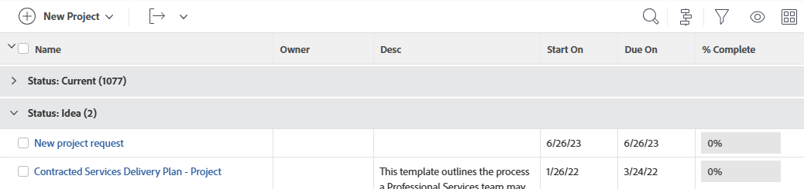

# Adobe Workfront의 그룹화 개요

<!-- Audited: 11/2024 -->

<!--(NOTE: This article was supposed to be replaced by "Groupings overview", but decided to keep this here because this is linked in too many places. "Create groupings" and "Edit existing groupings" have been added also (with videos) to replace portions of the old content here.)-->

그룹화를 추가하여 보고서 및 목록의 정보 레이아웃을 관리할 수 있습니다.

다음과 같은 방법으로 보고서에 그룹을 추가할 수 있습니다.

* 기존 그룹화를 편집하여 그룹화를 생성할 수 있습니다.

  기존 그룹화 사용자 지정에 대한 자세한 내용은 [기존 그룹화 편집](../../../reports-and-dashboards/reports/reporting-elements/edit-existing-groupings.md)을 참조하십시오.

* 그룹을 처음부터 만들 수 있습니다.

  그룹을 처음부터 만드는 방법에 대한 자세한 내용은 [Adobe Workfront에서 그룹 만들기](../../../reports-and-dashboards/reports/reporting-elements/create-groupings.md)를 참조하십시오.

기본적으로 그룹화는 보고서나 목록에서 회색 강조 표시로 표시됩니다. 보고서 또는 목록의 결과는 강조 표시 없이 개별 그룹 아래에 나열됩니다.

보고서에 최대 세 개의 그룹을 추가할 수 있습니다. 매트릭스 보고서를 만들어 최대 4개의 그룹으로 정보를 구성할 수 있습니다. 행렬 보고서에 대한 자세한 내용은 [행렬 보고서 만들기](../../../reports-and-dashboards/reports/creating-and-managing-reports/create-matrix-report.md)를 참조하십시오.

그룹화 이름 다음에 괄호로 묶인 숫자는 해당 그룹화 아래의 결과 수를 나타냅니다. 보고서가 여러 페이지에 걸쳐 있는 경우 보고서나 목록에 *모두*&#x200B;를 표시하여 각 그룹화 아래의 결과에 대한 정확한 개수를 얻어야 합니다.

그룹화 작업 시 다음 사항을 고려하십시오.

* 기존 그룹의 정보를 사용자 정의할 수 있습니다. 그룹을 볼 수 있는 모든 사용자도 변경 사항을 볼 수 있습니다.
* 그룹을 만들려면 Workfront 관리자가 [필터, 보기 및 그룹 편집]에 대한 액세스 권한을 부여해야 합니다.

  필터, 보기 및 그룹에 대한 액세스 권한 부여에 대한 자세한 내용은 [필터, 보기 및 그룹에 대한 액세스 권한 부여](../../../administration-and-setup/add-users/configure-and-grant-access/grant-access-fvg.md)를 참조하십시오.

* 그룹에 대한 사용 권한 수준은 그룹을 저장하는 방법을 지정합니다. 원래 그룹화를 만든 경우 변경 사항을 저장할 수 있습니다. 그렇지 않은 경우 그룹화의 버전을 저장하라는 메시지가 표시됩니다. 다른 사용자와 공유한 그룹을 변경하면 해당 그룹에도 영향을 줍니다.
* 그룹을 공유한 사용자가 액세스 관리 권한을 부여한 경우에만 사용자와 공유된 그룹을 사용자 지정할 수 있습니다. 그룹화 공유에 대한 자세한 내용은 [필터, 보기 또는 그룹화 공유](../../../reports-and-dashboards/reports/reporting-elements/share-filter-view-grouping.md)를 참조하십시오.
* 그룹화를 인라인으로 편집할 수 없습니다.
* 사용자 지정 필드(예: 확인란)를 여러 개 선택하거나 리소스 관리자 등의 여러 값을 가질 수 있는 필드별로 그룹화할 수 없습니다.

## 그룹에 대한 추가 정보

그룹핑 행의 각 열에 있는 값을 합산하여 그룹화를 사용할 때 보고서 정보를 더욱 효율적으로 관리할 수 있을 뿐만 아니라 그룹화의 필드별로 정보를 정렬할 수 있습니다. 그룹화가 더 이상 필요하지 않으면 제거할 수도 있습니다.

* [그룹화의 집계 값](#aggregate-values-in-groupings)
* [그룹별로 정렬](#sort-by-a-grouping)
* [그룹화 제거](#remove-a-grouping)

### 그룹화의 값 합계 {#aggregate-values-in-groupings}

보고서의 각 열에 있는 값을 요약하여 그룹화 라인의 보고서에 표시되는 데이터를 집계할 수 있습니다. 그룹화의 열 데이터 요약에 대한 자세한 내용은 [Adobe Workfront의 보기 개요](../../../reports-and-dashboards/reports/reporting-elements/views-overview.md)를 참조하십시오.

>[!NOTE]
>
>&#x200B;>그룹화에서 다음 필드의 값을 합산하는 경우 상위 객체(예: 상위 작업)에 다음 예외가 적용됩니다.
>
>* 실제 시간을 제외한 모든 숫자, 통화 및 날짜 필드는 하위 작업 및 독립 실행형 작업에 대해서만 값을 집계합니다. 상위 작업 또는 상위 작업의 상위 값을 집계하지 않습니다. 상위 작업만 포함하는 목록의 숫자, 통화 및 날짜 필드에 집계하면 그룹화 표시줄에 집계된 값이 표시되지 않습니다.
>
>* 실제 시간은 기본 상위 및 독립형 태스크에 대한 값을 집계합니다. 이 값은 하위 태스크 또는 상위 태스크의 상위 태스크에 대한 숫자를 집계하지 않습니다. <!--Examples of Actual hours include Planned/Actual Labor Cost, Planned/Actual Expense Cost, Planned/Actual Cost, and Planned Hours.-->
>
>* 숫자 및 통화 값에 대한 사용자 지정 데이터 필드는 모든 작업(상위, 하위, 상위 및 독립 실행형 작업)을 집계합니다.

### 그룹별 정렬 {#sort-by-a-grouping}

그룹을 정렬할 수 없습니다. 보기를 정렬할 수 있습니다. 그룹화에서 캡처한 값을 기준으로 목록을 정렬하려면 뷰의 열 중 하나에 동일한 값을 포함하고 뷰에서 정렬을 적용해야 합니다. 이렇게 하면 목록이 그룹화에서 값을 기준으로 간접적으로 정렬됩니다. 즉, 그룹화에서도 캡처되는 뷰의 값을 기준으로 정렬됩니다. 보기 만들기 및 보기 내의 값별 정렬에 대한 자세한 내용은 [Adobe Workfront의 보기 개요](../../../reports-and-dashboards/reports/reporting-elements/views-overview.md)를 참조하십시오.

### 그룹화 제거 {#remove-a-grouping}

그룹화를 제거하는 방법은 처음에 그룹화를 만들었는지 또는 그룹화가 사용자와 공유되었는지 여부에 따라 다릅니다. 기본 그룹화는 제거할 수 없습니다.

* **그룹화를 만들어서 제거하는 경우**, 그룹화는 Workfront 시스템에서 제거됩니다. 그룹화는 이전에 공유한 모든 사용자가 더 이상 사용할 수 없습니다.
* **그룹화가 공유되어 있고 그룹화를 제거하는 경우** 그룹화는 사용자에 대해서만 제거됩니다. 원래 생성한 사용자와 공유한 다른 사용자는 여전히 그룹에 액세스할 수 있습니다.

그룹 제거에 대한 자세한 내용은 문서 [필터, 보기 및 그룹 제거](../../../reports-and-dashboards/reports/reporting-elements/remove-filters-views-groupings.md)를 참조하십시오.

<!--Original note

The following exceptions apply for parent objects (for example, parent tasks) when you are aggregating values for the following fields in groupings:
All the number and currency fields except Actual Hours (for example, Planned/ Actual Labor Cost, Planned/ Actual Expense Cost, Planned/ Actual Cost, Planned Hours) aggregate only the values for the children tasks, and standalone tasks. They do not aggregate the values for the parent tasks or parents of parents.
Actual Hours aggregate the values for the main parent and the standalone tasks; they do not aggregate the numbers for the parents of parent tasks or the children tasks.
Custom data fields for number and currency values aggregate all tasks: parents, children, parents of parents, and standalone tasks.

-->
