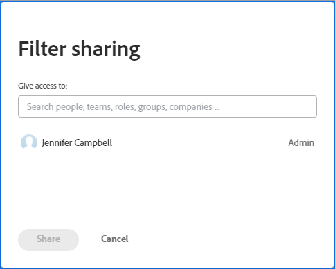
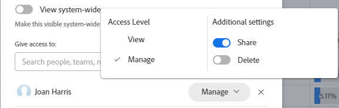
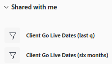
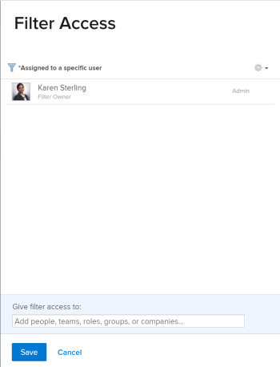

# 필터, 보기 또는 그룹화 공유

<!-- Audited: 11/2024 -->

<!--(NOTE: CONSIDER SPLITTING THIS in three articles for each reporting element?)
(NOTE: This is linked from the TOC article in WF Basics > permissions section)-->

Adobe Workfront 관리자는 사용자가 액세스 수준을 할당할 때 개체를 보거나 편집할 수 있는 액세스 권한을 사용자에게 부여합니다. 개체에 대한 액세스 권한을 부여하는 방법에 대한 자세한 내용은 [사용자 지정 액세스 수준 만들기 또는 수정](../../../administration-and-setup/add-users/configure-and-grant-access/create-modify-access-levels.md)을 참조하십시오.

사용자에게 부여되는 액세스 수준과 함께 작성했거나 공유할 수 있는 액세스 권한이 있는 특정 개체를 보거나 편집할 수 있는 권한을 부여할 수도 있습니다. 액세스 수준 및 사용 권한에 대한 자세한 내용은 [액세스 수준 및 사용 권한이 함께 작동하는 방법](../../../administration-and-setup/add-users/access-levels-and-object-permissions/how-access-levels-permissions-work-together.md)을 참조하세요.

보기 액세스 권한이 있는 필터, 보기 및 그룹화를 다른 사용자와 공유할 수 있습니다.

필터, 보기 또는 그룹화가 공유되면 해당 필터, 보기 또는 그룹화를 목록에 적용할 수 있습니다. 귀하에게 부여된 액세스 권한에 따라, 귀하는 이를 수정하고 다른 사용자와 공유할 수 있습니다.

필터, 보기 또는 그룹화 방법에 대한 자세한 내용은 다음 문서를 참조하십시오.

* [필터 개요](../../../reports-and-dashboards/reports/reporting-elements/filters-overview.md)
* [Adobe Workfront의 보기 개요](../../../reports-and-dashboards/reports/reporting-elements/views-overview.md)
* [Adobe Workfront의 그룹화 개요](../../../reports-and-dashboards/reports/reporting-elements/groupings-overview.md)

## 액세스 요구 사항

+++ 이 문서의 기능에 대한 액세스 요구 사항을 보려면 확장하십시오. 

<table style="table-layout:auto"> 
 <col> 
 <col> 
 <tbody> 
  <tr> 
   <td role="rowheader">Adobe Workfront 패키지</td> 
   <td> 
Any
 </td> 
  </tr> 
  <tr> 
   <td role="rowheader">Adobe Workfront 라이선스</strong></td> 
   <td> 
    
기여자 이상

    
요청 이상

   </td>
  </tr> 
  <tr> 
   <td role="rowheader">액세스 수준 구성</td> 
   <td> 
View or higher access to Filters, Views, Groupings

   </td> 
  </tr> 
  <tr> 
   <td role="rowheader">개체 권한</td> 
    <td> 
보기, 필터 또는 그룹화에 대한 공유 액세스 권한이 있는 보기 이상의 권한
</td> 
   </td> 
  </tr> 
 </tbody> 
</table>

이 표의 정보에 대한 자세한 내용은 [Workfront 설명서의 액세스 요구 사항](/help/quicksilver/administration-and-setup/add-users/access-levels-and-object-permissions/access-level-requirements-in-documentation.md)을 참조하십시오.

+++

## 필터, 보기 또는 그룹화 공유

<!--(NOTE: when the beta filters/ groupings come out either consider splitting this in different kinds of FVGs or splitting this article in FVGs for showing sharing on each one of them??)-->

선택 목록의 필터 공유는 필터를 공유하는 데 사용하는 인터페이스(표준 또는 레거시)에 따라 다릅니다. 필터 빌드 인터페이스 유형에 대한 자세한 내용은 [Adobe Workfront에서 필터 만들기 또는 편집](/help/quicksilver/reports-and-dashboards/reports/reporting-elements/create-filters.md)을 참조하십시오.

이전 인터페이스에서만 보기와 그룹화를 공유할 수 있습니다.

### 표준 빌더 인터페이스를 사용하여 필터 공유

프로젝트, 작업, 문제, 포트폴리오, 프로그램, 사용자, 템플릿 또는 그룹 목록에서 표준 인터페이스에서 필터를 공유할 수 있습니다. 필터에 대한 표준 빌더 인터페이스는 다른 개체, 보기 또는 그룹화에는 사용할 수 없습니다.

표준 빌더 인터페이스를 사용하여 필터 공유:

1. 프로젝트, 작업 또는 문제 목록으로 이동합니다.
1. **필터** 아이콘 을 클릭합니다.

   

1. 다음 필터 목록을 검토하십시오.

   <table style="table-layout:auto">
   <col>
   <col>
   <tbody>
   <tr>
   <td role="rowheader"><strong>즐겨찾기에 추가됨</strong></td>
   <td>즐겨찾기로 표시한 필터입니다. 필터를 즐겨찾기에 추가하면 원래 위치가 필터 이름 아래에 표시되고 즐겨찾기로 제거하지 않으면 원래 목록에서 숨겨집니다.</td>
   </tr>
   <tr>
   <td role="rowheader"><strong>저장됨</strong></td>
   <td>Filters that you built and saved yourself. By default this list displays saved filters in order of most recently saved, but the filter names can be dragged to manually reorder the list.</td>
   </tr>
   <tr>
   <td role="rowheader"><strong>시스템 기본값</strong></td>
   <td>Workfront system default filters, as well as filters that the Workfront administrator added to your list of filters, either at the system level or in your layout template.</td>
   </tr>
   <tr>
   <td role="rowheader"><strong>나와 공유됨</strong></td>
   <td>다른 사용자가 만들어 나와 공유했거나 시스템 전체에서 공유한 필터입니다.</td>
   </tr>
   </tbody>
   </table>

1. 최소한 보고 공유할 수 있는 액세스 권한이 있는 필터 위로 마우스를 가져간 후 **자세히** 메뉴 를 클릭한 다음 **공유**&#x200B;를 클릭합니다.

   

   필터 공유 상자가 표시됩니다.

1. **액세스 권한 부여** 필드에 공유할 사용자, 팀, 역할, 그룹 또는 회사의 이름을 입력하십시오.

   

1. (Optional) Click the right-pointing arrow next to the name of an entity to edit their permissions to the filter, then enable either the **View** or **Manage** option. **View** is the default.

   

1. (Optional) Enable or disable the additional permissions for an entity by doing one of the following:

   1. **보기**&#x200B;를 클릭하고 **공유** 옵션을 비활성화합니다. 기본적으로 활성화되어 있습니다.
   1. **관리**&#x200B;를 클릭하고 **공유** 또는 **삭제** 옵션을 사용하지 않도록 설정합니다. 기본적으로 활성화되어 있습니다.

      >[!NOTE]
      >
      >If you enable Manage access with the Delete option, these users will be able to delete the filter from all users, even though they do not own the filter.

   >[!TIP]
   >
   >Users cannot receive a higher permission than their access level. If they don&#39;t have access to Edit filters in their access level, they cannot receive permissions to manage a filter. Workfront disables the Manage option for these users and the option is dimmed.

1. **공유**&#x200B;를 클릭합니다. 필터는 지정한 엔티티와 공유됩니다.

   >[!TIP]
   >
   >그룹과 공유하면 그룹 및 모든 하위 그룹의 구성원에게 필터에 대한 권한을 부여합니다.

   공유한 필터가 해당 엔터티에 대한 필터 패널의 **나와 공유** 섹션에 표시됩니다.

   

### 기존 인터페이스를 사용하여 필터, 보기 및 그룹화 공유

레거시 인터페이스에서 필터, 보기 및 그룹화를 공유하는 것은 동일합니다.

1. 객체 목록 또는 보고서로 이동합니다.
1. (조건부) 목록에서 **필터**, **보기** 또는 **그룹화** 아이콘을 클릭한 다음 공유할 필터, 보기 또는 그룹화를 마우스로 가리키고 **자세히** 아이콘 , **공유**&#x200B;를 클릭합니다.

   보고서에서 **필터**, **보기** 또는 **그룹화** 드롭다운 메뉴를 클릭한 다음 공유할 필터, 보기 또는 그룹화를 선택하십시오.

1. (조건부) 보고서에서 공유하는 경우 **필터**, **보기** 또는 **그룹화** 드롭다운 메뉴를 다시 클릭한 다음 **필터 공유**, **보기 공유** 또는 **그룹화 공유**&#x200B;를 클릭합니다.\
   **액세스 필터링**, **액세스 보기** 또는 **액세스 그룹화** 대화 상자가 표시됩니다.

   

1. Complete either of the following, depending on who you want to share with:

   **To share with individual users, teams, roles, groups, or companies:** In the provided field, begin typing the name of the user, team, role, group, or company you want to share with, then click the name when it appears in the drop-down list.\
   Repeat this process to share access with multiple users, teams, roles, groups, or companies.

   >[!TIP]
   >
   >그룹과 공유하면 그룹 및 모든 하위 그룹의 구성원에게 필터, 보기 또는 그룹화에 대한 권한이 제공됩니다.

   **시스템의 모든 사용자와 공유하려면:** **설정** 아이콘을 클릭한 다음 **시스템 전체에 표시**&#x200B;를 클릭합니다.\
   이 옵션을 사용하려면 관리자가 시스템 전체 공유 옵션을 선택해야 합니다. 자세한 내용은 문서 [사용자 지정 액세스 수준 만들기 또는 수정](../../../administration-and-setup/add-users/configure-and-grant-access/create-modify-access-levels.md) 및 [보고서, 대시보드 및 일정 공유](../../../workfront-basics/grant-and-request-access-to-objects/permissions-reports-dashboards-calendars.md)를 참조하십시오.

1. (Conditional) If you are sharing with individual users, teams, roles, groups, or companies, click the drop-down menu to define the level of access you want to grant.

   다음 옵션 중에서 선택할 수 있습니다.

   <table style="table-layout:auto"> 
    <col> 
    <col> 
    <tbody> 
     <tr> 
      <td role="rowheader"><strong>보기</strong></td> 
      <td> 
Select this option to allow the share recipients only to use the shared Filter, View, or Grouping. 이 옵션을 선택하면 수신자는 공유 항목을 수정할 수 없습니다.
 </td> 
     </tr> 
     <tr> 
      <td role="rowheader"><strong>관리함</strong></td> 
      <td> 
공유 수신자가 공유 필터, 보기 또는 그룹화를 사용하고 수정할 수 있도록 하려면 이 옵션을 선택합니다.
 </td> 
     </tr> 
     <tr> 
      <td role="rowheader"><strong>공유</strong></td> 
      <td> 
<strong>고급 설정</strong>을 클릭한 다음 받는 사람이 다른 사람과 공유할 수 있게 할지 여부에 따라 <strong>공유</strong> 옵션을 선택하거나 선택을 취소합니다.
 </td> 
     </tr> 
    </tbody> 
   </table>

1. **저장**&#x200B;을 클릭합니다.

   필터, 보기 또는 그룹화를 공유한 사용자는 **필터**, **보기** 또는 **그룹화** 드롭다운 메뉴 또는 아이콘을 클릭하고 **나와 공유** 섹션으로 스크롤하여 액세스할 수 있습니다.

