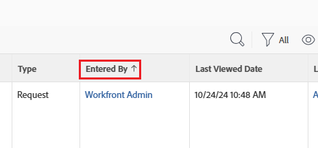

# 보고서 시작

<!-- Audited: 12/2023 -->

보고서는 사용자 및 작업에 발생한 상황을 파악할 수 있도록 해 줍니다. 보고서를 사용하여 Adobe Workfront의 개체에 대한 정보를 표시할 수 있습니다.

개체를 이해하고 Workfront 응용 프로그램에서 개체를 보고하는 방법에 대한 자세한 내용은 [Adobe Workfront 개체 개요](../../../workfront-basics/navigate-workfront/workfront-navigation/understand-objects.md)를 참조하십시오.

## 보고서 요소

보고서는 Workfront에서 다음 세 가지 요소의 조합으로 구성됩니다.

<table style="table-layout:auto"> 
 <col> 
 <col> 
 <tbody> 
  <tr> 
   <td role="rowheader">보기</td> 
   <td> <li>보고서의 열과 각 열에 포함할 수 있는 정보를 정의합니다.</li> <li>보기에 대한 자세한 내용은 <a href="../../../reports-and-dashboards/reports/reporting-elements/views-overview.md" class="MCXref xref">Adobe Workfront의 보기 개요</a>를 참조하세요.</li> </td> 
  </tr> 
  <tr> 
   <td role="rowheader">그룹화</td> 
   <td> <li>일반적인 정보를 기준으로 정보를 분류하고 보고서 결과를 제목 아래에 나열합니다.</li> <li>그룹화에 대한 자세한 내용은 <a href="../../../reports-and-dashboards/reports/reporting-elements/groupings-overview.md" class="MCXref xref">Adobe Workfront의 그룹화 개요</a>를 참조하십시오.</li> </td> 
  </tr> 
  <tr> 
   <td role="rowheader">필터</td> 
   <td> <li>보고서에 표시되는 정보의 양을 제어합니다.</li> <li>필터에 대한 자세한 내용은 <a href="../../../reports-and-dashboards/reports/reporting-elements/filters-overview.md" class="MCXref xref">필터 개요</a>를 참조하십시오.</li> <li>필터 수정자에 대한 자세한 내용은 <a href="../../../reports-and-dashboards/reports/reporting-elements/filter-condition-modifiers.md" class="MCXref xref">필터 및 조건 수정자</a>를 참조하십시오.</li> <li>와일드카드를 사용하여 필터링함으로써 필터를 보다 일반화하고 보다 유연하게 사용할 수 있습니다.</li> <li>필터에서 와일드카드를 사용하는 방법에 대한 자세한 내용은 <a href="../../../reports-and-dashboards/reports/reporting-elements/understand-wildcard-filter-variables.md" class="MCXref xref">와일드카드 필터 변수</a>를 참조하십시오.</li> </td> 
  </tr> 
 </tbody> 
</table>

>[!NOTE]
>
>목록에서 새 필터, 보기 또는 그룹을 선택하면 Workfront에서 로그아웃하거나 브라우저를 닫은 경우에도 선택한 항목이 유지됩니다.

보고서 요소에 대한 자세한 내용은 [보고 요소: 필터, 보기 및 그룹화](../../../reports-and-dashboards/reports/reporting-elements/reporting-elements-filters-views-groupings.md)를 참조하십시오.

보고서를 향상시키기 위해 다음 요소를 추가할 수 있습니다.

* 차트: 보고서의 결과를 시각적으로 보여줍니다.\
  차트 보고서에 대한 자세한 내용은 [보고서에 차트 추가](../../../reports-and-dashboards/reports/creating-and-managing-reports/add-chart-report.md)를 참조하십시오.

* 매트릭스 그룹화: 집계된 테이블 형식으로 보고서 정보를 요약합니다.\
  매트릭스 보고서에 대한 자세한 내용은 [매트릭스 보고서 만들기](../../../reports-and-dashboards/reports/creating-and-managing-reports/create-matrix-report.md)를 참조하십시오.

* 프롬프트: 보고서를 실행할 때마다 다르게 사용자 지정하고 적용할 수 있는 열린 필터입니다.\
  프롬프트에 대한 자세한 내용은 [보고서에 프롬프트 추가](../../../reports-and-dashboards/reports/creating-and-managing-reports/add-prompt-report.md)를 참조하십시오.

보고서를 작성할 때 Report Builder에서 이러한 요소를 개별적으로 수정할 수 있습니다.

보고서에 포함된 정보의 관련성을 높이는 또 다른 방법은 보기에 조건부 서식을 적용하는 것입니다. 조건부 서식 사용에 대한 자세한 내용은 [보기에서 조건부 서식 사용](../../../reports-and-dashboards/reports/reporting-elements/use-conditional-formatting-views.md)을 참조하십시오.

## 시스템 보고서

Workfront은 기본적으로 시스템에 로드되는 몇 가지 시스템 보고서를 제공합니다.\
시스템에 정보를 입력한 후 이러한 보고서를 사용하여 정보를 시각적으로 표시할 수 있습니다.

시스템 보고서에 액세스하는 방법과 사용 가능한 시스템 보고서에 대한 자세한 내용은 [Adobe Workfront 기본 제공 보고서 사용](../../../reports-and-dashboards/reports/using-built-in-reports/use-workfront-built-in-reports.md)을 참조하십시오.

## 보고서 만들기

Workfront에서 제공하는 시스템 보고서 외에도 조직의 요구 사항에 맞게 사용자 지정된 보고서를 만들 수 있습니다.

보고서를 만들려면 다음 중 하나를 수행할 수 있습니다.

* 보고서를 처음부터 새로 작성하십시오.
* 기존 보고서를 복사합니다.

  다른 사용자가 만든 보고서를 복사하려면 적어도 보기 권한이 있어야 합니다. 보고서 복사에 대한 자세한 내용은 [보고서 복사본 만들기](../../../reports-and-dashboards/reports/creating-and-managing-reports/create-copy-report.md)를 참조하세요.

보고서 만들기에 대한 자세한 내용은 [사용자 지정 보고서 만들기](/help/quicksilver/reports-and-dashboards/reports/creating-and-managing-reports/create-custom-report.md)를 참조하세요.

### 보고서 생성을 위한 사전 요구 사항 {#prerequisites-for-creating-reports}

* 보고서를 작성하려면 표준 또는 플랜 라이선스가 있어야 합니다.

  Workfront 라이선스 유형에 대한 자세한 내용은 현재 라이선스의 경우 [라이선스 개요](../../../administration-and-setup/add-users/access-levels-and-object-permissions/wf-licenses.md)를, 새 라이선스의 경우 [새 라이선스 개요](/help/quicksilver/administration-and-setup/add-users/how-access-levels-work/licenses-overview.md)를 참조하십시오.

* Workfront 관리자가 액세스 수준에서 보고서 편집에 대한 액세스 권한을 부여해야 합니다.

  보고서 편집에 대한 액세스 권한 부여에 대한 자세한 내용은 [보고서, 대시보드 및 일정에 대한 액세스 권한 부여](../../../administration-and-setup/add-users/configure-and-grant-access/grant-access-reports-dashboards-calendars.md)를 참조하십시오.

* Workfront 관리자는 액세스 수준에서 필터, 보기 및 그룹 편집에 대한 액세스 권한을 부여해야 합니다.

  편집 필터, 보기 및 그룹에 대한 액세스 권한 부여에 대한 자세한 내용은 [필터, 보기 및 그룹에 대한 액세스 권한 부여](../../../administration-and-setup/add-users/configure-and-grant-access/grant-access-fvg.md)를 참조하십시오.

* 보고할 개체 하나를 정의해야 합니다. 보고서는 Workfront의 특정 개체이므로 보고서 작성을 시작하려면 먼저 개체 유형을 선택해야 합니다. Workfront 인터페이스에서 사용 가능한 객체에만 보고할 수 있습니다.

### 소유권 보고 {#report-ownership}

Workfront에서 보고서를 만들면 보고서의 기본 소유자가 되며 내 보고서 섹션에 표시됩니다. 보고서 소유자는 변경할 수 없습니다.

보고서를 복사하면 자동으로 복사된 보고서의 소유자가 됩니다.
보고서 복사에 대한 자세한 내용은 [보고서 복사본 만들기](../../../reports-and-dashboards/reports/creating-and-managing-reports/create-copy-report.md)를 참조하세요.

**입력한 사람** 필드를 검토하여 누가 보고서를 소유하고 있는지 확인할 수 있습니다.

### 빌더 인터페이스에서 보고서 생성 {#create-reports-in-the-builder-interface}

먼저 보고서 작성 인터페이스를 사용하여 새 보고서를 작성하는 것이 좋습니다. 이 인터페이스에서는 여러 요소를 모아 원하는 보고서를 만드는 데 사용할 수 있는 효율적인 도구를 제공합니다. 목록에서 선택하고 모든 보고 요소에 추가할 수 있는 객체와 필드가 있습니다.\
보고서 빌드 인터페이스에서 보고서를 만드는 방법에 대한 자세한 내용은 [사용자 지정 보고서 만들기](../../../reports-and-dashboards/reports/creating-and-managing-reports/create-custom-report.md)를 참조하세요.

보고할 수 있는 개체 목록은 문서 [Adobe Workfront 개체 개요](../../../workfront-basics/navigate-workfront/workfront-navigation/understand-objects.md#report-on-objects)의 [개체 보고](../../../workfront-basics/navigate-workfront/workfront-navigation/understand-objects.md) 섹션을 참조하십시오.

보고서에 표시할 수 있는 필드에 대한 자세한 내용은 [Adobe Workfront 용어](../../../workfront-basics/navigate-workfront/workfront-navigation/workfront-terminology-glossary.md)를 참조하십시오.

### 텍스트 모드에서 보고서 만들기 {#create-reports-in-text-mode}

때때로 빌더 인터페이스에서 특정 필드를 찾을 수 없지만 API에서는 사용할 수 있습니다.\
API에서 사용할 수 있는 필드에 대한 자세한 내용은 문서 [API 탐색기](../../../wf-api/general/api-explorer.md)를 참조하십시오.

API 탐색기를 사용하는 방법에 대한 자세한 내용은 [API 탐색기 사용](../../../wf-api/general/using-api-explorer.md) 문서를 참조하십시오.

>[!NOTE]
>
>보고서 작성기에서 사용할 수 없는 개체에 대해서는 Workfront 인터페이스에서 보고할 수 없습니다. 그러나 API를 통해 해당 필드를 사용할 수 있는 경우에는 보고서 작성기의 개체와 연결된 필드에 대해 보고할 수 있습니다. 이렇게 하려면 텍스트 모드 인터페이스를 사용해야 합니다.

텍스트 모드를 사용하면 표준 모드 인터페이스에서 사용할 수 없는 필드를 사용할 수 있게 하여 보다 복잡한 보기, 필터, 그룹화 및 프롬프트를 만들 수 있습니다.

#### 텍스트 모드 용어 {#text-mode-terminology}

Workfront 텍스트 모드 인터페이스를 사용하려면 특정 구문을 사용해야 합니다.

텍스트 모드의 Workfront 구문에 대한 자세한 내용은 [텍스트 모드 구문 개요](../../../reports-and-dashboards/reports/text-mode/text-mode-syntax-overview.md)를 참조하십시오.

#### 계산된 열, 조건부 서식 및 기타 텍스트 모드 사용 {#calculated-columns-conditional-formatting-and-other-uses-of-text-mode}

빌더 인터페이스에서 사용할 수 없는 필드에 대한 보고 외부에서 텍스트 모드를 사용하여 특정 필드 간의 계산 또는 비교를 표시할 수 있습니다.

보고서에서 텍스트 모드의 가장 일반적인 사용 목록을 보려면 [텍스트 모드의 일반적인 사용 개요](../../../reports-and-dashboards/reports/text-mode/understand-common-uses-text-mode.md)를 참조하십시오.

보고서에 계산된 사용자 지정 데이터를 포함하는 방법에 대한 자세한 내용은 [보고서의 계산된 사용자 지정 데이터](../../../reports-and-dashboards/reports/calc-cstm-data-reports/calculated-custom-data-reports.md)를 참조하십시오.

조건부 서식의 필드 비교에 대한 자세한 내용은 [조건부 서식의 필드 비교](../../../reports-and-dashboards/reports/text-mode/compare-fields-conditional-formatting.md)를 참조하십시오.

보고서에서 텍스트 모드 를 사용하여 컬렉션 필드를 참조할 수도 있습니다.\
텍스트 모드를 사용하여 보고서에 컬렉션 정보를 표시하는 방법에 대한 자세한 내용은 [보고서의 컬렉션 참조](../../../reports-and-dashboards/reports/text-mode/reference-collections-report.md)를 참조하세요.

#### 텍스트 모드 샘플 {#text-mode-samples}

텍스트 모드로 만들 수 있는 가장 많이 사용된 보기, 필터 및 그룹화의 샘플 라이브러리가 있습니다.

이 라이브러리를 검색하고 제공하는 샘플 중 일부를 사용하려면 문서 [사용자 지정 보기, 필터 및 그룹화 샘플: 문서 인덱스](../../../reports-and-dashboards/reports/custom-view-filter-grouping-samples/custom-view-filter-grouping-samples.md)을 참조하십시오.

## 보고서의 탭

보고서는 인터페이스에서 보고서를 실행할 때 여러 탭을 포함할 수 있습니다.

보고서 실행에 대한 자세한 내용은 문서 [보고서 실행](../../../reports-and-dashboards/reports/creating-and-managing-reports/run-report.md)을 참조하십시오.

각 탭에서 보고서에 포함하는 정보는 약간 다른 형식으로 표시됩니다. 조직의 요구 사항에 가장 적합한 형식을 선택하십시오.

모든 탭을 보고서의 기본 탭으로 만들 수 있습니다. 기본 탭은 보고서 이름을 클릭하여 열 때 표시되는 첫 번째 탭이고 보고서를 대시보드에 배치할 때 표시되는 탭입니다.

### 세부 사항 탭 {#details-tab}

보고서의 세부 사항 탭에는 보고서의 객체와 목록 양식에서 해당 객체에 대해 선택한 속성이 표시됩니다. 모든 보고서에는 세부 사항 탭이 있습니다.

>[!IMPORTANT]
>
>세부 정보 탭의 정보는 시간대에 따라 차트 탭과 다르게 표시될 수 있습니다.\
>예를 들어 캘리포니아에 있는 사용자가 2월 12일 오후 9시(PST) 9분에 작업을 완료했습니다. :30 뉴욕의 사용자가 이 작업 완료를 포함하는 보고서를 볼 때, 실제 완료 일자가 2월 13일 오전 12시:30에 완료되었기 때문에 세부 정보 탭과 차트 세부 정보 모두에 2월 13일로 표시됩니다. 하지만 차트에서는 차트 요소를 확장할 때까지 2월 12일 그룹화에 포함됩니다.

### 요약 탭 {#summary-tab}

그룹화가 포함된 보고서에는 요약 탭이 있습니다.

세부 정보 탭의 목록 형식으로 표시된 동일한 정보는 요약 탭의 보고서에서 그룹화에 따라 요약 및 집계됩니다.

그룹화에 대한 자세한 내용은 Adobe Workfront의 [그룹화 개요](../../../reports-and-dashboards/reports/reporting-elements/groupings-overview.md)를 참조하십시오.

### 매트릭스 탭 {#matrix-tab}

매트릭스 그룹화가 포함된 보고서에는 매트릭스 탭이 있습니다.

세부 정보 탭의 목록 형식으로 표시되는 동일한 정보는 표 형식으로 표시되며, 매트릭스 탭의 보고서에서 그룹별로 그룹화됩니다.

Matrix 그룹을 보고서에 추가하면 Summary 탭이 Matrix 탭으로 바뀝니다.

행렬 그룹화 작성에 대한 자세한 내용은 [행렬 보고서 만들기](../../../reports-and-dashboards/reports/creating-and-managing-reports/create-matrix-report.md) 문서를 참조하십시오.

### 차트 탭 {#chart-tab}

차트가 포함된 보고서에는 차트 탭이 있습니다.

경영진을 위해 효과적인 대시보드가 필요하면 보고서에 차트를 포함하는 것이 좋습니다. 차트는 보고서에 정보를 표시하는 간결한 방법입니다. 차트 요소를 클릭하여 해당 요소에 포함된 항목을 표시하는 방법으로 차트 요소를 확장할 수 있습니다.

>[!IMPORTANT]
>
>차트 요소를 클릭하면 확장된 정보가 시간대에 따라 차트와 다르게 표시될 수 있습니다.\
>예를 들어 캘리포니아의 사용자는 2월 12일 오후 9시(PST)에 작업을 완료했습니다. :30 New York의 사용자가 이 작업 완료를 포함하는 보고서를 볼 때, 2월 13일 오전 12:00 EST에 완료되었으므로 [세부 정보] 탭과 차트 세부 정보 모두에 실제 완료 날짜가 2월 13일로 표시됩니다. :30 그러나 차트에서는 차트 요소를 확장할 때까지 2월 12일 그룹화에 포함됩니다.

차트를 사용하여 보고서를 만드는 방법에 대한 자세한 내용은 [보고서에 차트 추가](../../../reports-and-dashboards/reports/creating-and-managing-reports/add-chart-report.md) 문서를 참조하세요.

### 프롬프트 탭 {#prompts-tab}

프롬프트가 포함된 보고서에는 프롬프트 탭이 있습니다.

보고서를 실행할 때마다 보고서에 필터를 추가하라는 메시지가 표시됩니다. 보고서에 프롬프트를 추가하면 프롬프트 탭이 자동으로 보고서의 기본 탭이 됩니다. 이 탭은 다른 탭으로 변경할 수 없습니다.

보고서 프롬프트를 작성하는 방법에 대한 자세한 내용은 [보고서에 프롬프트 추가](../../../reports-and-dashboards/reports/creating-and-managing-reports/add-prompt-report.md) 문서를 참조하십시오.

## 보고서 공유

보고서를 만든 후 다른 사용자와 공유할 수 있습니다.

### 보고서에 공유 권한 부여 {#give-sharing-permissions-to-a-report}

만든 보고서를 보거나 관리하기 위해 다른 사용자에게 공유 권한을 부여할 수 있습니다. 다른 사용자에게 본인의 권한과 같거나 낮은 수준의 권한을 부여할 수 있습니다. 공유 권한을 사용하여 보고서를 공개하도록 할 수도 있습니다. 보고서 공유에 대한 자세한 내용은 [Adobe Workfront에서 보고서 공유](../../../reports-and-dashboards/reports/creating-and-managing-reports/share-report.md)를 참조하십시오.

### 보고서 배달 예약 {#schedule-a-report-delivery}

보고서 배달을 예약할 수 있습니다. 보고서를 공유하는 사용자는 보고서 결과가 첨부된 이메일을 받게 됩니다. 첨부 파일은 다음 형식일 수 있습니다.

* HTML
* PDF
* Excel
* .TSV

보고서 배달 예약에 대한 자세한 내용은 [보고서 배달 개요](../../../reports-and-dashboards/reports/creating-and-managing-reports/set-up-report-deliveries.md)를 참조하세요.

### 보고서 결과 내보내기 {#export-the-results-of-a-report}

보고서 결과를 다음 파일 형식으로 내보낼 수 있습니다.

* PDF
* Excel(.xls 및 .xlsx 형식)
* 탭으로 구분됨

보고서 결과를 내보내는 방법에 대한 자세한 내용은 [데이터 내보내기](../../../reports-and-dashboards/reports/creating-and-managing-reports/export-data.md)를 참조하세요.

이러한 형식 중 하나로 보고서를 내보낸 후 보고서를 첨부 파일로 전자 메일로 보내거나 인쇄하여 다른 사용자와 공유할 수 있습니다.

### 대시보드에 보고서 추가 {#add-a-report-to-a-dashboard}

대시보드에 보고서를 추가하고 대시보드를 다른 사용자와 공유할 수 있습니다. 대시보드에 보고서를 추가하는 방법에 대한 자세한 내용은 [대시보드에 보고서 추가](../../../reports-and-dashboards/dashboards/creating-and-managing-dashboards/add-report-dashboard.md)를 참조하세요.

## 캘린더 만들기

데이터를 달력 형식으로 표시하려는 경우 보고서 대신 달력을 만들 수 있습니다.

캘린더 작성 및 사용에 대한 자세한 내용은 [캘린더 보고서 개요](../../../reports-and-dashboards/reports/calendars/calendar-reports-overview.md)를 참조하세요.

## 보고서 사용량

보고서를 만들고 다른 사용자와 공유하면 이러한 보고서의 사용 빈도를 추적할 수 있습니다.
보는 빈도, 사용자가 보는 횟수, 표시되는 대시보드를 포함하여 보고서 사용에 대한 자세한 내용은 문서 [보고서 사용 개요](../../../reports-and-dashboards/reports/report-usage/report-usage-overview.md)를 참조하십시오.

## 보고서 참조에 사용되는 일반적인 용어

Workfront 보고서와 관련하여 다음과 같은 용어가 사용됩니다.

<table style="table-layout:auto"> 
 <col> 
 <col> 
 <thead> 
  <tr> 
   <th><strong>용어 또는 구문</strong> </th> 
   <th><strong>정의</strong> </th> 
  </tr> 
 </thead> 
 <tbody> 
  <tr> 
   <td>고급 옵션</td> 
   <td> 
Report Builder의 열(보기) 탭에 있는 링크를 참조하여 다음 작업을 수행할 수 있습니다.
 
    <ul> 
     <li>선택한 기준에 따라 텍스트 및 이미지의 열 조건부 스타일 서식을 설정합니다.</li> 
     <li>열의 레이블을 다시 지정합니다.</li> 
     <li>열의 값 서식을 지정합니다.</li> 
    </ul> 
예를 들어, 모든 상위 작업을 굵게 표시하거나 작업이 늦은 경우 계획된 완료 날짜를 빨간색으로 표시할 수 있습니다.
 </td> 
  </tr> 
  <tr> 
   <td>속성</td> 
   <td> 데이터베이스에 정의된 개체의 필드입니다. 텍스트 모드 표현식에 사용됩니다.  예를 들어, [상태] 필드는 [텍스트 모드] 식에서 사용될 때 <em>상태</em>(으)로 표시됩니다. </td> 
  </tr> 
  <tr> 
   <td>콩 또는 자바콩</td> 
   <td>Bean은 재사용 가능한 프로그래밍 요소를 나타냅니다. Bean 용어는 Workfront 애플리케이션에서 서로 다른 객체 간의 관계를 식별합니다. 기본 보고 도구에서 사용할 수 없는 객체에 대한 추가 속성을 표시하려는 경우 이러한 관계를 잘 알고 있어야 합니다.</td> 
  </tr> 
  <tr> 
   <td>빌더 인터페이스 또는 Report Builder</td> 
   <td>Builder Interface는 열(보기), 필터 및 그룹화 탭에 표시되는 필드가 포함된 일련의 드롭다운 메뉴입니다. 보기 열, 필터 기준 및 그룹화의 공통 속성을 식별하는 데 도움이 되도록 Bean 관계의 직관적인 매핑을 제공합니다.</td> 
  </tr> 
  <tr> 
   <td>카멜 대/소문자</td> 
   <td> 
Camel Case는 프로그래밍 요소를 작성하여 여러 단어 속성을 함께 문자화하는 특정 방법을 말합니다. 카멜 대/소문자로 특성을 입력할 때 첫 번째 단어의 첫 번째 문자가 소문자이고 단어 사이에 공백이 없으며 후속 단어의 첫 번째 문자가 대문자로 표시됩니다.
 
예를 들어, 홈 그룹은 <em>homeGroup</em>(으)로 기록되고, 리소스 풀은 <em>resourcePool</em>(이)로 기록되며, 실제 시작 날짜는 <em>actualStartDate</em>가 됩니다.
 </td> 
  </tr> 
  <tr> 
   <td>차트</td> 
   <td> 
보고서를 저장한 후 Report Builder 내의 탭, 보고서 탭 및 보고서에 차트를 추가할 수 있는 보고서의 선택적 요소입니다. 차트를 생성하려면 먼저 보고서에서 그룹화를 정의해야 합니다.
 
다음은 보고서에 추가할 수 있는 차트 유형입니다. 
 
    <ul> 
     <li>열</li> 
     <li>막대</li> 
     <li>파이</li> 
     <li>선</li> 
     <li>게이지</li> 
     <li>방울</li> 
    </ul> 
보고서에 차트를 추가하는 방법에 대한 자세한 내용은 <a href="../../../reports-and-dashboards/reports/creating-and-managing-reports/add-chart-report.md" class="MCXref xref">보고서에 차트 추가</a> 문서를 참조하세요.
 </td> 
  </tr> 
  <tr> 
   <td>세부 사항</td> 
   <td>보고서를 저장한 후 보고서의 탭 중 하나입니다. 선택한 뷰 및 그룹에 표시되는 보고서의 검색 결과가 표시됩니다.</td> 
  </tr> 
  <tr> 
   <td>표현식</td> 
   <td>표현식은 텍스트 모드 인터페이스를 사용할 때 검색되거나 표시될 정보를 전달하기 위해 텍스트 모드에서 작성된 수식입니다. 일반적으로 큰 텍스트 모드 문에서 한 줄입니다.</td> 
  </tr> 
  <tr> 
   <td>필드</td> 
   <td> 
는 객체의 속성을 나타냅니다. 예를 들어 "상태"는 프로젝트, 작업 또는 문제에 대한 필드입니다. "Portfolio Manager"는 Portfolio 개체에 대한 필드입니다.
 
직접 만들고 사용자 정의 양식에 추가하는 사용자 정의 필드를 가질 수도 있습니다. 사용자 지정 양식 만들기에 대한 자세한 내용은 <a href="/help/quicksilver/administration-and-setup/customize-workfront/create-manage-custom-forms/form-designer/design-a-form/design-a-form.md">사용자 지정 양식 만들기</a> 문서를 참조하세요.
 </td> 
  </tr> 
  <tr> 
   <td>필드 이름 </td> 
   <td>보기에 표시되거나 필터의 조건에 사용되거나 그룹화의 공통 요소로 사용되는 특성 값입니다. [필드 이름]에 대한 옵션은 [필드 소스 선택]에 따라 달라집니다.</td> 
  </tr> 
  <tr> 
   <td>필드 소스 </td> 
   <td>보기에 표시되거나 필터의 조건에 사용되거나 그룹화의 공통 요소로 사용되는 개체의 값입니다. 필드 소스의 옵션은 만드는 UI 요소의 개체 유형에 따라 달라집니다. 필드 소스를 사용하여 UI 요소의 개체 유형 이외의 개체에서 특성을 참조할 수 있습니다.</td> 
  </tr> 
  <tr> 
   <td>필터</td> 
   <td>보고서에 표시할 결과를 결정하는 기본 보고서 요소입니다.</td> 
  </tr> 
  <tr> 
   <td>양식 </td> 
   <td>"사용자 정의 양식"과 혼용되어 사용됩니다. 필드와 섹션이 양식에 추가된 다음 오브젝트에 연결되어 오브젝트와 연결할 수 있는 필드 수를 늘립니다.</td> 
  </tr> 
  <tr> 
   <td>그룹화 </td> 
   <td>결과 목록이 구성되는 방법을 식별하는 기본 보고서 요소입니다. 그룹화하면 보고서 전체에 가로 막대가 생성되어 보고서 생성 시 정의된 공통 속성에 따라 결과를 그룹화합니다. 그룹화는 매트릭스 보고서에서 데이터를 집계하거나 차트에서 데이터를 집계하여 차트의 축을 결정하는 데 사용됩니다.</td> 
  </tr> 
  <tr> 
   <td>객체 또는 객체 유형</td> 
   <td> 객체는 Workfront 응용 프로그램 요소(예: 프로젝트, 작업, 그룹, 회사, 필터)입니다. 객체 유형은 새 보고서, 보기, 필터 또는 그룹화를 만들 때 사용되어 보고서의 포커스가 되는 객체를 식별합니다. 보고서에는 보고서의 기본 개체인 개체 유형이 하나만 있을 수 있습니다. 부모 개체가 같은 보고서에서 참조될 수 있습니다. 개체 계층 구조에 대한 자세한 내용은 <a href="../../../workfront-basics/navigate-workfront/workfront-navigation/understand-objects.md" class="MCXref xref">Adobe Workfront 개체 개요</a> 문서의 "개체 간 종속성 및 계층 구조 이해" 섹션을 참조하십시오.</td> 
  </tr> 
  <tr> 
   <td>프롬프트</td> 
   <td> 
보고서를 실행할 때마다 다른 필터를 사용해야 하는 경우 보고서에 추가할 수 있는 선택적 보고서 요소입니다.
 
프롬프트에 대한 자세한 내용은 <a href="/help/quicksilver/reports-and-dashboards/reports/creating-and-managing-reports/add-prompt-report.md" class="MCXref xref">보고서에 프롬프트 추가</a>를 참조하십시오.
 </td> 
  </tr> 
  <tr> 
   <td>구분자 또는 조건 수정자</td> 
   <td> 
이 필드는 보고서의 다음 영역에 표시됩니다.
 
    <ul> 
     <li>필터 탭에서</li> 
     <li>열(보기) 탭의 열에 대한 고급 옵션 화면입니다. 구분자를 정의하여 필드명을 다른 필드나 값과 비교할 수 있습니다.</li> 
     <li> 사용자 지정 프롬프트에서 
프롬프트에 대한 자세한 내용은 <a href="/help/quicksilver/reports-and-dashboards/reports/creating-and-managing-reports/add-prompt-report.md" class="MCXref xref">보고서에 프롬프트 추가</a>를 참조하십시오.
.</li> 
    </ul> 
예를 들어 계획 완료 날짜가 오늘인 작업에 대한 필터를 작성할 경우 한정자 필드에서 <strong>같음</strong>을 선택하고 날짜 필드에서 오늘 날짜를 선택합니다.
 
<em>작업&gt; 계획 완료 날짜&gt;같음&gt;(오늘 날짜)</em> 
 
이 시나리오에서 한정자는 <strong>같음</strong>입니다. 한정자에 대한 자세한 내용은 <a href="../../../reports-and-dashboards/reports/reporting-elements/filter-condition-modifiers.md" class="MCXref xref">필터 및 조건 한정자</a> 문서를 참조하세요.
 </td> 
  </tr> 
  <tr> 
   <td>보고서 </td> 
   <td>보기, 필터 및 (경우에 따라) 그룹화의 조합입니다. 보고서의 목적은 인터페이스 전반에 데이터를 일관되게 표시하고, 정보를 배포하고, 정기적으로 동일한 검색 또는 쿼리를 실행할 필요가 없도록 하는 것입니다.</td> 
  </tr> 
  <tr> 
   <td>진술</td> 
   <td>텍스트 모드를 사용할 때 보고서에 표시되는 정보를 정의하기 위해 함께 사용되는 여러 표현식으로 구성됩니다. 보고서의 보기, 필터, 그룹화 또는 사용자 지정 프롬프트에 대해 문을 만들 수 있습니다.</td> 
  </tr> 
  <tr> 
   <td>요약</td> 
   <td>보고서를 저장한 후 보고서 탭 중 하나입니다. 이 탭은 보고서의 그룹화를 정의할 때만 만들어집니다. 보고서 생성 중에 정의된 그룹화에 따라 정보를 요약하고 보고서의 집계된 객체에 대한 빠른 개요를 제공합니다. 보고서에 모든 객체가 표시되지는 않으며 집계된 객체만 표시됩니다.</td> 
  </tr> 
  <tr> 
   <td>텍스트 모드 인터페이스</td> 
   <td>원래 빌더 인터페이스를 통해 만들어진 사용자 지정 보기, 필터, 그룹화 및 프롬프트의 코드를 만들거나 수정하는 기능을 제공합니다. 보고서 요소는 처음에 빌더 인터페이스를 통해 만든 다음, 고급 보기, 필터, 그룹화 또는 프롬프트 코딩을 단순화하기 위해 저장된 후 텍스트 모드로 변환하는 것이 좋습니다.</td> 
  </tr> 
  <tr> 
   <td>사용자 인터페이스(UI)</td> 
   <td>특정 시간에 사용자의 화면에 표시되는 항목의 구성 요소 또는 구성 요소를 나타냅니다.</td> 
  </tr> 
  <tr> 
   <td>보기(또는 열)</td> 
   <td>보고서의 주요 요소 중 하나입니다. 보고서 목록에 표시될 열 머리글을 식별합니다.</td> 
  </tr> 
 </tbody> 
</table>
