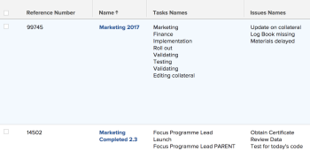

# 보고서에서 컬렉션 참조

<!-- Audited: 1/2025 -->

Adobe Workfront에서 보고서를 작성하면 목록, 그리드 또는 차트 형식으로 객체 세트, 해당 필드 또는 연결된 객체를 표시할 수 있습니다.

Workfront에서 보고서를 작성하는 방법에 대한 자세한 내용은 [사용자 지정 보고서 만들기](../../../reports-and-dashboards/reports/creating-and-managing-reports/create-custom-report.md)를 참조하십시오.

## 액세스 요구 사항

+++ 을 확장하여 이 문서의 기능에 대한 액세스 요구 사항을 봅니다.

다음 항목이 있어야 합니다.

<table style="table-layout:auto"> 
 <col> 
 <col> 
 <tbody> 
  <tr> 
   <td role="rowheader">Adobe Workfront 플랜</td> 
   <td> <p>임의</p> </td> 
  </tr> 
  <tr> 
   <td role="rowheader">Adobe Workfront 라이선스</td> 
   <td> 
      <p>신규:</p>
         <ul>
         <li><p>표준</p></li>
         </ul>
      <p>현재:</p>
         <ul>
         <li><p>플랜</p></li>
         </ul>
   </td>
  </tr> 
  <tr> 
   <td role="rowheader">액세스 수준 구성</td> 
   <td> <p>필터, 보기, 그룹화에 대한 액세스 편집</p> <p>보고서, 대시보드, 캘린더에 대한 액세스 편집</p> </td> 
  </tr> 
  <tr> 
   <td role="rowheader">개체 권한</td> 
   <td> <p>보고서에 대한 권한 관리</p> <p>보기, 필터 또는 그룹화에 대한 권한 관리 </p> </td> 
  </tr> 
 </tbody> 
</table>

자세한 내용은 [Workfront 설명서의 액세스 요구 사항](/help/quicksilver/administration-and-setup/add-users/access-levels-and-object-permissions/access-level-requirements-in-documentation.md)을 참조하십시오.

+++

## 컬렉션 이해

컬렉션은 다른 개체에 연결된 개체의 목록입니다.

Workfront의 개체 간에는 다음과 같은 두 가지 관계가 있습니다.

* **일대일 관계**: 한 개체에서 한 번에 한 개체에만 연결할 수 있습니다.\
  예를 들어 프로젝트는 한 번에 하나의 포트폴리오에만 연결할 수 있습니다.

* **일대다 관계**: 한 개체 하나가 한 번에 여러 다른 개체에 연결될 수 있습니다.\
  예를 들어 프로젝트에 여러 작업이 있을 수 있습니다. 이 경우 작업 목록은 프로젝트에 대한 컬렉션을 구성합니다.

>[!IMPORTANT]
>
>표준 Report Builder를 사용하여 개체 간의 일대일 관계를 보여 주는 보고서를 작성할 수 있습니다. 하지만 Report Builder의 텍스트 모드 인터페이스를 사용해야만 개체 간의 일대다 관계를 보여 주는 보고서를 작성할 수 있습니다.

표준 Report Builder에서 보고서를 작성하는 방법에 대한 자세한 내용은 [사용자 지정 보고서 만들기](../../../reports-and-dashboards/reports/creating-and-managing-reports/create-custom-report.md)를 참조하십시오.

텍스트 모드 인터페이스를 사용하여 보고서를 작성하는 방법에 대한 자세한 내용은 다음을 참조하십시오.

* [텍스트 모드 개요](../../../reports-and-dashboards/reports/text-mode/understand-text-mode.md)
* [텍스트 모드의 일반적인 사용 개요](../../../reports-and-dashboards/reports/text-mode/understand-common-uses-text-mode.md).
* [텍스트 모드 구문 개요](../../../reports-and-dashboards/reports/text-mode/text-mode-syntax-overview.md)

## API 탐색기에서 컬렉션 개체 및 해당 필드 찾기 {#find-collection-objects-and-their-fields-in-the-api-explorer}

모든 컬렉션을 보고할 수 있는 것은 아닙니다.

다른 컬렉션과 연결할 수 있는 개체를 이해하려면 API 탐색기를 사용해야 합니다.\
API 탐색기 테이블에 대한 자세한 내용은 [API 탐색기](../../../wf-api/general/api-explorer.md)를 참조하십시오.

보고할 수 있는 컬렉션을 알아보려면 다음 작업을 수행하십시오.

1. [API 탐색기](../../../wf-api/general/api-explorer.md)(으)로 이동합니다.
1. 보고서의 개체를 찾습니다.
1. **컬렉션** 탭을 선택합니다.

   >[!NOTE]
   >
   >이 탭에 나열된 객체만 선택한 객체에 대한 보고서에 컬렉션으로 표시할 수 있습니다.

1. 컬렉션의 개체를 클릭하여 확장합니다.
1. 표시된 링크를 클릭하여 컬렉션의 개체로 이동합니다.\
   이렇게 하면 컬렉션의 개체에 대한 **필드** 탭이 열립니다.

   >[!NOTE]
   >
   >컬렉션 보고서에서는 이 탭에 나열된 필드만 참조하거나 이 탭에 나열된 객체와 연결된 필드만 참조할 수 있습니다.

## 보고서의 참조 컬렉션

다음 보고 요소에 있는 컬렉션 개체의 개체를 참조할 수 있습니다.

* 보기
* 필터
* 프롬프트

다음 보고 요소에 있는 컬렉션 개체의 개체는 참조할 수 없습니다.

* 그룹화
* 차트

예를 들어 프로젝트 보고서에서 작업 또는 문제점 컬렉션을 참조하여 프로젝트 수준에서 작업 또는 문제점 정보를 표시할 수 있습니다.

* [보고서 보기에서 컬렉션 참조](#reference-a-collection-in-the-view-of-a-report)
* [보고서의 필터링에서 컬렉션 참조](#reference-a-collection-in-the-filter-of-a-report)
* [보고서의 사용자 지정 프롬프트에서 컬렉션 참조](#reference-a-collection-in-the-custom-prompt-of-a-report)

### 보고서 보기에서 컬렉션 참조 {#reference-a-collection-in-the-view-of-a-report}

보고서 뷰에서 객체 컬렉션을 참조하여 보고서 객체와 연관된 객체의 속성을 표시할 수 있습니다.

예를 들어 보고서 보기에서 작업 또는 문제에 대한 컬렉션 열을 빌드하여 프로젝트 보고서에 작업 또는 문제 정보를 표시할 수 있습니다.

작업 또는 문제에 대한 정보(예: 이름, 날짜, 기본 담당자, 완료율 등)를 컬렉션 보기에 표시할 수 있습니다.

보기에는 작업 또는 문제 정보가 목록 형식으로 표시되며 목록의 모든 행은 작업 또는 문제에 대한 정보를 나타냅니다. 작업 또는 문제 및 해당 필드의 목록은 작업 또는 문제가 속한 프로젝트와 동일한 줄에 표시됩니다.

{width=400}

* [보고서 보기에 컬렉션 열 추가](#add-a-collection-column-in-a-report-view)
* [텍스트 모드에서 컬렉션 보기의 줄 이해](#understand-the-lines-of-a-collection-view-in-text-mode)
* [컬렉션 보기의 제한 사항](#limitations-of-a-collection-view)

### 보고서 보기에 컬렉션 열 추가 {#add-a-collection-column-in-a-report-view}

보고서 보기에 컬렉션 열을 추가하려면 다음 작업을 수행하십시오.

1. **주** 메뉴 을 클릭한 다음 **보고서**&#x200B;를 클릭합니다.
1. **새 보고서**&#x200B;를 클릭합니다.
1. 보고서의 개체를 선택합니다.
1. 보고서에서 떨어진 다음 [API 탐색기](../../../wf-api/general/api-explorer.md)를 사용하여 보고서에 대해 선택한 개체에 사용할 수 있는 컬렉션을 결정합니다.

   컬렉션의 개체를 선택하는 방법에 대한 자세한 내용은 이 문서의 [API 탐색기에서 컬렉션 개체 및 해당 필드 찾기](#find-collection-objects-and-their-fields-in-the-api-explorer) 섹션을 참조하십시오.

   컬렉션에 대한 개체의 이름이 무엇인지 메모합니다.

1. [API 탐색기](../../../wf-api/general/api-explorer.md)를 사용하여 컬렉션에 표시할 개체의 필드 목록으로 이동합니다.

   컬렉션 개체의 필드를 찾는 방법에 대한 자세한 내용은 이 문서의 [API 탐색기에서 컬렉션 개체 및 해당 필드 찾기](#find-collection-objects-and-their-fields-in-the-api-explorer) 섹션을 참조하십시오.

   컬렉션에 표시할 필드의 이름을 메모하십시오.

1. 보고서로 돌아가서 **열(보기)** 탭에서 **열 추가**&#x200B;를 클릭합니다.
1. **텍스트 모드로 전환**&#x200B;을 클릭합니다.
1. **텍스트 모드 편집**&#x200B;을 클릭합니다.
1. **텍스트 모드** 대화 상자에서 모든 텍스트를 선택하고 제거한 다음 컬렉션 개체의 필드를 참조하는 경우 다음 코드를 붙여넣습니다.

   ```
   valueformat=HTML
   textmode=true
   type=iterate
   listdelimiter=<p>
   displayname=Column Name
   listmethod=nested(collection object name).lists
   valuefield=collection object field
   ```

1. **열 이름**&#x200B;을(를) `displayname` 줄의 열 이름으로 바꾸십시오.
1. [API 탐색기](../../../wf-api/general/api-explorer.md)에 나타나는 대로 **컬렉션 개체 이름**&#x200B;을(를) `listmethod` 줄의 컬렉션 개체 이름으로 바꿉니다.

1. [API 탐색기](../../../wf-api/general/api-explorer.md)에 나타나는 대로 **컬렉션 개체 필드**&#x200B;을(를) `valuefield` 줄의 컬렉션 개체 필드 이름으로 바꾸십시오.

   보기에서 사용자 지정 식을 만들려면 **valuefield**&#x200B;을(를) **valueexpression**(으)로 바꿀 수 있습니다.

   계산된 사용자 지정 식에 대한 자세한 내용은 [계산된 데이터 식의 개요](../../../reports-and-dashboards/reports/calc-cstm-data-reports/calculated-data-expressions.md)를 참조하십시오.

   예를 들어 프로젝트 보고서에 작업 목록을 표시하려는 경우 이 컬렉션에서는 작업 이름을 참조하기 위해 `valuefield` 줄을 사용합니다.

   다음 중 하나를 수행하십시오.

   * 다음 코드를 사용하여 열을 빌드합니다.

     ```
     valueformat=HTML
     textmode=true
     type=iterate
     listdelimiter=<p>
     displayname=Project Tasks Names
     listmethod=nested(tasks).lists
     valuefield=name
     ```

   * 다음 코드를 사용하여 보고서에 문제 목록을 표시합니다.

     ```
     displayname=Project Issues Names
     listdelimiter=<p>
     listmethod=nested(issues).lists
     textmode=true
     type=iterate
     valuefield=name
     valueformat=HTML
     ```

     컬렉션에서 **listmethod** 행에 대해 **issues**&#x200B;을(를) 사용해야 합니다. 대신 문제에 대한 데이터베이스 이름인 **opTasks**&#x200B;을(를) 사용해야 합니다. 문제를 참조할 때 **문제**&#x200B;를 사용할 때와 **opTask**&#x200B;을(를) 사용할 시기에 대한 자세한 내용은 [문제를 참조할 때 &quot;opTask&quot; 및 &quot;문제&quot; 사용](../../../manage-work/issues/issue-information/use-optask-instead-of-issue.md)을 참조하십시오.

   * 프로젝트 보고서에 작업 목록을 기본 피할당자와 함께 표시하려면 **valuefield** 대신 기본 피할당자의 이름과 인접한 작업 이름을 참조하는 데 **valueexpression** 줄을 사용합니다.

     다음 코드를 사용하여 열을 빌드합니다.

     ```
     valueformat=HTML
     textmode=true
     type=iterate
     listdelimiter=<p>
     displayname=Tasks Names - Primary Assignee
     listmethod=nested(tasks).lists
     valueexpression=CONCAT({name},' - ',{assignedTo}.{name})
     ```

1. 프로젝트 보고서에는 기본 피할당자와 함께 각 프로젝트의 모든 작업을 나열하는 다음 열이 표시됩니다.

   {width=400}

1. **저장**&#x200B;을 클릭합니다.
1. (선택 사항) 보고서를 계속 편집합니다.

   또는

   보고서를 저장하려면 **저장 + 닫기**&#x200B;를 클릭하십시오.

#### 텍스트 모드에서 컬렉션 보기의 줄 이해

컬렉션에 대한 텍스트 모드 보기의 라인은 다음 표에 요약되어 있습니다.

<table style="table-layout:auto"> 
 <col> 
 <col> 
 <thead> 
  <tr> 
   <th><strong>샘플 줄</strong> </th> 
   <th><strong>설명</strong> </th> 
  </tr> 
 </thead> 
 <tbody> 
  <tr> 
   <td><code>valueformat=HTML</code> </td> 
   <td> <p>이 줄에는 다양한 값을 사용할 수 있지만 컬렉션 목록의 <code style="font-weight: normal;">valueformat</code>은(는) <strong>HTML.</strong>이어야 합니다.</p>
   </td> 
  </tr> 
  <tr> 
   <td><code>textmode=true</code> </td> 
   <td> <p>이 줄은 열이 텍스트 모드를 사용하여 구성되었음을 나타냅니다. 이 줄을 제거하면 Workfront에서 기본적으로 다시 추가합니다.</p> </td> 
  </tr> 
  <tr> 
   <td><code>type=iterate</code> </td> 
   <td> <p>보기를 만들 때 목록의 <code>type</code>은(는) 항상 <code>iterate</code>입니다.</p> </td> 
  </tr> 
  <tr> 
   <td><code>listdelimiter=&lt;p&gt;</code> </td> 
   <td> <p>목록의 값을 구분하는 데 사용되는 구분 기호입니다.<br>값 사이에 줄 바꿈을 추가하는 <code>&lt;p&gt;</code>을(를) 사용하는 것이 좋습니다.</p> <p>다음을 사용할 수도 있습니다.</p> <p><code>&amp;zwj;</code> (너비가 0인 조이너). 컬렉션의 값에는 이러한 값 사이에 구분이 없습니다.<br><strong>,</strong> =쉼표 구분 기호입니다.컬렉션 값은 쉼표와 공백 없이 구분됩니다.<br><strong>/</strong> = 슬래시 구분 기호입니다.컬렉션 값은 슬래시로 구분됩니다.<br><strong>-</strong> = 대시 구분 기호. 컬렉션 값은 대시로 구분됩니다.<br>이 줄을 비워 두면 기본적으로 쉼표가 추가되고 그 뒤에 컬렉션 값 사이에 공백이 추가됩니다.</p> </td> 
  </tr> 
  <tr> 
   <td><code>displayname=</code><em>열 이름</em> </td> 
   <td> <p><strong>열 이름</strong>을(를) 새 열의 실제 이름으로 바꾸십시오.</p> </td> 
  </tr> 
  <tr> 
   <td><code>listmethod=nested(collection object name).list</code> </td> 
   <td> <p> 이 줄은 참조하는 컬렉션을 정의합니다.</p> <p><a href="../../../wf-api/general/api-explorer.md" class="MCXref xref">API 탐색기</a>에 나타나는 대로 <strong>컬렉션 개체 이름</strong>을 컬렉션에서 참조하는 개체의 이름으로 바꾸십시오. 이 값은 일반적으로 컬렉션 개체 이름의 복수 형식입니다.</p> </td> 
  </tr> 
  <tr> 
   <td><code>valuefield=collection object field</code> </td> 
   <td> <p>이 줄은 컬렉션 개체에서 참조하는 필드를 정의합니다.</p> <p><strong>컬렉션 개체 필드</strong>은(는) <a href="../../../wf-api/general/api-explorer.md" class="MCXref xref">API 탐색기</a>에 나타나는 대로 컬렉션에서 참조하는 개체의 필드 이름으로 바꾸십시오.</p> <p>이 줄을 다음으로 바꿀 수 있습니다.</p> <p><strong>valueexpression</strong>=계산된 컬렉션 개체 필드/ 필드</p> <p><strong>valueexpression</strong>을(를) 사용하면 다음 작업을 수행할 수 있습니다.  열에 계산된 사용자 정의 표현식을 표시합니다.</p> <p><strong>valueexpression</strong> 줄 서식 지정 방법에 대한 자세한 내용은 <a href="../../../reports-and-dashboards/reports/text-mode/text-mode-syntax-overview.md" class="MCXref xref">텍스트 모드 구문 개요</a>를 참조하십시오.</p> </td> 
  </tr> 
 </tbody> 
</table>

#### 컬렉션 보기의 제한 사항 {#limitations-of-a-collection-view}

컬렉션 보기를 만들 때는 다음 제한 사항을 고려하십시오.

* 컬렉션 데이터가 표시되는 순서를 제어할 수 없습니다.
* 컬렉션 뷰에는 조건부 서식을 적용할 수 없습니다.
* 컬렉션의 개체를 클릭 가능한 링크로 만들 수 없습니다.
* 다른 컬렉션의 컬렉션 보기는 빌드할 수 없습니다.\
  예를 들어 프로젝트 보고서의 각 작업에 대한 모든 피할당자를 표시할 수는 없습니다. 프로젝트 보기의 각 작업에는 기본 할당자만 표시할 수 있습니다.

### 보고서의 필터에서 컬렉션 참조 {#reference-a-collection-in-the-filter-of-a-report}

보고서의 필터에서 객체 컬렉션을 참조하여 보고서의 객체와 연관된 객체의 속성을 필터링할 수 있습니다.

예를 들어 필터 문에서 프로젝트에 대한 작업 또는 문제의 속성에 대한 참조를 사용하여 프로젝트 보고서에서 작업 또는 문제 정보를 필터링할 수 있습니다.

>[!NOTE]
>
>여러 값이 포함된 필드(예: 프로젝트 내의 메모 컬렉션)에 적용되면 필터는 다음과 같이 포함을 결정합니다.
>
>* 컬렉션의 모든 항목에 지정된 값이 포함되어 있으면 전체 레코드가 결과에서 제외됩니다.
>* 컬렉션에서 하나 이상의 항목에 지정된 값이 포함되어 있지 않으면 레코드가 결과에 유지됩니다.


보고서 필터의 컬렉션에 대한 참조를 추가하려면 다음 작업을 수행하십시오.

1. **주** 메뉴 을 클릭한 다음 **보고서**&#x200B;를 클릭합니다.
1. **새 보고서**&#x200B;를 클릭합니다.
1. 보고서의 개체를 선택합니다.
1. 보고서에서 떨어진 다음 [API 탐색기](../../../wf-api/general/api-explorer.md)를 사용하여 보고서에 대해 선택한 개체에 사용할 수 있는 컬렉션을 결정합니다.

   컬렉션의 개체를 선택하는 방법에 대한 자세한 내용은 이 문서의 [API 탐색기에서 컬렉션 개체 및 해당 필드 찾기](#find-collection-objects-and-their-fields-in-the-api-explorer) 섹션을 참조하십시오.

   컬렉션에 대한 개체의 이름이 무엇인지 메모합니다.

1. [API 탐색기](../../../wf-api/general/api-explorer.md)를 사용하여 컬렉션에 표시할 개체의 필드 목록으로 이동합니다.

   컬렉션 개체의 필드를 찾는 방법에 대한 자세한 내용은 이 문서의 [API 탐색기에서 컬렉션 개체 및 해당 필드 찾기](#find-collection-objects-and-their-fields-in-the-api-explorer) 섹션을 참조하십시오.

   컬렉션에 표시할 필드를 메모하십시오.

1. 보고서로 돌아간 후 **필터** 탭에서 **텍스트 모드로 전환**&#x200B;을 클릭한 다음 **텍스트 모드 편집**&#x200B;을 클릭합니다.

1. **보고서에 대한 필터 규칙 설정** 영역에 다음 코드를 붙여넣습니다.

   ```
   collection object name:collection object field=collection object value
   collection object name:collection object field_Mod=value of the modifier
   ```

1. [API 탐색기](../../../wf-api/general/api-explorer.md)에 나타나는 대로 **컬렉션 개체 이름**&#x200B;을(를) 컬렉션 개체의 이름으로 바꾸십시오. 이 값은 일반적으로 컬렉션 개체 이름의 복수 형식입니다.

1. **컬렉션 개체 필드**&#x200B;을(를) [API 탐색기](../../../wf-api/general/api-explorer.md)에 나타나는 컬렉션 개체의 필드 이름으로 바꾸십시오.

1. **컬렉션 개체 값**&#x200B;을(를) Workfront에 나타나는 컬렉션 개체의 값으로 바꾸십시오.
1. **한정자의 값**&#x200B;을(를) 올바른 한정자로 바꾸십시오.

   수정자 목록을 보려면 [필터 및 조건 수정자](../../../reports-and-dashboards/reports/reporting-elements/filter-condition-modifiers.md)를 참조하십시오.\
   예를 들어 이름에 &quot;Marketing&quot;이 있는 작업이 있는 프로젝트만 표시하는 프로젝트 보고서를 작성하려면 다음 코드를 사용하십시오.

   ```
   tasks:name=Marketing
   tasks:name_Mod=cicontains
   ```

   이 보고서는 이름에 &quot;marketing&quot;이라는 단어가 포함된 작업이 하나 이상 있는 프로젝트만 표시합니다.

   {width=400}

1. 문제의 이름을 필터링하려면 다음 코드를 사용하십시오.

   ```
   issues:name=Marketing
   issues:name_Mod=cicontains
   ```

   >[!TIP]
   >
   >API 탐색기에서 문제가 나타나는 방식인 `optask` 대신 컬렉션 개체 이름에 `issues`을(를) 사용해야 합니다.

1. **완료**&#x200B;를 클릭합니다.
1. (선택 사항) 보고서를 계속 편집합니다.

   또는

   보고서를 저장하려면 **저장 + 닫기**&#x200B;를 클릭하십시오.

### 보고서의 사용자 지정 프롬프트에서 컬렉션 참조 {#reference-a-collection-in-the-custom-prompt-of-a-report}

보고서의 사용자 정의 프롬프트에서 개체 컬렉션 참조를 사용하여 보고서 개체와 연관된 개체 속성에 대한 보고서 결과를 필터링할 수 있습니다.

예를 들어 보고서의 사용자 지정 프롬프트에서 프로젝트의 작업 특성에 대한 참조를 사용하여 프로젝트 보고서에서 작업 정보를 묻는 메시지를 표시할 수 있습니다.

>[!NOTE]
>
>표준 프롬프트에서 컬렉션을 참조할 수 없습니다.

사용자 지정 프롬프트는 명령문이 앰퍼샌드 기호로 연결되는 사용자 지정 필터입니다. 먼저 필터에서 명령문을 작성한 다음 명령문의 줄을 앰퍼샌드로 연결하는 것이 좋습니다.

컬렉션 참조를 사용하여 필터 문을 작성하는 방법에 대한 자세한 내용은 이 문서의 보고서](#reference-a-collection-in-the-filter-of-a-report) 필터링에서 컬렉션 참조 섹션을 [참조하세요.

보고서의 사용자 지정 프롬프트에서 컬렉션 참조를 추가하려면:

1. Main menu(기본&#x200B;**메뉴) Main Menu(기본 메뉴 클릭한 다음 Reports(보고서&#x200B;**)를 클릭합니다**.
1. 새로 만들기 보고서를&#x200B;**클릭합니다**.
1. 보고서 개체를 선택합니다.
1. 이 문서의 [보고서의 필터에서 컬렉션 참조](#reference-a-collection-in-the-filter-of-a-report) 섹션에 설명된 대로 컬렉션 참조를 사용하여 필터를 빌드합니다.
1. **보고서 설정**&#x200B;을 클릭합니다.
1. **보고서 프롬프트**&#x200B;를 클릭합니다.
1. **프롬프트 추가**&#x200B;를 클릭합니다.
1. **사용자 지정 프롬프트**&#x200B;를 클릭합니다.
1. **필드****이름** 필드에 프롬프트 이름을 지정하십시오.

1. **드롭다운 항목 레이블**&#x200B;을(를) 지정하십시오.
1. **조건** 필드에 다음을 지정하십시오.

   ```
   collection object name:collection object field_Mod=value of the modifier
   ```

1. (선택 사항) 이 선택 사항이 기본적으로 프롬프트에 표시되는지 여부를 지정합니다.
1. [API 탐색기](../../../wf-api/general/api-explorer.md)에 나타나는 대로 **컬렉션 개체 이름**&#x200B;을(를) 컬렉션 개체의 이름으로 바꾸십시오. 이 값은 일반적으로 컬렉션 개체 이름의 복수 형식입니다.
1. **컬렉션 개체 필드**&#x200B;을(를) [API 탐색기](../../../wf-api/general/api-explorer.md)에 나타나는 컬렉션 개체의 필드 이름으로 바꾸십시오.
1. **컬렉션 개체 값**&#x200B;을(를) Workfront에 나타나는 컬렉션 개체의 값으로 바꾸십시오.

   예를 들어 작업 이름에 &quot;Marketing&quot;이 포함된 프로젝트를 필터링하는 경우 **컬렉션 개체 값**&#x200B;을 **marketing**(으)로 바꾸십시오.

1. **한정자의 값**&#x200B;을(를) 올바른 한정자로 바꾸십시오.

   수정자 목록을 보려면 [필터 및 조건 수정자](../../../reports-and-dashboards/reports/reporting-elements/filter-condition-modifiers.md)를 참조하십시오.

   **예:** 예를 들어 특정 사용자에게 하나 이상의 작업이 할당된 프로젝트만 표시할 사용자 지정 프롬프트를 사용하여 프로젝트 보고서를 작성하려면 아래 코드를 사용하십시오.

   ```
   tasks:assignedToID=57cf1b7a000077c9f02f66cb09c8f86c&tasks:assignedToID_Mod=in
   ```

   이렇게 하면 나열된 모든 프로젝트에 GUID가 57cf1b7a000077c9f02f66cb09c8f86c인 사용자에게 할당된 작업이 하나 이상 있는 보고서가 생성됩니다.

   >[!NOTE]
   >
   >[API 탐색기](../../../wf-api/general/api-explorer.md)에 따라 작업의 기본 피할당자(&quot;할당 대상&quot; 필드)의 이름을 참조할 수 없습니다. 기본 피할당자의 ID만 참조할 수 있습니다.

   예를 들어 프로젝트 문제 중 하나가 특정 사용자에게 할당된 프로젝트를 필터링하려면 사용자 지정 프롬프트에 다음 코드를 사용하십시오.

   ```
   issues:assignedToID=57cf1b7a000077c9f02f66cb09c8f86c&issues:assignedToID_Mod=in
   ```

   이렇게 하면 나열된 모든 프로젝트에 GUID가 57cf1b7a000077c9f02f66cb09c8f86c인 사용자에게 할당된 문제가 하나 이상 있는 보고서가 생성됩니다.

   >[!NOTE]
   >
   >컬렉션 개체 이름에 **문제**&#x200B;를 사용해야 합니다. 현재 API 탐색기에서 문제에 대한 컬렉션 개체 이름을 제공하지 않습니다.

1. **완료**&#x200B;를 클릭합니다.
1. (선택 사항) 보고서를 계속 편집합니다.

   또는

   보고서를 저장하려면 **저장 + 닫기**&#x200B;를 클릭하십시오.
