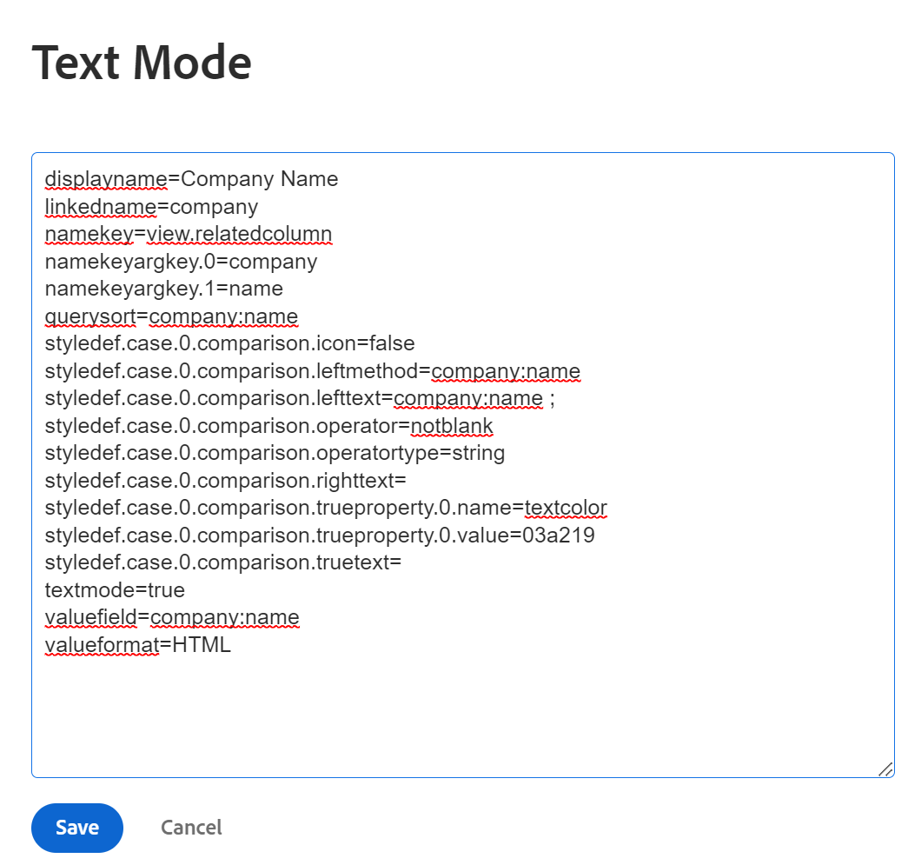

# 텍스트 모드에서 조건부 서식 사용

<!--Audited: 01/2025-->

표준 인터페이스 빌더는 조직의 요구 사항을 충족하는 보고 요소를 만들 때 광범위한 유연성을 제공합니다.

표준 인터페이스를 사용하여 보기에서 조건부 서식을 적용할 수 있습니다.\
보기에 조건부 서식을 적용하는 방법에 대한 자세한 내용은 [보기에서 조건부 서식 사용](../../../reports-and-dashboards/reports/reporting-elements/use-conditional-formatting-views.md)을 참조하십시오.

## 액세스 요구 사항

+++ 을 확장하여 이 문서의 기능에 대한 액세스 요구 사항을 봅니다.

<table style="table-layout:auto"> 
 <col> 
 <col> 
 <tbody> 
  <tr> 
   <td role="rowheader">Adobe Workfront 패키지</td> 
   <td> <p>임의</p> </td> 
  </tr> 
  <tr> 
   <td role="rowheader">Adobe Workfront 라이선스</td> 
   <td> 
     <p>표준</p>
     <p>플랜</p>
   </td> 
  </tr> 
  <tr> 
   <td role="rowheader">액세스 수준 구성</td> 
   <td> <p>필터, 보기, 그룹화에 대한 액세스 편집</p> <p>보고서, 대시보드, 캘린더에 대한 액세스 권한을 편집하여 보고서의 보기 편집</p> </td> 
  </tr> 
  <tr> 
   <td role="rowheader">개체 권한</td> 
   <td> <p>보고서의 보기를 편집할 수 있도록 보고서에 대한 권한 관리</p> <p>보기에 대한 편집 권한 관리</p> </td> 
  </tr>
 </tbody> 
</table>

이 표의 정보에 대한 자세한 내용은 [Workfront 설명서의 액세스 요구 사항](/help/quicksilver/administration-and-setup/add-users/access-levels-and-object-permissions/access-level-requirements-in-documentation.md)을 참조하십시오.

+++

## 텍스트 모드의 조건부 서식

텍스트 모드를 사용하면 표준 인터페이스에서 사용할 수 없는 필드를 사용할 수 있으므로 더 복잡한 보기, 필터, 그룹화 및 프롬프트를 만들 수 있습니다.

보고 가능한 모든 필드의 전체 목록을 보려면 [API 탐색기](../../../wf-api/general/api-explorer.md)를 참조하십시오.

텍스트 모드 구문 사용에 대한 자세한 내용은 [텍스트 모드 구문 개요](../../../reports-and-dashboards/reports/text-mode/text-mode-syntax-overview.md)를 참조하십시오.

텍스트 모드를 사용하여 보고서와 목록의 보기에 서식을 지정할 수도 있습니다. 조건부 서식을 사용하면 보고서에서 결과의 글꼴 유형과 배경뿐만 아니라 아이콘과 플래그를 변경하여 보고서의 보기를 변경할 수 있습니다. 항상 먼저 표준 인터페이스를 사용하여 보기를 작성하고 반드시 필요한 경우에만 텍스트 모드 인터페이스로 전환하는 것이 좋습니다.

>[!NOTE]
>
> CSS 스타일을 사용하여 조건부 서식을 사용자 지정할 수 없습니다. 대신 Adobe Workfront에서 사용할 수 있는 미리 디자인된 서식 옵션을 사용해야 합니다.

## 보기에 조건부 서식 추가

표준 빌더 인터페이스의 보기에 조건부 서식을 적용하는 방법에 대한 자세한 내용은 [보기에서 조건부 서식 사용](../../../reports-and-dashboards/reports/reporting-elements/use-conditional-formatting-views.md)을 참조하십시오.

텍스트 모드 인터페이스의 뷰에 조건부 서식을 추가하려면 다음을 수행합니다.

1. 개체 목록으로 이동합니다.
1. 조건부 서식을 추가할 뷰의 드롭다운 메뉴를 확장합니다.
1. **보기 사용자 지정**&#x200B;을 클릭합니다.
1. 보기에서 조건부 서식을 적용할 열을 클릭합니다.
1. **텍스트 모드로 전환**&#x200B;을 클릭합니다.
1. **이 열에 표시:** 영역에서 **텍스트를 편집하려면 클릭**&#x200B;합니다.
1. 선택한 열의 텍스트 맨 아래에 있는 [텍스트 모드를 사용하는 서식 보기](#format-views-using-text-mode)에서 제공된 코드 샘플을 추가합니다.
1. **저장**&#x200B;을 클릭한 다음 **보기 저장**&#x200B;을 클릭합니다.

## 텍스트 모드를 사용하여 보기 서식 지정 {#format-views-using-text-mode}

다음 구성 요소를 뷰의 열에 추가하여 텍스트 모드에서 조건부 서식을 지정할 수 있습니다.

* [열 설정](#column-settings)
* [열 규칙](#column-rules)
* [조건부로 valueexpression 서식 지정](#conditionally-format-a-valueexpression)

### 열 설정 {#column-settings}

조건부 서식을 보기에 추가하려면 먼저 텍스트 모드 인터페이스에 익숙해야 합니다.

보기에서 조건부 서식을 사용할 때 열의 다음 요소를 사용자 지정할 수 있습니다.

* [열 머리글](#column-headers)
* [날짜 서식](#format-dates)
* [숫자 서식](#format-numbers)

#### 열 헤더 {#column-headers}

표시된 열 머리글을 변경하려면 열에 `displayname= [Name of column]` 코드를 추가하십시오. 예를 들어 열 이름을 프로젝트 소유자로 지정하려면 텍스트 코드는 다음과 같습니다.

`displayname=Project Owner`

#### 날짜 형식 지정 {#format-dates}

날짜는 다양한 형식으로 표시하도록 구성할 수 있습니다.

자세한 내용은 [텍스트 모드 보고서의 날짜 서식 지정](../../../reports-and-dashboards/reports/text-mode/format-dates-in-text-mode-reports.md)을 참조하십시오.

#### 숫자 서식 {#format-numbers}

보고 요구 사항에 가장 적합한 정보를 표시하도록 숫자 값의 형식을 지정할 수 있습니다.

자세한 내용은 [텍스트 모드 보고서의 숫자, 통화 및 백분율 값 서식](../../../reports-and-dashboards/reports/text-mode/format-numbers-in-text-mode-reports.md)을 참조하세요.

### 열 규칙 {#column-rules}

열 규칙을 사용하면 보기 내에서 이미지, 색상, 서식 및 텍스트 재정의를 추가할 수 있습니다. 열 규칙은 독립적으로 설정되거나 열에 대한 여러 조건을 포함할 수 있습니다.

* [조건부 서식](#conditional-formatting)
* [여러 조건부 형식](#multiple-conditional-formats)
* [텍스트 적용](#apply-text)
* [행 형식 적용](#apply-row-formats)
* [이미지 적용](#apply-images)

#### 조건부 서식 {#conditional-formatting}

색상을 통합하거나 텍스트 서식을 지정할 때 특정 텍스트 모드 문을 적용해야 합니다.

>[!NOTE]
>
>병합된 열에서는 조건부 서식이 지원되지 않을 수 있습니다.\
>열을 텍스트 모드로 병합하는 방법에 대한 자세한 내용은 [보기: 하나의 공유 열에 있는 여러 열의 정보 병합](../../../reports-and-dashboards/reports/custom-view-filter-grouping-samples/view-merge-columns.md)을 참조하십시오.

조건부 서식을 추가할 열에 다음 코드를 삽입합니다.

```
styledef.case.0.comparison.leftmethod= [field name]
styledef.case.0.comparison.lefttext= [field name]
styledef.case.0.comparison.righttext= [field value]
styledef.case.0.comparison.operator= [qualifier]
styledef.case.0.comparison.operatortype= [data type]
styledef.case.0.comparison.icon=false
styledef.case.0.comparison.truetext= 
styledef.case.0.comparison.trueproperty.0.name= [format option]
styledef.case.0.comparison.trueproperty.0.value= [format style]
```

>[!NOTE]
>
>`styledef.case.0.comparison.icon` 줄은 아이콘으로 작업하지 않는 한 항상 false입니다.
>
>텍스트를 덮어쓸 때까지 `styledef.case.0.comparison.truetext` 줄은 항상 비어 있습니다.
>
>한정자가 비어 있지 않으면 `styledef.case.0.comparison.righttext` 줄이 비어 있습니다.

예를 들어 프로젝트 보고서에 회사 이름을 녹색 텍스트로 표시하려는 경우 다음 코드를 사용할 수 있습니다.

```
styledef.case.0.comparison.leftmethod=company:name
styledef.case.0.comparison.lefttext=company:name ;
styledef.case.0.comparison.righttext= 
styledef.case.0.comparison.operator=notblank
styledef.case.0.comparison.operatortype=string
styledef.case.0.comparison.icon=false
styledef.case.0.comparison.truetext=
styledef.case.0.comparison.trueproperty.0.name=textcolor
styledef.case.0.comparison.trueproperty.0.value=03a219
```

>[!NOTE]
>
>* 이 문은 회사 이름 열에 적용할 수 있지만 보고서의 다른 열에도 적용할 수 있습니다. 프로젝트에 연결된 회사가 있는 경우에만 녹색 텍스트가 표시됩니다. 조건이 열에 표시되는지 여부에 관계없이 `[field name]`, `[value]` 및 `[qualifier]` 드라이브를 기억하십시오.
>* 한정자를 사용할 때는 `cicontains`보다 `equal`을(를) 사용하는 것이 좋습니다. 기본적으로 `equal`은(는) ID 번호를 찾습니다. `cicontains` 한정자를 사용하면 해당 이름으로 항목에 액세스할 수 있습니다.

{width="500"}


{width="400"}

텍스트 모드에 텍스트 색상, 정렬, 글꼴 스타일 또는 배경색을 적용하든 관계없이 동일한 문(위에 표시)이 사용됩니다.

열에 필요한 해당 형식을 반영하도록 다음 줄을 수정해야 합니다.

```
styledef.case.0.comparison.trueproperty.0.name= [format option]
styledef.case.0.comparison.trueproperty.0.value= [format style]
```

다음 표를 사용하여 수정해야 하는 선과 열의 형식 스타일을 정의하기 위해 지정해야 하는 값을 식별합니다.

| **텍스트 색상** | **줄: textcolor=** |
|---|---|
| 검은색 | `000000` |
| 진한 파란색 | `0c6aca` |
| 청록색 | `1b878c` |
| 녹색 | `03a219` |
| 자주색 | `6408c4` |
| 회색 | `767676` |
| 빨간색 | `d30519` |
| 노란색 | `e19503` |

{style="table-layout:auto"}

| **정렬** | **줄: 정렬=** |
|---|---|
| 왼쪽 정렬 | `left` |
| 오른쪽 정렬 | `right` |
| 가운데 정렬 | `center` |

{style="table-layout:auto"}

| 글꼴 | 줄: ***fontstyle=*** |
|---|---|
| 볼드체 | `bold` |
| 이탤릭체 | `italic` |

{style="table-layout:auto"}

| **배경색** | **줄: bgcolor=** |
|---|---|
| 청록색 | `dcf6f7` |
| 녹색 | `def6e2` |
| 회색 | `e8e8e8` |
| 파란색 | `e8f1ff` |
| 자주색 | `e9def4` |
| 빨간색 | `eac6c9` |
| 노란색 | `feecc8` |
| 흰색 | `ffffff` |

{style="table-layout:auto"}

#### 여러 조건부 형식 {#multiple-conditional-formats}

명령문에 두 개 이상의 서식 스타일을 적용할 수 있습니다. core 문은 변경되지 않으며 추가적인 형식 표현식이 문에 추가됩니다.

예를 들어, 녹색 굵게 텍스트에 회사 이름을 포함하기 위해 이전 문을 사용합니다. 문은 다음 코드를 사용하여 작성됩니다.

```
styledef.case.0.comparison.leftmethod=company:name
styledef.case.0.comparison.lefttext=company:name
styledef.case.0.comparison.righttext=
styledef.case.0.comparison.operator=notblank
styledef.case.0.comparison.operatortype=string
styledef.case.0.comparison.icon=false
styledef.case.0.comparison.truetext= 
styledef.case.0.comparison.trueproperty.0.name=textcolor
styledef.case.0.comparison.trueproperty.0.value=03a219
styledef.case.0.comparison.trueproperty.1.name=fontstyle
styledef.case.0.comparison.trueproperty.1.value=bold
```

>[!NOTE]
>
>조건부 서식 표현식을 두 개 이상 포함할 경우 명령문에서 각 표현식을 숫자로 식별해야 합니다. 표현식 0과 표현식 1이 식별되었습니다.

#### 텍스트 적용 {#apply-text}

열에 채워진 기본값을 선택한 값으로 바꾸려면 열에 텍스트를 적용할 때 가능합니다.

예를 들어 프로젝트 보고서에서 &#39;오늘 아님&#39; 텍스트 대신 프로젝트의 계획된 시작 일자를 표시하지 않도록 계획된 시작 일자 열 값을 설정합니다. 계획된 시작 일자 열에 다음 코드를 사용합니다.

```
case.0.comparison.leftmethod=plannedStartDate
case.0.comparison.lefttext=plannedStartDate
case.0.comparison.righttext=2013-04-10T10:45:00:000
case.0.comparison.operator=ne
case.0.comparison.operatortype=date
case.0.comparison.icon=false
case.0.comparison.truetext=not today
styledef.case.0.comparison.leftmethod=plannedStartDate
styledef.case.0.comparison.lefttext=plannedStartDate
styledef.case.0.comparison.righttext=2013-04-10T10:45:00:000 
styledef.case.0.comparison.operator=ne
styledef.case.0.comparison.operatortype=date&
styledef.case.0.comparison.icon=false
styledef.case.0.comparison.truetext=not today
```

>[!NOTE]
>
>`case.0.`(으)로 시작하는 줄은 텍스트 사용을 식별하기 위해 사용 사례 비교를 사용합니다. `styledef.case.0.`(으)로 시작하는 줄은 `truetext` 식을 통해 텍스트 사용을 식별하는 초기 조건부 서식 문입니다. `truetext`을(를) 비워 두지 말고 값으로 설정하십시오.

{width="500"}

{width="400"}

#### 행 형식 적용 {#apply-row-formats}

전체 행에 조건을 적용하려면 열 코드에 다음 코드를 사용합니다.

```
styledef.case.0.comparison.icon=false
styledef.case.0.comparison.isrowcase=true
styledef.case.0.comparison.leftmethod= [field name]
styledef.case.0.comparison.lefttext= [field name]
styledef.case.0.comparison.operator= [qualifier]
styledef.case.0.comparison.operatortype= [data type]
styledef.case.0.comparison.righttext= [field value]
styledef.case.0.comparison.trueproperty.0.name= [format option]
styledef.case.0.comparison.trueproperty.0.value= [format style]
styledef.case.0.comparison.truetext=
row.0.styledef.applyallcases=true
row.0.styledef.case.0.comparison.icon=false
row.0.styledef.case.0.comparison.isrowcase=true
row.0.styledef.case.0.comparison.leftmethod= [field name]
row.0.styledef.case.0.comparison.lefttext= [field name]
row.0.styledef.case.0.comparison.operator= [qualifier]
row.0.styledef.case.0.comparison.operatortype= [data type]
row.0.styledef.case.0.comparison.righttext= [field value]
row.0.styledef.case.0.comparison.trueproperty.0.name= [format option]
row.0.styledef.case.0.comparison.trueproperty.0.value= [format style]
row.0.styledef.case.0.comparison.truetext=
```

#### 이미지 적용 {#apply-images}

텍스트로 서식을 지정하는 것과 마찬가지로 이미지를 사용하여 보고서에 정보를 표시할 수 있습니다. Workfront에는 보고서 설정에서 시각적 정보를 전달할 수 있는 많은 내장 이미지가 있습니다. 조건부 서식 설정에서 이미지를 사용하려면 다음 문이 필요합니다.

```
image.case.0.comparison.leftmethod= [field name]
image.case.0.comparison.lefttext= [field name]
image.case.0.comparison.righttext= [field value]
image.case.0.comparison.operator= [qualifier]
image.case.0.comparison.operatortype= [data type]
image.case.0.comparison.icon=true
image.case.0.comparison.truetext=
```

예를 들어 프로젝트 보고서에서 오늘 일자와 같지 않은 모든 계획된 완료 일자에 대해 찡그린 얼굴을 표시하는 열을 작성하려고 합니다. 다음 텍스트 모드 코드를 사용하여 열에 아이콘을 추가합니다.

```
image.case.0.comparison.leftmethod=plannedCompletionDate
image.case.0.comparison.lefttext=plannedCompletionDate
image.case.0.comparison.righttext=2013-04-10T13:00:00:000 
image.case.0.comparison.operator=ne 
image.case.0.comparison.operatortype=date
image.case.0.comparison.icon=true
image.case.0.comparison.truetext=/interface/images/v4_redux/icons/casebuilder/emoticon_frown.gif
```

>[!NOTE]
>
>문에서 `icon=true` 식을 사용합니다. 이 문은 `style.def` 형식이 아니라 고유한 이미지 형식을 사용한다는 점에서 다른 조건부 서식 구문과 다릅니다.

{width="500"}

{width="400"}

사용 가능한 이미지를 사용하려면 다음 코드와 값을 적용합니다.

| **아이콘** | **줄: image.case.0.comparison.truetext=** |
|---|---|
| 찡그린 얼굴  | =`/interface/images/v4_redux/icons/casebuilder/emoticon_frown.gif` |
| 행복한 얼굴  | =`/interface/images/v4_redux/icons/casebuilder/emoticon_smile.gif` |
| 파란색 플래그  | =`/interface/images/v4_redux/icons/casebuilder/flag_blue.gif` |
| 녹색 플래그  | =`/interface/images/v4_redux/icons/casebuilder/flag_green.gif` |
| 빨간색 플래그  | =`/interface/images/v4_redux/icons/casebuilder/flag_red.gif` |
| 노란색 플래그  | =`/interface/images/v4_redux/icons/casebuilder/flag_yellow.gif` |
| 검정색 원  | =`/interface/images/v4_redux/icons/casebuilder/light_black.gif` |
| 파란색 원  | =`/interface/images/v4_redux/icons/casebuilder/light_blue.gif` |
| 회색 원  | =`/interface/images/v4_redux/icons/casebuilder/light_grey.gif` |
| 녹색 원  | =`/interface/images/v4_redux/icons/casebuilder/light_green.gif` |
| 주황색 원  | =`/interface/images/v4_redux/icons/casebuilder/light_orange.gif` |
| 분홍색 원  | =`/interface/images/v4_redux/icons/casebuilder/light_pink.gif` |
| 자주색 원  | =`/interface/images/v4_redux/icons/casebuilder/light_purple.gif` |
| 빨간색 원  | =`/interface/images/v4_redux/icons/casebuilder/light_red.gif` |
| 흰색 원  | =`/interface/images/v4_redux/icons/casebuilder/light_white.gif` |
| 노란색 원  | =`/interface/images/v4_redux/icons/casebuilder/light_yellow.gif` |

{style="table-layout:auto"}

### 조건부로 `valueexpression` 형식 지정 {#conditionally-format-a-valueexpression}

열에 계산된 값을 표시하려면 열의 `valuefield` 코드 행을 `valueexpression`(으)로 바꿀 수 있습니다. 계산된 값을 사용하면 동일한 객체에 대한 두 기존 필드 간의 계산을 기반으로 객체에 대한 새 값을 표시할 수 있습니다.

`valueexpression line`의 서식을 지정하는 방법에 대한 자세한 내용은 [텍스트 모드 구문 개요](../../../reports-and-dashboards/reports/text-mode/text-mode-syntax-overview.md)를 참조하십시오.

`valueexpression` 코드 줄이 포함된 열의 형식을 조건부로 지정할 수 없습니다. 대신 계산된 사용자 정의 필드를 사용자 정의 양식에 추가하고 보고서에 표시하는 객체와 연결할 수 있습니다. 그런 다음 이 필드를 표시하는 열의 서식을 조건부로 지정할 수 있습니다.

계산된 사용자 지정 필드에 대한 자세한 내용은 [양식에 계산된 필드 추가](/help/quicksilver/administration-and-setup/customize-workfront/create-manage-custom-forms/form-designer/design-a-form/add-a-calculated-field.md)를 참조하십시오.

## 텍스트 모드 열에 집계 값 추가

먼저 빌더 인터페이스에서 열을 빌드하고, 거기에 집계 값을 추가한 다음 텍스트 모드에서 열을 편집하는 것이 좋습니다.

텍스트 모드에서 열에 집계자를 추가할 때 다음 사항을 고려하십시오.

* 열의 값은 요약할 수 있는 형식을 가져야 합니다. 예를 들어 다음 형식 중 하나가 있어야 합니다.

   * 숫자
   * Date
   * 통화

* 계산을 표시하는 열에 집계를 추가할 수 있습니다. 집계된 값은 보기 또는 보고서의 그룹화에 표시됩니다. 자세한 내용은 [그룹화: 그룹화에서 계산된 여러 값을 집계한 결과를 표시합니다](../../../reports-and-dashboards/reports/custom-view-filter-grouping-samples/grouping-calculation-between-two-fields-aggregated-in-grouping.md)을 참조하십시오.
* 열 정의에 대한 코드 행은 애그리게이터를 소개하고 앞에 &quot;애그리게이터&quot;가 오는 코드 행과 동일해야 합니다. 예를 들어 프로젝트에 계획된 시간을 표시하는 열이 있는 경우 열의 기본 행의 텍스트 모드는 다음과 같습니다.

```
  valuefield=workRequired
  valueformat=compound
```

보기 그룹화에 있는 모든 라인의 값을 집계하려는 경우 다음 코드를 추가하여 집계 값을 추가할 수 있습니다.

`aggregator.valuefield=workRequired`(`aggregator.valuefield` 줄은 열을 설명하는 `valuefield`과(와) 같아야 함)

`aggregator.valueformat=compound`(`aggregator.valueformat` 줄의 값은 열을 설명하는 `valueformat`과(와) 같아야 함)

`aggregator.function=SUM`(열을 집계하는 방법을 나타내는 필수 행이며, 이 경우 그룹화 행에서 모든 개별 계획된 시간을 하나의 숫자로 추가하려는 경우)

`aggregator.displayformat=minutesAsHoursString`(시간이 Workfront에 분 단위로 저장되므로 시간이 분 단위로 저장되는 시간에 대해 `displayformat`을(를) 표시하려고 함)
