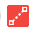

# 보기의 기본 제공 상태 아이콘

<!-- Audited: 11/2024 -->

<!--(NOTE: ALina: ***Link this from the Understanding Fields in Lists and Reports.)-->

기본 제공 상태 아이콘 필드를 보기의 열로 추가하여 개체에 대한 주요 지점을 보다 명확하게 볼 수 있습니다. 상태 아이콘을 사용하면 다음 조건이 있을 때 한 눈에 볼 수 있습니다.

* 오브젝트에 문서가 첨부되어 있습니다.
* 오브젝트가 승인 프로세스와 연결되어 있습니다.
* 개체에는 연결된 추가 메모가 있습니다.
* 경비는 청구 가능 또는 환급 가능
* 작업이 중요 경로에 있습니다.
* 사용자가 회사, 팀에 속하거나 개인 사용자가 다른 시간대에 있습니다

다음 사항을 고려하십시오.

* 상태 아이콘 필드의 대부분의 표시기는 실제 객체 또는 객체가 나타내는 영역에 대한 빠른 링크입니다.

* 아이콘으로 표시되는 항목 중 개체에서 누락된 항목이 있는 경우 누락된 항목을 나타내는 아이콘이 색상 이미지 대신 상태 아이콘 열에 흐리게 표시됩니다.

  

  자세한 내용은 이 문서의 [상태 아이콘 및 플래그 개요](#overview-of-status-icons-and-flags) 섹션을 참조하십시오.

* 일부 보기에서 **상태 아이콘** 필드 이름은 **플래그** 또는 **아이콘 보기**&#x200B;입니다.\
  상태 아이콘 필드에 포함된 아이콘의 모양과 느낌은 사용자 정의할 수 없습니다.

* 상태 아이콘 필드의 아이콘 수는 편집할 수 없습니다.

## 액세스 요구 사항

+++ 을 확장하여 이 문서의 기능에 대한 액세스 요구 사항을 봅니다. 

<table style="table-layout:auto"> 
 <col> 
 <col> 
 <tbody> 
  <tr> 
   <td role="rowheader">Adobe Workfront 패키지</td> 
   <td> 
임의
 </td> 
  </tr> 
  <tr> 
   <td role="rowheader">Adobe Workfront 라이선스</td> 
   <td> 
      
기여자 이상

      
요청 이상

   </td>
  </tr>
  <tr> 
   <td role="rowheader">액세스 수준 구성</td> 
   <td> 
필터, 보기, 그룹화에 대한 액세스 편집
 
보고서, 대시보드, 캘린더에 대한 액세스 권한을 편집하여 보고서에 열 추가
</td> 
  </tr> 
  <tr> 
   <td role="rowheader">개체 권한</td> 
   <td> 
기존 보기에 대한 권한 관리
 
보고서에 열을 추가할 권한 관리
</td> 
  </tr> 
 </tbody> 
</table>

이 표의 정보에 대한 자세한 내용은 [Workfront 설명서의 액세스 요구 사항](/help/quicksilver/administration-and-setup/add-users/access-levels-and-object-permissions/access-level-requirements-in-documentation.md)을 참조하십시오.

+++

## 보기에 상태 아이콘 필드 추가

일부 기본 제공 보기 및 보고서에는 이미 상태 아이콘 필드가 포함되어 있습니다.

모든 보기에 상태 아이콘 필드를 추가할 수는 없습니다.

처음부터 빌드하는 사용자 정의 보기에 상태 아이콘 필드를 추가하려면:

1. 다음 개체 목록으로 이동합니다.

   * 작업
   * 문제
   * 프로젝트
   * 템플릿 작업
   * 템플릿
   * 경비
   * 문서
   * 사용자\
     이 개체만 **상태 아이콘** 필드를 사용할 수 있습니다.\
     개체 목록에 대한 자세한 내용은 [Adobe Workfront 목록 시작](../../../workfront-basics/navigate-workfront/use-lists/view-items-in-a-list.md)을 참조하세요.

1. **보기** 드롭다운 메뉴에서 **새 보기**&#x200B;를 선택합니다.

1. **열 추가**&#x200B;를 클릭합니다.
1. **이 열에 표시** 상자에서 다음 필드 이름을 입력한 다음 목록에 표시될 때 선택합니다.

   * *상태 아이콘*
   * *플래그*
   * *보기 아이콘*(문서 보기에서만).

   기본 제공 아이콘은 다음 이름 아래에 나열됩니다.\
   템플릿 보기에는 **상태 아이콘** 및 **플래그** 필드가 모두 있습니다. 이 경우 두 열에는 동일한 아이콘이 포함됩니다.\
   문서 보기에 **보기 아이콘** 필드가 있습니다.

1. **보기 저장**&#x200B;을 클릭합니다.
1. (선택 사항) 보기의 새 이름을 지정한 다음 **보기 저장**&#x200B;을 클릭합니다.\
   **상태 아이콘** 열이 보기에 추가됩니다.
1. (선택 사항) 아이콘 위에 마우스를 올려 놓으면 그 아이콘이 무엇을 나타내는지 알 수 있습니다.
1. (선택 사항) 아이콘을 클릭하면 표시되는 객체 영역으로 이동합니다.\
   모든 아이콘이 오브젝트에 연결된 링크인 것은 아닙니다.\
   각 아이콘의 전체 특성 목록을 보려면 [상태 아이콘 및 플래그 개요](#overview-of-status-icons-and-flags) 섹션을 참조하십시오.

## 상태 아이콘 및 플래그 개요 {#overview-of-status-icons-and-flags}

다음 표에는 Workfront에서 사용할 수 있는 모든 상태 아이콘, 사용자와 연결할 수 있는 객체 유형 및 해당 아이콘을 클릭할 때 나타나는 상황이 나와 있습니다.

다음 아이콘 중 일부를 클릭하여 해당 객체에 액세스하려면 적어도 객체를 볼 수 있는 권한이 있어야 합니다.

<table style="table-layout:auto"> 
 <col> 
 <col> 
 <col> 
 <col> 
 <col> 
 <thead> 
  <tr> 
   <th><strong>상태 아이콘 또는 플래그</strong> </th> 
   <th><strong>설명</strong> </th> 
   <th><strong>개체</strong> </th> 
   <th>클릭 시</th> 
   <th> </th> 
  </tr> 
 </thead> 
 <tbody> 
  <tr> 
   <td> 또는   또는   또는 </td> 
   <td>프로젝트의 상태가 [대상](녹색), [문제 발생](빨간색) 또는 [위험 발생](노란색)임을 나타냅니다. 프로젝트 상태에 대한 자세한 내용은 <a href="../../../manage-work/projects/manage-projects/project-condition-and-condition-type.md" class="MCXref xref">프로젝트 상태 및 상태 형식 개요</a>를 참조하십시오.</td> 
   <td>프로젝트</td> 
   <td>을(를) 클릭하여 프로젝트의 작업 목록을 엽니다. </td> 
   <td> </td> 
  </tr> 
  <tr> 
   <td>  </td> 
   <td>업데이트 탭에 개체에 메모(업데이트)가 있음을 나타냅니다.</td> 
   <td> 
프로젝트 작업 문제 템플릿 템플릿 작업
 </td> 
   <td> 
를 클릭하여 개체의 업데이트 탭을 엽니다. 
 </td> 
   <td> </td> 
  </tr> 
  <tr> 
   <td> 또는 </td> 
   <td>오브젝트에 문서가 첨부되어 있음을 나타냅니다. </td> 
   <td> 프로젝트 작업 문제 템플릿 템플릿 작업 </td> 
   <td>를 클릭하여 객체의 문서 탭을 엽니다. </td> 
   <td> </td> 
  </tr> 
  <tr> 
   <td> 또는 </td> 
   <td>프로젝트 또는 작업에 진행 중 문제가 있음을 나타냅니다.</td> 
   <td> 프로젝트 작업 </td> 
   <td>를 클릭하여 개체를 엽니다. </td> 
   <td> </td> 
  </tr> 
  <tr> 
   <td>  또는 </td> 
   <td>오브젝트에 대한 승인이 있음을 나타냅니다.</td> 
   <td> 프로젝트 작업 문제 템플릿 템플릿 작업 </td> 
   <td>를 클릭하여 개체를 엽니다. </td> 
   <td> </td> 
  </tr> 
  <tr> 
   <td>  </td> 
   <td> 
보기에 경비 아이콘 열을 추가하여 이 아이콘을 표시할 수 있습니다. 프로젝트 또는 작업에 연결된 경비가 있음을 나타냅니다.
 </td> 
   <td> 
프로젝트
 
작업
 </td> 
   <td>프로젝트 또는 작업의 경비 탭을 열려면 클릭합니다. </td> 
   <td> </td> 
  </tr> 
  <tr> 
   <td>           </td> 
   <td> 
작업의 진행 상태가 다음 중 하나임을 나타냅니다.
 
    <ul> 
     <li>설정 시간(녹색 사각형)</li> 
     <li>지연(빨간색 원)</li> 
     <li>위험 상태(파란색 다이아몬드)</li> 
     <li>뒤(노란색 삼각형)</li> 
    </ul> 
작업의 진행 상태에 대한 자세한 내용은 <a href="../../../manage-work/tasks/task-information/task-progress-status.md" class="MCXref xref">작업 진행 상태 개요</a>를 참조하세요.
 </td> 
   <td>작업</td> 
   <td>을(를) 클릭하여 작업을 엽니다. </td> 
   <td> </td> 
  </tr> 
  <tr> 
   <td>  또는 </td> 
   <td>작업이 현재 중요 경로에 있음을 나타냅니다.  프로젝트의 중요 경로에 있는 작업에 대한 자세한 내용은 <a href="../../../manage-work/tasks/manage-tasks/critical-path.md" class="MCXref xref">중요 경로 개요</a>를 참조하십시오.</td> 
   <td>작업</td> 
   <td>을(를) 클릭하여 작업을 엽니다.</td> 
   <td> </td> 
  </tr> 
  <tr> 
   <td>  </td> 
   <td>작업이 마일스톤과 연결되어 있음을 나타냅니다. 시스템 관리자는 사용자 환경에서 다이아몬드의 색상을 사용자 정의할 수 있습니다. 마일스톤에 대한 자세한 내용은 <a href="../../../administration-and-setup/customize-workfront/configure-approval-milestone-processes/create-milestone-path.md" class="MCXref xref">마일스톤 경로 만들기</a>를 참조하세요.</td> 
   <td>작업</td> 
   <td>을(를) 클릭하여 작업을 엽니다. </td> 
   <td> </td> 
  </tr> 
  <tr> 
   <td>  </td> 
   <td>문제의 소스 오브젝트에 대한 링크입니다. 문제의 소스 개체는 문제가 기록된 개체입니다. 작업 또는 프로젝트는 문제의 소스 개체가 될 수 있습니다. </td> 
   <td>문제</td> 
   <td>을(를) 클릭하여 문제의 소스 개체(작업 또는 프로젝트)를 엽니다. </td> 
   <td> </td> 
  </tr> 
  <tr> 
   <td>  </td> 
   <td>궁극적으로 문제를 해결하는 해결 중인 오브젝트가 있음을 나타냅니다. 이 경우 문제를 완료할 수 없습니다. 해결 중인 오브젝트가 완료되면 완료됩니다.  개체 확인에 대한 자세한 내용은 <a href="../../../manage-work/issues/convert-issues/resolving-and-resolvable-objects.md" class="MCXref xref">해결 및 해결 가능한 개체 개요 </a>를 참조하십시오.</td> 
   <td>문제</td> 
   <td>을(를) 클릭하여 문제의 해결 중 오브젝트를 엽니다. </td> 
   <td> </td> 
  </tr> 
  <tr> 
   <td>  </td> 
   <td>문서를 봅니다.</td> 
   <td>문서</td> 
   <td>문서를 다운로드하려면 를 클릭합니다.</td> 
   <td> </td> 
  </tr> 
  <tr> 
   <td>  </td> 
   <td>문서 다운로드.</td> 
   <td>문서</td> 
   <td>문서를 다운로드하려면 를 클릭합니다.</td> 
   <td> </td> 
  </tr> 
  <tr> 
   <td>  </td> 
   <td>문서 유형을 나타냅니다.</td> 
   <td>문서</td> 
   <td>문서를 다운로드하려면 를 클릭합니다.</td> 
   <td> </td> 
  </tr> 
  <tr> 
   <td>  </td> 
   <td>사용자가 회사와 연결되어 있음을 나타냅니다. </td> 
   <td>사용자</td> 
   <td>사용할 수 없음</td> 
   <td> </td> 
  </tr> 
  <tr> 
   <td>  </td> 
   <td>사용자가 팀과 연결되어 있음을 나타냅니다.</td> 
   <td>사용자</td> 
   <td>을(를) 클릭하여 사용자 프로필을 엽니다.</td> 
   <td> </td> 
  </tr> 
  <tr> 
   <td>  </td> 
   <td>사용자의 할당 탭 바로 가기 </td> 
   <td>사용자</td> 
   <td>을(를) 클릭하여 사용자의 할당 탭을 열고 사용자에게 할당된 작업 항목에 대해 알아봅니다.</td> 
   <td> </td> 
  </tr> 
  <tr> 
   <td>  </td> 
   <td>사용자가 시스템의 시간대와 다른 시간대에 있음을 나타냅니다.</td> 
   <td>사용자</td> 
   <td>사용할 수 없음</td> 
   <td> </td> 
  </tr> 
  <tr> 
   <td>  </td> 
   <td>경비를 청구할 수 있음을 나타냅니다. 비용에 대한 자세한 내용은 <a href="../../../manage-work/projects/project-finances/manage-project-expenses.md" class="MCXref xref">프로젝트 비용 관리 </a>를 참조하십시오.</td> 
   <td>경비</td> 
   <td>사용할 수 없음</td> 
   <td> </td> 
  </tr> 
  <tr> 
   <td>  </td> 
   <td> 경비가 정산 가능함을 나타냅니다. 비용에 대한 자세한 내용은 <a href="../../../manage-work/projects/project-finances/manage-project-expenses.md" class="MCXref xref">프로젝트 비용 관리 </a>를 참조하십시오.</td> 
   <td>경비</td> 
   <td>사용할 수 없음</td> 
   <td> </td> 
  </tr> 
  <tr> 
   <td> </td> 
   <td> 경비가 상환되었음을 나타냅니다. 비용에 대한 자세한 내용은 <a href="../../../manage-work/projects/project-finances/manage-project-expenses.md" class="MCXref xref">프로젝트 비용 관리 </a>를 참조하십시오.</td> 
   <td>경비</td> 
   <td>사용할 수 없음</td> 
   <td> </td> 
  </tr> 
 </tbody> 
</table>
