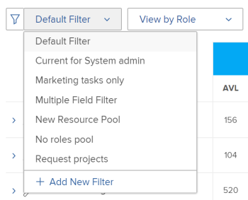
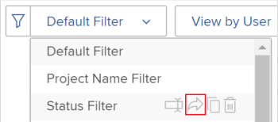
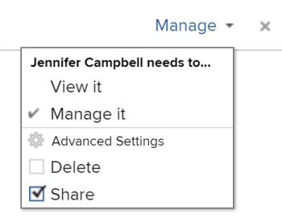

# 리소스 계획자에서 정보 필터링

<!--

(AL:*Iterate on this article: filtering by custom data. Other enhancements? Special characters caveat might change - follow the story to know when. It originally came in Beta 3 17.3.)

-->

필터를 사용하여 시스템에 저장된 모든 정보에서 리소스 계획자에 표시되는 정보를 수정할 수 있습니다.

## 액세스 요구 사항

다음 항목이 있어야 합니다.

<table style="table-layout:auto"> 
 <col> 
 <col> 
 <tbody> 
  <tr> 
   <td role="rowheader">Adobe Workfront 플랜*</td> 
   <td> 
Pro 이상
 </td> 
  </tr> 
  <tr> 
   <td role="rowheader">Adobe Workfront 라이선스*</td> 
   <td> 
검토 이상<!--
      <MadCap:conditionalText data-mc-conditions="QuicksilverOrClassic.Draft mode">
        (this seems to be the case in NWE only, not classic. Waiting on Vazgen's response for this)
      </MadCap:conditionalText>
     -->
 </td> 
  </tr> 
  <tr> 
   <td role="rowheader">액세스 수준 구성*</td> 
   <td> 
프로젝트, 사용자 및 리소스 관리에 대한 액세스 보기 이상 
 
<b>메모</b>

여전히 액세스 권한이 없는 경우 Workfront 관리자에게 액세스 수준에서 추가 제한 사항을 설정하는지 문의하십시오. Workfront 관리자가 액세스 수준을 변경하는 방법에 대한 자세한 내용은 <a href="../../administration-and-setup/add-users/configure-and-grant-access/create-modify-access-levels.md" class="MCXref xref">사용자 정의 액세스 수준 만들기 또는 수정</a>.
 </td>
</tr> 
  <tr> 
   <td role="rowheader">개체 권한</td> 
   <td> 
프로젝트에 대한 권한 보기 이상
 
추가 액세스 요청에 대한 자세한 내용은 <a href="../../workfront-basics/grant-and-request-access-to-objects/request-access.md" class="MCXref xref">개체에 대한 액세스 요청 </a>.
 </td> 
  </tr> 
 </tbody> 
</table>

*보유하고 있는 플랜, 라이선스 유형 또는 액세스를 알아보려면 Workfront 관리자에게 문의하십시오.

## 리소스 계획자 필터 개요

Resource Planner에 표시되는 정보의 양을 최소화하기 위해 Adobe Workfront에서는 사전 구성된 기준이 있는 기본 필터를 제공합니다. 기본 필터에 대한 자세한 내용은 섹션을 참조하십시오 [리소스 계획자의 기본 필터 개요](#overview-of-the-default-filter-in-the-resource-planner) 참조하십시오.

사용자 지정된 필터를 빌드할 수도 있습니다. 리소스 계획자에서 필터 사용자 지정에 대한 자세한 내용은 섹션을 참조하십시오 [리소스 플래너 필터 만들기](#create-resource-planner-filters) 참조하십시오.

리소스 계획자에서 필터를 사용할 때는 다음 사항을 고려하십시오.

* 사용자가 만드는 필터는 사용자만 볼 수 있습니다. 필터를 공유하여 다른 사용자가 사용할 수 있도록 할 수 있습니다.
* Workfront 관리자는 사용자가 만들거나 사용자와 공유되는 필터만 볼 수 있습니다.
* 리소스 계획자에 대해 다른 뷰를 선택하면 필터링된 결과가 변경되지 않습니다.\
   리소스 계획자에서 뷰 변경에 대한 자세한 내용은 [리소스 플래너 탐색 개요](../../resource-mgmt/resource-planning/resource-planner-navigation.md).

* 필터를 적용해도 프로젝트, 역할 또는 사용자에 대한 리소스 플래너의 할당 및 가용성 데이터가 변경되지 않습니다. 필터는 Resource Planner에 표시되는 객체 수만 변경합니다.
* 필터링은 리소스 플래너에 동시에 표시되는 모든 객체에 적용됩니다. 예를 들어 특정 사용자에 대해 필터링하면 리소스 계획자는 다음 결과만 표시합니다.

   * 해당 사용자가 리소스 풀(프로젝트 및 역할 보기)의 일부이거나 프로젝트에 대한 할당이 있는 프로젝트(사용자 보기)
   * 해당 프로젝트에서 사용자와 연관된 역할\
      사용자와 연결된 프로젝트의 다른 역할이나 사용자는 표시되지 않습니다.

## 리소스 계획자의 기본 필터 개요 {#overview-of-the-default-filter-in-the-resource-planner}

리소스 계획자를 처음 열면 Workfront에서 기본 필터를 적용합니다. 기본 필터를 편집하여 표시할 항목에 대해서만 필터링할 수 있습니다. 필터 수정에 대한 자세한 내용은 섹션을 참조하십시오 [리소스 계획자에서 필터 편집](#edit-a-filter-in-the-resource-planner) 참조하십시오.

기본 필터를 사용할 때는 다음 사항을 고려하십시오.

* 기본 필터는 다음을 사용하는 프로젝트에서만 정보를 검색합니다.

   * 현재 월의 첫 번째 일자 이후에 발생하는 계획 완료 일자
   * 현재 일자부터 네 번째 달의 마지막 일자 전에 발생하는 계획 시작 일자
   * 현재 또는 계획 상태

   >[!IMPORTANT]
   >
   >기본 필터는 Resource Planner에서 표시할 기간에 관계없이 현재 월의 첫 번째 날로 시작하는 4개월 이내에 발생하는 프로젝트에서 정보를 검색합니다.

* 사용자 보기에서는 시스템의 모든 사용자가 표시되지만 필터링된 프로젝트와 연결된 사용자만 시간 정보가 표시됩니다.
* 필터를 저장하지 않고 기본 필터에서 정보를 편집할 수 있습니다.
* 기본 필터의 복사본을 복제 및 편집하고, 기본 필터에서 원하는 기준을 변경한 다음 새 필터로 저장할 수 있습니다.
* 기본 필터를 삭제하거나 공유할 수 없습니다.

   

## 리소스 플래너 필터 만들기 {#create-resource-planner-filters}

<!--

(Alina: **^ This section is somewhat duplicated (format more than content) from the "Filtering Utilization Information" section in "Viewing Utilization Information for Projects, Programs, and Portfolios.")

-->

리소스 계획자에서 필터를 생성하는 것은 모든 뷰에 대해 동일합니다.

필터를 생성하기 전에 Resource Planner에서 올바른 정보를 보기 위한 사전 요구 사항이 있는지 확인합니다.\
Resource Planner 작업에 필요한 전제 조건을 충족하는 방법에 대한 자세한 내용은 의 &quot;Resource Planner 작업 필수 조건&quot; 섹션을 참조하십시오 [리소스 플래너 개요](../../resource-mgmt/resource-planning/get-started-resource-planner.md) 문서.

필터를 만들 때 다음 사항을 고려하십시오.

* 한 번에 필터링할 수 있는 개체 수에는 제한이 없습니다.
* 리소스 계획자에 적용하는 뷰의 객체에 따라 필터 변경에 추가할 수 있는 필드입니다. 예를 들어, 사용자 보기에서만 문제 또는 작업 필드를 필터링할 수 있습니다. 이러한 객체는 사용자 보기에만 표시되기 때문입니다. 사용자 보기에서 문제 또는 작업에 대한 필터를 작성한 다음 프로젝트 또는 역할 보기에 적용하면 필드가 프로젝트 또는 역할 보기에 존재하지 않으므로 무시됩니다. 이 경우 필터를 사용할 수 없습니다.

리소스 계획자에서 필터를 생성하려면 다음을 수행합니다.

1. 을(를) 클릭합니다. **기본 메뉴** 아이콘  Adobe Workfront의 오른쪽 상단 모서리에서

1. 클릭 **리소스**.

   다음 **계획자** 기본적으로 표시됩니다.

   기본적으로 자원 계획자에 처음 액세스할 때 <strong>기본 필터</strong> 이 적용됩니다. 기본 필터에 대한 자세한 내용은 <a href="#overview-of-the-default-filter-in-the-resource-planner" class="MCXref xref">리소스 계획자의 기본 필터 개요</a> 섹션에 자세히 설명되어 있습니다.

1. 의 왼쪽 위 모서리에서 **필터** 아이콘.\
   \
   또는\
   를 확장합니다. **필터** 드롭다운 메뉴를 클릭하고 **새 필터 추가**.\
   

1. 기본 제공 기준을 사용하여 필터를 빌드하려면 다음 필드 중 하나를 지정합니다.

   * **Portfolio**: 리소스 계획자에 포함할 정보가 들어 있는 포트폴리오의 이름을 입력한 다음 목록에 나타나는 이름을 클릭합니다.\
      여러 포트폴리오의 정보를 포함하려면 이 프로세스를 반복합니다.

   * **프로젝트 상태**: 프로젝트 상태 드롭다운 메뉴를 확장하고 목록에서 사용할 수 있는 하나 이상의 프로젝트 상태를 선택합니다.
   * **팀**: 보려는 프로젝트의 작업에 할당된 사용자와 연결된 하나 이상의 팀의 이름을 입력합니다.
   * **작업 역할**: 보려는 프로젝트의 작업에 할당된 사용자와 연결된 하나 이상의 작업 역할의 이름을 입력합니다.
   * **풀**: 프로젝트(프로젝트 보기), 사용자(사용자 보기) 또는 보려는 프로젝트 및 사용자(역할 보기)와 연결된 하나 이상의 리소스 풀의 이름을 입력합니다.
   * **그룹**: 보려는 사용자(사용자 보기) 또는 프로젝트(프로젝트 및 역할 보기)와 연결된 하나 이상의 그룹의 이름을 입력합니다.

1. 클릭 **필터 규칙 추가**&#x200B;을 입력한 다음 **항목을 필터링할 유형** 상자. 필드를 사용할 수 있으면 필드를 연결할 수 있는 각 개체에 대해 채워집니다.

   >[!IMPORTANT]
   >
   >사용자 지정 필드를 참조할 때는 필드 레이블이 아니라 필드 이름을 입력해야 합니다. 필드 레이블은 개체에 첨부된 사용자 지정 양식에 표시됩니다. 레이블과 사용자 지정 필드 이름의 차이에 대한 자세한 내용은  [사용자 지정 양식 만들기 또는 편집](../../administration-and-setup/customize-workfront/create-manage-custom-forms/create-or-edit-a-custom-form.md) .

1. 목록에 표시될 때 필터에 추가하려면 필드 이름을 클릭합니다.\
   목록에 표시되는 필드에 대한 자세한 내용은 [Adobe Workfront 용어 설명](../../workfront-basics/navigate-workfront/workfront-navigation/workfront-terminology-glossary.md).

1. (선택 사항) 필터에 대한 필터 및 조건 수정자를 선택합니다. 사용 가능한 수정자는 [필터 및 조건 수정자](../../reports-and-dashboards/reports/reporting-elements/filter-condition-modifiers.md).

   사용자 기반 또는 날짜 기반 와일드카드를 사용하여 로그인한 사용자와 관련된 정보를 필터링할 수 있습니다.\
   필터에 지원되는 와일드카드에 대한 자세한 내용은 [와일드카드 필터 변수](../../reports-and-dashboards/reports/reporting-elements/understand-wildcard-filter-variables.md).

1. 클릭 **저장**&#x200B;을 눌러 필터 규칙을 저장합니다.
1. (선택 사항) **필터 규칙 추가** 다른 개체나 필드에 새 규칙을 추가하려면
1. 클릭 **적용** 필터를 저장하지 않고 적용합니다.

   또는

   클릭 **필터 저장** 필터를 저장합니다.\
   

1. (조건부) **저장**&#x200B;에서 필터 이름을 지정합니다. **필터 이름** 상자 내부 **필터 저장** 대화 상자 필수 필드입니다.\
   

   >[!NOTE]
   >
   >필터 이름에 특수 문자가 포함되어 있으면 다음 문자만 사용합니다.
   >
   >* 쉼표
   >* 슬래시
   >* 하이픈
   >* 밑줄

1. **저장**&#x200B;을 클릭합니다.

   이제 Resource Planner의 결과는 필터 규칙에 포함된 정보로 필터링됩니다.

## 기존 필터 적용

사용자 또는 리소스 계획자에 액세스할 수 있는 사용자가 필터를 저장하면 리소스 계획자를 사용하는 모든 사용자가 필터를 사용할 수 있게 됩니다.

기존 필터를 적용하려면:

1. 리소스 플래너로 이동합니다.
1. 왼쪽 위 모서리에서 **필터** 드롭다운 메뉴

   만든 필터나 이 메뉴에서 사용자와 만들고 공유한 다른 필터를 볼 수 있습니다.\
   

1. 드롭다운 메뉴에서 필터를 선택합니다. 사용자 또는 다른 사용자가 이 메뉴에서 만든 필터를 볼 수 있습니다.\
   필터를 선택하면 리소스 계획자에 표시되는 정보의 양이 자동으로 줄어듭니다.

## 리소스 계획자에서 필터 편집 {#edit-a-filter-in-the-resource-planner}

다음 중 하나를 수행하여 리소스 계획자에서 필터를 편집할 수 있습니다.

* [필터 이름 바꾸기](#rename-a-filter)
* [필터에서 정보 편집](#edit-the-information-in-a-filter)
* [필터 복제](#duplicate-a-filter)

필터를 편집하면 리소스 계획자에 액세스할 수 있는 시스템의 모든 사용자에 대해 업데이트됩니다.

### 필터 이름 바꾸기 {#rename-a-filter}

기준을 변경하지 않고 필터 이름을 변경할 수 있습니다. 다른 사용자가 필터를 볼 수 있으므로 시스템의 다른 사용자에게 이 변경 내용을 알리는 것이 좋습니다. 이 변경 사항은 리소스 계획자를 볼 수 있는 모든 사용자의 필터 목록에 영향을 줍니다.

1. 리소스 계획자로 이동하여 **필터** 드롭다운 메뉴를 사용하여 저장된 필터를 선택합니다.
1. 를 확장합니다. **필터** 드롭다운 메뉴 이름을 바꿀 필터를 찾아 해당 이름을 마우스로 가리킵니다.
1. 을(를) 선택합니다 **필터 이름 바꾸기** 아이콘을 클릭합니다.

   

1. 에서 필터의 새 이름을 지정합니다. **필터 이름** 상자.
1. **저장**&#x200B;을 클릭합니다.\
   필터에 포함된 정보가 동일하며 이름이 업데이트됩니다.

### 필터에서 정보 편집 {#edit-the-information-in-a-filter}

필터에 포함할 정보를 이름을 변경하지 않고 변경할 수 있습니다. 필터가 표시되므로 시스템의 다른 사용자가 이 변경 사항에 대해 알 수 있도록 하는 것이 좋습니다. 이 변경 사항은 리소스 계획자를 볼 수 있는 모든 사용자의 필터 목록에 영향을 줍니다.

1. 리소스 계획자로 이동하여 **필터** 왼쪽 위 모서리에 있는 드롭다운 메뉴.
1. 편집할 기존 필터를 선택합니다.
1. 을(를) 클릭합니다. **필터** 아이콘.\
   

1. 필터에 새 필드를 추가합니다.\
   필터 빌드에 대한 자세한 내용은 [리소스 플래너 필터 만들기](#create-resource-planner-filters).

1. 필터에 대해 선택한 기존 필드를 마우스로 가리킨 다음 **편집** 아이콘을 사용하여 다른 필드를 선택하거나 **삭제** 아이콘을 클릭하여 필드를 삭제합니다.\
   

1. (선택 사항) **필터 규칙 추가** 필터에 새 필드를 추가하려면 다음을 수행하십시오.\
   필터 기준 정의에 대한 자세한 내용은 [리소스 플래너 필터 만들기](#create-resource-planner-filters).

1. 클릭 **적용** 필터를 저장하지 않고 적용합니다.

   또는

   클릭 **저장** 필터를 저장합니다.\
   필터가 동일한 이름으로 저장되지만 새 필터링 기준과 함께 저장됩니다.

### 필터 복제 {#duplicate-a-filter}

기존 필터를 복제할 수 있습니다. 원래 필터링 기준은 복제된 필터에서 동일하게 유지되며 새 필터를 새 이름으로 저장할 수 있습니다.

1. 리소스 계획자로 이동하여 **필터** 왼쪽 위 모서리에 있는 드롭다운 메뉴.
1. 복제할 저장된 필터의 이름을 마우스로 가리킵니다.
1. 을(를) 클릭합니다. **복제** 아이콘.

   \
   중복 필터 상자가 표시됩니다.

1. 에서 **필터 이름** 필드에서 복제된 필터에 대한 새 이름을 지정합니다.\
   새 필터의 기본 이름은 다음과 같습니다 *`<Original Filter Name>`(복사)*.

1. **저장**&#x200B;을 클릭합니다. 원래 필터와 동일한 기준을 사용하여 새 이름을 사용하여 새 필터를 만듭니다.

   >[!NOTE]
   >
   >동일한 이름과 동일한 기준으로 두 개의 필터를 사용할 수 있지만, 혼동을 방지하기 위해 리소스 플래너에 고유한 필터링 기준과 이름으로 필터를 저장하는 것이 좋습니다.

## 필터 삭제

더 이상 필요하지 않은 필터를 삭제할 수 있습니다. 기본 필터는 삭제할 수 없습니다.

기본 필터에 대한 자세한 내용은 [리소스 계획자의 기본 필터 개요](#overview-of-the-default-filter-in-the-resource-planner) 섹션에 자세히 설명되어 있습니다.

필터를 삭제하면 Resource Planner에 액세스할 수 있는 모든 Workfront 사용자에 대해 필터가 삭제됩니다. 제거하기 전에 제거하려는 필터가 Resource Planner에서 작업하는 다른 사용자가 더 이상 사용하지 않도록 확인합니다. 삭제된 필터는 복구할 수 없습니다.

필터를 제거하려면 다음을 수행하십시오.

1. 리소스 플래너로 이동합니다.
1. 를 확장합니다. **필터** 드롭다운 메뉴
1. 제거할 필터를 찾아 해당 이름을 마우스로 가리킵니다.
1. 을(를) 선택합니다 **필터 삭제** 아이콘을 클릭합니다.

   

1. 클릭 **삭제** 에서 **필터 삭제** 대화 상자

1. 필터가 삭제되고 리소스 플래너에서 제거됩니다.

## 필터 공유

작성한 필터를 공유하거나 다른 사용자와 공유할 수 있는 액세스 권한이 있습니다. 기본 필터를 공유할 수는 없지만 복제하고 복사본을 공유할 수 있습니다.

>[!NOTE]
>
>Workfront 관리자를 비롯한 모든 사용자는 자신이 빌드했거나 사용자와 공유한 필터만 액세스할 수 있습니다. 특정 사용자와 필터를 공유하여 모든 리소스 플래너 사용자가 필터를 사용할 수 있도록 할 수 있습니다.

기본 필터에 대한 자세한 내용은 [리소스 계획자의 기본 필터 개요](#overview-of-the-default-filter-in-the-resource-planner) 섹션에 자세히 설명되어 있습니다.

필터 복제에 대한 자세한 내용은 [필터 복제](#duplicate-a-filter) 섹션에 자세히 설명되어 있습니다.

1. 리소스 플래너로 이동합니다.
1. 를 확장합니다. **필터** 드롭다운 메뉴
1. 공유할 필터를 찾아 해당 이름을 마우스로 가리킵니다.
1. 을(를) 선택합니다 **공유 필터** 아이콘을 클릭합니다.

   

   필터 액세스 대화 상자가 표시됩니다.

1. (선택 사항) 모든 Resource Planner 사용자가 필터를 사용할 수 있도록 하려면 **설정** 아이콘을 선택한 다음, **시스템 전체에 표시**.

   

1. 에서 **리소스 플래너 필터 액세스 권한 제공:** 상자에서 필터를 공유할 사용자, 팀, 역할, 그룹 또는 회사의 이름을 입력합니다.
1. 다음 권한 수준 중에서 선택합니다.

   * 보기
   * 관리

      Workfront의 권한에 대한 자세한 내용은 [개체에 대한 권한 공유 개요](../../workfront-basics/grant-and-request-access-to-objects/sharing-permissions-on-objects-overview.md)

1. (선택 사항) **고급 설정**&#x200B;을(를) 선택하여 각 수준에 대한 권한을 추가하거나 해당 권한을 선택 취소하여 각 수준에 대한 권한을 제거합니다.

   

1. **저장**&#x200B;을 클릭합니다.

   선택한 엔티티와 필터가 공유되고 **나와 공유** 영역.

   
