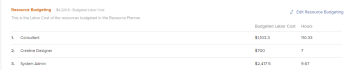

# 리소스 플래너 개요

<!--

(Alina: this used to be the beginning of Planning in the Resource Planner - consider restructuring it further? Merging some of this information with information about Understanding Navigation in the RP?!)

-->

리소스 플래너를 사용하여 배정된 프로젝트에 대한 리소스 할당을 예측하고 예산을 책정하며 향후 작업에 대한 가용성을 예측할 수 있습니다.

Adobe Workfront의 리소스 계획에 대한 일반적인 개요는 문서 를 참조하십시오. [리소스 계획 시작](../../resource-mgmt/resource-planning/get-started-resource-planning.md).

## 리소스 플래너 개요

리소스 플래너를 사용하여 사용자 및 작업 역할의 가용성과 프로젝트 작업을 완료하는 데 필요한 계획된 시간을 쉽게 이해할 수 있습니다. 그런 다음 사용 가능한 시간을 기준으로 할당된 프로젝트에서 사용자 및 사용자 작업 역할을 할당하는 방법을 결정할 수 있습니다.

>[!IMPORTANT]
>
>리소스 플래너를 사용하여 실제 작업(작업 및 문제)을 사용자에게 할당할 수 없습니다. 할당된 작업 및 문제에 관계없이 사용자 또는 작업 역할이 프로젝트를 완료하는 데 필요한 시간만 예상할 수 있습니다.\
>사용자에게 실제 작업을 할당하려면 업무 균형자 를 사용해야 합니다. 업무 균형자에 대한 자세한 내용은 [업무 균형자 개요](../../resource-mgmt/workload-balancer/overview-workload-balancer.md).

리소스 플래너에서 세 개의 개별 보기를 사용하여 정보를 볼 수 있습니다. 각 뷰를 사용하여 다음 목적 중 하나를 수행할 수 있습니다.

* 프로젝트 및 역할 보기를 사용하여 완료해야 하는 작업에 대한 리소스의 시간 또는 비용을 책정하기 위해. 이는 리소스 플래너의 주요 목적입니다.\
  리소스 플래너의 예산 편성에 대한 자세한 내용은 문서 를 참조하십시오 [프로젝트 및 역할 보기를 사용하여 리소스 플래너의 예산 리소스](../resource-planning/budget-resources-project-role-views-resource-planner.md).

* 사용자 보기를 사용하여 다음 정보를 보려면 다음과 같이 하십시오.

   * 일정에 따른 사용자 가용성
   * 프로젝트 계획에 따라 작업을 완료하는 데 필요한 계획된 시간입니다.
   * 사용자가 이미 실제 작업 항목에 로그온한 시간입니다.

  리소스 플래너에서 사용자의 사용 가능 시간, 계획된 시간 및 실제 시간 또는 FTE 보기에 대한 자세한 내용은 문서를 참조하십시오 [사용자 보기를 사용할 때 리소스 플래너에서 가용, 계획 및 실제 시간 또는 FTE 보기](../../resource-mgmt/resource-planning/view-hours-fte-user-view-resource-planner.md#using).

## 리소스 플래너 고려 사항

* 작업 중인 프로젝트의 우선 순위를 지정하고 우선 순위에 따라 리소스 할당의 예산을 책정하여 가장 중요한 프로젝트에 우선적으로 배정된 리소스를 확보할 수 있습니다.

  리소스 플래너에서 프로젝트 우선 순위 지정에 대한 자세한 내용은 [리소스 플래너에서 프로젝트 우선 순위 지정](../../resource-mgmt/resource-planning/prioritize-projects-resource-planner.md).

* 프로젝트의 작업 및 문제에서 시간, FTE 및 비용 정보를 표시할 수 있습니다.

  >[!NOTE]
  >
  >작업 및 문제는 리소스 플래너에 표시되지 않습니다. 단, 작업에 대한 리소스 할당의 시간, FTE 및 비용 정보는 프로젝트의 총 횟수로 리소스 플래너에 표시됩니다.

* 상위 작업의 시간, FTE 및 비용 정보는 리소스 플래너에 표시되는 프로젝트에서 제외됩니다. 리소스 플래너에서 리소스의 시간 또는 비용을 관리하려면 하위 작업에만 리소스를 할당하는 것이 좋습니다.

  상위 작업에 대한 자세한 내용은 다음 문서를 참조하십시오.

   * [작업 개요](../../manage-work/tasks/task-information/tasks-overview.md)
   * [하위 작업 만들기](../../manage-work/tasks/create-tasks/create-subtasks.md)

  >[!TIP]
  >
  >상위 작업에는 하위 작업의 총 시간과 비용이 표시됩니다. 이러한 이유로 하위 작업과 상위 작업에서 시간, FTE 및 비용을 계산하면 이러한 금액이 두 번 계산됩니다. 상위 작업 정보가 리소스 플래너에서 제외되는 이유입니다.

* 리소스 플래너에 작업 또는 문제가 있는 프로젝트의 팀 할당을 관리할 수 없습니다.
* 리소스 플래너를 사용하여 한 번에 여러 프로젝트에 대한 리소스의 예산을 책정하거나 비즈니스 사례의 리소스 예산 책정 영역을 사용하여 단일 프로젝트에 대한 리소스의 예산을 책정할 수 있습니다. 한 프로젝트에 대해 예산을 책정하는 정보는 리소스 플래너에도 표시됩니다.

  단일 프로젝트에 대한 리소스 예산을 책정하는 방법에 대한 자세한 내용은 문서 를 참조하십시오 [비즈니스 사례의 예산 리소스](../../manage-work/projects/define-a-business-case/budget-resources-in-business-case.md).

  리소스 플래너에서 한 번에 여러 프로젝트에 대한 리소스 예산을 책정하는 방법에 대한 자세한 내용은 문서의 &quot;리소스 플래너의 리소스 예산&quot; 섹션을 참조하십시오 [프로젝트 및 역할 보기를 사용하여 리소스 플래너의 예산 리소스](../../resource-mgmt/resource-planning/budget-resources-project-role-views-resource-planner.md).

## 리소스 플래너에서 작업하기 위한 사전 요구 사항 {#prerequisites-for-working-in-the-resource-planner}

<!--

(<b>THIS SECTION IS LINKED TO ALL RES PLANNING ARTICLES. DO NOT RENAME OF DELETE THIS!</b> - do NOT ADD the variable here, because it might break this link!)

-->

리소스 예산을 책정하는 데 리소스 플래너를 성공적으로 사용하려면 먼저 사용자, 프로젝트 및 작업이 사전 요구 사항 세트를 충족하는지 확인해야 합니다. 리소스 플래너에 올바른 정보를 표시하고 리소스를 정확하게 관리하기 위해 이러한 전제 조건은 필수입니다.

>[!IMPORTANT]
>
>다음 전제 조건 중 하나가 누락된 경우 리소스 할당 또는 가용성에 대한 일부 정보가 누락되었거나 값이 0일 수 있습니다.\
>필드에 데이터가 없거나 필드 값이 0인 이유를 자세히 이해하려면 필드 위로 마우스를 가져갑니다.

>[!NOTE]
>
>다음 전제 조건은 프로젝트나 작업 역할별로 리소스 플래너를 보거나 프로젝트의 비즈니스 사례에서 리소스 예산을 책정할 때만 필요합니다.

프로젝트별 또는 역할별로 리소스 플래너를 볼 때 리소스 플래너의 올바른 기능을 사용하려면 다음 유형의 사전 요구 사항이 필요합니다.

* [사용자 사전 요구 사항](#user-prerequisites)
* [프로젝트 사전 요구 사항](#project-prerequisites)
* [작업 및 문제 사전 요구 사항](#tasks-and-issues-prerequisites)
* [시스템 수준 사전 요구 사항](#system-level-prerequisites)

### 사용자 사전 요구 사항 {#user-prerequisites}

리소스 플래너 사용을 시작하기 전에 다음 사용자 설정이 있는지 확인하십시오.

* 예산 리소스에 대한 올바른 액세스 권한이 있습니다.

  리소스 예산을 책정하는 데 필요한 액세스에 대한 자세한 내용은 문서 를 참조하십시오 [Adobe Workfront에서 리소스 예산을 책정하는 데 필요한 액세스 권한](../../resource-mgmt/resource-planning/access-needed-to-budget-resources.md).

* 작업에 할당된 사용자가 프로젝트와 연결된 리소스 풀에 추가됩니다.

  리소스 풀에 사용자 추가에 대한 자세한 내용은 [사용자와 리소스 풀 연결](../../resource-mgmt/resource-planning/resource-pools/associate-resource-pools-with-users.md).

  >[!NOTE]
  >
  >사용자가 리소스 풀에 추가되지 않으면 다음과 같은 시나리오가 발생할 수 있습니다.
  >
  >   
  >   
  >   * 사용자는 프로젝트의 작업에 할당될 수 있지만 리소스 플래너에 표시되지 않습니다.
  >   * 연결된 작업에 계획된 시간이 있는 경우 사용자가 해당 작업에 대한 작업 역할과도 연결되어 있지 않는 한 리소스 플래너의 프로젝트에 해당 시간이 표시되지 않습니다.
  >   * 사용자가 프로젝트의 작업에 대한 작업 역할과 연결된 경우 리소스 플래너에 작업 역할에 대한 계획된 시간이 표시되지만 작업 역할의 예산을 책정할 수 없습니다.
  >   
  >

* 작업 및 리소스 풀에 할당된 사용자는 프로필과 연결된 일정 및 작업 역할이 있어야 합니다.

  일정 및 작업 역할을 사용자와 연관시키는 방법에 대한 자세한 내용은 [사용자 프로필 편집](../../administration-and-setup/add-users/create-and-manage-users/edit-a-users-profile.md).

  >[!NOTE]
  >
  >일정과 연관되지 않았지만 프로젝트의 리소스 풀에 있는 사용자는 리소스 플래너에서 예산을 책정할 수 없습니다.

* 정확한 가용 시간 정보를 보려면 사용자와 연관된 스케줄에 스케줄 예외 및 휴무 시간이 업데이트되었는지 확인하십시오.

  >[!NOTE]
  >
  >사용자가 일정과 연결되어 있지 않으면 리소스 플래너의 목적으로 Workfront 시스템의 기본 일정이 기본적으로 사용자와 연결되어 있습니다.

  일정 만들기에 대한 자세한 내용은 문서 를 참조하십시오 [일정 만들기](../../administration-and-setup/set-up-workfront/configure-timesheets-schedules/create-schedules.md).

* 비용별로 자원을 책정하려면 작업 역할을 비용/시간과 연관시켜야 합니다. 비율입니다. 리소스 풀의 사용자에게 할당된 작업 역할과 관련된 비용은 프로젝트의 예산 인건비 및 예산 비용을 계산하는 데 사용됩니다.\
  작업 역할과 비율 연관에 대한 자세한 내용은 문서를 참조하십시오 [작업 역할 만들기 및 관리](../../administration-and-setup/set-up-workfront/organizational-setup/create-manage-job-roles.md).\
  예산 인건비 계산에 대한 자세한 내용은 문서를 참조하십시오. [프로젝트의 예산 인건비 및 예산 시간 이해](../../manage-work/projects/project-finances/budgeted-labor-cost.md).\
  예산 비용 계산에 대한 자세한 내용은 문서를 참조하십시오. [예산 비용 계산](../../manage-work/projects/project-finances/budgeted-cost.md).

### 프로젝트 사전 요구 사항 {#project-prerequisites}

리소스 플래너 사용을 시작하기 전에 다음 프로젝트 설정이 있는지 확인하십시오.

* 프로젝트가 리소스 풀과 연결되어 있습니다.\
  프로젝트에 리소스 풀을 추가하는 방법에 대한 자세한 내용은 [리소스 풀을 프로젝트 및 템플릿과 연결](../../resource-mgmt/resource-planning/resource-pools/associate-resource-pools-with-projects-and-templates.md).

  >[!IMPORTANT]
  >
  >리소스 풀이 없는 프로젝트는 리소스 플래너에 계획된 시간 또는 할당 정보를 표시하지 않습니다.

### 작업 및 문제 사전 요구 사항 {#tasks-and-issues-prerequisites}

리소스 플래너에 작업 및 문제를 표시할 수 없지만 해당 정보는 리소스 플래너에 표시되는 프로젝트로 전송됩니다.

리소스 플래너에서 리소스 예산 책정을 시작하기 전에 다음 작업 및 문제 설정이 있는지 확인합니다.

* 예산 책정하려는 프로젝트의 작업 또는 문제가 다음 엔티티 중 하나에 할당됩니다.

   * 작업 역할과 연결된 프로젝트의 리소스 풀 사용자
   * 작업 역할

  >[!NOTE]
  >
  >작업 역할에 할당된 작업 및 문제의 계획된 시간이 리소스 플래너에 표시되지만, 작업 역할과 연결된 사용자가 프로젝트와 연결된 리소스 풀에 나열되지 않으면 이러한 시간을 예산 책정할 수 없습니다.

* 상위 작업을 사용자 또는 역할에 할당하면 안 됩니다.

  리소스 플래너에 상위 작업과 연관된 사용자 또는 역할에 대한 시간 정보를 표시하려면 하위 작업에도 할당해야 합니다. 리소스 플래너는 상위 작업의 정보를 표시하지 않습니다.

* 작업 및 문제의 계획된 시간 값이 0보다 큽니다.
* 작업 및 문제의 기간 값이 0보다 큽니다.
* 문제의 계획된 일자는 프로젝트의 타임라인 내에 있습니다.

### 시스템 수준 사전 요구 사항 {#system-level-prerequisites}

시스템의 리소스 관리 기본 설정에 따라 Workfront 인스턴스가 사용자 가용성을 계산하는 방법을 이해해야 합니다. Workfront은 사용자 프로필 페이지에 정의된 사용자의 일정 또는 시스템의 기본 일정을 사용하여 사용자 가용성을 계산할 수 있습니다.

Workfront 관리자가 리소스 관리 환경 설정을 구성합니다.

자세한 내용은 [리소스 관리 환경 설정 구성](../../administration-and-setup/set-up-workfront/configure-system-defaults/configure-resource-mgmt-preferences.md).

## 리소스 플래너 찾기

<!--

(This became another standalone article; drfat this section here when article is live.)

-->

여러 프로젝트에 대한 리소스 예산을 책정할 것인지 아니면 하나의 프로젝트에 대한 리소스 예산을 책정할 것인지에 따라 Workfront의 두 영역에서 리소스 플래너를 찾을 수 있습니다.

리소스 플래너 찾기에 대한 자세한 내용은 [리소스 플래너 찾기](../../resource-mgmt/resource-planning/locate-resource-planner.md).

<!--

(this is drafted and moved to its own article: locate-resource-planner) 

Ensure that all prerequisites are met before starting to use the Resource Planner. This way, you ensure that the Resource Planner displays the correct information before you start budgeting your resources. For information about the prerequisites that must be met before you can start using the Resource Planner, see the <a href="#prerequisites-for-working-in-the-resource-planner" class="MCXref xref">Prerequisites for working in the Resource Planner</a> section in this article. 

You can locate the Resource Planner in two areas of Workfront, depending on whether you want to budget your resources for multiple projects, or for just one project.

<ul>
<li><a href="#use-the-resource-planner-for-multiple-projects" class="MCXref xref">Use the Resource Planner for multiple projects</a> </li>
<li> 
<a href="#use-the-resource-planner-for-one-project" class="MCXref xref">Use the Resource Planner for one project</a> 
 </li>
</ul>

<strong>Use the Resource Planner for multiple projects</strong>

When using the Resource Planner for multiple projects, the allocation numbers for your resources represent numbers across multiple projects. 

To access the  Planner section  in the  Resourcing area: 

<ol>
<li value="1">  Click the <strong>Main Menu</strong> icon  in the upper-right corner of Adobe Workfront.  </li>
<li value="2"> 
  Click <strong>Resourcing</strong>. The Resource Planner displays by default.  For information about budgeting resources in the Resource Planner, see the article <a href="../../resource-mgmt/resource-planning/budget-resources-project-role-views-resource-planner.md" class="MCXref xref">Budget resources in the Resource Planner using the Project and Role views</a>. 
 
  
 </li>
<li value="3">  Hover over the left panel, and click <strong>Resource Pools</strong>.  For information about creating new resource pools, see <a href="../../resource-mgmt/resource-planning/resource-pools/create-resource-pools.md" class="MCXref xref">Create resource pools</a>.</li>
</ol>

<strong>Use the Resource Planner for one project</strong>

When using the Resource Planner for one project, the allocation numbers for your resources represent numbers for the selected project. 

<ol>
<li value="1"> 
Go to a project you want to budget resources for.
 </li>
<li value="2"> 
Click <strong>Business Case</strong> in the left panel.
 </li>
<li value="3"> 
Scroll to the <strong>Resource Budgeting</strong> section of the Business Case.
 </li>
<li value="4"> 
Click <strong>Edit Resource Budgeting</strong> to add resource pools to your project and start budgeting your resources. 
 <note type="tip">
You can only add a resource pool in the Resource Budgeting area of the Business Case when the project has no resource pools associated with it. When the project already has a resource pool, the users in the pool and their job roles display in the Resource Budgeting area by default.
</note> 
  
 
For information about budgeting resources for one project, see the article <a href="../../manage-work/projects/define-a-business-case/budget-resources-in-business-case.md" class="MCXref xref">Budget resources in the Business Case</a>.
 </li>
</ol>

-->

## 리소스 플래너 영역

리소스 플래너에서 다음 정보를 보거나 다음 작업을 수행할 수 있습니다.

* 일반 타임라인에서 리소스 플래너에서 프로젝트에 할당된 리소스에 대한 정보입니다.
* 리소스 플래너에서 리소스의 초과 할당 또는 과소 활용입니다.
* 작업에 대한 자원의 예산을 수동 또는 자동으로 책정합니다.

리소스 플래너에 표시되는 영역과 이러한 영역에 표시되는 정보를 구성하는 방법에 대한 자세한 내용은 문서를 참조하십시오 [리소스 플래너 탐색 개요](../../resource-mgmt/resource-planning/resource-planner-navigation.md).

## 리소스 플래너에 정보를 표시할 때의 제한 사항

성능을 향상시키기 위해 Workfront에서는 리소스 플래너에 표시할 수 있는 항목 수를 제한합니다.

이러한 제한 사항에 대한 자세한 내용은 문서 를 참조하십시오 [리소스 플래너 표시 제한](../../resource-mgmt/resource-planning/resource-planner-display-limitations.md) .

## 리소스 플래너에서 FTE 계산

리소스 플래너의 가용성, 할당 및 계획된 값을 시간, FTE 또는 비용으로 표시할 수 있습니다.

리소스 플래너에 표시하는 정보를 변경하는 방법에 대한 자세한 내용은 섹션을 참조하십시오 [시간, FTE 또는 비용별 정보 보기](../../resource-mgmt/resource-planning/resource-availability-allocation-resource-planner.md#display-by-hour-or-fte-menu) 이 문서에서 [Adobe Workfront 리소스 플래너를 사용하여 리소스 가용성 및 할당 검토](../../resource-mgmt/resource-planning/resource-availability-allocation-resource-planner.md).

Workfront에서 사용자 및 역할에 대한 시간 및 FTE를 계산하는 방법에 대한 자세한 내용은 문서를 참조하십시오 [리소스 플래너에서 사용자 및 역할에 대한 시간 및 FTE 계산 개요](../../resource-mgmt/resource-planning/calculate-hours-fte-for-users-roles-resource-planner.md).

## 리소스 플래너에서 비용 계산

리소스 플래너에서 비용별 정보를 보려면 프로젝트에 대한 재무 데이터 보기 및 재무 보기 권한이 있어야 합니다.

시간 및 FTE로 리소스 플래너에 가용성, 할당 및 계획된 값을 표시할 뿐만 아니라 원가별로 표시할 수도 있습니다.

>[!TIP]
>
>리소스 플래너에서 비용별 정보를 표시하려면 사용자 및 작업 역할을 시간당 비용 요금에 연결해야 합니다.

시간당 비용 비율을 작업 역할과 연관시키는 방법에 대한 자세한 내용은 문서를 참조하십시오 [작업 역할 만들기 및 관리](../../administration-and-setup/set-up-workfront/organizational-setup/create-manage-job-roles.md).\
시간당 비용 요금과 사용자 연관에 대한 자세한 내용은 이 문서 를 참조하십시오 [사용자 프로필 편집](../../administration-and-setup/add-users/create-and-manage-users/edit-a-users-profile.md).

리소스 플래너에서 비용별로 정보를 조회할 때 다음 사항을 고려하십시오.

* 각 시간 유형(사용자, 역할 또는 프로젝트에 대한 계획, 가용, 예산, 실제)의 비용은 다른 원가율을 사용하여 계산됩니다.
* 계획된 비용은 프로젝트의 작업에 대한 비용 유형의 영향을 받습니다.
* 리소스 플래너에 사용자 보기를 적용할 때 비용별 할당 및 가용성 정보를 표시할 수 없습니다.

리소스 플래너에서 사용자 및 역할에 대해 비용을 계산하는 방법에 대한 자세한 내용은 문서 를 참조하십시오 [리소스 플래너에서 비용 계산](../../resource-mgmt/resource-planning/calculate-costs-resource-planner.md).

<!--

<h2>Use the User View to view Available, Planned, and Actual Hours or FTE </h2>

(this information is repeated from above where it exists in shorter form. Drafted to simplify the amount of info of this article.) 

You can use the User View of the Resource Planner to display information about the Planned, Available, and Actual Hours or FTE values for projects and resources. 

For information about using the Resource Planner to review the Available, Planned, and Actual Hours and FTE for resources, see the article <a href="../../resource-mgmt/resource-planning/view-hours-fte-user-view-resource-planner.md" class="MCXref xref">View Available, Planned, and Actual Hours or FTE in the Resource Planner when using the User view</a>.

<strong>Use the Project and Role Views to budget resources </strong>

 The main function of the Resource Planner is to budget your resources for the work that needs to be completed on the projects that you can manage. 

 You can budget your resources only if you apply the <strong>View by Project</strong> or <strong>View by Role</strong> views to the Resource Planner.

For information about budgeting resources using the Project and Role views in the Resource Planner, see the article <a href="../../resource-mgmt/resource-planning/budget-resources-project-role-views-resource-planner.md"><a href="../../resource-mgmt/resource-planning/budget-resources-project-role-views-resource-planner.md" class="MCXref xref">Budget resources in the Resource Planner using the Project and Role views</a></a>.

-->

## 리소스 플래너에서 정보 필터링

필터를 만들어 리소스 플래너에 표시되는 프로젝트, 역할 또는 사용자의 수를 줄일 수 있습니다.\
자세한 내용은 이 문서 를 참조하십시오. [리소스 플래너에서 정보 필터링](../../resource-mgmt/resource-planning/filter-resource-planner.md).
