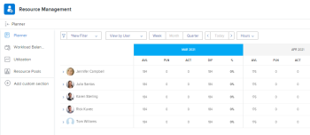

# 리소스 플래너 찾기

<!--

(This came off this article: draft that content in the article when this comes live: /Content/Resource Mgmt/Resource Planning/get-started-resource-planner.html)

-->

리소스 플래너를 사용하여 프로젝트에 대한 리소스 할당을 관리할 수 있습니다. 프로젝트의 비즈니스 사례 영역에서 동시에 또는 하나의 프로젝트에 대한 리소스 플래너에 액세스할 수 있습니다.

## 액세스 요구 사항

+++ 이 문서의 기능에 대한 액세스 요구 사항을 보려면 확장하십시오.

<table style="table-layout:auto"> 
 <col> 
 <col> 
 <tbody> 
  <tr> 
   <td>Adobe Workfront 패키지</td> 
   <td>
Any
</td>
  </tr> 
  <tr> 
   <td>Adobe Workfront 라이선스</td> 
   <td>
하나의 프로젝트에 대해 가볍게 또는 높게, 여러 프로젝트에 대해 표준

       
하나의 프로젝트에 대해 검토 이상, 여러 프로젝트에 대한 계획
</td>
  </tr> 
  <tr> 
   <td>액세스 수준 구성</td> 
   <td> 
리소스 관리에 대한 액세스 이상 보기
 </td> 
  </tr> 
  <tr> 
   <td>개체 권한</td> 
   <td> 
프로젝트 및 사용자에 대한 권한 보기 
 </td> 
  </tr> 
 </tbody> 
</table>

자세한 내용은 [Workfront 설명서의 액세스 요구 사항](/help/quicksilver/administration-and-setup/add-users/access-levels-and-object-permissions/access-level-requirements-in-documentation.md)을 참조하십시오.

+++

## 전제 조건

리소스 플래너 사용을 시작하기 전에 리소스 플래너에 액세스하고 리소스 플래너로 작업하기 위한 모든 전제 조건이 충족되는지 확인하십시오. 이렇게 하면 리소스 예산을 책정하기 전에 리소스 플래너에 올바른 정보가 표시되는지 확인합니다.

리소스 플래너 필수 구성 요소에 대한 자세한 내용은 [리소스 계획 시작](../../resource-mgmt/resource-planning/get-started-resource-planning.md)을 참조하세요.

## 리소스 플래너 찾기

여러 프로젝트에 대한 리소스 예산을 책정할 것인지 아니면 하나의 프로젝트에 대한 리소스 예산을 책정할 것인지에 따라 Workfront의 두 영역에서 리소스 플래너를 찾을 수 있습니다.

* [여러 프로젝트에 리소스 플래너 사용](#use-the-resource-planner-for-multiple-projects)
* [한 프로젝트에 리소스 플래너 사용](#use-the-resource-planner-for-one-project)

### 여러 프로젝트에 리소스 플래너 사용 {#use-the-resource-planner-for-multiple-projects}

여러 프로젝트에 리소스 플래너를 사용할 때 리소스에 대한 할당 번호는 여러 프로젝트의 번호를 나타냅니다.

리소스 조달 영역의 플래너 섹션에 액세스하려면 다음을 수행하십시오.

{{step1-to-resourcing}}

기본적으로 플래너가 표시됩니다.  리소스 플래너의 리소스 예산 책정에 대한 자세한 내용은 문서 [프로젝트 및 역할 보기를 사용하여 리소스 플래너의 리소스 예산](../../resource-mgmt/resource-planning/budget-resources-project-role-views-resource-planner.md)을 참조하십시오.

1. 왼쪽 패널에서 **리소스 풀**을 클릭합니다.
리소스 풀 만들기에 대한 자세한 내용은 [리소스 풀 만들기](../../resource-mgmt/resource-planning/resource-pools/create-resource-pools.md)를 참조하십시오.

### 한 프로젝트에 리소스 플래너 사용 {#use-the-resource-planner-for-one-project}

한 프로젝트에 대해 리소스 플래너를 사용할 때 리소스의 할당 번호는 선택한 프로젝트에 대한 번호를 나타냅니다.

1. 리소스 예산을 책정할 프로젝트로 이동합니다.
1. 왼쪽 패널에서 **비즈니스 사례**&#x200B;를 클릭합니다.
1. 비즈니스 사례의 **리소스 예산 책정** 섹션으로 스크롤합니다.
1. 프로젝트에 리소스 풀을 추가하고 리소스 예산을 책정하려면 **리소스 예산 편성 편집**&#x200B;을 클릭하십시오.

   >[!TIP]
   >
   >프로젝트에 연결된 리소스 풀이 없는 경우 비즈니스 사례의 리소스 예산 책정 영역에만 리소스 풀을 추가할 수 있습니다. 프로젝트에 이미 리소스 풀이 있는 경우, 풀의 사용자와 해당 작업 역할이 기본적으로 리소스 예산 책정 영역에 표시됩니다.

   

   한 프로젝트의 리소스 예산 편성에 대한 자세한 내용은 [비즈니스 사례의 리소스 예산](../../manage-work/projects/define-a-business-case/budget-resources-in-business-case.md) 문서를 참조하십시오.
