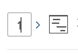

# 리소스 플래너에서 프로젝트 우선 순위 지정

프로젝트는 가장 중요한 프로젝트가 맨 위에 있는 리소스 플래너에 우선 순위 순서로 나열됩니다.

## 액세스 요구 사항

+++ 을 확장하여 이 문서의 기능에 대한 액세스 요구 사항을 봅니다.

<table style="table-layout:auto"> 
 <col> 
 <col> 
 <tbody> 
  <tr> 
   <td>Adobe Workfront 패키지</td> 
   <td>
임의
</td>
  </tr> 
  <tr> 
   <td>Adobe Workfront 라이선스</td> 
   <td>
표준

       
플랜
</td> 
  </tr> 
  <tr> 
   <td>액세스 수준 구성</td> 
   <td> 
리소스 플래너에서 우선순위 및 예산 시간 편집에 대한 액세스 권한이 포함된 리소스 관리에 대한 액세스 편집
 
재무 데이터, 프로젝트 및 사용자에 대한 액세스 편집
</td> 
  </tr> 
  <tr> 
   <td>개체 권한</td> 
   <td> 
재무 관리 기능으로 예산을 책정하려는 프로젝트에 대한 권한을 관리합니다.
</td>
  </tr> 
 </tbody> 
</table>

자세한 내용은 [Workfront 설명서의 액세스 요구 사항](/help/quicksilver/administration-and-setup/add-users/access-levels-and-object-permissions/access-level-requirements-in-documentation.md)을 참조하십시오.

+++

## 리소스 플래너의 기본 프로젝트 순서

기본적으로 프로젝트는 아래 기준을 고려하여 리소스 플래너의 프로젝트 보기에 나열됩니다.

>[!IMPORTANT]
>
>리소스 플래너를 처음 열 때만 아래 세 가지 기준에 따라 프로젝트가 나열됩니다. 그러나 이 기본 우선 순위는 자동으로 사용자 지정 우선 순위가 되며, 다음 중 하나를 수행할 때마다 원래 우선 순위로 되돌릴 수 없습니다.
>
>* 언제든지 저장 을 클릭합니다.
>* 프로젝트 계획 우선순위를 수동으로 변경하는 경우. 프로젝트 계획 우선 순위를 수동으로 변경하는 방법에 대한 자세한 내용은 이 문서의 [프로젝트 계획 우선 순위 수동으로 변경](#manually-change-the-project-planning-priority) 섹션을 참조하십시오.
>
>프로젝트 우선순위가 사용자 정의 우선순위가 되면 프로젝트 정보의 변경 사항이 더 이상 이러한 기준을 사용한 프로젝트 순서에 영향을 주지 않습니다. 이 후에는 수동으로만 프로젝트의 우선 순위를 지정할 수 있습니다.

프로젝트 보기에서 프로젝트를 나열하는 원래 기본 기준은 다음과 같습니다(이 순서로).

1. 프로젝트의 정렬 점수별.\
   프로젝트의 정렬 점수에 대한 자세한 내용은 [프로젝트에 스코어카드 적용 및 정렬 점수 생성](../../manage-work/projects/define-a-business-case/apply-scorecard-to-project-to-generate-alignment-score.md)을 참조하십시오.

1. 프로젝트의 계획된 시작 일자까지(정렬 필드가 null이거나 여러 프로젝트에 대해 동일한 경우).
1. 사전순(정렬 필드가 null이거나 동일하고 계획된 시작 일자가 여러 프로젝트에 대해 동일한 경우).

리소스 플래너에서 프로젝트 우선 순위를 사용할 때는 다음 사항을 고려하십시오.

* 프로젝트 보기를 적용할 때만 프로젝트 우선 순위를 수동으로 사용자 지정할 수 있습니다. 또한 리소스 플래너에서 프로젝트의 순서를 변경합니다.
* 리소스 플래너에서 역할 또는 사용자 보기를 적용하면 프로젝트가 프로젝트 보기에 설정된 동일한 우선 순위로 표시됩니다.
* 리소스 플래너의 프로젝트 순서는 고유합니다. 다른 사용자는 리소스 플래너에서 동일한 프로젝트를 볼 수 있지만 다른 순서로 볼 수 있습니다. 프로젝트 계획 우선순위 필드에 대해 보고할 수 없습니다. 리소스 플래너에서만 볼 수 있으며 프로젝트 우선 순위를 지정하는 플래그 역할을 합니다.

포트폴리오와 연결된 프로젝트에는 포트폴리오 수준의 우선 순위가 있을 수 있습니다. 리소스 플래너 우선 순위 외에 리소스 플래너에서 프로젝트의 포트폴리오 우선 순위를 볼 수 있습니다. 포트폴리오 우선 순위에 따라 프로젝트를 정렬할 수도 있습니다.

## 프로젝트 계획 우선 순위 수동 변경 {#manually-change-the-project-planning-priority}

리소스 플래너에서 프로젝트를 재정렬하려면 리소스 관리에 대한 편집 액세스 권한과 프로젝트에 대한 관리 권한이 있어야 합니다.

프로젝트에 새로운 우선 순위를 부여하면 중요도 순서대로 순위를 지정할 수 있습니다.

프로젝트 계획 우선순위를 편집하려면:

1. **리소스 플래너**(으)로 이동합니다.

1. 숫자가 포함된 프로젝트 이름 왼쪽의 필드 내부를 클릭하고 숫자를 입력하여 Planning 우선 순위를 변경한 다음 Enter 키를 누릅니다.\
   \
   또는\
   프로젝트 이름 위로 마우스를 가져간 후 프로젝트 이름 왼쪽에 있는 표시기를 클릭하고 드래그하여 올바른 위치에 놓아 우선 순위를 변경합니다.

   

   프로젝트의 우선 순위를 지정할 숫자를 선택할 때는 우선 순위가 높은(더 중요한) 경우 낮은 숫자를 선택하고 우선 순위가 낮은(덜 중요한) 경우 높은 숫자를 선택합니다. 프로젝트의 우선 순위 번호를 더 낮은 번호(더 높은 우선 순위)로 변경하면 리소스 플래너의 다른 모든 프로젝트가 목록에서 아래로 이동합니다(덜 중요해짐).\
   프로젝트의 우선 순위를 더 높은 수(낮은 우선 순위)로 변경하면 리소스 플래너의 다른 모든 프로젝트가 목록에서 위로 이동합니다(더 중요해짐).

1. **저장**&#x200B;을 클릭합니다.\
   선택한 사항에 따라 프로젝트의 순서가 변경되며 리소스 플래너에서 사용자 정의 프로젝트 우선 순위가 됩니다. 다른 사용자는 리소스 플래너에서 동일한 프로젝트를 볼 수 있지만 리소스 플래너에서 프로젝트의 우선 순위를 볼 수 없습니다.

## 리소스 플래너에서 Portfolio 우선 순위에 따라 프로젝트 주문

>[!IMPORTANT]
>
>Portfolio Optimizer에서 프로젝트의 우선 순위를 지정하려면 귀사에 비즈니스 이상의 Workfront 계획이 있어야 합니다.
>
>Workfront 플랜에 대한 자세한 내용은 [플랜](https://business.adobe.com/products/workfront/pricing.html)을 참조하세요.
>
>Portfolio Optimizer에서 프로젝트 우선 순위를 지정하는 방법에 대한 자세한 내용은 [Portfolio Optimizer에서 프로젝트 우선 순위 지정](../../manage-work/portfolios/portfolio-optimizer/prioritize-projects-in-portfolio-optimizer.md)을 참조하십시오.

1. **프로젝트 보기**&#x200B;에서 **리소스 플래너**&#x200B;를 엽니다.
1. **설정** 아이콘을 클릭합니다.
1. **Portfolio 우선 순위 표시** 설정을 사용하여 할당된 Portfolio에 따라 프로젝트 우선 순위를 표시합니다. 포트폴리오에 따른 프로젝트의 우선 순위가 리소스 플래너 우선 순위 옆에 표시됩니다. 이 설정은 기본적으로 비활성화되어 있습니다.

   <!--
   
(NOTE: check screen shot to see if this is accurate still - should say Order, and not Sort:)

   -->

   

   프로젝트의 포트폴리오 우선 순위는 리소스 플래너의 프로젝트 보기에만 표시됩니다.

1. 포트폴리오 우선 순위에 따라 프로젝트의 순서를 지정하려면 **순서**&#x200B;를 클릭하십시오.

   둘 이상의 포트폴리오에 속하는 프로젝트가 있는 경우 리소스 플래너에서 포트폴리오 우선 순위가 동일한 여러 프로젝트를 볼 수 있습니다. 이 경우 포트폴리오 우선 순위가 동일한 프로젝트가 다음 기준에 따라 이 순서로 나열됩니다.

   1. 정렬 점수
   1. 계획된 시작 일자
   1. 프로젝트 이름

   

1. **저장**&#x200B;을 클릭합니다.

## 프로젝트 계획 우선 순위 변경이 사용자 가용 시간에 미치는 영향

프로젝트 계획 우선 순위는 사용자의 사용 가능한 시간에 영향을 줍니다. 우선순위가 가장 높은 프로젝트와 관련된 사용자는 일정에 따라 이 프로젝트의 사용 가능한 시간(AVL) 열에 대한 최대 가용성을 보여줍니다.

두 번째 프로젝트와 우선순위 순서로 연결된 동일한 사용자는 전체 가용 시간과 예산 시간 열의 첫 번째 프로젝트에 대해 이미 예산이 책정된 시간의 차이인 가용 시간 값을 표시합니다. 리소스 플래너의 리소스 예산 편성에 대한 자세한 내용은 [프로젝트 및 역할 보기를 사용하여 리소스 플래너의 리소스 예산](../../resource-mgmt/resource-planning/budget-resources-project-role-views-resource-planner.md)을 참조하십시오.

사용자의 첫 번째 프로젝트(우선 순위 순)에 대한 예산 책정된 시간이 없지만 동일한 사용자의 두 번째 프로젝트에 대한 예산 책정된 시간이 있는 경우, 사용자는 두 프로젝트에 대해 사용 가능한 전체 시간을 보여 줍니다.

항상 사용자의 사용 가능한 시간을 정확하게 볼 수 있도록 리소스 플래너에 있는 프로젝트 순서로 사용자의 예산 시간 열을 업데이트하는 것이 좋습니다.

>[!NOTE]
>
>프로젝트 계획 우선순위는 모든 리소스 관리자에 대해 고유하므로 두 번째 우선순위 프로젝트는 리소스 플래너에서 동일한 프로젝트를 보는 다른 사용자의 첫 번째 우선순위 프로젝트일 수 있습니다. 다른 리소스 관리자가 첫 번째 프로젝트에 대한 리소스를 예산으로 책정하는 경우 해당 변경 사항에 따라 첫 번째 프로젝트의 해당 리소스에 대한 사용 가능한 시간이 줄어듭니다.
>
>시간을 예산책정하는 사용자는 먼저 해당 리소스를 할당하고 시스템 전체에서 해당 리소스에 대한 사용 가능한 시간 수를 줄입니다. 리소스 플래너의 리소스에 대한 예산 시간이 저장되는 즉시 모든 사용자에 대한 가용 시간을 업데이트해야 합니다.
>
>사용 가능한 시간에 대한 자세한 내용은 [리소스 사용 가능 및 할당](../../resource-mgmt/resource-planning/resource-availability-allocation-resource-planner.md#availability-and-allocation-of-resources)을 참조하세요.
