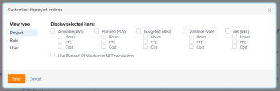
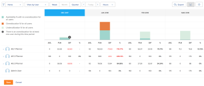

# Adobe Workfront 리소스 플래너를 사용하여 리소스 가용성 및 할당 검토

리소스 플래너에서 리소스의 가용성과 프로젝트에 대한 계획 또는 예산 작업의 양을 볼 수 있습니다. 이러한 값은 시간, FTE(Full Time Equivalent) 또는 비용 금액으로 표시되며 열로 구성됩니다.

## 액세스 요구 사항

+++ 을 확장하여 이 문서의 기능에 대한 액세스 요구 사항을 봅니다.

이 문서의 단계를 수행하려면 다음 액세스 권한이 있어야 합니다.

<table style="table-layout:auto"> 
 <col> 
 <col> 
 <tbody> 
  <tr> 
   <td role="rowheader">Adobe Workfront 플랜</td> 
   <td>
새로 만들기: 모두

       
또는

       
현재: Pro 이상
 </td> 
  </tr> 
  <tr> 
   <td role="rowheader">Adobe Workfront 라이선스</td> 
   <td>
새로운 기능: 밝게 또는 높음

       
또는

       
현재: 검토 이상
</td>
  </tr> 
  <tr> 
   <td role="rowheader">액세스 수준 구성</td> 
   <td> 
다음에 대한 액세스 권한 이상:
 
    <ul> 
     <li> 
리소스 관리
 </li> 
     <li> 
재무 데이터
 </li> 
     <li> 
사용자
 </li> 
     <li> 
프로젝트
 </li> 
    </ul> </td> 
  </tr> 
  <tr> 
   <td role="rowheader">개체 권한</td> 
   <td> 
리소스 플래너에서 보려는 프로젝트에 대한 이상의 권한 보기
 </td> 
  </tr> 
 </tbody> 
</table>

이 표의 정보에 대한 자세한 내용은 [Workfront 설명서의 액세스 요구 사항](/help/quicksilver/administration-and-setup/add-users/access-levels-and-object-permissions/access-level-requirements-in-documentation.md)을 참조하십시오.

+++

## 전제 조건

리소스 플래너 작업에 필요한 모든 사전 요구 사항을 충족해야 합니다. 자세한 내용은 [리소스 플래너 개요](../../resource-mgmt/resource-planning/get-started-resource-planner.md)를 참조하세요.

>[!IMPORTANT]
>
>리소스 플래너의 올바른 기능에 필요한 사전 요구 사항이 누락된 경우 일부 숫자가 0이거나 예산 시간이 흐리게 표시될 수 있습니다.

## 리소스 가용성 및 할당

자원의 가용성과 할당을 표시하는 열은 리소스 플래너에 적용하는 뷰에 따라 변경됩니다. 프로젝트, 역할 또는 사용자별로 리소스 플래너에 정보를 표시하는 방법에 대한 자세한 내용은 [리소스 플래너 탐색 개요](../../resource-mgmt/resource-planning/resource-planner-navigation.md)를 참조하십시오.

보기를 리소스 플래너로 변경할 때 다음 사항을 고려하십시오.

* **프로젝트별 보기** 또는&#x200B;**역할별 보기** 보기를 적용하면 다음 열이 표시됩니다.

  <!--
  <MadCap:conditionalText data-mc-conditions="QuicksilverOrClassic.Draft mode">
  (NOTE: Alina: (some of the information in this area is also covered in Calculating Costs in the RP - https://workfront.zendesk.com/hc/en-us/articles/115004186433 - update this article also, when changes here occur)
  </MadCap:conditionalText>
  -->

   * 사용 가능한 시간, FTE 또는 비용
   * 계획된 시간, FTE 또는 비용
   * 예산 시간, FTE 또는 비용
   * 시간, FTE 또는 비용 차이
   * 순 시간, FTE 또는 비용

* **사용자별 보기** 보기를 적용하면 다음 열이 표시됩니다.

   * 사용 가능한 시간 또는 FTE
   * 계획된 시간 또는 FTE
   * 시간 또는 FTE 차이
   * 계획된 시간 할당 백분율

>[!TIP]
>
>리소스 플래너에 **사용자별 보기** 보기를 적용할 때 이 정보를 비용으로 사용할 수 없습니다.
>
>각 열에 표시되는 내용에 대한 자세한 내용을 보려면 숫자가 표시된 열의 이름 위로 마우스를 가져갑니다.\
>
>
>각 열에 표시되는 데이터에 대한 자세한 내용은 다음 문서를 참조하십시오.
>
>* [리소스 플래너의 프로젝트 및 역할 보기의 시간, FTE 및 비용 정보 개요](../../resource-mgmt/resource-planning/overview-of-planner-hour-fte-cost-information-in-role-project-views.md)
>* [사용자 보기를 사용할 때 리소스 플래너에서 사용 가능한 시간, 계획된 시간 및 실제 시간 또는 FTE 보기](../../resource-mgmt/resource-planning/view-hours-fte-user-view-resource-planner.md)
>

## 시간, FTE 또는 비용별 정보 보기

1. 리소스 플래너로 이동합니다.

   리소스 플래너에는 기본적으로 정보가 시간별로 표시됩니다.

1. 드롭다운 메뉴를 확장합니다.\
   

1. 다음 옵션 중에서 선택합니다.

   <table style="table-layout:auto"> 
    <col> 
    <col> 
    <tbody> 
     <tr> 
      <td role="rowheader">시간</td> 
      <td>가용성 및 할당 정보를 시간 단위로 표시합니다.</td> 
     </tr> 
     <tr> 
      <td role="rowheader">FTE</td> 
      <td> 
FTE로 가용성 및 할당 정보를 표시합니다.
 
리소스 플래너에서 FTE를 계산하는 방법에 대한 자세한 내용은 <a href="../../resource-mgmt/resource-planning/calculate-hours-fte-for-users-roles-resource-planner.md" class="MCXref xref">리소스 플래너에서 사용자 및 역할에 대한 시간 및 FTE 계산 개요</a>를 참조하십시오. 
 </td> 
     </tr> 
     <tr> 
      <td role="rowheader">비용</td> 
      <td> 
프로젝트 또는 역할 보기에서 리소스 플래너를 보는 경우 비용별 가용성 및 할당 정보를 표시합니다. 정보는 시스템 통화로 값을 표시합니다. Workfront 관리자가 시스템 통화를 정의합니다. Workfront에서 시스템 통화를 설정하는 방법에 대한 자세한 내용은 <a href="../../administration-and-setup/manage-workfront/exchange-rates/set-up-exchange-rates.md" class="MCXref xref">환율 설정</a>을 참조하십시오.
 
<b>메모</b>

   리소스 플래너에 비용 정보를 표시하려면 사용자 및 작업 역할을 시간당 비용에 연결해야 합니다. 시간당 비용을 작업 역할과 연결하는 방법에 대한 자세한 내용은 <a href="../../administration-and-setup/set-up-workfront/organizational-setup/create-manage-job-roles.md" class="MCXref xref">작업 역할 만들기 및 관리</a>를 참조하십시오. 시간당 비용을 사용자와 연결하는 방법에 대한 자세한 내용은 <a href="../../administration-and-setup/add-users/create-and-manage-users/edit-a-users-profile.md" class="MCXref xref">사용자 프로필 편집</a>을 참조하십시오. 리소스 플래너에서 비용을 계산하는 방법에 대한 자세한 내용은 <a href="../../resource-mgmt/resource-planning/calculate-costs-resource-planner.md" class="MCXref xref">리소스 플래너에서 비용 계산 </a>을 참조하십시오.
 </td>
   </tr> 
     <tr> 
      <td role="rowheader">맞춤화</td> 
      <td>리소스 플래너에 표시되는 열의 사용자 지정 보기를 만듭니다. 아래 단계에 설명된 대로 리소스 플래너에 표시할 옵션을 선택합니다. </td> 
     </tr> 
    </tbody> 
   </table>

1. (조건부) **사용자 지정**&#x200B;을 선택한 경우 **표시된 지표 사용자 지정** 상자에 옵션을 표시하여 사용자 지정 보기를 설정합니다.

   

1. 왼쪽의 **보기 형식** 열에서 다음 보기 중 하나를 선택합니다.

   * 프로젝트
   * 역할
   * 사용자

1. **선택한 항목 표시** 섹션에서 선택한 보기의 열에 표시할 정보 형식을 선택합니다. 다음 표는 각 보기에서 사용할 수 있는 옵션을 보여 줍니다.

   | **옵션** | 사용자 조회 | 프로젝트 보기 | 역할 보기 |
   |---|---|---|---|
   | 사용 가능 | ✔ | ✔ | ✔ |
   | 계획됨 | ✔ | ✔ | ✔ |
   | 예산 |   | ✔ | ✔ |
   | 변량 |   | ✔ | ✔ |
   | 순 |   | ✔ | ✔ |
   | 실제 | ✔ |   |   |
   | 차이 | ✔ |   |   |
   | 백분율 | ✔ |   |   |

1. 프로젝트 및 역할 보기에서 순 값을 계산할 때 예산 정보 대신 계획된 값을 사용하려면 **NET 계산에서 계획된(PLN) 값 사용**&#x200B;을 선택하십시오.

   이 옵션을 선택하면 Workfront은 다음 공식을 사용하여 순 값을 계산합니다.

   `Net = Available - Planned`

   >[!TIP]
   >
   >**이 옵션은 선택한 항목 표시 섹션에서 보기를 사용자 지정하는 옵션을 하나 이상 선택한 경우에만 적용됩니다.**

1. **저장**&#x200B;을 클릭합니다.

   선택한 열이 포함된 사용자 정의 보기가 표시됩니다.

   리소스 플래너는 시간 드롭다운 메뉴에 사용자 정의된 보기를 사용자 정의로 나열합니다.

   >[!NOTE]
   >
   >사용자 정의된 보기는 하나만 있을 수 있습니다.

   

## 사용자 할당 차트 보기

차트에서 가용성에 대한 사용자의 계획된 할당을 표시할 수 있습니다.

차트에 사용자 할당을 표시하려면 다음을 수행합니다.

1. 리소스 플래너로 이동합니다.

   리소스 플래너에 액세스하는 방법에 대한 자세한 내용은 문서 [리소스 플래너 개요](../../resource-mgmt/resource-planning/get-started-resource-planner.md)에서 [리소스 플래너 찾기](../../resource-mgmt/resource-planning/get-started-resource-planner.md#accessing-the-resource-planner) 섹션을 참조하십시오.

1. **사용자별 보기**&#x200B;를 선택합니다.

   >[!TIP]
   >
   >사용자 보기에서만 사용자 할당 차트를 볼 수 있습니다.

1. **사용자 할당 차트** 아이콘 을(를) 클릭하여 다음 정보를 표시합니다.

   <table style="table-layout:auto"> 
    <col> 
    <col> 
    <tbody> 
     <tr> 
      <td role="rowheader">모든 사용자에 대해 초과 할당이 없는 가용성 %</td> 
      <td>모든 사용자가 일정 기간 동안 작업에 사용할 수 있는 총 시간입니다. 총 사용 가능한 시간의 백분율로 표시됩니다. </td> 
     </tr> 
     <tr> 
      <td role="rowheader">모든 사용자의 초과 할당(%) </td> 
      <td> 
사용자가 특정 기간에 초과 할당된 총 시간으로서, 총 사용 가능한 시간의 백분율로 표시됩니다.
 
<b>메모</b>

   계획된 시간이 가용 시간보다 높을 때 초과 할당이 발생합니다. 
 </td>
   </tr> 
     <tr> 
      <td role="rowheader">모든 사용자의 과소 활용(%)</td> 
      <td> 
일정 기간 동안 사용자가 충분히 활용되지 않는 총 사용 가능 시간의 백분율로 표시됩니다.
 
<b>메모</b>

   계획된 시간이 가용 시간보다 낮은 경우 활용률이 낮아집니다. 
 </td>
   </tr> 
     <tr> 
      <td role="rowheader">이 기간 동안 최소 한 명의 사용자에게 초과 할당이 있습니다.</td> 
      <td>모든 사용자의 총 시간이 해당 기간에 대해 초과 할당되지 않지만 한 기간에 적어도 한 명의 사용자에 대해 초과 할당이 있음을 나타냅니다. 사용자 목록을 스크롤해야 하며 초과 할당된 사용자의 시간이 빨간색으로 강조 표시됩니다.</td> 
     </tr> 
    </tbody> 
   </table>

   

1. (선택 사항) 차트에서 **모든 사용자에 대한 초과 할당(%)** 영역을 클릭합니다.\
   초과 할당된 모든 사용자는 빨간색으로 강조 표시됩니다.
1. (선택 사항) 차트에서 **모든 사용자에 대한 미달 사용률(%)** 영역을 클릭합니다.\
   활용도가 낮은 모든 사용자는 파란색으로 강조 표시됩니다.

1. (선택 사항) 최소 한 명 이상의 사용자가 초과 할당된 위치를 보여 주는 표시기 아이콘 을(를) 클릭합니다.\
   초과 할당된 사용자는 빨간색으로 강조 표시됩니다.

1. (선택 사항) 페이지를 새로 고쳐 차트를 축소합니다.
