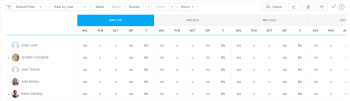

# 리소스 플래너 탐색 개요

Adobe Workfront 리소스 플래너를 사용하면 리소스의 가용성과 더불어 프로젝트 작업을 완료하는 데 필요한 계획된 시간을 쉽게 이해할 수 있습니다. 그런 다음 할당된 프로젝트에서 사용자 및 사용자 작업 역할의 할당을 관리할 수 있습니다.

>[!TIP]
>
>리소스 플래너에서 할당된 작업에 대한 팀 할당을 관리할 수 없습니다.

리소스 플래너를 완전히 사용하는 데 필요한 사전 요구 사항을 충족해야 합니다. 리소스 플래너에 대한 자세한 내용은 [리소스 플래너 개요](../../resource-mgmt/resource-planning/get-started-resource-planner.md)를 참조하십시오.

다음 섹션에서는 리소스 플래너의 모든 영역에 대해 간략히 설명합니다.

## 프로젝트 타임라인

리소스 플래너의 상단에 있는 달력을 사용하여 보고 있는 프로젝트의 타임라인을 탐색합니다. 타임라인은 기본적으로 오늘 달로 시작됩니다.\
리소스 플래너에 표시되는 타임라인의 시간 프레임을 변경하는 방법에 대한 자세한 내용은 이 문서의 [시간 프레임 선택](#timeframe-selection) 섹션을 참조하십시오.

## 일정 선택  {#timeframe-selection}

기본적으로 리소스 플래너는 현재 달부터 시작하여 한 번에 3개월 또는 4개월 동안의 리소스 정보를 표시합니다. 표시되는 기간 수는 화면의 너비에 따라 다릅니다.

>[!TIP]
>
>리소스 플래너에는 한 번에 4개 이상의 기간을 표시할 수 없습니다.

타임라인을 탐색하려면 다음을 수행합니다.

1. 타임라인에서 앞뒤로 이동하려면 뒤로 및 앞으로 화살표를 클릭합니다.
1. 리소스 플래너의 다음 날짜 범위 옵션에서 적절한 버튼을 클릭하여 선택합니다.

   <table style="table-layout:auto"> 
    <col> 
    <col> 
    <tbody> 
     <tr> 
      <td role="rowheader">주</td> 
      <td>주별 정보를 표시합니다. 열 머리글의 날짜 옆에 주 숫자가 표시됩니다. </td> 
     </tr> 
     <tr> 
      <td role="rowheader">월</td> 
      <td> 월별 정보를 표시합니다.</td> 
     </tr> 
     <tr> 
      <td role="rowheader">분기</td> 
      <td>분기별로 정보를 표시합니다. 열 머리글의 날짜 옆에 분기 숫자가 표시됩니다. 사용자 지정 분기가 리소스 플래너에 표시되지 않습니다. </td> 
     </tr> 
     <tr> 
      <td role="rowheader">오늘</td> 
      <td>오늘의 월, 주 또는 분기로 돌아갑니다.</td> 
     </tr> 
    </tbody> 
   </table>

## 프로젝트/역할/사용자 보기 선택

정보 표시 방법에 따라 리소스 플래너에서 보기를 변경할 수 있습니다.

기본적으로 리소스 플래너는 사용자 보기에 표시됩니다. 보기를 프로젝트 또는 역할 보기로 변경할 수 있습니다. 다른 보기로 변경하면 선택 항목이 기본 보기가 됩니다.

보기를 변경하면 다음 정보도 변경됩니다.

* 객체 계층(리소스 플래너 행의 정보)입니다.
* 시간 할당 정보(리소스 플래너 열에 있는 정보).

  선택한 보기에 따라 리소스 플래너에 표시되는 열에 대한 자세한 내용은 [Adobe Workfront 리소스 플래너를 사용하여 리소스 가용성 및 할당 검토](../../resource-mgmt/resource-planning/resource-availability-allocation-resource-planner.md)를 참조하십시오.

리소스 플래너에 정확한 정보를 표시하려면 사전 요구 사항 세트를 충족해야 합니다. 필수 구성 요소에 대한 자세한 내용은 [리소스 플래너 개요](../../resource-mgmt/resource-planning/get-started-resource-planner.md) 문서의 &quot;리소스 플래너에서 작업하기 위한 필수 구성 요소&quot; 섹션을 참조하십시오.  리소스 플래너에서 보기를 변경하려면 다음을 수행합니다.

1. **리소스 플래너**(으)로 이동합니다.\
   리소스 플래너에 액세스하는 방법에 대한 자세한 내용은 [리소스 플래너 개요](../../resource-mgmt/resource-planning/get-started-resource-planner.md) 문서의 [리소스 플래너 찾기](../../resource-mgmt/resource-planning/get-started-resource-planner.md#accessing-the-resource-planner) 섹션을 참조하십시오.

1. **보기 기준** 드롭다운 메뉴에서 다음 보기 중 하나를 선택합니다.

   * [프로젝트별 보기](#view-by-project)
   * [역할별 보기](#view-by-role)
   * [사용자별 보기](#view-by-user)

### 프로젝트별 보기 {#view-by-project}

리소스 플래너에서 프로젝트 보기를 선택할 때는 다음 사항을 고려하십시오.

* 최소한 볼 수 있는 권한이 있는 프로젝트를 볼 수 있습니다.
* 리소스 플래너에 처음 액세스하면 기본 필터로 필터링된 프로젝트를 볼 수 있습니다.\
  리소스 플래너의 필터링 정보에 대한 자세한 내용은 [리소스 플래너의 필터링 정보](../../resource-mgmt/resource-planning/filter-resource-planner.md)를 참조하십시오.

* 성능을 개선하기 위해 프로젝트 보기에서 표시하거나 내보낼 수 있는 항목의 수가 제한됩니다.\
  프로젝트 보기에서 리소스 플래너를 볼 때의 제한 사항에 대한 자세한 내용은 [리소스 플래너 표시 제한](../../resource-mgmt/resource-planning/resource-planner-display-limitations.md) 문서의 [프로젝트 보기의 제한](../../resource-mgmt/resource-planning/resource-planner-display-limitations.md#project-view-limits) 섹션을 참조하십시오.

* 프로젝트 보기에는 프로젝트가 우선 순위 순서로 나열됩니다.\
  리소스 플래너의 프로젝트 우선 순위에 대한 자세한 내용은 이 문서의 [프로젝트 계획 우선 순위](#project-planning-priority) 섹션을 참조하십시오.

* 각 프로젝트를 확장할 때 연결된 작업 역할을 표시할 수 있습니다.\
  각 역할을 확장하면 해당 역할과 연관된 사용자를 표시할 수 있습니다.\
  스크롤하여 각 프로젝트 아래에 더 많은 역할과 사용자를 로드합니다.

* 이 보기가 적용되면 역할 시간, FTE 또는 비용이 프로젝트 시간, FTE 또는 비용에 추가됩니다.\
  

* 프로젝트 보기에서 다음 시간, FTE 또는 비용 정보를 볼 수 있습니다.

   * 사용 가능
   * 계획됨
   * 예산
   * 변량
   * 순

     자세한 내용은 [프로젝트 및 역할 보기를 사용하여 리소스 플래너의 리소스 예산](../../resource-mgmt/resource-planning/budget-resources-project-role-views-resource-planner.md)을 참조하세요.

### 역할별 보기 {#view-by-role}

리소스 플래너에서 역할 보기를 선택할 때는 다음 사항을 고려하십시오.

* 해당 프로젝트와 관련된 역할을 보려면 최소한 리소스 관리에 대한 보기 액세스 권한과 프로젝트에 대한 보기 권한이 있어야 합니다.
* 각 역할을 확장하여 프로젝트 목록을 표시하고 모든 프로젝트를 확장하여 프로젝트에서 해당 역할을 수행할 수 있는 사용자 목록을 표시할 수 있습니다.
* 성능 향상을 위해 역할 보기에서 표시하거나 내보낼 수 있는 항목의 수가 제한됩니다.\
  역할 보기에서 리소스 플래너를 볼 때의 제한 사항에 대한 자세한 내용은 [리소스 플래너 표시 제한](../../resource-mgmt/resource-planning/resource-planner-display-limitations.md)의 [역할 보기의 제한](../../resource-mgmt/resource-planning/resource-planner-display-limitations.md#role-view-limits) 섹션을 참조하십시오.

* 프로젝트는 프로젝트 보기에 나열되어 있는 우선 순위와 동일한 순서로 작업 역할에 나열됩니다.
* 이 보기가 적용되면 프로젝트 시간, FTE 또는 비용이 역할 시간, FTE 또는 비용에 추가됩니다.\
  

* 역할 보기에서 다음 시간, FTE 또는 비용 정보를 볼 수 있습니다.

   * 사용 가능
   * 계획됨
   * 예산
   * 변량
   * 순

     자세한 내용은 [프로젝트 및 역할 보기를 사용하여 리소스 플래너의 리소스 예산](../../resource-mgmt/resource-planning/budget-resources-project-role-views-resource-planner.md)을 참조하세요.

### 사용자별 보기 {#view-by-user}

사용자 보기에 리소스 플래너를 표시하여 사용자의 계획된 시간과 가용 시간 또는 FTE 간의 차이를 이해하거나 사용자가 기록한 실제 시간을 확인할 수 있습니다.

리소스 플래너에 사용자 보기를 적용할 때 리소스 예산을 책정할 수 없습니다. 프로젝트 또는 역할 보기를 사용하여 리소스 예산을 책정하고 사용자 보기를 사용하여 계획된 작업과 관련하여 사용자의 할당 및 가용성을 검토해야 합니다.* *

사용자 보기는 리소스 플래너의 기본 보기입니다.

리소스 플래너에서 사용자 보기를 선택할 때는 다음 사항을 고려하십시오.

* 볼 수 있는 권한이 있는 모든 사용자, 최대 2000명의 사용자가 활성 상태이며 Adobe Workfront에 한 번 이상 로그인한 사용자를 볼 수 있습니다.\
  팀, 작업 역할 또는 풀별로 사용자 목록을 필터링하여 해당 엔티티와만 연결된 사용자를 확인합니다.
* 사용자 목록을 프로젝트별로 필터링한 경우 필터링된 프로젝트와 연결된 사용자만 확장할 수 있으며 시간 정보도 표시할 수 있습니다.\
  리소스 플래너의 필터링 정보에 대한 자세한 내용은 [리소스 플래너의 필터링 정보](../../resource-mgmt/resource-planning/filter-resource-planner.md)를 참조하십시오.

* 사용자 보기에서 표시하거나 내보낼 수 있는 항목의 수는 성능을 개선하기 위해 제한됩니다.\
  사용자 보기에서 리소스 플래너를 볼 때의 제한 사항에 대한 자세한 내용은 [리소스 플래너 표시 제한 사항](../../resource-mgmt/resource-planning/resource-planner-display-limitations.md)의 [사용자 보기의 제한 사항](../../resource-mgmt/resource-planning/resource-planner-display-limitations.md#user-view-limits) 섹션을 참조하십시오.

* 프로젝트는 프로젝트 보기에 나열되어 있는 우선 순위와 동일한 순서로 사용자 이름에 나열됩니다.\
  리소스 플래너의 프로젝트 우선 순위에 대한 자세한 내용은 이 문서의 [프로젝트 계획 우선 순위](#project-planning-priority) 섹션을 참조하십시오.

* 사용자에게 연결된 작업 역할이 없는 경우 시간 또는 FTE 값이 **역할 없음** 섹션에 나열됩니다.
* 이 보기가 적용되면 프로젝트 시간 또는 FTE가 사용자 시간 또는 FTE에 추가됩니다.

  >[!TIP]
  >
  >사용자 보기에는 비용별 사용자 할당 및 가용성을 표시할 수 없습니다.

* 프로젝트 및 작업에 대한 권한은 사용자 보기에 표시되는 사용자 이름 아래에 표시되는 내용을 결정합니다.\
  다음과 같은 시나리오가 있습니다.

   * 리소스 플래너에 표시된 사용자에게 할당된 프로젝트 및 작업 또는 문제를 볼 수 있는 권한이 없는 경우 **액세스할 수 없는 항목** 섹션에 해당 항목이 나열됩니다. **액세스할 수 없는 항목** 섹션이 이 경우 프로젝트 또는 작업 섹션을 대체합니다.

   * 프로젝트를 볼 수 있는 권한이 없지만 프로젝트의 작업 또는 문제를 볼 수 있는 액세스 권한이 있는 경우 프로젝트, 작업 및 문제가 할당된 사용자 이름 아래에 나열됩니다.
   * 프로젝트를 볼 수 있는 권한이 있지만 프로젝트에 대한 작업이나 문제가 없으면 프로젝트 이름이 표시되고 작업 및 문제가 **액세스할 수 없는 항목** 섹션에 나열됩니다.\
     Workfront의 사용 권한에 대한 자세한 내용은 [개체에 대한 공유 권한 개요](../../workfront-basics/grant-and-request-access-to-objects/sharing-permissions-on-objects-overview.md)를 참조하십시오.

     

   

* 사용자 보기에서 다음 시간 및 FTE 정보를 볼 수 있습니다.

   * 사용 가능
   * 계획됨
   * 실제
   * 계획과 실제 간의 차이
   * 계획된 할당의 백분율

     자세한 내용은 사용자 보기를 사용할 때 리소스 플래너에서 [사용 가능 시간, 계획된 시간 및 실제 시간 또는 FTE 보기](../../resource-mgmt/resource-planning/view-hours-fte-user-view-resource-planner.md)를 참조하십시오.

## 프로젝트 이름

리소스 플래너에서 다음 프로젝트를 볼 수 있습니다.

* 최소한 볼 수 있는 권한이 있는 프로젝트입니다.

  또한 액세스 수준에서 최소한 리소스 관리 보기에 대한 액세스 권한이 있어야 합니다.

  리소스 플래너를 사용하는 데 필요한 액세스에 대한 자세한 내용은 [Adobe Workfront에서 리소스 예산을 책정하는 데 필요한 액세스](../../resource-mgmt/resource-planning/access-needed-to-budget-resources.md)를 참조하십시오.

* 리소스 플래너에 적용되는 필터에 의해 제한된 프로젝트.

  리소스 플래너의 필터링 정보에 대한 자세한 내용은 [리소스 플래너의 필터링 정보](../../resource-mgmt/resource-planning/filter-resource-planner.md)를 참조하십시오.

  >[!NOTE]
  >
  >리소스 플래너에 표시되는 프로젝트 수를 줄이려면 필터를 사용하는 것이 좋습니다.

## 프로젝트 계획 우선 순위 {#project-planning-priority}

프로젝트는 가장 중요한 프로젝트가 맨 위에 있는 리소스 플래너에 우선 순위 순서로 나열됩니다. 우선 순위는 프로젝트 이름 앞에 숫자로 표시됩니다.

포트폴리오와 연결된 경우 포트폴리오에 따라 프로젝트 우선 순위를 표시하도록 설정을 활성화할 수도 있습니다. 리소스 플래너에서 프로젝트 우선 순위 지정 및 포트폴리오 우선 순위 표시에 대한 자세한 내용은 [리소스 플래너에서 프로젝트 우선 순위 지정](../../resource-mgmt/resource-planning/prioritize-projects-resource-planner.md)을 참조하십시오.

## 작업 역할 이름

리소스 플래너에는 다음 작업 역할 범주가 나열됩니다.

* 작업에 할당된 작업 역할입니다.
* 작업에 할당되지 않았지만 프로젝트의 리소스 풀과 연결된 사용자의 기본 작업 역할인 작업 역할입니다.
* 해당 작업 역할의 작업에 할당된 사용자의 보조 작업 역할입니다.
* 프로필에 유효한 **FTE 가용성 비율**&#x200B;이 있는 사용자의 보조 작업 역할입니다.\
  작업 역할의 **FTE 가용성 비율**&#x200B;에 대한 자세한 내용은 [사용자 프로필 편집](../../administration-and-setup/add-users/create-and-manage-users/edit-a-users-profile.md) 을 참조하십시오.

>[!NOTE]
>
>**문제 후 시간 포함** 설정을 사용하면 문제에 할당된 작업 역할도 나열됩니다. 리소스 플래너에서 문제 시간을 사용하는 방법에 대한 자세한 내용은 [설정](#settings) 섹션을 참조하십시오.

## 사용자 이름

리소스 플래너의 프로젝트 및 역할 보기에 나열된 사용자는 프로젝트와 연결된 리소스 풀에 속합니다.\
사용자로 리소스 풀을 채우는 방법에 대한 자세한 내용은 [사용자와 리소스 풀 연결](../../resource-mgmt/resource-planning/resource-pools/associate-resource-pools-with-users.md)을 참조하십시오.

보기에 대한 액세스 권한이 있고 Workfront에 한 번 이상 로그인한 모든 사용자가 사용자 보기에 표시됩니다.

프로젝트 및 역할 보기에서 다음 유형의 작업 역할 아래에 사용자가 표시될 수 있습니다.

* 기본 작업 역할
* 다음 시나리오에서 보조 작업 역할:

   * 보조 작업 역할에 사용자 프로필의 **FTE 가용성의 백분율**&#x200B;에 대한 올바른 숫자가 있는 경우.
   * 사용자가 해당 역할의 작업에 할당된 경우.

작업 역할의 **FTE 가용성 비율**&#x200B;에 대한 자세한 내용은 [사용자 프로필 편집](../../administration-and-setup/add-users/create-and-manage-users/edit-a-users-profile.md) 을 참조하십시오.

## &quot;역할 없음&quot; 및 &quot;사용자 없음&quot; 섹션

* [&quot;역할 없음&quot; 섹션](#no-role-section)
* [&quot;사용자 없음&quot; 섹션](#no-user-section)

### &quot;역할 없음&quot; 섹션  {#no-role-section}

사용자가 프로젝트와 연결된 리소스 풀에 속하지만 연결된 작업 역할이 없는 경우 특정 작업 역할이 아닌 **역할 없음** 섹션에 표시됩니다.

**역할 없음** 섹션에서 사용자에 대한 시간을 예약할 수 없습니다. 작업 예산을 책정하려면 사용자에게 연결된 작업 역할이 하나 이상 있어야 합니다.\

### &quot;사용자 없음&quot; 섹션  {#no-user-section}

팀에 작업을 할당하거나 할당 해제된 상태로 두면 리소스 플래너의 **역할 없음** 섹션에 나타나는 **사용자 없음** 섹션에 계획된 시간이 나타납니다. 이러한 작업은 **사용자별 보기** 보기를 사용할 때 리소스 플래너에 표시되지 않습니다.

리소스 플래너의 **사용자 없음** 섹션에서 프로젝트의 작업에 속하는 계획된 시간을 볼 수 있지만, 이러한 할당에 대한 예산을 책정할 수는 없습니다.

 

## 필터

필터를 사용하여 리소스 플래너에 표시하는 정보를 제한할 수 있습니다.

리소스 플래너에서 필터링하는 방법에 대한 자세한 내용은 [리소스 플래너에서 필터링 정보](../../resource-mgmt/resource-planning/filter-resource-planner.md)을 참조하십시오.

## 설정 {#settings}

설정 영역에서 리소스 플래너의 정보를 표시하거나 숨기는 옵션을 활성화하거나 비활성화할 수 있습니다.

리소스 플래너에서 설정을 활성화하려면 다음을 수행하십시오.

1. 리소스 플래너를 엽니다.
1. **설정** 아이콘을 클릭합니다.

   

   리소스 플래너 설정 상자가 표시됩니다.

   

1. **문제 후 시간 포함** 설정을 사용하여 리소스 플래너에 문제 후 계획된 시간을 표시합니다. 이 설정은 기본적으로 비활성화되어 있습니다.

   이 설정을 활성화할 때 다음 사항을 고려하십시오.

   * 문제에 할당된 사용자의 이름은 문제에 연결된 작업 역할 아래에 표시되며 프로젝트 및 역할 보기에서 사용자와 작업 역할에 대한 예산 시간을 지정할 수 있습니다.
   * 사용자에게 할당된 문제는 사용자 보기의 작업 역할 이름 아래에 나열됩니다.

     >[!IMPORTANT]
     >
     >**문제에 대한 계획된 시작 및 완료 날짜가 프로젝트의 타임라인을 벗어나는 경우 문제의 계획된 시간이 문제의 날짜에 따라 표시됩니다. 예를 들어 프로젝트 타임라인이 1월과 3월 사이에 있지만 문제의 타임라인이 8월에 있는 경우 문제에 대한 계획된 시간이 8월 기간에 나타납니다.**

1. (조건부 및 선택 사항) 프로젝트 보기를 선택한 경우, Portfolio 우선 순위 표시 설정을 활성화하여 프로젝트 우선 순위를 지정된 Portfolio에 따라 표시합니다. 포트폴리오에 따른 프로젝트의 우선 순위가 리소스 플래너 우선 순위 옆에 표시됩니다. 이 설정은 기본적으로 비활성화되어 있습니다.

   리소스 플래너에서 프로젝트 우선 순위를 지정하는 방법에 대한 자세한 내용은 [리소스 플래너에서 프로젝트 우선 순위 지정](../../resource-mgmt/resource-planning/prioritize-projects-resource-planner.md)을 참조하십시오.

## 전체 화면 옵션

리소스 플래너를 전체 화면으로 표시하여 화면에서 볼 수 있는 정보의 양을 확대할 수 있습니다.

리소스 플래너의 모든 보기에서 전체 화면으로 정보를 보는 옵션을 사용할 수 있습니다.

리소스 플래너를 전체 화면에 표시하려면 다음 작업을 수행하십시오.

1. **리소스 플래너**(으)로 이동합니다.
1. 리소스 플래너를 전체 화면으로 보려면 **전체 화면 아이콘**&#x200B;을 클릭하십시오.\
   \
   리소스 플래너가 확장되어 전체 브라우저 창을 차지하고 아이콘은 **전체 화면 닫기** 보기 옵션으로 변경됩니다.

1. (선택 사항) 이전 화면으로 되돌리려면 **전체 화면 닫기 아이콘**&#x200B;을 클릭합니다.

## 내보내기 옵션

리소스 플래너의 모든 보기에서 정보를 Excel(.xlsx) 파일로 내보낼 수 있습니다.\
리소스 플래너에서 정보를 내보내는 방법에 대한 자세한 내용은 [리소스 플래너에서 정보 내보내기](../../resource-mgmt/resource-planning/export-resource-planner.md)를 참조하십시오.

내보낸 파일의 정보 양과 표시를 관리할 수 있습니다.\
리소스 플래너에서 내보낼 수 있는 정보와 내보낸 파일의 모양과 느낌을 관리하는 방법에 대한 자세한 내용은 [리소스 플래너 표시 제한](../../resource-mgmt/resource-planning/resource-planner-display-limitations.md)을 참조하십시오.
