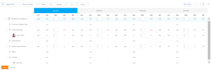

# 리소스 플래너 탐색 개요

Adobe Workfront Resource Planner를 사용하면 리소스의 가용성과 프로젝트 작업을 완료하는 데 필요한 계획 시간을 쉽게 이해할 수 있습니다. 그런 다음 사용자에게 할당된 프로젝트에서 사용자 및 해당 작업 역할의 할당을 관리할 수 있습니다.

>[!TIP]
>
>자원 계획자에서 지정된 태스크에 대한 팀 할당을 관리할 수 없습니다.

리소스 계획자를 완전히 사용하는 데 필요한 전제 조건을 충족해야 합니다. 리소스 계획자에 대한 자세한 내용은 [리소스 플래너 개요](../../resource-mgmt/resource-planning/get-started-resource-planner.md).

다음 섹션에서는 리소스 계획자의 모든 영역에 대해 설명합니다.

## 프로젝트의 타임라인

리소스 계획자 상단의 달력을 사용하여 보고 있는 프로젝트의 타임라인을 탐색합니다. 타임라인은 기본적으로 오늘의 달로 시작됩니다.\
리소스 계획자에서 표시하는 타임라인의 시간 변경에 대한 자세한 내용은 섹션을 참조하십시오 [일정 선택](#timeframe-selection) 참조하십시오.

## 일정 선택  {#timeframe-selection}

기본적으로 Resource Planner는 현재 월을 시작으로 한 번에 3~4개월 동안의 자원 정보를 표시합니다. 표시되는 기간 수는 화면 너비에 따라 다릅니다.

>[!TIP]
>
>자원 계획자는 한 번에 4개 이상의 기간을 표시할 수 없습니다.

타임라인을 탐색하려면

1. 타임라인에서 뒤로 및 앞으로 화살표를 클릭하여 앞뒤로 이동합니다.
1. 해당 버튼을 눌러 리소스 계획자의 다음 날짜 범위 옵션 중에서 선택합니다.

   <table style="table-layout:auto"> 
    <col> 
    <col> 
    <tbody> 
     <tr> 
      <td role="rowheader">주</td> 
      <td>주별로 정보를 표시합니다. 열 헤더의 날짜 옆에 주 수가 표시됩니다. </td> 
     </tr> 
     <tr> 
      <td role="rowheader">월</td> 
      <td> 월별로 정보를 표시합니다.</td> 
     </tr> 
     <tr> 
      <td role="rowheader">분기</td> 
      <td>분기별로 정보를 표시합니다. 분기 수는 열 헤더의 날짜 옆에 표시됩니다. 사용자 지정 분기는 리소스 계획자에 표시되지 않습니다. </td> 
     </tr> 
     <tr> 
      <td role="rowheader">오늘</td> 
      <td>오늘 월, 주 또는 분기로 돌아갑니다.</td> 
     </tr> 
    </tbody> 
   </table>

## 프로젝트/역할/사용자 보기 선택

정보를 표시할 방법에 따라 리소스 계획자에서 뷰를 변경할 수 있습니다.

기본적으로 리소스 계획자가 사용자 뷰에 표시됩니다. 보기를 프로젝트 또는 역할 보기로 변경할 수 있습니다. 다른 뷰로 변경하면 선택 사항이 기본 보기가 됩니다.

뷰를 변경하면 다음 정보도 변경됩니다.

* 객체 계층(리소스 계획자 행의 정보)입니다.
* 시간 할당 정보(리소스 계획자 열의 정보)

   선택한 보기에 따라 리소스 계획자에 표시되는 열에 대한 자세한 내용은 다음을 참조하십시오 [Adobe Workfront Resource Planner를 사용하여 리소스 가용성 및 할당 검토](../../resource-mgmt/resource-planning/resource-availability-allocation-resource-planner.md).

리소스 계획자에 정확한 정보를 표시하려면 일련의 전제 조건을 충족해야 합니다. 전제 조건에 대한 자세한 내용은 의 &quot;Resource Planner에서 작업을 위한 전제 조건&quot; 섹션을 참조하십시오 [리소스 플래너 개요](../../resource-mgmt/resource-planning/get-started-resource-planner.md) 문서.  자원 계획자에서 뷰를 변경하려면

1. 로 이동합니다. **리소스 플래너**.\
   리소스 계획자 액세스에 대한 자세한 내용은 [리소스 계획자 찾기](../../resource-mgmt/resource-planning/get-started-resource-planner.md#accessing-the-resource-planner) 의 섹션 [리소스 플래너 개요](../../resource-mgmt/resource-planning/get-started-resource-planner.md) 문서.

1. 에서&#x200B;**보기 기준** 드롭다운 메뉴에서 다음 보기 중 하나를 선택합니다.

   * [프로젝트별 보기](#view-by-project)
   * [역할별 보기](#view-by-role)
   * [사용자별 보기](#view-by-user)

### 프로젝트별 보기 {#view-by-project}

리소스 계획자에서 프로젝트 뷰를 선택할 때 다음 사항을 고려하십시오.

* 적어도 볼 수 있는 권한이 있는 프로젝트를 볼 수 있습니다.
* 리소스 계획자에 처음으로 액세스하면 기본 필터로 필터링된 프로젝트를 볼 수 있습니다.\
   리소스 계획자에서 정보를 필터링하는 방법에 대한 자세한 내용은 다음을 참조하십시오 [리소스 계획자에서 정보 필터링](../../resource-mgmt/resource-planning/filter-resource-planner.md).

* 성능을 향상시키기 위해 프로젝트 보기에서 표시하거나 내보낼 수 있는 항목 수가 제한됩니다.\
   프로젝트 보기에서 리소스 계획자를 볼 때 제한 사항에 대한 자세한 내용은 [프로젝트 보기의 제한 사항](../../resource-mgmt/resource-planning/resource-planner-display-limitations.md#project-view-limits) 의 섹션 [리소스 계획자 표시 제한 사항](../../resource-mgmt/resource-planning/resource-planner-display-limitations.md) 문서.

* 프로젝트는 프로젝트 보기에서 우선 순위 순서로 나열됩니다.\
   리소스 계획자의 프로젝트 우선 순위에 대한 자세한 내용은 [프로젝트 계획 우선 순위](#project-planning-priority) 섹션에 자세히 설명되어 있습니다.

* 각 프로젝트를 확장하면 연결된 작업 역할을 표시할 수 있습니다.\
   각 역할을 확장하면 역할과 연관된 사용자를 표시할 수 있습니다.\
   각 프로젝트 아래에 더 많은 역할과 사용자를 로드하려면 스크롤합니다.

* 이 뷰가 적용되면 역할 시간, FTE 또는 비용이 프로젝트 시간, FTE 또는 비용에 추가됩니다.\
   

* 프로젝트 뷰에서 다음 시간, FTE 또는 비용 정보를 볼 수 있습니다.

   * 사용 가능
   * 계획됨
   * 예산
   * 변량
   * 순

      자세한 내용은 [프로젝트 및 역할 보기를 사용하는 자원 계획자의 예산 자원](../../resource-mgmt/resource-planning/budget-resources-project-role-views-resource-planner.md).

### 역할별 보기 {#view-by-role}

리소스 계획자에서 역할 보기를 선택할 때 다음 사항을 고려하십시오.

* 프로젝트에 연결된 역할을 보려면 리소스 관리에 대한 보기 액세스 권한이 있어야 하며 프로젝트에 대한 보기 권한이 있어야 합니다.
* 각 역할을 확장하여 프로젝트 목록과 모든 프로젝트를 표시하여 프로젝트에서 이러한 역할을 수행할 수 있는 사용자 목록을 표시할 수 있습니다.
* 성능을 향상시키기 위해 역할 보기에서 표시하거나 내보낼 수 있는 항목 수가 제한됩니다.\
   역할 보기에서 리소스 계획자를 볼 때 제한 사항에 대한 자세한 내용은 [역할 보기의 제한 사항](../../resource-mgmt/resource-planning/resource-planner-display-limitations.md#role-view-limits) 섹션 [리소스 계획자 표시 제한 사항](../../resource-mgmt/resource-planning/resource-planner-display-limitations.md) .

* 프로젝트는 프로젝트 보기에 나열된 것과 동일한 우선순위 순서로 작업 역할 아래에 나열됩니다.
* 이 뷰가 적용되면 프로젝트 시간, FTE 또는 비용이 역할 시간, FTE 또는 비용에 추가됩니다.\
   

* 역할 뷰에서 다음 시간, FTE 또는 비용 정보를 볼 수 있습니다.

   * 사용 가능
   * 계획됨
   * 예산
   * 변량
   * 순

      자세한 내용은 [프로젝트 및 역할 보기를 사용하는 자원 계획자의 예산 자원](../../resource-mgmt/resource-planning/budget-resources-project-role-views-resource-planner.md).

### 사용자별 보기 {#view-by-user}

사용자 뷰에 리소스 계획자를 표시하여 사용자의 계획 시간과 가용 시간 또는 FTE의 차이를 이해하거나 사용자가 로그인한 실제 시간을 확인할 수 있습니다.

리소스 계획자에 사용자 뷰를 적용할 때는 자원을 예측할 수 없습니다. 프로젝트 또는 역할 보기를 사용하여 자원을 예산을 책정하고 사용자 뷰를 사용하여 계획된 작업과 관련된 사용자의 할당 및 가용성을 검토해야 합니다.*

사용자 뷰는 리소스 계획자의 기본 뷰입니다.

리소스 계획자에서 사용자 뷰를 선택할 때 다음 사항을 고려하십시오.

* 활성 상태이며 Adobe Workfront에 한 번 이상 로그인한 모든 사용자를 최대 2000명의 사용자에게 볼 수 있습니다.\
   팀, 작업 역할 또는 풀별로 사용자 목록을 필터링하여 해당 엔티티와만 연결된 사용자를 확인합니다.
* 프로젝트별로 사용자 목록을 필터링한 경우, 필터링된 프로젝트와 연결된 사용자만 확장하고 시간 정보도 표시할 수 있습니다.\
   리소스 계획자에서 정보를 필터링하는 방법에 대한 자세한 내용은 다음을 참조하십시오 [리소스 계획자에서 정보 필터링](../../resource-mgmt/resource-planning/filter-resource-planner.md) .

* 성능을 개선하기 위해 사용자 보기에서 표시하거나 내보낼 수 있는 항목의 수가 제한됩니다.\
   사용자 보기에서 리소스 플랫폼을 볼 때의 제한 사항에 대한 자세한 내용은 [사용자 보기의 제한 사항](../../resource-mgmt/resource-planning/resource-planner-display-limitations.md#user-view-limits) 섹션 [리소스 계획자 표시 제한 사항](../../resource-mgmt/resource-planning/resource-planner-display-limitations.md) .

* 프로젝트는 프로젝트 보기에 나열된 것과 동일한 우선순위 순서로 사용자 이름 아래에 나열됩니다.\
   리소스 계획자의 프로젝트 우선 순위에 대한 자세한 내용은 [프로젝트 계획 우선 순위](#project-planning-priority) 섹션에 자세히 설명되어 있습니다.

* 사용자에게 연관된 Job 역할이 없는 경우 Hours 또는 FTE 값은 **역할 없음** 섹션을 참조하십시오.
* 이 뷰가 적용되면 프로젝트 시간 또는 FTE는 사용자 시간 또는 FTE에 추가됩니다.

   >[!TIP]
   >
   >사용자 뷰에서 비용별로 사용자의 할당 및 가용성을 표시할 수 없습니다.

* 프로젝트 및 작업에 대한 권한은 사용자 보기에 표시되는 사용자 이름 아래에 표시되는 내용을 결정합니다.\
   다음 시나리오가 있습니다.

   * Resource Planner에 표시된 사용자에게 할당된 프로젝트 및 작업 또는 문제를 볼 수 있는 권한이 없는 경우 해당 항목이 **액세스할 수 없는 항목** 섹션에 자세히 설명되어 있습니다. 다음 **액세스할 수 없는 항목** 이 경우 섹션은 프로젝트 또는 작업 섹션을 대체합니다.

   * 프로젝트를 볼 수 있는 권한이 없지만 프로젝트, 프로젝트, 작업 및 문제에 대한 작업 또는 문제를 볼 수 있는 액세스 권한이 있는 경우 해당 프로젝트에 할당된 사용자의 이름 아래에 프로젝트, 작업 및 문제가 나열됩니다.
   * 프로젝트를 볼 수 있는 권한이 있지만 프로젝트에 대한 작업이나 문제가 없으면 프로젝트 이름이 표시되고 작업 및 문제가 아래에 나열됩니다 **액세스할 수 없는 항목** 섹션을 참조하십시오.\
      Workfront의 권한에 대한 자세한 내용은 [개체에 대한 권한 공유 개요](../../workfront-basics/grant-and-request-access-to-objects/sharing-permissions-on-objects-overview.md).

      
    

* 사용자 보기에서 다음 시간 및 FTE 정보를 볼 수 있습니다.

   * 사용 가능
   * 계획됨
   * 실제
   * 계획 및 실제 간의 차이
   * 계획 할당 비율

      자세한 내용은 [사용자 뷰를 사용할 때 리소스 계획자에서 사용 가능한 시간, 계획 시간 또는 실제 시간 또는 FTE 보기](../../resource-mgmt/resource-planning/view-hours-fte-user-view-resource-planner.md)

## 프로젝트 이름

리소스 계획자에서 다음 프로젝트를 볼 수 있습니다.

* 적어도 볼 수 있는 권한이 있는 프로젝트.

   또한 액세스 수준에서 적어도 리소스 관리 보기에 액세스할 수 있어야 합니다.

   리소스 계획자 사용에 필요한 액세스에 대한 자세한 내용은 [Adobe Workfront의 예산 리소스에 대한 액세스 필요](../../resource-mgmt/resource-planning/access-needed-to-budget-resources.md).

* 리소스 계획자에 적용된 필터에 의해 제한된 프로젝트

   리소스 계획자에서 정보를 필터링하는 방법에 대한 자세한 내용은 다음을 참조하십시오 [리소스 계획자에서 정보 필터링](../../resource-mgmt/resource-planning/filter-resource-planner.md).

   >[!NOTE]
   >
   >필터를 사용하여 리소스 플래너에 표시되는 프로젝트 수를 줄이는 것이 좋습니다.

## 프로젝트 계획 우선 순위 {#project-planning-priority}

가장 중요한 프로젝트가 맨 위에 있는 자원 계획자에서 우선 순위 순서로 프로젝트가 나열됩니다. 우선 순위는 프로젝트 이름 앞에 있는 숫자로 표시됩니다.

또한 설정이 포트폴리오와 연결되어 있을 때 포트폴리오에 따라 프로젝트 우선순위를 표시하도록 설정할 수도 있습니다. 프로젝트 우선 순위 지정 및 Resource Planner에서 포트폴리오 우선 순위 표시에 대한 자세한 내용은 [리소스 계획자에서 프로젝트 우선 순위 지정](../../resource-mgmt/resource-planning/prioritize-projects-resource-planner.md).

## 작업 역할 이름

Resource Planner에는 다음 작업 역할 범주가 나열됩니다.

* 작업에 할당된 작업 역할입니다.
* 작업에 할당되지 않지만 프로젝트의 리소스 풀과 연관된 사용자의 기본 작업 역할인 작업 역할입니다.
* 해당 작업 역할의 작업에 할당된 사용자의 보조 작업 역할입니다.
* 유효한 사용자의 보조 작업 역할 **FTE 가용성 비율** 참조하십시오.\
   에 대한 자세한 정보 **FTE 가용성 비율** 작업 역할에 대해서는 [사용자 프로필 편집](../../administration-and-setup/add-users/create-and-manage-users/edit-a-users-profile.md) .

>[!NOTE]
>
>문제에 할당된 작업 역할도 **문제 발생 시간 포함** 이 활성화되어 있습니다. 리소스 계획자에서 문제 시간을 활성화하는 방법에 대한 자세한 내용은 [설정](#settings) 섹션을 참조하십시오.

## 사용자 이름

리소스 계획자의 프로젝트 및 역할 보기에 나열된 사용자는 프로젝트와 연관된 리소스 풀에 속합니다.\
사용자로 리소스 풀을 채우는 방법에 대한 자세한 내용은 [사용자와 리소스 풀 연결](../../resource-mgmt/resource-planning/resource-pools/associate-resource-pools-with-users.md).

보기에 액세스할 수 있고 Workfront에 로그인한 모든 사용자가 사용자 보기에 한 번 이상 표시됩니다.

프로젝트 및 역할 보기에서는 사용자가 다음 유형의 작업 역할 아래에 나열될 수 있습니다.

* 그들의 1차 직무 역할
* 다음 시나리오에서 보조 작업 역할:

   * 보조 작업 롤에 유효한 번호가 있는 경우 **FTE 가용성 비율** 참조하십시오.
   * 사용자가 해당 역할의 작업에 할당되는 경우.

에 대한 자세한 정보 **FTE 가용성 비율** 작업 역할에 대해서는 [사용자 프로필 편집](../../administration-and-setup/add-users/create-and-manage-users/edit-a-users-profile.md) .

## 역할 없음 및 &quot;사용자 없음&quot; 섹션

* [역할 없음 섹션](#no-role-section)
* [&quot;사용자 없음&quot; 섹션](#no-user-section)

### 역할 없음 섹션  {#no-role-section}

사용자가 프로젝트와 연결된 리소스 풀에 속하지만 연결된 작업 역할이 없는 경우 **역할 없음** 섹션을 참조하십시오.

사용자는 **역할 없음** 섹션을 참조하십시오. 작업에 대한 예산 책정을 수행하려면 사용자에게 연관된 Job 역할이 하나 이상 있어야 합니다.\

### &quot;사용자 없음&quot; 섹션  {#no-user-section}

팀에 작업을 할당하거나 작업을 할당되지 않은 상태로 두면 **사용자 없음** 아래에 표시되는 섹션 **역할 없음** 리소스 플래너의 섹션을 참조하십시오. 이러한 작업은 **사용자별 보기** 보기.

프로젝트에서 작업에 속하는 계획 시간의 양을 **사용자 없음** 자원 계획자 섹션에 있는 섹션을 사용할 수 있지만 이러한 할당에 대한 예산을 계산할 수는 없습니다.

 

## 필터

필터를 사용하여 리소스 계획자에 표시할 정보를 제한할 수 있습니다.

리소스 계획자에서 필터링에 대한 자세한 내용은 다음을 참조하십시오 [리소스 계획자에서 정보 필터링](../../resource-mgmt/resource-planning/filter-resource-planner.md) .

## 설정 {#settings}

설정 영역에서 리소스 계획자에 정보를 표시하거나 숨길 수 있는 옵션을 활성화하거나 비활성화할 수 있습니다.

리소스 계획자에서 설정을 사용하려면

1. 리소스 계획자를 엽니다.
1. 을(를) 클릭합니다. **설정** 아이콘.

   

   리소스 계획자 설정 상자가 표시됩니다.

   

1. 를 활성화합니다 **문제 발생 시간 포함** 자원 계획자의 문제로부터 계획 시간을 표시하도록 설정 이 설정은 기본적으로 비활성화됩니다.

   이 설정을 활성화할 때는 다음 사항을 고려하십시오.

   * 문제에 지정된 사용자의 이름이 해당 문제에 연관된 작업 역할 아래에 표시되며, 사용자의 예산 책정된 시간과 프로젝트 및 역할 뷰에서 작업 역할을 지정할 수 있습니다.
   * 사용자에게 할당된 문제는 사용자 보기에서 작업 역할의 이름 아래에 나열됩니다.

      >[!IMPORTANT]
      >
      >**계획 시작 및 완료 일자 문제가 프로젝트의 타임라인을 벗어나면 문제의 계획 시간이 문제의 날짜에 따라 표시됩니다. 예를 들어 프로젝트 타임라인이 1월과 3월 사이에 있지만 문제의 타임라인이 8월에 있으면 문제에 대한 계획 시간이 8월 기간에 나타납니다.**

1. (조건부 및 선택 사항) 프로젝트 보기를 선택한 경우, Portfolio 우선순위 표시 설정을 활성화하여 프로젝트 우선순위를 지정된 Portfolio에 따라 표시합니다. 해당 포트폴리오에 따라 프로젝트의 우선순위가 리소스 계획자 우선순위 옆에 표시됩니다. 이 설정은 기본적으로 비활성화됩니다.

   리소스 계획자에서 프로젝트 우선 순위에 대한 자세한 내용은 [리소스 계획자에서 프로젝트 우선 순위 지정](../../resource-mgmt/resource-planning/prioritize-projects-resource-planner.md).

## 전체 화면 옵션

화면에서 볼 수 있는 정보의 양을 확대하기 위해 리소스 계획자를 전체 화면에 표시할 수 있습니다.

전체 화면에서 정보를 보는 옵션은 리소스 계획자의 모든 뷰에 사용할 수 있습니다.

리소스 계획자를 전체 화면에 표시하려면

1. 로 이동합니다. **리소스 플래너**.
1. 을(를) 클릭합니다. **전체 화면 아이콘** 전체 화면에서 리소스 계획자를 보려면\
   \
   리소스 계획자가 확장되어 전체 브라우저 창을 차지하며 아이콘이 **전체 화면 닫기** 보기 옵션.

1. (선택 사항) **전체 화면 닫기 아이콘** 이전 디스플레이로 되돌립니다.

## 내보내기 옵션

리소스 플래너의 뷰에서 정보를 Excel(.xlsx) 파일로 내보낼 수 있습니다.\
리소스 계획자에서 정보 내보내기에 대한 자세한 내용은 [리소스 계획자에서 정보 내보내기](../../resource-mgmt/resource-planning/export-resource-planner.md).

내보낸 파일의 정보와 표시를 관리할 수 있습니다.\
리소스 계획자에서 내보낼 수 있는 정보와 내보낸 파일의 모양과 느낌을 관리하는 방법에 대한 자세한 내용은 [리소스 계획자 표시 제한 사항](../../resource-mgmt/resource-planning/resource-planner-display-limitations.md).
