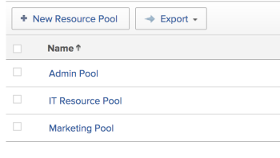

# 리소스 풀 만들기

리소스 풀은 Adobe Workfront에서 리소스를 쉽게 관리하는 데 도움이 되는 사용자의 컬렉션입니다. 리소스 풀에 대한 자세한 내용은 [리소스 풀 개요](../../../resource-mgmt/resource-planning/resource-pools/work-with-resource-pools.md).

## 액세스 요구 사항

다음 항목이 있어야 합니다.

<table style="table-layout:auto"> 
 <col> 
 <col> 
 <tbody> 
  <tr> 
   <td role="rowheader">Adobe Workfront 플랜*</td> 
   <td> 
Pro 이상
 </td> 
  </tr> 
  <tr> 
   <td role="rowheader">Adobe Workfront 라이선스*</td> 
   <td> 
플랜 
 </td> 
  </tr> 
  <tr> 
   <td role="rowheader">액세스 수준 구성*</td> 
   <td> 
리소스 풀 관리에 대한 액세스를 포함하는 리소스 관리에 대한 액세스 편집
 
사용자, 프로젝트 및 템플릿에 대한 액세스 편집
 
참고: 여전히 액세스 권한이 없는 경우 Workfront 관리자에게 액세스 수준에서 추가 제한 사항을 설정하는지 문의하십시오. Workfront 관리자가 액세스 수준을 변경하는 방법에 대한 자세한 내용은 <a href="../../../administration-and-setup/add-users/configure-and-grant-access/create-modify-access-levels.md" class="MCXref xref">사용자 정의 액세스 수준 만들기 또는 수정</a>.
 </td> 
  </tr> 
  <tr data-mc-conditions=""> 
   <td role="rowheader">개체 권한</td> 
   <td> 
리소스 풀을 연결할 프로젝트 및 템플릿에 대한 권한을 관리합니다
 
추가 액세스 요청에 대한 자세한 내용은 <a href="../../../workfront-basics/grant-and-request-access-to-objects/request-access.md" class="MCXref xref">개체에 대한 액세스 요청 </a>.
 </td> 
  </tr> 
 </tbody> 
</table>

&#42;어떤 계획, 라이선스 유형 또는 액세스 권한을 보유하고 있는지 알아보려면 Workfront 관리자에게 문의하십시오.

## 리소스 풀 만들기 {#create-a-resource-pool}

1. 리소스 풀을 편집할 수 있는 액세스 권한이 있는 사용자로 로그인합니다.\
   자세한 내용은 [리소스 풀 만들기](#create-a-resource-pool).

1. 을(를) 클릭합니다. **기본 메뉴** 아이콘  Adobe Workfront의 오른쪽 상단 모서리에서

1. 클릭 **리소스**.
1. 클릭 **리소스 풀** 왼쪽 패널에 표시됩니다.\
   

1. 클릭 **새 리소스 풀**.
1. 다음을 지정합니다.

   <table style="table-layout:auto">
    <col>
    <col>
    <tbody>
     <tr>
      <td role="rowheader"><strong>이름</strong></td>
      <td>리소스 풀의 이름입니다.</td>
     </tr>
     <tr>
      <td role="rowheader"><strong>설명</strong></td>
      <td>이 리소스 풀에 대한 간략한 설명입니다. 예를 들어 사용해야 하는 목적을 지정할 수 있습니다.</td>
     </tr>
     <tr>
      <td role="rowheader"><strong>풀 멤버</strong></td>
      <td>
 리소스 풀에 사용자를 개별적으로 추가합니다. 또는  여러 사용자를 한 번에 리소스 풀에 추가하려면 사용자 또는 사용자 컬렉션과 연결된 다음 엔티티 중 하나를 추가할 수 있습니다.
        <ul>
         <li><strong>팀</strong>: 팀의 모든 구성원이 리소스 풀에 추가됩니다.</li>
         <li><strong>그룹</strong>: 그룹의 모든 구성원이 리소스 풀에 추가됩니다.</li>
         <li><strong>역할</strong>: 해당 역할과 연결된 모든 사용자가 리소스 풀에 추가됩니다.</li>
         <li><strong>회사</strong>: 회사의 모든 사용자가 리소스 풀에 추가됩니다.</li>
        </ul>
팁: 활성 사용자, 팀만 추가할 수 있습니다. 역할, 또는 회사입니다.

참고: 사용자가 그룹, 팀, 회사 또는 작업 역할의 구성원이 되거나 그룹, 팀, 회사 또는 작업 역할이 자원 풀에 추가된 후 작업 역할과 연관된 경우 새 멤버가 자원 풀에 자동으로 추가되지 않습니다.  사용자가 추가하려는 팀, 그룹, 회사 및 작업 역할에 속해 있는 경우 사용자는 리소스 풀에 한 번만 추가됩니다. 리소스 풀에 추가된 후 비활성화된 사용자는 사용자 목록에서 흐리게 표시되고 비활성화된 것으로 표시됩니다.

</td>
     </tr>
    </tbody>
   </table>

1. (선택 사항) **실행 취소** 그룹, 팀, 회사 또는 작업 역할을 통해 추가된 사용자를 제거하는 링크입니다.

   >[!NOTE]
   >
   >리소스 풀에 포함할 수 있는 사용자 수에는 제한이 없습니다. 그러나 리소스 관리에 너무 많은 사용자를 추가하지 않는 것이 좋습니다. 그렇지 않으면 리소스 관리가 문제가 될 수 있기 때문입니다. 사용자 목록에는 리소스 풀의 처음 2,000명의 사용자만 표시되고 알파벳순으로 나열됩니다.

   

1. (선택 사항) 사용자를 제거하려면 사용자 이름 오른쪽에 있는 X 아이콘을 클릭합니다. 리소스 풀에서 사용자를 제거하는 방법에 대한 자세한 내용은 [리소스 풀에서 사용자 제거](../../../resource-mgmt/resource-planning/resource-pools/remove-users-from-resource-pool.md).
1. (선택 사항) **검색** 리소스 풀에서 사용자를 찾는 옵션
1. Click **Create**.
