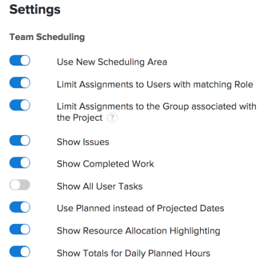

# 예약 영역에서 설정을 구성합니다

>[!IMPORTANT]
>  
>이 문서에 설명된 예약 기능은 2023년 1월 23.1 릴리스부터 Adobe Workfront에서 더 이상 사용되지 않고 제거됩니다.   
>  
>  이 문서는 2023년 초에 23.1 릴리스 직후 제거됩니다. 지금은 이에 따라 책갈피를 업데이트하는 것이 좋습니다. 
> 
> 이제 작업 로드 밸런서를 사용하여 자원에 대한 작업 일정을 예약할 수 있습니다. 
>  
> 작업 로드 밸런서를 사용하여 리소스를 예약하는 방법에 대한 자세한 내용은 섹션을 참조하십시오 [작업 로드 밸런서](../../resource-mgmt/workload-balancer/workload-balancer.md). 

<!--  

>[!CAUTION] 
> 
> 
> The information in this article refers to the Adobe Workfront's Scheduling tools. The Scheduling areas have been removed from the Preview environment and will be removed from the Production environment in **January 2023**. 
>  Instead, you can schedule resources in the Workload Balancer.  
> 
>*  For information about scheduling resources using the Workload Balancer, see the section [The Workload Balancer](../../resource-mgmt/workload-balancer/workload-balancer.md). 
> 
>*  For more information about the deprecation and removal of the Scheduling tools, see [Deprecation of Resource Scheduling tools in Adobe Workfront](../../resource-mgmt/resource-mgmt-overview/deprecate-resource-scheduling.md). 
-->

다양한 설정을 구성하여 예약 타임라인에 표시되는 정보와 방법을 사용자 정의할 수 있습니다.

## 액세스 요구 사항

이 문서의 절차를 수행하려면 다음 액세스 권한이 있어야 합니다.

<table style="table-layout:auto"> 
 <col> 
 <col> 
 <tbody> 
  <tr> 
   <td role="rowheader">Adobe Workfront 플랜*</td> 
   <td> 
모든
 </td> 
  </tr> 
  <tr> 
   <td role="rowheader">Adobe Workfront 라이선스*</td> 
   <td> 
작업 이상
 </td> 
  </tr> 
  <tr> 
   <td role="rowheader">액세스 수준*</td> 
   <td> 
프로젝트, 작업 및 문제에 대한 액세스 이상의 권한 보기
 
<b>메모</b>

여전히 액세스 권한이 없는 경우 Workfront 관리자에게 액세스 수준에서 추가 제한 사항을 설정하는지 문의하십시오. Workfront 관리자가 액세스 수준을 변경하는 방법에 대한 자세한 내용은 <a href="../../administration-and-setup/add-users/configure-and-grant-access/create-modify-access-levels.md" class="MCXref xref">사용자 정의 액세스 수준 만들기 또는 수정</a>.
 </td>
</tr> 
  <tr> 
   <td role="rowheader">개체 권한</td> 
   <td> 
프로젝트, 작업 및 문제에 대한 권한 부여
 
추가 액세스 요청에 대한 자세한 내용은 <a href="../../workfront-basics/grant-and-request-access-to-objects/request-access.md" class="MCXref xref">개체에 대한 액세스 요청 </a>.
 </td> 
  </tr> 
 </tbody> 
</table>

*보유하고 있는 플랜, 라이선스 유형 또는 액세스를 알아보려면 Workfront 관리자에게 문의하십시오.

## 예약 타임라인에 표시할 문제를 구성합니다

<!--

(NOTE: ALL THE SECTIONS BELOW ARE LINKED TO PRODUCT. DO NOT CHANGE TITLES) 

-->

예약 타임라인에서 작업 외에 표시할 문제를 구성할 수 있습니다.\
팀 예약 섹션에서 리소스를 예약하면 기본적으로 작업과 함께 문제가 표시됩니다. 프로젝트에 대한 리소스를 예약할 때 기본적으로 작업만 표시됩니다.

1. 여러 프로젝트, 개별 프로젝트 또는 팀의 예약 타임라인으로 이동합니다.

   * **여러 프로젝트의 경우**:  을(를) 클릭합니다. **기본 메뉴** 아이콘  Workfront의 오른쪽 위 모서리에서 **리소스 > 작업 로드 밸런서**&#x200B;를 선택하고 을 선택합니다. **예약** 를 클릭합니다.
   * **개별 프로젝트의 경우**: 프로젝트로 이동하여 **작업 로드 밸런서** 왼쪽 패널의 섹션에서 을(를) 선택한 다음 **예약** 왼쪽 위 드롭다운 메뉴에서 을 선택합니다.
   * **팀**: 을(를) 클릭합니다. **기본 메뉴** 아이콘  Workfront의 오른쪽 위 모서리에서 을(를) 클릭하고 **팀**&#x200B;를 클릭하고, 팀을 선택하고 **작업 로드 밸런서** 왼쪽 패널에서 를 선택하고 **예약** 왼쪽 위 드롭다운 메뉴에서 을 선택합니다.

1. 을(를) 클릭합니다. **설정** 아이콘을 클릭합니다.

1. 리소스 예약 설정 대화 상자에서 **문제 표시** 선택 사항입니다.\
   

1. 클릭 **예약으로 돌아가기**. 

## 예약 타임라인에 표시할 완료된 작업 구성

이미 완료로 표시된 작업을 표시하도록 예약 타임라인을 구성할 수 있습니다. 기본적으로 완료된 작업은 예약 타임라인에 표시되지 않습니다. 

1. 여러 프로젝트, 개별 프로젝트 또는 팀의 예약 타임라인으로 이동합니다.

   * **여러 프로젝트의 경우**:  을(를) 클릭합니다. **기본 메뉴** 아이콘  Workfront의 오른쪽 위 모서리에서 **리소스 > 작업 로드 밸런서**&#x200B;를 선택하고 을 선택합니다. **예약** 를 클릭합니다.
   * **개별 프로젝트의 경우**: 프로젝트로 이동하여 **작업 로드 밸런서** 왼쪽 패널의 섹션에서 을(를) 선택한 다음 **예약** 왼쪽 위 드롭다운 메뉴에서 을 선택합니다.
   * **팀**: 을(를) 클릭합니다. **기본 메뉴** 아이콘  Workfront의 오른쪽 위 모서리에서 을(를) 클릭하고 **팀**&#x200B;를 클릭하고, 팀을 선택하고 **작업 로드 밸런서** 왼쪽 패널에서 를 선택하고 **예약** 왼쪽 위 드롭다운 메뉴에서 을 선택합니다.

1. 을(를) 클릭합니다. **설정** 아이콘을 클릭합니다.

1. 리소스 예약 설정 대화 상자에서 **완료된 작업 표시** 선택 사항입니다.\
   

1. 클릭 **예약으로 돌아가기**.\
   완료된 작업은 작업 항목의 오른쪽 위 모서리에 확인 표시가 나타납니다.

## 예약 타임라인에 표시할 프로젝트 이름 구성 

각 작업에 표시되도록 프로젝트 이름을 구성하고 예약 타임라인에서 문제를 해결할 수 있습니다. 이렇게 하면 예약 타임라인을 보는 사용자가 작업이나 문제가 있는 프로젝트의 이름을 빠르게 볼 수 있습니다.

프로젝트 이름을 표시할 수 있도록 설정하면 각 작업 및 문제가 예약 타임라인에서 더 많은 수직 공간을 사용하므로 단일 뷰에 표시되는 작업과 문제가 줄어듭니다.

기본적으로 프로젝트 이름은 예약 타임라인의 작업 및 문제에 표시되지 않습니다.

예약 타임라인에서 작업 및 문제에 대한 프로젝트 이름을 표시하려면 다음을 수행하십시오.

1. 여러 프로젝트 또는 팀의 예약 타임라인으로 이동합니다.

   * **여러 프로젝트의 경우**:  을(를) 클릭합니다. **기본 메뉴** 아이콘  Workfront의 오른쪽 위 모서리에서 **리소스 > 작업 로드 밸런서**&#x200B;를 선택하고 을 선택합니다. **예약** 를 클릭합니다.
   * **팀**: 을(를) 클릭합니다. **기본 메뉴** 아이콘  Workfront의 오른쪽 위 모서리에서 을(를) 클릭하고 **팀**&#x200B;를 클릭하고, 팀을 선택하고 **작업 로드 밸런서** 왼쪽 패널에서 를 선택하고 **예약** 왼쪽 위 드롭다운 메뉴에서 을 선택합니다.

1. 을(를) 클릭합니다. **설정** 아이콘을 클릭합니다.

1. 리소스 예약 설정 대화 상자에서 다음과 같은 옵션을 활성화합니다. **프로젝트 이름 표시**.\
   

1. 클릭 **예약으로 돌아가기**.\
   예약 타임라인의 각 작업 및 문제는 작업 또는 문제가 있는 프로젝트의 이름을 표시합니다.\
   

## 예약 타임라인에 표시할 예상 날짜를 구성합니다

기본적으로 계획 날짜는 예약 타임라인에서 사용됩니다. 또는 예상 날짜를 사용하도록 예약 타임라인을 구성할 수 있습니다.

계획 및 예상 일자에 대해 다음 정보를 고려하십시오.

* 작업에 대한 계획 날짜는 수동으로 설정하거나 작업 제한 및 기간 유형에 따라 자동으로 설정할 수 있습니다. 자세한 내용은 문서를 참조하십시오 [작업 제한 개요](../../manage-work/tasks/task-constraints/task-constraint-overview.md) 및  [작업 기간 및 기간 유형 개요](../../manage-work/tasks/taskdurtn/task-duration-and-duration-type.md) .

   문제에 대한 계획 날짜는 사용자가 문제에 대해 수동으로 설정합니다. 그러나 시스템 관리자는 사용자가 문제에 대한 계획 일자를 조정하지 못하도록 제한할 수 있습니다.

* 작업 및 문제에 대한 예상 날짜가 자동으로 설정됩니다. 예상 날짜에 대한 자세한 내용은 문서를 참조하십시오 [프로젝트, 작업 및 문제에 대한 예상 완료 일자 개요](../../manage-work/projects/planning-a-project/project-projected-completion-date.md).

>[!NOTE]
>
>예약 타임라인에서 예상 날짜를 사용하는 경우 사용자 할당 정보를 표시할 수 없습니다. 사용자 할당에 대한 자세한 내용은 문서를 참조하십시오 [예약 영역에서 지정되지 않은 작업 및 문제를 수동으로 지정](../../resource-mgmt/resource-scheduling/manually-assign-items-scheduling-areas.md).

예상 날짜에 따라 작업 및 문제를 표시하도록 예약 타임라인을 구성하려면 

1. 여러 프로젝트, 개별 프로젝트 또는 팀의 예약 타임라인으로 이동합니다.

   * **여러 프로젝트의 경우**:  을(를) 클릭합니다. **기본 메뉴** 아이콘  Workfront의 오른쪽 위 모서리에서 **리소스 > 작업 로드 밸런서**&#x200B;를 선택하고 을 선택합니다. **예약** 를 클릭합니다.
   * **개별 프로젝트의 경우**: 프로젝트로 이동하여 **작업 로드 밸런서** 왼쪽 패널의 섹션에서 을(를) 선택한 다음 **예약** 왼쪽 위 드롭다운 메뉴에서 을 선택합니다.
   * **팀**: 을(를) 클릭합니다. **기본 메뉴** 아이콘  Workfront의 오른쪽 위 모서리에서 을(를) 클릭하고 **팀**&#x200B;를 클릭하고, 팀을 선택하고 **작업 로드 밸런서** 왼쪽 패널에서 를 선택하고 **예약** 왼쪽 위 드롭다운 메뉴에서 을 선택합니다.

1. 을(를) 클릭합니다. **설정** 아이콘을 클릭합니다.

1. 리소스 예약 설정 대화 상자에서 **예상 날짜 대신 계획됨 사용** 선택 사항입니다.
1. 클릭 **예약으로 돌아가기**.

## 예약 타임라인에 사용자가 표시되는 방식을 구성합니다

>[!NOTE]
>
>이 섹션은 팀의 리소스를 예약할 때만 적용됩니다( 팀의 예약 섹션). 복수 프로젝트(스케줄링 탭에서) 또는 단일 프로젝트(스태핑 탭에서)에 대한 자원을 스케줄링할 때 사용자를 알파벳순으로 표시할 수 없습니다. 그들은 항상 역할별로 조직된다.

팀을 위한 리소스를 예약할 때 사용자를 알파벳순 또는 역할별로 예약 타임라인에 표시하도록 구성할 수 있습니다. 기본적으로 사용자는 알파벳순으로 표시됩니다(역할은 표시되지 않음).

1. 을(를) 클릭합니다. **기본 메뉴** 아이콘  Workfront의 오른쪽 위 모서리에서 팀을 클릭합니다. 기본적으로 팀이 선택됩니다.

1. 을(를) 클릭합니다. **설정** 아이콘을 클릭합니다.

1. 설정 대화 상자에서 **역할별 그룹** 선택 사항입니다.\
   이 옵션을 비활성화하면 사용자가 알파벳순으로 표시되며 예약 타임라인에 역할이 표시되지 않습니다.\
   이 옵션이 활성화되면 역할이 예약 타임라인에 표시되고 사용자가 각 역할 내에서 그룹화됩니다. 지정된 사용자에게 시스템에 여러 역할이 정의된 경우 해당 사용자는 각 해당 역할 아래의 예약 타임라인에 여러 번 나타납니다.\
   

1. 클릭 **예약으로 돌아가기**.

## 상위 작업이 예약 타임라인에 표시되는지 여부를 구성합니다

<!--

(NOTE: This section is linked to the UI in a tooltip inside the Settings of the scheduler. do not rename/ remove/ edit the tag!! - Resource Scheduling (People> Scheduling>Settings>Show Parent Tasks tooltip)

-->

상위 작업은 액세스 중인 일정 일정에 따라 다르게 표시됩니다. 

* [여러 프로젝트에 대한 상위 작업 표시](#display-parent-tasks-for-multiple-projects)
* [프로젝트 또는 팀의 상위 작업 표시](#display-parent-tasks-for-a-project-or-a-team)

### 여러 프로젝트에 대한 상위 작업 표시 {#display-parent-tasks-for-multiple-projects}

예약 섹션에서 여러 프로젝트에 대한 리소스를 예약할 때 상위 작업이 표시되는지 여부는 다음 설정에 따라 다릅니다.

* 프로젝트의 완료 모드입니다.
* 프로젝트의 요약 완료 모드.
* 예약 탭의 상위 작업 표시 설정.

다음 표에서는 상위 작업이 예약 탭에 표시되는 시기와 하위 작업만 표시되는 경우를 설명합니다. 

| **상위 작업 설정 표시** | **프로젝트의 완료 모드** | **프로젝트의 요약 완료 모드** | **예약 타임라인에 표시된 작업 유형** |
|---|---|---|---|
| 비활성화 | 수동 | 자동 | 하위 작업만 |
| 비활성화 | 수동 | 수동 | 하위 작업만 |
| 비활성화 | 자동 | 자동 | 하위 작업만 |
| 비활성화 | 자동 | 수동 | 하위 작업만 |
| 활성화됨 | 자동 | 수동 | 하위 작업 및 상위 작업 |
| 활성화됨 | 자동 | 자동 | 하위 작업만 |
| 활성화됨 | 수동 | 수동 | 하위 작업 및 상위 작업 |
| 활성화됨 | 수동 | 자동 | 하위 작업만 |

구성에 대한 자세한 내용은&#x200B;**완료 모드** 그리고 **요약 완료 모드** 각 프로젝트의 필드는 문서에서 &quot;설정&quot; 섹션을 참조하십시오 [프로젝트 편집](../../manage-work/projects/manage-projects/edit-projects.md).

여러 프로젝트에 대한 예약 섹션에서 상위 작업 표시 설정을 수동으로 구성할 수 있습니다. 

상위 작업 표시 설정을 구성하려면 

1. 을(를) 클릭합니다. **기본 메뉴** 아이콘  Workfront의 오른쪽 위 모서리에서 **리소스 > 작업 로드 밸런서**&#x200B;를 선택하고 을 선택합니다. **예약** 를 클릭합니다.
1. 을(를) 클릭합니다. **설정** 아이콘을 클릭합니다.

1. 리소스 예약 설정 대화 상자에서 옵션을 활성화할지 여부를 선택합니다. **상위 작업을 표시합니다.**
이 옵션을 활성화하면 위의 표에 설명된 대로 모든 프로젝트의 상위 작업이 요약 완료 모드 및 프로젝트의 완료 모드 설정에 따라 표시됩니다. 이 옵션은 기본적으로 활성화되어 있습니다.
\
   

1. 클릭 **예약으로 돌아가기** 왼쪽 아래 모퉁이에 있습니다.

### 프로젝트 또는 팀의 상위 작업 표시 {#display-parent-tasks-for-a-project-or-a-team}

프로젝트의 스태핑 섹션이나 예약 섹션에서 리소스를 스케줄링할 때 상위 태스크가 표시되는지 여부는 다음 설정에 따라 달라집니다.

* 프로젝트의 완료 모드입니다.
* 프로젝트의 요약 완료 모드.

구성에 대한 자세한 내용은 **완료 모드** 그리고 **요약 완료 모드** 각 프로젝트의 필드는 문서에서 &quot;설정&quot; 섹션을 참조하십시오 [프로젝트 편집](../../manage-work/projects/manage-projects/edit-projects.md).

다음 테이블은 상위 태스크가 프로젝트의 스태핑 섹션이나 일정 섹션에 표시되는 시기와 하위 태스크만 표시되는 경우를 설명합니다. 

| 프로젝트의 완료 모드 | 프로젝트의 요약 완료 모드 | 예약 섹션에 표시되는 작업 유형 | 팀 예약 섹션에 표시되는 작업 유형 |
|---|---|---|---|
| 수동 | 자동 | 하위 작업만 | 하위 작업만 |
| 수동 | 수동 | 하위 작업 및 상위 작업 | 하위 작업만 |
| 자동 | 자동 | 하위 작업만 | 하위 작업만 |
| 자동 | 수동 | 하위 작업 및 상위 작업 | 하위 작업만 |
| 자동 | 수동 | 하위 작업 및 상위 작업 | 하위 작업만 |
| 자동 | 자동 | 하위 작업만 | 하위 작업만 |
| 수동 | 수동 | 하위 작업 및 상위 작업 | 하위 작업만 |
| 수동 | 자동 | 하위 작업만 | 하위 작업만 |

## 일별 계획 시간이 예약 타임라인에 표시되는지 여부를 구성합니다

모든 사용자에 대한 계획 시간의 일별 합계를 표시하도록 예약 타임라인을 구성하려면: 

1. 여러 프로젝트, 개별 프로젝트 또는 팀의 예약 타임라인으로 이동합니다.

   * **여러 프로젝트의 경우**:  을(를) 클릭합니다. **기본 메뉴** 아이콘  Workfront의 오른쪽 위 모서리에서 **리소스 > 작업 로드 밸런서**&#x200B;를 선택하고 을 선택합니다. **예약** 를 클릭합니다.
   * **개별 프로젝트의 경우**: 프로젝트로 이동하여 **작업 로드 밸런서** 왼쪽 패널의 섹션에서 을(를) 선택한 다음 **예약** 왼쪽 위 드롭다운 메뉴에서 을 선택합니다.
   * **팀**: 을(를) 클릭합니다. **기본 메뉴** 아이콘  Workfront의 오른쪽 위 모서리에서 을(를) 클릭하고 **팀**&#x200B;를 클릭하고, 팀을 선택하고 **작업 로드 밸런서** 왼쪽 패널에서 를 선택하고 **예약** 왼쪽 위 드롭다운 메뉴에서 을 선택합니다.

1. 을(를) 클릭합니다. **설정** 아이콘을 클릭합니다.

1. 설정 대화 상자에서 다음 옵션을 활성화합니다.

   *  **일별 계획 시간 합계 표시**: 각 사용자에 대한 일별 계획 시간의 총계를 표시합니다.
   * **리소스 할당 강조 표시**: 작업 및 문제에 대한 사용자의 할당을 강조 표시하고 사용자가 너무 많이 할당된 기간을 강조 표시합니다.\
      이러한 옵션은 기본적으로 비활성화됩니다.\
      

1. 클릭 **예약으로 돌아가기**.\
   사용자에게 할당된 총 계획 시간이 각 날에 대해 표시됩니다.\
   사용자가 초과 할당된 날에 대한 계획 시간은 빨간색으로 강조 표시됩니다.\
   사용자 할당에 대한 자세한 내용은 문서를 참조하십시오 [예약 영역에서 지정되지 않은 작업 및 문제를 수동으로 지정](../../resource-mgmt/resource-scheduling/manually-assign-items-scheduling-areas.md).

## 모든 사용자 작업이 예약 타임라인에 표시되는지 여부를 구성합니다

>[!NOTE]
>
>이 옵션은 개별 프로젝트에 대한 리소스를 예약할 때만 적용됩니다( 프로젝트의 예약 섹션). 이 옵션은 여러 프로젝트에 대한 리소스를 예약할 때( 예약 섹션에서) 또는 팀에 대한 리소스를 예약할 때 사용할 수 없습니다( 팀의 예약 섹션).

보고 있는 프로젝트와 관련된 작업뿐만 아니라 각 사용자에게 할당된 모든 작업이 예약 타임라인에 표시되는지 여부를 구성하려면 다음을 수행합니다.

1. 각 사용자에게 할당된 모든 작업을 표시하도록 예약 타임라인을 구성할 프로젝트로 이동합니다.
1. 을(를) 클릭합니다. **작업 로드 밸런서** 왼쪽 패널의 섹션(아래에 있을 수 있음) **자세히 표시**)를 선택한 다음 을 선택합니다. **예약** 왼쪽 위 드롭다운 메뉴에서 을 선택합니다.
1. 을(를) 클릭합니다. **설정** 아이콘을 클릭합니다.

1. 설정 영역에서 옵션을 활성화할지 여부를 선택합니다. **모든 사용자 작업 표시**.\
   이 옵션이 활성화되면 작업이 있는 프로젝트에 관계없이 각 사용자에게 할당된 모든 작업이 예약 타임라인에 표시됩니다.\
   이 옵션은 기본적으로 비활성화됩니다.\
   

1. 클릭 **예약으로 돌아가기**.
