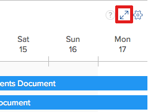
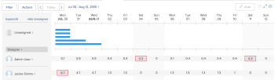

# 리소스 예약 시작

>[!IMPORTANT]
>  
>이 문서에 설명된 예약 기능은 2023년 1월 23.1 릴리스부터 Adobe Workfront에서 더 이상 사용되지 않고 제거됩니다.   
>  
>  이 문서는 2023년 초에 23.1 릴리스 직후 제거됩니다. 지금은 이에 따라 책갈피를 업데이트하는 것이 좋습니다. 
> 
> 이제 작업 로드 밸런서를 사용하여 자원에 대한 작업 일정을 예약할 수 있습니다. 
>  
> 작업 로드 밸런서를 사용하여 리소스를 예약하는 방법에 대한 자세한 내용은 섹션을 참조하십시오 [작업 로드 밸런서](../../resource-mgmt/workload-balancer/workload-balancer.md). 

<!--  

>[!CAUTION] 
> 
> 
> The information in this article refers to the Adobe Workfront's Scheduling tools. The Scheduling areas have been removed from the Preview environment and will be removed from the Production environment in **January 2023**.   
>  Instead, you can schedule resources in the Workload Balancer.  
> 
>*  For information about scheduling resources using the Workload Balancer, see the section [The Workload Balancer](../../resource-mgmt/workload-balancer/workload-balancer.md). 
> 
>*  For more information about the deprecation and removal of the Scheduling tools, see [Deprecation of Resource Scheduling tools in Adobe Workfront](../../resource-mgmt/resource-mgmt-overview/deprecate-resource-scheduling.md). 
-->

<!--

(NOTE: LINKED TO THE PRODUCT FROM: ALL SCHEDULING TOOLS: GLOBAL, TEAM, PROJECT STAFFING *** LINKED TO LOTS OF ARTICLES, AS WELL!) 

(NOTE: Alina: this article should be divided in multiple articles, but CAREFULLY because some sections are linked to the UI)

-->

Adobe Workfront에서 리소스 예약 기능을 사용할 때 적절한 사용자에게 작업 및 문제를 보다 쉽게 할당할 수 있습니다. 작업 역할과 사용자의 가용성을 모두 고려하여 작업 또는 문제를 완료할 수 있는 사용자를 결정할 수 있습니다.

다음 섹션에서는 Workfront에서 예약 영역 사용에 대한 자세한 내용을 제공합니다.

## Workfront에서 예약 도구를 사용하기 위한 사전 요구 사항

>[!IMPORTANT]
>
>이 문서에 설명된 사전 요구 사항은 Workfront의 예약 영역에만 적용됩니다. 작업 로드 밸런서 사용 모범 사례에 대한 자세한 내용은 [작업 로드 밸런서 개요](../../resource-mgmt/workload-balancer/overview-workload-balancer.md).

Workfront에서 리소스 예약 기능을 성공적으로 사용하려면 먼저 사용자, 프로젝트, 작업 및 문제가 다음 사전 요구 사항을 충족하는지 확인해야 합니다.

* [사용자 사전 요구 사항](#user-prerequisites)
* [프로젝트 사전 요구 사항](#project-prerequisites)
* [작업 및 문제 사전 요구 사항](#task-and-issue-prerequisites)

### 사용자 사전 요구 사항 {#user-prerequisites}

스케줄링 탭, 스태핑 탭 또는 다음 각 조건이 충족될 경우 작업 중 탭에서 사용할 수 있는 자원 스케줄링 도구를 사용할 수 있습니다.

**리소스를 리소스 관리자로 예약할 때(예약 탭에서):**

* 리소스를 관리할 프로젝트의 리소스 관리자로 지정됩니다.

   프로젝트에 대한 리소스 관리자 지정에 대한 자세한 내용은 문서를 참조하십시오 [프로젝트 또는 템플릿에 대한 자원 관리자 지정](../../manage-work/projects/planning-a-project/designate-resource-managers-for-projects-and-templates.md).

* 계획 라이센스가 있는 사용자입니다.

기본적으로 사용자는 시스템에 정의된 작업 역할(기본 작업 역할 또는 보조 작업 역할)이 있는 경우에만 예약 타임라인에 표시되며 해당 작업 역할은 작업에 할당된 작업 롤이나 현재 **지정되지 않음** 예약 타임라인의 영역. 해당 사용자에게 작업의 역할 할당이나 사용자에게 할당되는 문제와 일치하는 사용자 프로필에 정의된 역할이 있는지 여부에 관계없이 해당 사용자에게 작업 및 문제를 할당하도록 이 기능을 비활성화할 수 있습니다. 자세한 내용은 문서를 참조하십시오 [예약 영역에서 역할 및 그룹 구성원에 관계없이 사용자 지정 허용](../../resource-mgmt/resource-scheduling/assignments-regardless-of-role-or-group-scheduling-areas.md).

기본적으로 할당되는 작업은 작업의 역할 할당이나 문제와 일치하는 사용자 프로필에 정의된 역할이 있는 사용자만 지정할 수 있습니다.

**자원을 프로젝트 팀의 구성원으로 스케줄링할 때(프로젝트의 스태핑 탭에서)**

* 프로젝트를 보거나, 기여하거나, 관리할 수 있는 권한이 있습니다
* 계획 또는 작업 라이센스가 있습니다

<!--
<note type="note">  If Workfront has not removed the Use New Scheduling Area option from your Scheduling settings, users must have a Plan license and Manage permissions to the project to view the Scheduling timeline. For more information about the removal of the Use New Scheduling Area option, see the article
<a href="../../product-announcements/announcements/announcement-archive/replace-flash-tools.md" class="MCXref xref">Replacement of Flash-based tools in Adobe Workfront</a>.
</note>
-->

**리소스를 팀 구성원으로 예약할 때(작업 중 탭에서):**

* 당신은 팀의 구성원입니다\
   팀의 모든 구성원이 예약 타임라인에 표시됩니다. 팀에 할당되고 사용자에게 할당되지 않은 작업 및 문제가 지정되지 않음 영역에 표시됩니다. 팀 및 팀의 사용자에게 할당된 작업 및 문제가 지정된 사용자 행에 표시됩니다.

### 프로젝트 사전 요구 사항 {#project-prerequisites}

이 섹션에 설명된 프로젝트 사전 요구 사항은 예약 타임라인에서 리소스를 리소스 관리자로 예약하는 경우에만 적용됩니다.

관리 중인 프로젝트는 해당 프로젝트의 작업 항목이 예약 타임라인에 표시되려면 다음 상태(또는 이러한 상태 중 하나와 일치하는 상태) 중 하나여야 합니다. 계획, 현재 또는 승인됨. 기본적으로 현재 상태의 프로젝트만 표시됩니다.

프로젝트 상태에 대한 자세한 내용은 문서를 참조하십시오 [상태 만들기 또는 편집](../../administration-and-setup/customize-workfront/creating-custom-status-and-priority-labels/create-or-edit-a-status.md).

<!--

(NOTE: [! I assume this doesn't apply when using the Staffing tab on a single project? The project can be in whatever status?]) 

-->

### 작업 및 문제 사전 요구 사항 {#task-and-issue-prerequisites}

Workfront에서 리소스 예약 도구를 사용할 때 가장 효과적으로 하려면 시스템의 작업 및 문제에 다음 기준이 정의되어 있는지 확인하십시오.

* 지속 시간
* 계획 시작 날짜
* 계획된 시간\
   문서에 설명된 대로 사용자 할당을 수정하려면 계획 시간이 필요합니다 [예약 영역에서 사용자 할당 관리](../../resource-mgmt/resource-scheduling/manage-allocations-scheduling-areas.md).

   >[!NOTE]
   >
   >자원 스케줄링 카드의 계획 시간 필드는 작업의 계획 시간이 아니라 모든 workPerDay 값의 합계를 표시합니다. workPerDay 값은 계획 시간 값을 작업 기간으로 나누어 계산됩니다. 0이 아닌 기간의 경우 반올림으로 인한 작은 불일치가 발생할 수 있지만 값은 대개 작업의 계획 시간과 일치합니다. 지속 시간이 0일이면 계획 시간은 0시간을 표시합니다.

* 역할 지정

## 예약 영역에서 정보를 봅니다.

* [예약 영역에서 정보를 찾아 봅니다](#locate-and-view-information-in-the-scheduling-areas)
* [자원 지정 및 상세내역 보기](#view-resource-assignments-and-details)
* [예약 영역의 작업 및 문제 최소화](#minimize-tasks-and-issues-on-the-scheduling-areas)
* [예약 영역의 날짜 범위 조정](#adjust-the-date-range-of-the-scheduling-areas)

### 예약 영역에서 정보를 찾아 봅니다 {#locate-and-view-information-in-the-scheduling-areas}

리소스를 예약하려는 위치에 따라 Workfront의 다음 영역에서 예약 타임라인에 액세스할 수 있습니다.

* 여러 프로젝트의 경우 일정 영역에서
* 예약 섹션의 프로젝트
* 팀의 경우 예약 섹션에서

1. 여러 프로젝트, 개별 프로젝트 또는 팀의 예약 타임라인으로 이동합니다.

   * **여러 프로젝트의 경우**:  을(를) 클릭합니다. **기본 메뉴** 아이콘  Workfront의 오른쪽 위 모서리에서 **리소스 > 작업 로드 밸런서**&#x200B;를 선택하고 을 선택합니다. **예약** 를 클릭합니다.
   * **개별 프로젝트의 경우**: 프로젝트로 이동하여 **작업 로드 밸런서** 왼쪽 패널의 섹션에서 을(를) 선택한 다음 **예약** 왼쪽 위 드롭다운 메뉴에서 을 선택합니다.
   * **팀**: 을(를) 클릭합니다. **기본 메뉴** 아이콘  Workfront의 오른쪽 위 모서리에서 을(를) 클릭하고 **팀**&#x200B;를 클릭하고, 팀을 선택하고 **작업 로드 밸런서** 왼쪽 패널에서 를 선택하고 **예약** 왼쪽 위 드롭다운 메뉴에서 을 선택합니다.

1. (선택 사항) **전체 화면** 예약 타임라인의 오른쪽 위 모서리에 있는 아이콘입니다.\
   \
   예약 타임라인이 전체 화면 모드로 표시됩니다. 전체 화면 모드에서 예약 타임라인을 볼 때 예약 타임라인은 전체 화면을 차지합니다. 다른 모든 정보는 숨겨져 있습니다(팀 또는 프로젝트 정보, 전역 탐색 막대 및 브라우저 정보 포함).

1. (선택 사항) 전체 화면 모드를 종료하려면 다음 중 하나를 수행하십시오.

   * 을(를) 클릭합니다. **전체 화면** 아이콘.
   * Esc 키를 누릅니다.

### 자원 지정 및 상세내역 보기 {#view-resource-assignments-and-details}

예약 타임라인에서 현재 리소스 지정 및 개별 작업 및 문제에 대한 기타 세부 정보를 볼 수 있습니다.

1. 여러 프로젝트, 개별 프로젝트 또는 팀의 예약 타임라인으로 이동합니다.

   * **여러 프로젝트의 경우**:  을(를) 클릭합니다. **기본 메뉴** 아이콘  Workfront의 오른쪽 위 모서리에서 **리소스 > 작업 로드 밸런서**&#x200B;를 선택하고 을 선택합니다. **예약** 를 클릭합니다.
   * **개별 프로젝트의 경우**: 프로젝트로 이동하여 **작업 로드 밸런서** 왼쪽 패널의 섹션에서 을(를) 선택한 다음 **예약** 왼쪽 위 드롭다운 메뉴에서 을 선택합니다.
   * **팀**: 을(를) 클릭합니다. **기본 메뉴** 아이콘  Workfront의 오른쪽 위 모서리에서 을(를) 클릭하고 **팀**&#x200B;를 클릭하고, 팀을 선택하고 **작업 로드 밸런서** 왼쪽 패널에서 를 선택하고 **예약** 왼쪽 위 드롭다운 메뉴에서 을 선택합니다.

1. (선택 사항) 예약 타임라인에 표시되는 콘텐츠를 사용자 정의하려면 [예약 영역에서 정보를 필터링합니다.](../../resource-mgmt/resource-scheduling/filter-scheduling-area.md).
1. 작업 또는 문제를 확장하여 다음 정보를 봅니다.

   * **프로젝트:** 작업이 있는 프로젝트의 이름 및 링크입니다.

   * **날짜:** 작업과 연관된 시작 날짜와 기한 날짜입니다.

   * **계획 시간:** 작업과 연관된 계획 시간 수입니다.\
      계획된 시간은 작업이 사용자 또는 작업 역할에 지정된 경우에만 표시됩니다.

   * **선행 작업 아이콘:** 작업과 연결된 모든 선행 작업 선행 작업 아이콘은 작업과 연결된 선행 작업이 있는 경우에만 표시됩니다. 선행 작업이 완료되고 작업이 작업할 준비가 되면 선행 작업 아이콘이 녹색으로 표시됩니다.

   * **지정:** 작업과 연관된 모든 사용자 또는 작업 역할 할당 작업 역할 할당은 사용자 할당 옆에 괄호로 표시됩니다.\
      팀 할당이 표시되지 않습니다.\
      작업이나 문제에 대해 Contribute가 액세스할 수 있는 경우 작업이나 문제 기간 내에 매일 사용자가 할당되는 시간을 수정할 수 있습니다. 사용자 할당 수정에 대한 자세한 내용은 문서를 참조하십시오 [예약 영역에서 사용자 할당 관리](../../resource-mgmt/resource-scheduling/manage-allocations-scheduling-areas.md).

### 예약 영역의 작업 및 문제 최소화 {#minimize-tasks-and-issues-on-the-scheduling-areas}

작업 및 문제를 최소화하면 단일 화면에서 많은 사용자에 대한 사용자 지정을 볼 수 있습니다.\
기본적으로 예약 타임라인의 모든 작업 및 문제는 최소화됩니다.

작업 및 문제가 최소화되면 다음을 수행할 수 있습니다.

* 작업 기간 보기
* 프로젝트 색상 보기
* 예약 타임라인의 사용자에게 지정되지 않음 영역의 작업을 할당합니다

작업 및 문제가 최소화되면 다음을 수행할 수 없습니다.

* 작업 이름 보기
* 사용자에게 이미 할당된 작업을 끌어서 재할당합니다
* 작업을 확장하여 세부 정보 보기

일별 계획 시간 합계 표시 설정을 사용으로 설정하면 작업 및 문제가 최소화될 때만 다음 작업을 수행할 수 있습니다.

* 각 사용자에 대한 총 일별 계획 시간 을 봅니다.

이 섹션에 설명된 대로 작업 및 문제를 최소화하면 해당 변경 사항이 사용자에게만 표시됩니다. 작업 및 문제는 브라우저 세션을 확장하거나 종료할 때까지 최소화됩니다. (페이지를 새로 고치면 최소화된 작업 및 문제가 확장된 상태로 되돌리지 않습니다.)

예약 타임라인에서 개별 사용자, 작업 역할 또는 모든 사용자에 대해 표시되는 작업 및 문제를 최소화할 수 있습니다.

* [개별 사용자에 대한 작업 및 문제 최소화](#minimize-tasks-and-issues-for-individual-users)
* [작업 역할에 대한 작업 및 문제 최소화](#minimize-tasks-and-issues-for-a-job-role)
* [모든 사용자에 대한 작업 및 문제 최소화](#minimize-tasks-and-issues-for-all-users)

#### 개별 사용자에 대한 작업 및 문제 최소화 {#minimize-tasks-and-issues-for-individual-users}

1. 작업 및 문제를 최소화하려는 예약 타임라인에서 사용자 옆에 있는 캐럿을 클릭합니다.\
   \
   작업 및 문제가 표시되는 방식은 다음 설정에 따라 다릅니다.

   * 를 활성화하는 경우 **일별 계획 시간 합계 표시** 다음 조건이 적용됩니다.

      * 사용자가 표시할 계획 시간만
      * 작업 및 문제가 숨겨짐
   * 를 활성화하는 경우 **일별 계획 시간 합계 표시** 사용자에 대한 작업 및 문제가 최소화됩니다.\
      

#### 작업 역할에 대한 작업 및 문제 최소화 {#minimize-tasks-and-issues-for-a-job-role}

특정 작업 역할과 연관된 모든 사용자에 대한 작업 및 문제를 최소화할 수 있습니다.

1. 최소화하려는 작업과 문제가 있는 사용자가 포함된 예약 타임라인에서 작업 역할 옆에 있는 캐럿을 클릭합니다.\
   \
   을 비활성화하면 해당 역할과 연결된 모든 사용자의 작업 및 문제가 최소화됩니다 **일별 계획 시간 합계 표시** 설정\
   이 설정을 사용하면 작업 및 문제가 숨겨지고 사용자의 계획된 시간만 표시됩니다.\
   

#### 모든 사용자에 대한 작업 및 문제 최소화 {#minimize-tasks-and-issues-for-all-users}

1. 클릭 **모두 축소** 사용자 및 역할 영역의 맨 위에 있습니다.\
   \
   또는\
   Shift 키를 누른 채 예약 타임라인에서 사용자 또는 작업 역할 옆에 있는 캐럿을 클릭합니다.\
   \
   를 비활성화하면 모든 사용자 및 역할에 대한 작업 및 문제가 최소화됩니다 **일별 계획 시간 합계 표시** 활성화하면 작업 및 문제가 숨겨집니다.\
   만약 **일별 계획 시간 합계 표시** 사용자가 표시할 계획 시간만 사용으로 설정됩니다. 미지정 영역에 대해 작업 및 문제가 최소화됩니다.\
   

### 예약 영역의 날짜 범위 조정 {#adjust-the-date-range-of-the-scheduling-areas}

기본적으로 현재 날짜부터 14일(주말 포함)이 예약 타임라인에 표시됩니다.

다음 옵션 중 하나를 사용하여 예약 타임라인에 데이터가 표시되는 날짜 범위를 수정합니다.

* **날짜 범위 옵션:** 현재 날짜 범위를 클릭한 다음 타임라인에 표시할 주 수를 선택합니다. 일(1일), 1주(7일), 2주(14일), 3주(21일), 4주(28일) 또는 6주(42일)를 표시할 수 있습니다.\
   예약 타임라인의 날짜 범위를 조정할 때 다음 사항을 고려하십시오.

   * 선택하는 날짜 범위 옵션은 다음에 예약 타임라인을 방문할 때 유지됩니다.

      <!--   
     
(NOTE: [! Not sure if this is going to apply to all 3 scheduling areas...]) 
   
     -->

   * 일 보기에서 예약 타임라인을 볼 때 사용자 할당이 표시되지 않습니다.\
      

* **달력:** 현재 날짜 범위를 클릭한 다음 현재 날짜 이전 또는 이후의 날짜를 클릭합니다. 현재 일과 선택한 일 사이의 시간이 새 범위입니다.\
   

* **오늘:** 현재 날짜를 표시하려면 이 옵션을 클릭합니다. 그러면 날짜 범위의 맨 왼쪽에 현재 날짜가 표시됩니다.\
   이전 또는 미래 날짜를 보려면 왼쪽 및 오른쪽 화살표를 클릭합니다.

   >[!NOTE]
   >
   >선택한 기간은 페이지를 새로 고칠 때 유지됩니다.

   

* **날짜 범위의 드래그 앤 드롭:** 예약 타임라인의 맨 위에서 날짜 범위를 드래그합니다.\
   

## 예약 영역에서 설정 구성

예약 타임라인에 기본적으로 특정 정보가 표시됩니다. 추가 정보를 표시하도록 설정을 구성할 수도 있습니다.

예약 타임라인에서 설정을 구성하는 방법에 대한 자세한 내용은 다음 문서를 참조하십시오.

[예약 영역에서 설정을 구성합니다](../../resource-mgmt/resource-scheduling/configure-settings-scheduling-areas.md)

[예약 영역에서 역할 및 그룹 구성원에 관계없이 사용자 지정 허용](../../resource-mgmt/resource-scheduling/assignments-regardless-of-role-or-group-scheduling-areas.md)

[예약 영역에서 미할당 작업 및 문제를 자동으로 지정](../../resource-mgmt/resource-scheduling/automatically-assign-items-scheduling-areas.md)

## 예약 영역에서 정보를 필터링합니다.

필터를 만들어 예약 타임라인에 표시되는 내용을 정의할 수 있습니다.

자세한 내용은 문서를 참조하십시오 [예약 영역에서 정보를 필터링합니다.](../../resource-mgmt/resource-scheduling/filter-scheduling-area.md).

## 사용자 할당 및 할당 수정

* [사용자 할당 수정](#modify-user-assignments)
* [사용자 할당 수정](#modify-user-allocations)

### 사용자 할당 수정 {#modify-user-assignments}

스왑 도구를 사용하거나 예약 타임라인에서 직접 작업과 문제를 수정하여 예약 탭에서 사용자 지정을 수정할 수 있습니다(프로젝트에 대한 리소스를 예약할 때). 예약 타임라인에서 직접 작업 및 문제를 수정하여 작업 중 탭에서 사용자 지정을 수정할 수 있습니다(팀 리소스를 예약할 때).

자세한 내용은 문서를 참조하십시오 [예약 영역에서 지정되지 않은 작업 및 문제를 수동으로 지정](../../resource-mgmt/resource-scheduling/manually-assign-items-scheduling-areas.md).

### 사용자 할당 수정 {#modify-user-allocations}

작업이나 문제에 대한 계획 시간이 사용자에게 할당되는 방식을 결정할 수 있습니다. 계획 시간은 다음과 같은 방법으로 나눌 수 있습니다.

* 작업 또는 문제에 할당된 사용자 중
* 작업 또는 문제 기간 동안

자세한 내용은 문서를 참조하십시오 [예약 영역에서 사용자 할당 관리](../../resource-mgmt/resource-scheduling/manage-allocations-scheduling-areas.md).
