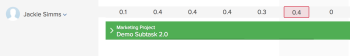

# 예약 영역에서 사용자 할당 관리

>[!IMPORTANT]
>  
>이 문서에 설명된 예약 기능은 2023년 1월 23.1 릴리스부터 Adobe Workfront에서 더 이상 사용되지 않고 제거됩니다.   
>  
>  이 문서는 2023년 초에 23.1 릴리스 직후 제거됩니다. 지금은 이에 따라 책갈피를 업데이트하는 것이 좋습니다. 
> 
> 이제 작업 로드 밸런서를 사용하여 자원에 대한 작업 일정을 예약할 수 있습니다. 
>  
> 작업 로드 밸런서를 사용하여 리소스를 예약하는 방법에 대한 자세한 내용은 섹션을 참조하십시오 [작업 로드 밸런서](../../resource-mgmt/workload-balancer/workload-balancer.md). 

<!--  

>[!CAUTION] 
> 
> 
> The information in this article refers to the Adobe Workfront's Scheduling tools. The Scheduling areas have been removed from the Preview environment and will be removed from the Production environment in **January 2023**.   
>  Instead, you can schedule resources in the Workload Balancer.  
> 
>*  For information about scheduling resources using the Workload Balancer, see the section [The Workload Balancer](../../resource-mgmt/workload-balancer/workload-balancer.md). 
> 
>*  For more information about the deprecation and removal of the Scheduling tools, see [Deprecation of Resource Scheduling tools in Adobe Workfront](../../resource-mgmt/resource-mgmt-overview/deprecate-resource-scheduling.md). 

-->

사용자 할당은 사용자가 작업 항목을 완료하기 위해 주어진 날에 보내야 하는 시간을 나타내는 시간(시)의 금액입니다. 작업 항목의 계획 시간에 포함됩니다.

이 문서에서는 리소스 예약 영역을 사용하여 작업 또는 문제에 할당된 사용자에 대한 일별 시간별 할당을 업데이트하는 방법에 대해 설명합니다. 사용자에 대한 전체 할당 및 작업에 대한 작업 역할을 관리하는 방법에 대한 자세한 내용은 [작업에 대한 사용자 및 역할 할당 시간 관리](../../manage-work/tasks/assign-tasks/manage-allocation-hours-on-tasks.md). 문제에 대한 사용자 및 작업 역할에 대한 전체 할당을 업데이트할 수 없습니다.

Adobe Workfront의 다음 영역에 사용자 할당을 표시할 수 있습니다.

* 리소스 영역의 예약 섹션에서
* 프로젝트의 예약 섹션에서(단일 프로젝트에 대한 리소스를 예약할 때)
* 팀의 예약 섹션에서(팀을 위한 리소스를 예약할 때)

## 액세스 요구 사항

다음 항목이 있어야 합니다.

<table style="table-layout:auto"> 
 <col> 
 <col> 
 <tbody> 
  <tr> 
   <td role="rowheader">Adobe Workfront 플랜*</td> 
   <td> 
모든
 </td> 
  </tr> 
  <tr> 
   <td role="rowheader">Adobe Workfront 라이선스*</td> 
   <td> 
작업 이상
 </td> 
  </tr> 
  <tr> 
   <td role="rowheader">액세스 수준*</td> 
   <td> 
프로젝트, 작업 및 문제에 대한 보기 이상의 액세스 권한
 
<b>메모</b>

여전히 액세스 권한이 없는 경우 Workfront 관리자에게 액세스 수준에서 추가 제한 사항을 설정하는지 문의하십시오. Workfront 관리자가 액세스 수준을 변경하는 방법에 대한 자세한 내용은 <a href="../../administration-and-setup/add-users/configure-and-grant-access/create-modify-access-levels.md" class="MCXref xref">사용자 정의 액세스 수준 만들기 또는 수정</a>.
 </td>
</tr> 
  <tr> 
   <td role="rowheader">개체 권한</td> 
   <td> 
프로젝트, 작업 및 문제에 대한 권한 기여
 
추가 액세스 요청에 대한 자세한 내용은 <a href="../../workfront-basics/grant-and-request-access-to-objects/request-access.md" class="MCXref xref">개체에 대한 액세스 요청 </a>.
 </td> 
  </tr> 
 </tbody> 
</table>

*보유하고 있는 플랜, 라이선스 유형 또는 액세스를 알아보려면 Workfront 관리자에게 문의하십시오.

## 예약 영역에서 사용자 할당

이 문서에 설명된 대로 사용자에게 시간을 할당하기 전에 의 설명에 따라 Workfront에서 리소스 예약이 작동하는 방식을 숙지하십시오 [리소스 예약 시작](../../resource-mgmt/resource-scheduling/get-started-resource-scheduling.md).

사용자가 속해 있는 개별 팀의 작업 및 문제, 사용자가 프로젝트 팀의 멤버인 개별 프로젝트 또는 리소스 관리자가 있는 여러 프로젝트에 대해 작업할 수 있도록 리소스를 예약할 수 있습니다.

다음 섹션에서는 Workfront에서 사용자 할당을 활성화하고 관리하는 방법을 설명합니다.

* [작업 할당을 하려면 예약 영역을 사용합니다](#use-the-scheduling-areas-to-assign-work)
* [작업 편집 또는 문제 편집 상자에 설정된 할당과 예약 영역에서 설정된 할당과](#allocations-set-on-the-edit-task-or-the-edit-issue-boxes-vs-in-the-scheduling-areas)
* [할당 지표](#allocation-indicators)
* [계획 시간 기본 할당](#default-allocation-for-planned-hours)
* [누가 할당을 보고 수정할 수 있습니까?](#who-can-view-and-modify-allocations)
* [예약 영역의 시간대 고려 사항](#time-zone-considerations-in-the-scheduling-areas)

### 작업 할당을 하려면 예약 영역을 사용합니다 {#use-the-scheduling-areas-to-assign-work}

예약 타임라인에서 새 작업을 사용자에게 할당할 때 작업이나 문제에 대한 계획 시간이 사용자에게 어떻게 할당되는지 확인할 수 있습니다.\
계획된 시간에 대한 자세한 내용은 [계획 시간 개요](../../manage-work/tasks/task-information/planned-hours.md).

계획 시간은 다음과 같은 방법으로 나눌 수 있습니다.

* 작업 또는 문제에 지정된 사용자 중
* 작업 또는 문제 기간 동안\
   예를 들어 영업 관련 작업을 하려면 작업 기간이 끝날 때까지 더 많은 작업이 필요할 수 있습니다. 이 불규칙한 시간 분포를 작업에 계획할 수 있습니다.

>[!TIP]
>
>예약 영역에서 여러 프로젝트에 대한 리소스를 예약할 때 모든 사용자와 작업 항목이 예약 타임라인에 표시되는 것은 아닙니다. 예약 타임라인에 표시되는 정보에 대한 자세한 내용은 [리소스 예약 시작](../../resource-mgmt/resource-scheduling/get-started-resource-scheduling.md).

### 작업 편집 또는 문제 편집 상자에 설정된 할당과 예약 영역에서 설정된 할당과 {#allocations-set-on-the-edit-task-or-the-edit-issue-boxes-vs-in-the-scheduling-areas}

Workfront 내의 다음 위치에서 작업 또는 문제에 대한 사용자 할당을 수정할 수 있습니다.

* 예약 타임라인\
   예약 타임라인은 다음 영역에 있습니다.

   * 리소스 영역의 예약 섹션에서
   * 프로젝트의 예약 섹션에서(단일 프로젝트에 대한 리소스를 예약할 때)
   * 팀의 예약 섹션에서(팀을 위한 리소스를 예약할 때)

   다음에 설명된 대로 예약 타임라인에서 사용자 할당을 수정하는 경우 [사용자 할당 수정](#modify-user-allocations) 섹션에서 작업 또는 문제의 각 사용자에 대한 할당은 물론 작업 또는 문제 기간 내의 각 날에 대한 할당은 정의할 수 있습니다.\
   

* 작업 편집 또는 문제 편집 대화 상자\
   작업 또는 문제 편집 대화 상자에서 사용자 할당을 수정하는 경우(에 설명된 대로) [작업에 대한 사용자 또는 역할 할당 비율 관리](../../manage-work/tasks/assign-tasks/manage-allocation-percentage-on-tasks.md)), 각 사용자에 대해 작업 또는 문제에 대한 할당을 전체적으로 정의할 수 있습니다. 일일 기준으로 이러한 할당을 관리하려면, [사용자 할당 수정](#modify-user-allocations) 섹션에 자세히 설명되어 있습니다.

   >[!IMPORTANT]
   >
   >작업 편집 또는 문제 대화 상자에서 사용자 할당을 수정할 때 예약 타임라인에서 이전에 구성한 할당을 덮어씁니다. 또한 예약 타임라인에서 할당을 변경한 내용은 작업 편집 또는 문제 편집 대화 상자에 반영되지 않습니다.

다음 이점을 활용하려면 작업 편집 또는 문제가 아닌 예약 타임라인에서 사용자 할당을 관리하는 것이 좋습니다.

* 다음에 설명된 대로 사용자가 할당 지표를 사용하여 초과 할당되는 시기를 명확히 확인할 수 있습니다. [할당 지표](#allocation-indicators) 섹션을 참조하십시오.
* 한 사용자에 대해 다른 사용자를 위해 더 많은 시간을 할당할 수 있습니다.\
   할당 표시기는 [할당 지표](#allocation-indicators) 섹션을 참조하십시오.

* 하루 동안 다른 날에 일을 위해 더 많은 시간을 할당할 수 있습니다.\
   할당 표시기는 다음에 설명된 대로 할당된 사용자가 지정된 날에 어떻게 있는지를 시각적으로 보여줍니다. [할당 지표](#allocation-indicators).

* 예약 타임라인에서 모든 자원 관리 책임을 한 곳에서 수행할 수 있습니다.

### 할당 지표 {#allocation-indicators}

다양한 시각적 지표를 사용하여 특정 날짜에 작업을 수행하도록 사용자가 할당된 수준에 대한 빠른 정보를 제공할 수 있습니다.

시스템 관리자는 Workfront이 시스템 수준에서 사용자 가용성을 계산하는 방법을 결정합니다(시간 및 FTE 가용성을 고려). 이 시스템 전체 설정에 따라 기본 예약이나 사용자의 일정을 사용하여 사용자 가용성을 계산합니다. 자세한 내용은 [Workfront에서 예약 영역에 대한 리소스 시간 및 FTE 가용성을 계산하는 방법을 구성합니다](../../resource-mgmt/resource-scheduling/calculate-hours-fte-scheduling-area.md).

* **할당 음영**
할당은 사용자에게 할당된 작업에 음영처리 형태로 시각적으로 표시됩니다. 어두운 음영은 지정된 날에 할당된 사용자의 FTE(Full Time Equivalent)의 백분율로 할당된 시간을 나타냅니다. (Workfront에서 FTE를 구성하는 방법에 대한 자세한 내용은 [Workfront에서 예약 영역에 대한 리소스 시간 및 FTE 가용성을 계산하는 방법을 구성합니다](../../resource-mgmt/resource-scheduling/calculate-hours-fte-scheduling-area.md))\
   예를 들어, 하나의 사용자가 4개의 계획 시간과 1일의 기간을 가진 작업에 할당됩니다. 사용자에 대한 FTE는 시스템에 1로 정의됩니다. 즉, 사용자가 상근으로 근무하도록 예약되어 있거나 일주일에 40시간 또는 하루에 8시간 근무하도록 되어 있습니다. 지정된 날짜의 작업에 대한 음영은 작업의 수직 공간의 절반을 차지하며, 이는 사용자가 해당 날짜의 FTE(4시간)의 절반을 할당했음을 나타냅니다.\
   \
   작업 또는 문제는 작업 항목에 할당된 모든 사용자에 대한 누적 할당을 표시합니다. 작업 항목을 확장하여 작업 항목에 지정된 사용자 및 각 사용자에게 할당된 시간 등 자세한 내용을 볼 수 있습니다.\
   음영은 **지정되지 않음** 예약 타임라인의 영역.\
   

* **각 사용자에 대한 각 날의 일별 합계:** 매일 주어진 사용자에게 할당된 총 계획 시간을 표시할 수 있습니다. 이 정보는 예약 타임라인의 각 사용자 행 맨 위에 표시됩니다. 이 정보는 기본적으로 표시되지 않습니다. 에 설명된 대로 이 기능을 활성화할 수 있습니다. [사용자 할당 활성화](#enable-user-allocations). 일별 총계를 결정할 때 다음 상태 중 하나가 있는 프로젝트의 작업이 포함됩니다. 현재, 계획 또는 승인됨.\
   

* **중복 할당 지표**
특정 일에 사용자에게 할당된 총 계획 시간 수가 하루(모든 작업에 걸쳐) 사용자가 작업하는 시간을 초과하는 경우 해당 사용자는 해당 일에 초과 할당된 것으로 간주됩니다.\
   사용자가 너무 많이 할당되면 빨간색 막대가 표시되며, 빨간색 막대는 각 작업의 개요를 나타냅니다.\
   사용자의 초과 할당을 결정할 때 다음 상태가 있는 프로젝트의 작업이 포함됩니다. 현재, 계획 또는 승인됨.\
   사용자가 하루에 작업하는 시간(시간)은 다음 참조 설명에 따라 각 사용자 프로필의 FTE 필드를 통해 정의됩니다 [Workfront에서 예약 영역에 대한 리소스 시간 및 FTE 가용성을 계산하는 방법을 구성합니다](../../resource-mgmt/resource-scheduling/calculate-hours-fte-scheduling-area.md).\
   \
   를 활성화하면 **일별 계획 시간 합계 표시** 그리고 **리소스 할당 강조 표시** 설정에 있는 옵션에서는 사용자가 너무 많이 할당되면 계획된 일별 총 시간 수가 빨간색으로 표시됩니다. 시간은 기본적으로 가장 가까운 10분(예: 1.3)으로 표시됩니다.\
   

### 계획 시간 기본 할당 {#default-allocation-for-planned-hours}

Workfront은 지정된 사용자 및 일수 간에 다음과 같이 계획 시간을 배포하려고 합니다.

* 여러 사용자가 작업 또는 문제에 할당되면 시간이 사용자 간에 균등하게 분할됩니다.\
   분배에는 작업에 이미 수행된 모든 고급 할당이 반영됩니다.\
   고급 지정에 대한 자세한 내용은 [고급 할당 만들기](../../manage-work/tasks/assign-tasks/create-advanced-assignments.md).

* 작업 또는 문제의 기간(기간)이 여러 날에 걸쳐 있을 경우, 계획 시간은 사용자 스케줄에 따라, 그리고 작업에 할당된 모든 사용자 간에 균등하게 분배됩니다.
* 작업의 계획 시간이 여러 일에 걸쳐 있을 경우 다른 시간대의 작업을 보는 사용자는 작업 기간 또는 계획 시작 날짜 또는 계획 완료 날짜의 차이를 볼 수 있습니다.

시간은 기본적으로 가장 가까운 100분의 1로 표시됩니다(예: 1.33). 더 자세히 보려면 오른쪽으로 스크롤할 수 있습니다.\

### 누가 할당을 보고 수정할 수 있습니까? {#who-can-view-and-modify-allocations}

다음 유형의 사용자는 Workfront에서 사용자 할당을 보거나 수정할 수 있습니다.

* **리소스 관리자:** 리소스 관리자가 있는 프로젝트의 작업 및 문제에 대한 사용자 할당을 보고 수정할 수 있습니다. 사람 영역의 예약 타임라인이나 프로젝트의 스태핑 탭에서 이 작업을 수행할 수 있습니다.\
   리소스 관리자가 프로젝트 전체의 작업 및 문제를 변경할 수 있는 방법에 대한 자세한 내용은 [예약 영역에서 지정되지 않은 작업 및 문제를 수동으로 지정](../../resource-mgmt/resource-scheduling/manually-assign-items-scheduling-areas.md).

* **계획 및 작업 사용자:** 구성원인 팀에서 새 내 작업 달력 또는 작업 중 달력을 사용하여 지정한 작업 및 문제에 대한 할당을 볼 수 있습니다.\
   할당 보기 외에 작업 및 문제에 대한 Contribute 액세스 권한이 있는 경우 할당을 수정할 수 있습니다.

   <!--
  <MadCap:conditionalText data-mc-conditions="QuicksilverOrClassic.Draft mode">
  (NOTE: Article is conditioned to classic.)
  </MadCap:conditionalText>
  -->

### 예약 영역의 시간대 고려 사항  {#time-zone-considerations-in-the-scheduling-areas}

드문 경우 예약 타임라인을 보는 사용자는 작업의 계획 시간이 개별 요일의 총 할당된 시간과 같지 않은 일치하지 않을 수 있습니다. 이 문제는 한 사용자의 운영 체제 표준 시간대 설정이 계획 시작 일자 또는 계획 완료 일자가 다른 사용자와 다른 경우 발생할 수 있습니다.

예를 들어, 작업의 계획 완료 일자가 11/3/18에서 오전 11시로 설정된 경우, MST에서 작업을 보는 오스트레일리아 사용자는 11/4/18의 계획 완료 일자를 오전 1시로 볼 수 있습니다. 호주의 사용자가 11/4/18에 시간을 할당하는 경우, 이러한 할당된 시간은 MST에서 사용자에게 표시되지 않습니다. 하지만 이 시간은 항상 프로젝트의 계획 시간에 대해 고려됩니다.

## 사용자 할당 활성화 {#enable-user-allocations}

예약 타임라인에서 사용자 할당 기능은 기본적으로 비활성화됩니다. 이 섹션에 설명된 사용자 할당 기능을 사용하려면 먼저 해당 기능을 활성화해야 합니다.

>[!NOTE]
>
>예약 타임라인이 계획 일자를 사용하도록 구성된 경우에만 사용자 할당을 활성화할 수 있습니다. 예약 타임라인이 예상 날짜를 사용하도록 구성된 경우 사용자 할당을 표시할 수 없습니다. 계획 또는 예상 날짜를 사용하도록 예약 타임라인을 구성하는 방법에 대한 자세한 내용은 의 &quot;예약 타임라인에 표시할 예상 날짜 구성&quot;을 참조하십시오. [예약 영역에서 설정을 구성합니다](../../resource-mgmt/resource-scheduling/configure-settings-scheduling-areas.md).

예약 타임라인에서 사용자 할당을 사용하려면

1. 여러 프로젝트, 개별 프로젝트 또는 팀의 예약 타임라인으로 이동합니다.

   * **여러 프로젝트의 경우**:  을(를) 클릭합니다. **기본 메뉴** 아이콘  Workfront의 오른쪽 위 모서리에서 **리소스 > 작업 로드 밸런서**&#x200B;를 선택하고 을 선택합니다. **예약** 를 클릭합니다.
   * **개별 프로젝트의 경우**: 프로젝트로 이동하여 **작업 로드 밸런서** 왼쪽 패널의 섹션에서 을(를) 선택한 다음 **예약** 왼쪽 위 드롭다운 메뉴에서 을 선택합니다.
   * **팀**: 을(를) 클릭합니다. **기본 메뉴** 아이콘  Workfront의 오른쪽 위 모서리에서 을(를) 클릭하고 **팀**&#x200B;를 클릭하고, 팀을 선택하고&#x200B;**작업 로드 밸런서** 왼쪽 패널에서 를 선택하고&#x200B;**예약** 왼쪽 위 드롭다운 메뉴에서 을 선택합니다.

   

1. 을(를) 클릭합니다. **설정** 아이콘을 클릭합니다.\
   \
   리소스 예약 설정 대화 상자가 표시됩니다.\
   

1. 예약 타임라인에 사용자 할당을 표시하려면 다음 옵션 중 하나 또는 둘 다 활성화합니다.

   <table style="table-layout:auto"> 
    <col> 
    <col> 
    <tbody> 
     <tr> 
      <td role="rowheader">리소스 할당 강조 보기</td> 
      <td> 
예약 타임라인에 작업 및 문제에 대한 사용자 할당 음영을 표시합니다. 
 
이 옵션은 기본적으로 비활성화됩니다.
 </td> 
     </tr> 
     <tr> 
      <td role="rowheader">일별 계획된 시간의 합계 표시</td> 
      <td>예약 타임라인에서 각 날에 대해 각 사용자에게 할당된 총 계획 시간 수를 표시합니다. 계획 시간이 가장 가까운 10일로 표시됩니다(예: 1.3). 이 옵션은 기본적으로 비활성화됩니다.</td> 
     </tr> 
    </tbody> 
   </table>

1. (선택 사항)에서 **포함 문제** 섹션에서 예약 타임라인에 문제를 표시할지 여부를 선택합니다.\
   이 옵션은 기본적으로 비활성화됩니다.

1. 클릭 **예약으로 돌아가기**.\
   이제 사용자 할당이 예약 타임라인에 표시됩니다.\
   

## 사용자 할당 수정 {#modify-user-allocations}

작업 또는 문제에 대한 사용자 할당은 예약 타임라인이나 작업 편집 또는 문제 대화 상자에서 수정할 수 있습니다. 자세한 내용은 [작업 편집 또는 문제 편집 상자에 설정된 할당과 예약 영역에서 설정된 할당과](#allocations-set-on-the-edit-task-or-the-edit-issue-boxes-vs-in-the-scheduling-areas).

기본적으로 사용자는에 설명된 대로 할당자간 및 기간 중 일 간에 균등하게 작업 또는 문제에 할당됩니다. [계획 시간 기본 할당](#default-allocation-for-planned-hours).

예약 타임라인에서 작업 또는 문제에 대한 사용자 할당을 수정하려면 다음을 수행합니다.

1. 여러 프로젝트, 개별 프로젝트 또는 팀의 예약 타임라인으로 이동합니다.

   * **여러 프로젝트의 경우**:  을(를) 클릭합니다. **기본 메뉴** 아이콘  Workfront의 오른쪽 위 모서리에서 **리소스 > 작업 로드 밸런서**&#x200B;를 선택하고 을 선택합니다. **예약** 를 클릭합니다.
   * **개별 프로젝트의 경우**: 프로젝트로 이동하여 **작업 로드 밸런서** 왼쪽 패널의 섹션에서 을(를) 선택한 다음 **예약** 왼쪽 위 드롭다운 메뉴에서 을 선택합니다.
   * **팀**: 을(를) 클릭합니다. **기본 메뉴** 아이콘  Workfront의 오른쪽 위 모서리에서 을(를) 클릭하고 **팀**&#x200B;를 클릭하고, 팀을 선택하고&#x200B;**작업 로드 밸런서** 왼쪽 패널에서 를 선택하고&#x200B;**예약** 왼쪽 위 드롭다운 메뉴에서 을 선택합니다.

   

1. 다음에 설명된 대로 예약 타임라인에서 사용자 할당이 활성화되어 있는지 확인합니다. [사용자 할당 활성화](#enable-user-allocations) 섹션에 자세히 설명되어 있습니다.
1. 사용자 할당을 관리할 작업을 확장합니다.\
   기본적으로 계획 시간은 지정된 사용자와 작업 기간 일 간에 균등하게 분할됩니다. 주말에는 시간이 추가되지 않습니다(토요일 및 일요일). 자세한 내용은 [계획 시간 기본 할당](#default-allocation-for-planned-hours) 섹션에 자세히 설명되어 있습니다.

1. 지정된 날짜에 시간을 조정할 사용자의 필드를 클릭합니다.

   >[!NOTE]
   >
   >시간을 수정한 후 원래 분포를 유지 관리하려면 **취소**.

1. 조정된 시간 수를 지정합니다.
1. **저장**&#x200B;을 클릭합니다.\
   작업에 대한 총 시간(시간)이 원래 계획 시간(시간)과 같은 경우에만 변경 내용을 저장할 수 있습니다. 이 숫자는 **계획 시간** 필드의 필드를 지정합니다. 합계가 총 계획 시간 수와 같지 않으면 숫자가 빨간색으로 표시됩니다.\
   

## 사용자 할당을 재설정하는 기준

Workfront은 작업 또는 프로젝트에서 많은 작업이 발생할 때 예약 타임라인에서 수동으로 편집하는 사용자 할당을 재설정합니다. 일반적으로 Workfront은 이 프로세스에서 작업 및 문제에 대한 계획 시간 수가 변경된 경우 프로젝트의 타임라인이 다시 계산될 때마다 사용자 할당을 재설정합니다.\
프로젝트의 타임라인 재계산에 대한 자세한 내용은 [프로젝트 타임라인 다시 계산](../../manage-work/projects/manage-projects/recalculate-project-timeline.md).

예약 타임라인에서 사용자 할당을 재설정할 수 있는 가장 일반적인 기준 중 일부는 다음과 같습니다.

* 반복에 작업 추가\
   반복에는 고정 날짜가 있으므로 작업 및 할당의 날짜가 재계산됩니다.\
   반복 작업이 작업 날짜에 미치는 영향에 대한 자세한 내용은 [기존 반복에 스토리 추가](../../agile/use-scrum-in-an-agile-team/iterations/add-stories-to-existing-iteration.md).

* 작업의 기간 유형을 작업량 제어으로 변경합니다.
* 2명 이상이 지정된 경우 작업의 기간 유형을 계산된 지정으로 변경합니다.\
   작업 기간에 대한 자세한 내용은 [작업 기간 및 기간 유형 개요](../../manage-work/tasks/taskdurtn/task-duration-and-duration-type.md).

* 프로젝트 계획 시작 및 계획 완료 일자 변경\
   프로젝트 계획 날짜에 대한 자세한 내용은 [프로젝트 계획 시작 일자 개요](../../manage-work/projects/planning-a-project/project-planned-start-date.md) 및 [프로젝트 계획 완료 일자 설정](../../manage-work/projects/planning-a-project/project-planned-completion-date.md).

   계획 완료 날짜에 대한 작업에 대한 자세한 내용은 [작업 계획 완료 일자 개요](../../manage-work/tasks/task-information/task-planned-completion-date.md).

* 작업 제약 조건이 유연한 제약 조건인 경우 이전 작업의 날짜 변경\
   예를 들어, 가능한 한 빨리 또는 최대한 늦게.\
   작업 제한에 대한 자세한 내용은 [작업 제한 개요](../../manage-work/tasks/task-constraints/task-constraint-overview.md).

* 계획된 작업 시간 또는 문제 시간 변경

   Workfront의 계획 시간에 대한 자세한 내용은 [계획 시간 개요](../../manage-work/tasks/task-information/planned-hours.md).
