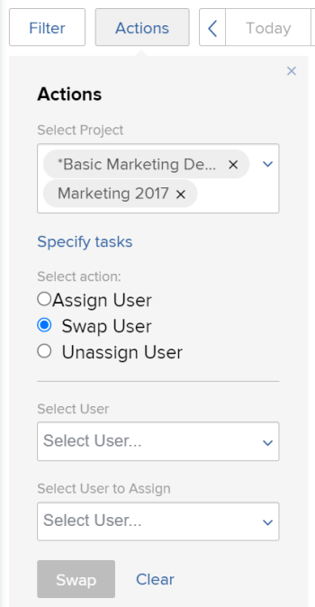
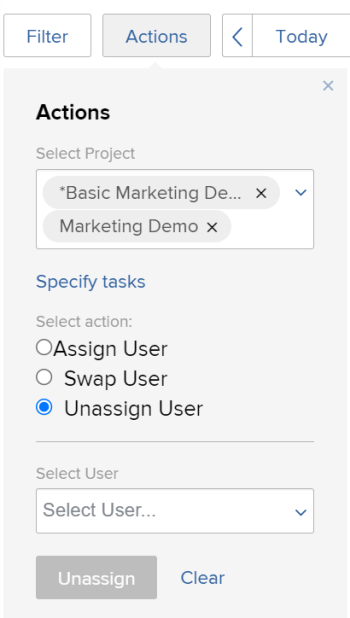

# 예약 영역에서 작업에 할당된 여러 사용자를 수정합니다

>[!IMPORTANT]
>  
>이 문서에 설명된 예약 기능은 2023년 1월 23.1 릴리스부터 Adobe Workfront에서 더 이상 사용되지 않고 제거됩니다.   
>  
>  이 문서는 2023년 초에 23.1 릴리스 직후 제거됩니다. 지금은 이에 따라 책갈피를 업데이트하는 것이 좋습니다. 
> 
> 이제 작업 로드 밸런서를 사용하여 자원에 대한 작업 일정을 예약할 수 있습니다. 
>  
> 작업 로드 밸런서를 사용하여 리소스를 예약하는 방법에 대한 자세한 내용은 섹션을 참조하십시오 [작업 로드 밸런서](../../resource-mgmt/workload-balancer/workload-balancer.md). 

<!--   

>[!CAUTION] 
> 
> 
> The information in this article refers to the Adobe Workfront's Scheduling tools. The Scheduling areas have been removed from the Preview environment and will be removed from the Production environment in **January 2023**.  
>  Instead, you can schedule resources in the Workload Balancer.  
> 
>*  For information about scheduling resources using the Workload Balancer, see the section [The Workload Balancer](../../resource-mgmt/workload-balancer/workload-balancer.md). 
> 
>*  For more information about the deprecation and removal of the Scheduling tools, see [Deprecation of Resource Scheduling tools in Adobe Workfront](../../resource-mgmt/resource-mgmt-overview/deprecate-resource-scheduling.md). 

This article refers to modifying user assignments for multiple tasks using the Scheduling area of Adobe Workfront. Also see the following articles for modifying assignments on multiple tasks in other areas:

* For information about modifying assignments on multiple tasks in a task list, see [Modify multiple user assignments in a task list](../../manage-work/tasks/assign-tasks/modify-multiple-assignments-in-task-list.md). 
* For information about scheduling resources using the new Workload Balancer, see the section [The Workload Balancer](../../resource-mgmt/workload-balancer/workload-balancer.md).
-->
리소스 스케줄러를 사용할 때 동시에 여러 작업에 사용자를 할당할 수 있습니다.

>[!NOTE]
>
>이 문서는 여러 프로젝트( 예약 섹션 )나 단일 프로젝트( 예약 섹션 )에 대한 리소스를 예약하는 경우에만 적용됩니다. 팀을 위한 리소스를 예약할 때 이 섹션에 설명된 대로 여러 작업에 대한 사용자 지정을 관리할 수 없습니다( 예약 섹션에서 ).

## 액세스 요구 사항

다음 항목이 있어야 합니다.

<table style="table-layout:auto"> 
 <col> 
 <col> 
 <tbody> 
  <tr> 
   <td role="rowheader">Adobe Workfront 플랜*</td> 
   <td> 
모든
 </td> 
  </tr> 
  <tr> 
   <td role="rowheader">Adobe Workfront 라이선스 개요*</td> 
   <td> 
작업 이상
 </td> 
  </tr> 
  <tr> 
   <td role="rowheader">액세스 수준*</td> 
   <td> 
프로젝트, 작업 및 문제에 대한 보기 이상의 액세스 권한
 
<b>참고</b> 여전히 액세스 권한이 없는 경우 Workfront 관리자에게 액세스 수준에서 추가 제한 사항을 설정하는지 문의하십시오. Workfront 관리자가 액세스 수준을 변경하는 방법에 대한 자세한 내용은 <a href="../../administration-and-setup/add-users/configure-and-grant-access/create-modify-access-levels.md" class="MCXref xref">사용자 정의 액세스 수준 만들기 또는 수정</a>.
 </td> 
  </tr> 
  <tr> 
   <td role="rowheader">개체 권한</td> 
   <td> 
프로젝트, 작업 및 업데이트 문제에 대한 권한 이상을 제공할 수 있습니다
 
추가 액세스 요청에 대한 자세한 내용은 <a href="../../workfront-basics/grant-and-request-access-to-objects/request-access.md" class="MCXref xref">개체에 대한 액세스 요청 </a>.
 </td> 
  </tr> 
 </tbody> 
</table>

*보유하고 있는 플랜, 라이선스 유형 또는 액세스를 알아보려면 Workfront 관리자에게 문의하십시오.

## 예약 영역에서 복수 지정을 위한 고려 사항

하나 이상의 프로젝트에서 여러 작업 및 문제에 대한 사용자 지정을 빠르게 관리할 수 있습니다(그런 다음 변경 사항이 예약 타임라인에 반영됨).

현재 작업 역할에 지정된 모든 작업에 사용자를 할당하거나, 사용자 간에 사용자 할당을 바꾸거나, 모든 작업에서 사용자 할당을 취소할 수 있습니다.

For example:

* 리소스 관리자는 새 프로젝트에 대한 사용자 지정을 담당합니다. 프로젝트는 원래 템플릿으로 만들어졌고 작업 역할은 프로젝트 내의 다양한 작업에 이미 할당됩니다. 리소스 관리자는 현재 작업 역할에 할당된 모든 작업에 특정 사용자를 할당하려고 합니다.
* 재키 심즈에게 3개의 다른 프로젝트에서 45개의 작업이 할당됩니다. 재키가 조직을 떠나 이제 자원 관리자는 자신의 업무를 다른 사용자에게 재할당해야 합니다.

>[!NOTE]
>
>여러 작업에 대한 사용자 지정을 관리할 때에는 다음 제한 사항을 고려하십시오.
>
>* 여러 프로젝트에 대한 리소스를 예약할 때 관리 중인 프로젝트는 다음 상태(또는 이러한 상태 중 하나와 일치하는 상태) 중 하나여야 합니다. 계획, 현재 또는 승인됨. 프로젝트 상태에 대한 자세한 내용은 [상태 만들기 또는 편집](../../administration-and-setup/customize-workfront/creating-custom-status-and-priority-labels/create-or-edit-a-status.md).
>* 단일 프로젝트에 대한 리소스를 예약할 때 프로젝트 상태는 이 기능의 가용성에 영향을 주지 않습니다.
>* 다음 라이선스를 사용하는 사용자를 위해 리소스 변경을 수행할 수 있습니다. 계획, 작업 및 검토. 요청 라이선스가 있는 사용자에 대해서는 리소스 변경 작업을 수행할 수 없습니다.
>

## 하나 이상의 프로젝트에 대한 사용자 지정 관리

1. 여러 프로젝트 또는 개별 프로젝트의 예약 타임라인으로 이동합니다.

   * **여러 프로젝트의 경우**:  을(를) 클릭합니다. **기본 메뉴** 아이콘  Workfront의 오른쪽 위 모서리에서 **리소스 > 작업 로드 밸런서**&#x200B;를 선택하고 을 선택합니다. **예약** 를 클릭합니다.
   * **개별 프로젝트의 경우**: 프로젝트로 이동하여 **작업 로드 밸런서** 왼쪽 패널의 섹션에서 을(를) 선택한 다음 **예약** 왼쪽 위 드롭다운 메뉴에서 을 선택합니다.

1. 클릭 **작업**.\
   

1. 에서 **프로젝트 선택** 필드(예약 탭에서 여러 프로젝트에 대한 예약 타임라인을 보고 있는지 또는 개별 프로젝트(스태핑 탭에서)에 대해 보고 있는지에 따라 다음 중 하나를 수행합니다.

   * **여러 프로젝트의 경우:** 할당을 변경할 프로젝트의 이름을 입력한 다음 드롭다운 목록에 표시되면 이름을 클릭합니다. 또는 드롭다운 화살표를 클릭하여 프로젝트 목록에서 선택합니다. 이 프로세스를 반복하여 여러 프로젝트에서 지정을 변경합니다.\
      자원 관리자인 모든 프로젝트에 대해 지정을 변경하려면 이 필드를 비워 둡니다.

      >[!NOTE]
      >
      >다음 경우에만 프로젝트를 선택할 수 있습니다.
      >
      >   
      >   
      >   * 프로젝트에서 리소스 관리자로 지정됩니다.\
         >     자세한 내용은 [프로젝트 또는 템플릿에 대한 자원 관리자 지정](../../manage-work/projects/planning-a-project/designate-resource-managers-for-projects-and-templates.md).
      >   
      >   * 프로젝트는 다음 상태 중 하나(또는 이러한 상태 중 하나와 동일한 상태)입니다. 계획, 현재 또는 승인됨\
         >     프로젝트 상태에 대한 자세한 내용은 [상태 만들기 또는 편집](../../administration-and-setup/customize-workfront/creating-custom-status-and-priority-labels/create-or-edit-a-status.md).
      >   
      >   * 계획 라이센스가 있는 사용자입니다.

   * **개별 프로젝트의 경우:** 다음 **프로젝트 선택** 필드를 수정할 수 없습니다. 다음 **프로젝트 선택** 필드에는 항상 보고 있는 프로젝트의 이름이 포함됩니다.

1. (선택 사항) **작업 지정** 개별 작업에 대한 발령 변경을 수정하려면 개별 작업을 지정하면, **프로젝트 선택** 필드는 무시됩니다.\
   에서 **작업 선택** 필드에서 할당을 변경할 작업의 이름을 입력합니다. 추가 작업에 대해 할당을 변경하려면 이 단계를 반복합니다.\
   이 필드를 비워 두면 3단계에서 선택한 프로젝트 내의 모든 작업이 영향을 받습니다.\
   개별 작업에 대해 지정을 변경하면 지정한 작업의 모든 하위 작업에 변경 사항이 적용됩니다. 다음에 설명된 대로 예약 타임라인에 문제가 표시되도록 구성한 경우 작업과 관련된 모든 문제에 변경 사항이 적용됩니다. [다양한 설정을 구성하여 예약 타임라인에 표시되는 정보와 방법을 사용자 정의할 수 있습니다.](../../resource-mgmt/resource-scheduling/configure-settings-scheduling-areas.md#configuring-issues-to-display-on-the-scheduling-timeline) in [예약 영역에서 설정을 구성합니다](../../resource-mgmt/resource-scheduling/configure-settings-scheduling-areas.md).

1. 다음 섹션을 계속 진행합니다.

   * [사용자 할당](#assign-a-user)
   * [사용자 교체](#swap-a-user)
   * [사용자 할당 취소](#unassign-a-user)

### 사용자 할당 {#assign-a-user}

선택한 프로젝트 내에서 현재 특정 역할에 지정된 모든 작업에 사용자를 할당할 수 있습니다.

이러한 방식으로 사용자를 할당하면 사용자에게 다음 유형의 작업이 할당되지 않습니다.

* 사용자에게 이미 할당된 작업에 대한 할당
* 완료된 작업

선택한 프로젝트 또는 작업 전체에서 작업에 사용자를 할당하려면

1. 선택 **사용자 할당** 에서 **작업 선택** 섹션을 참조하십시오.\
   

1. 에서 **역할 선택** 필드에서 드롭다운 화살표를 클릭하여 역할 목록에서 선택합니다. 지정한 프로젝트 내의 작업에 현재 지정된 역할만 표시됩니다.\
   사용자를 할당하면 사용자가 여기에서 선택하는 역할을 대체합니다.

1. 에서 **할당할 사용자 선택** 필드에서 드롭다운 화살표를 클릭하여 사용자 목록에서 선택합니다.\
   만약 **일치하는 역할을 가진 사용자에게 지정 제한** 옵션이 설정 영역에서 활성화되어 있으면 사용자는 사용자 설정(기본 역할이나 기타 역할로)에서 선택된 역할이 할당된 경우에만 선택할 수 있습니다. 이 옵션을 비활성화하면 시스템에 일치하는 역할이 정의되어 있지 않더라도 할당하려는 다른 사용자의 이름을 입력할 수 있습니다. 이 옵션은 기본적으로 활성화되어 있습니다.\
   이 옵션에 대한 자세한 내용은 [예약 영역에서 역할 및 그룹 구성원에 관계없이 사용자 지정 허용](../../resource-mgmt/resource-scheduling/assignments-regardless-of-role-or-group-scheduling-areas.md). 기본적으로 할당되는 작업은 작업의 역할 할당이나 문제와 일치하는 사용자 프로필에 정의된 역할이 있는 사용자만 지정할 수 있습니다.

1. 클릭 **지정**.\
   단일 작업으로 최대 1,000개의 할당을 수행할 수 있습니다. 선택한 항목이 1,000개 이상의 할당 변경을 수행하는 경우 선택 사항을 다시 조정하고 다시 시도하십시오.

### 사용자 교체 {#swap-a-user}

사용자의 작업 지정을 선택한 프로젝트 또는 선택한 작업에 대해 다른 사용자의 작업 지정과 교환할 수 있습니다.

이 섹션에 설명된 대로 사용자의 작업 지정을 교체하면 이미 완료 로 표시된 모든 할당은 교체되지 않습니다.

사용자의 태스크 지정을 다른 사용자의 태스크 지정과 교체하려면

1. 선택 **사용자 교체** 에서 **작업 선택** 섹션을 참조하십시오.\
   

1. 에서 **사용자 선택** 필드에서 드롭다운 화살표를 클릭하여 사용자 목록에서 선택하거나 교체하려는 사용자의 이름을 입력한 다음 드롭다운 목록에 표시될 이름을 클릭합니다.\
   지정된 프로젝트 내에서 하나 이상의 불완전한 작업에 사용자가 지정되는 경우에만 표시됩니다.

1. (조건부) **역할 선택** 선택한 사용자가 역할이 다른 여러 작업에 할당될 때만 필드가 표시됩니다. 사용자에 대한 작업에 설정된 작업 역할을 보려면 **할당자의 역할** 다음에 설명된 대로 작업의 고급 할당 대화 상자에 있는 열 [고급 할당 만들기](../../manage-work/tasks/assign-tasks/create-advanced-assignments.md)).\
   에서 **역할 선택** 필드에서 역할을 선택하여 교환하려는 작업 유형을 결정합니다. 이 역할을 사용하여 사용자가 할당되는 작업만 새 사용자에게 할당됩니다.\
   예를 들어 프로젝트에서 5개의 작업에 Hanna Marin이 할당됩니다. 작업 중 2개 작업에서는 Job 역할이 &quot;엔지니어&quot;로 정의됩니다. 나머지 세 가지 업무 중 그녀의 직무 역할은 &quot;디자이너&quot;로 정의됩니다. 역할 선택 필드에서 디자이너를 선택하는 경우 Job 역할이 &quot;디자이너&quot;로 정의된 Hanna의 3개 작업 모두에 대한 지정을 변경하려고 함을 의미합니다. Job 역할이 &quot;엔지니어&quot;로 정의된 두 가지 작업은 변경되지 않습니다.\
   

1. 에서 **할당할 사용자 선택** 필드에서 드롭다운 화살표를 클릭하여 사용자 목록에서 선택합니다. 사용자는 자신의 역할(사용자 설정에 정의된 대로)이 대체되는 사용자에게 할당된 작업의 역할과 일치하는 경우에만 할당할 수 있습니다.\
   만약 **일치하는 역할을 가진 사용자에게 지정 제한** 옵션이 설정 영역에서 활성화되어 있으면 사용자의 역할(사용자 설정에 정의된 대로)이 대체되는 사용자에게 할당된 작업의 역할과 일치하는 경우에만 사용자가 할당할 수 있습니다. 이 옵션을 비활성화하면 시스템에 일치하는 역할이 정의되어 있지 않더라도 할당하려는 다른 사용자의 이름을 입력할 수 있습니다. 이 옵션은 기본적으로 활성화되어 있습니다.\
   이 옵션에 대한 자세한 내용은 [예약 영역에서 역할 및 그룹 구성원에 관계없이 사용자 지정 허용](../../resource-mgmt/resource-scheduling/assignments-regardless-of-role-or-group-scheduling-areas.md). 기본적으로 할당되는 작업은 작업의 역할 할당이나 문제와 일치하는 사용자 프로필에 정의된 역할이 있는 사용자만 지정할 수 있습니다.\
   바꾸려는 사용자가 선택한 프로젝트의 작업에 대해 여러 역할에 할당되어 있는 경우, **역할 선택** 필드, **할당할 사용자 선택** 필드에는 지정된 역할을 모두 가진 사용자만 표시됩니다.

1. 클릭 **교체**.\
   단일 작업으로 최대 1,000개의 할당을 수행할 수 있습니다. 선택한 항목이 1,000개 이상의 할당 변경을 수행하는 경우 선택 사항을 다시 조정하고 다시 시도하십시오.

### 사용자 할당 취소 {#unassign-a-user}

선택한 프로젝트 또는 선택한 작업에 대해 사용자에게 할당된 모든 작업에서 사용자 할당을 취소할 수 있습니다. 사용자 할당을 취소하면 해당 사용자에게 할당된 모든 작업은 사용자가 할당되기 전에 할당 상태로 돌아갑니다.

사용자에게 시스템에 정의된 기본 역할이 있고 사용자 할당을 취소하면 사용자 할당을 취소할 때 해당 작업이 자동으로 사용자의 기본 역할에 할당됩니다. 또는 사용자가 할당되기 전에 할당된 역할에 할당됩니다.

시스템에 정의된 기본 역할이 없고 사용자의 할당을 취소하면 사용자 할당을 취소할 때 작업이 할당되지 않은 상태로 전환됩니다.

완료됨으로 표시된 작업은 할당을 취소할 수 없습니다.

선택한 프로젝트 전체 작업 또는 선택한 작업에 대해 사용자 할당을 취소하려면

1. 선택 **사용자 할당 취소** 에서 **작업 선택** 섹션을 참조하십시오.\
   

1. 에서 **사용자 선택** 필드에서 드롭다운 화살표를 클릭하여 사용자 목록에서 선택하거나 할당을 취소할 사용자의 이름을 입력한 다음 드롭다운 목록에 표시될 때 이름을 클릭합니다. 한 번에 한 명의 사용자만 할당을 취소할 수 있습니다.
1. (조건부) **역할 선택** 선택한 사용자가 역할이 다른 여러 작업에 할당될 때만 필드가 표시됩니다. 사용자에 대해 작업에 설정된 작업 역할을 보려면 **할당자의 역할** 다음에 설명된 대로 작업의 고급 할당 대화 상자에 있는 열 [고급 할당 만들기](../../manage-work/tasks/assign-tasks/create-advanced-assignments.md)).\
   에서 **역할 선택** 필드에서 역할을 선택하여 할당을 취소할 작업 유형을 결정합니다. 사용자가 이 역할에 할당되는 작업만 할당되지 않습니다.\
   예를 들어 프로젝트에서 5개의 작업에 Hanna Marin이 할당됩니다. 2개의 작업에서 그녀의 직무 역할은 엔지니어로 정의됩니다. 나머지 3개의 작업에서 그녀의 직무 역할은 디자이너로 정의됩니다. 역할 선택 필드에서 디자이너를 선택하는 경우, Job 역할이 Designer로 정의된 3개의 모든 태스크에서 Hanna의 할당을 취소하려는 것입니다. 엔지니어로 정의된 두 가지 작업은 변경되지 않습니다.\
   

1. 클릭 **할당 취소**.\
   단일 작업으로 최대 1,000개의 할당을 수행할 수 있습니다. 선택한 항목이 1,000개 이상의 할당 변경을 수행하는 경우 선택 사항을 다시 조정하고 다시 시도하십시오.
