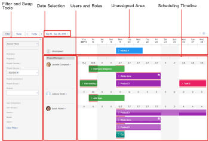

# 예약 영역 개요

>[!IMPORTANT]
>  
>이 문서에 설명된 예약 기능은 2023년 1월 23.1 릴리스부터 Adobe Workfront에서 더 이상 사용되지 않고 제거됩니다.   
>  
>  이 문서는 2023년 초에 23.1 릴리스 직후 제거됩니다. 지금은 이에 따라 책갈피를 업데이트하는 것이 좋습니다. 
> 
> 이제 작업 로드 밸런서를 사용하여 자원에 대한 작업 일정을 예약할 수 있습니다. 
>  
> 작업 로드 밸런서를 사용하여 리소스를 예약하는 방법에 대한 자세한 내용은 섹션을 참조하십시오 [작업 로드 밸런서](../../resource-mgmt/workload-balancer/workload-balancer.md). 

<!--  

>[!CAUTION] 
> 
> 
> The information in this article refers to the Adobe Workfront's Scheduling tools. The Scheduling areas have been removed from the Preview environment and will be removed from the Production environment in **January 2023**.  
>  Instead, you can schedule resources in the Workload Balancer.  
> 
>*  For information about scheduling resources using the Workload Balancer, see the section [The Workload Balancer](../../resource-mgmt/workload-balancer/workload-balancer.md). 
> 
>*  For more information about the deprecation and removal of the Scheduling tools, see [Deprecation of Resource Scheduling tools in Adobe Workfront](../../resource-mgmt/resource-mgmt-overview/deprecate-resource-scheduling.md). 

-->

다음 섹션에서는 Adobe Workfront 내에서 예약 영역에 액세스할 수 있는 위치와 예약 영역에서 사용할 수 있는 기능에 대해 설명합니다.

## 리소스를 예약할 수 있는 Workfront 영역

Workfront의 다음 영역에서 리소스를 예약할 수 있습니다.

* **리소스 관리자가 있는 모든 프로젝트에 대해** ( **예약** 영역) Workfront의 예약 영역을 사용하면 리소스 관리자가 여러 프로젝트에 자원을 할당할 수 있습니다.

* **프로젝트 팀의 구성원일 때 개별 프로젝트의 경우** ( **예약** 프로젝트 영역):

   프로젝트 내의 예약 영역을 사용하면 프로젝트 팀 구성원이 프로젝트 팀의 사용자에게 프로젝트의 작업을 할당할 수 있습니다.

* **개별 팀의 경우** ( **예약** 팀 내 일정 관리 섹션을 사용하면 팀 구성원이 여러 프로젝트에서 이미 팀에 할당된 작업을 개별 팀 구성원에게 할당할 수 있습니다.

## 예약 영역에서 사용 가능한 기능

예약 영역에는 작업 및 문제와 현재 리소스 할당이 표시됩니다.\

* [필터 및 교체 도구](#filter-and-swap-tools)
* [날짜 선택](#date-selection)
* [할당되지 않은 영역](#unassigned-area)
* [사용자 및 역할](#users-and-roles)
* [타임라인 예약](#scheduling-timeline)

### 필터 및 교체 도구 {#filter-and-swap-tools}

* **필터 도구:** 예약 타임라인에 표시되는 컨텐츠를 필터링할 수 있습니다. 필터 도구 사용에 대한 자세한 내용은 [예약 영역에서 정보를 필터링합니다.](../../resource-mgmt/resource-scheduling/filter-scheduling-area.md).
* **교체 도구:** (스케줄링 탭이나 스태핑 탭에서 프로젝트에 대한 자원을 스케줄링할 때만 사용 가능) 여러 프로젝트의 태스크에 사용자를 신속하게 지정, 교체 또는 할당 취소할 수 있습니다. 자세한 내용은 [예약 영역에서 지정되지 않은 작업 및 문제를 수동으로 지정](../../resource-mgmt/resource-scheduling/manually-assign-items-scheduling-areas.md).

### 날짜 선택 {#date-selection}

예약 타임라인에 데이터가 표시되는 날짜 범위를 조정할 수 있습니다. 기본적으로 날짜 범위는 현재 날짜부터 2주(14일 연속, 주말 포함)입니다.

### 할당되지 않은 영역 {#unassigned-area}

* [자원을 자원 관리자로 스케줄링할 때(스케줄링 영역에서 복수 프로젝트의 경우)](#when-scheduling-resources-as-the-resource-manager-for-multiple-projects-in-the-scheduling-area)
* [리소스를 프로젝트 팀(프로젝트에서)의 구성원으로 예약할 때](#when-scheduling-resources-as-a-member-of-the-project-team-from-a-project)
* [리소스를 팀 구성원으로 예약할 때(팀)](#when-scheduling-resources-as-a-team-member-from-a-team)

#### 자원을 자원 관리자로 스케줄링할 때(스케줄링 영역에서 복수 프로젝트의 경우) {#when-scheduling-resources-as-the-resource-manager-for-multiple-projects-in-the-scheduling-area}

다음 **지정되지 않음** 예약 타임라인의 영역에는 다음 기준을 모두 충족하는 작업과 문제만 표시됩니다.

* 사용자에게 할당되지 않았습니다.
* 팀에 할당되지 않았습니다.\
   작업이나 문제가 팀에 할당되면 여전히 **지정되지 않음** 작업 또는 문제가 팀 할당 외에 역할에 할당되는 경우 영역\
   작업 또는 문제에 사용자가 이행하지 않는 추가 작업 역할 할당이 있는 경우 해당 작업 역할도 표시됩니다.\
   예를 들어, 작업은 3개의 작업 역할에 할당됩니다. 디자이너, 제품 관리자 및 개발자. 이 작업은 디자이너 작업 역할이 있는 사용자 A와 제품 관리자 작업 역할이 있는 사용자 B에 할당합니다. 이 시나리오에서는 개발자 작업 역할이 사용자에게 할당되지 않았기 때문에 예약 타임라인의 [지정되지 않음] 영역에 작업이 계속 표시됩니다.

#### 리소스를 프로젝트 팀(프로젝트에서)의 구성원으로 예약할 때 {#when-scheduling-resources-as-a-member-of-the-project-team-from-a-project}

다음 **지정되지 않음** 예약 타임라인의 맨 위에 있는 영역에는 다음 기준을 충족하는 작업과 문제가 표시됩니다.

* 프로젝트와 연결되었지만 프로젝트 팀의 사용자에게 할당되지 않았습니다.\
   프로젝트와 연결되고 프로젝트 팀의 사용자에게 할당된 작업은 작업이 지정된 사용자 행에 표시됩니다.
* 프로젝트와 연결되었지만 프로젝트 팀이 아닌 구성원에게 할당되었습니다.

   <!--
  
(NOTE:&nbsp;[! Is it even possible to have the task assigned to a member who is not part of the project team? If so, then would this end up in the Unassigned area?])

  -->

#### **리소스를 팀 구성원으로 예약할 때(팀)** {#when-scheduling-resources-as-a-team-member-from-a-team}

다음 **지정되지 않음** 예약 타임라인의 맨 위에 있는 영역에는 다음 기준을 충족하는 작업과 문제가 표시됩니다.

* 팀에 할당되고 팀의 다른 사용자에게 지정되지 않습니다.\
   팀과 팀의 사용자에게 모두 할당된 작업은 작업이 지정된 사용자 행에 표시됩니다.
* 팀 및 팀 구성원이 아닌 사용자에게 둘 다 할당됩니다.

### 사용자 및 역할 {#users-and-roles}

* [자원을 자원 관리자로 스케줄링할 때(스케줄링 영역에서 복수 프로젝트의 경우)](#when-scheduling-resources-as-the-resource-manager-for-multiple-projects-in-the-scheduling-area)
* [리소스를 프로젝트 팀(프로젝트에서)의 구성원으로 예약할 때](#when-scheduling-resources-as-a-member-of-the-project-team-from-a-project)
* [리소스를 팀 구성원으로 예약할 때(팀)](#when-scheduling-resources-as-a-team-member-from-a-team)

#### 자원을 자원 관리자로 스케줄링할 때(스케줄링 영역에서 복수 프로젝트의 경우) {#when-scheduling-resources-as-the-resource-manager-for-multiple-projects-in-the-scheduling-area-1}

할당되지 않은 작업 중 하나를 할당할 수 있는 사용자는 **지정되지 않음** 영역. 예약 타임라인에서 다음 상황에서 작업이나 문제를 지정할 수 있습니다.

* 기본적으로 사용자는 시스템에 정의된 작업 역할(기본 작업 역할 또는 보조 작업 역할)이 있는 경우에만 예약 타임라인에 표시되며 해당 작업 역할은 작업에 할당된 작업 롤이나 현재 **지정되지 않음** 예약 타임라인의 영역. 해당 사용자에게 작업의 역할 할당이나 사용자에게 할당되는 문제와 일치하는 사용자 프로필에 정의된 역할이 있는지 여부에 관계없이 해당 사용자에게 작업 및 문제를 할당하도록 이 기능을 비활성화할 수 있습니다. 자세한 내용은 [예약 영역에서 역할 및 그룹 구성원에 관계없이 사용자 지정 허용](../../resource-mgmt/resource-scheduling/assignments-regardless-of-role-or-group-scheduling-areas.md).\
   사용자에게 Workfront 시스템에서 지정된 여러 작업 역할이 있는 경우 사용자 및 사용자의 지정된 작업이 예약 타임라인에 여러 번 표시될 수 있습니다.\
   사용자에게 작업 또는 문제가 할당되면, 일치하는 역할 할당이 있는 남은 작업 또는 문제가 없는 경우에도 예약 타임라인에 남아 있습니다. 이를 통해 할당된 후 필요한 사항을 변경할 수 있습니다.\
   작업이 작업 역할에 할당되지 않으면 필터 요구 사항을 충족하는 모든 사용자가 표시됩니다. 필터에 대한 자세한 내용은 [예약 영역에서 정보를 필터링합니다.](../../resource-mgmt/resource-scheduling/filter-scheduling-area.md).

* 이 파일은 **사용자** 의 필드 **필터** 탭.\
   필터에 대한 자세한 내용은 [예약 영역에서 정보를 필터링합니다.](../../resource-mgmt/resource-scheduling/filter-scheduling-area.md).\
   팀을 위한 리소스를 예약할 때(작업 중 탭) 팀 할당도 표시됩니다.

해당 사용자에게 할당된 다른 모든 작업 또는 문제도 타임라인에 표시됩니다.

에 설명된 대로 지정된 날짜에 사용자가 할당되는 수준을 볼 수 있습니다. [예약 영역에서 사용자 할당 관리](../../resource-mgmt/resource-scheduling/manage-allocations-scheduling-areas.md). 적어도 Contribute 권한이 없는 작업은 예약 타임라인에 회색 막대로 표시됩니다.

#### 리소스를 프로젝트 팀(프로젝트에서)의 구성원으로 예약할 때 {#when-scheduling-resources-as-a-member-of-the-project-team-from-a-project-1}

사용자의 작업 역할 지정 및 [지정되지 않음] 영역에 있는 작업의 역할 지정에 관계없이, 팀의 각 멤버가 항상 예약 타임라인에 표시됩니다.

사용자에게 시스템에 정의된 작업 역할이 여러 개인 경우 다음 기준이 충족되면 사용자가 예약 타임라인에 여러 번 나타납니다.

* 에 표시되는 작업 또는 문제가 있습니다 **지정되지 않음** 사용자와 연관된 작업 역할에 할당된 영역입니다.
* 프로젝트에 Job 역할이 할당된 작업이나 문제가 있으며 해당 작업이나 문제는 시스템에 정의된 해당 Job 역할이 있는 사용자에게 할당됩니다.

#### 리소스를 팀 구성원으로 예약할 때(팀) {#when-scheduling-resources-as-a-team-member-from-a-team-1}

사용자의 작업 역할 지정 및 [지정되지 않음] 영역에 있는 작업의 역할 지정에 관계없이, 팀의 각 멤버가 항상 예약 타임라인에 표시됩니다.

에 설명된 대로 지정된 날짜에 사용자가 할당되는 수준을 볼 수 있습니다. [예약 영역에서 사용자 할당 관리](../../resource-mgmt/resource-scheduling/manage-allocations-scheduling-areas.md). 적어도 Contribute 권한이 없는 작업은 예약 타임라인에 회색 막대로 표시할 수 있습니다.

### 타임라인 예약 {#scheduling-timeline}

* **기본 콘텐츠:** 기본적으로 섹션에 정의된 요구 사항을 충족하는 모든 작업 [작업 및 문제 사전 요구 사항](../../resource-mgmt/resource-scheduling/get-started-resource-scheduling.md#task-and-issue-prerequisites) 에서 [리소스 예약 시작](../../resource-mgmt/resource-scheduling/get-started-resource-scheduling.md) 현재(Current) 상태의 모든 프로젝트에 대한 문서가 예약 타임라인에 표시됩니다.

   <!--
  <MadCap:conditionalText data-mc-conditions="QuicksilverOrClassic.Draft mode">
  (NOTE: [! true for teams? - Yes, but really we're focusing on tasks, and the team assignment.])
  </MadCap:conditionalText>
  -->

   다른 상태의 문제 및 프로젝트 표시를 포함하여 예약 타임라인에 표시되는 내용을 사용자 지정하려면 다음에 설명된 대로 필터를 사용합니다. [예약 영역에서 정보를 필터링합니다.](../../resource-mgmt/resource-scheduling/filter-scheduling-area.md).

   지정된 사용자에 대해 하루에 최대 10개의 작업이 표시됩니다. 목록을 확장하여 해당 사용자에게 현재 할당된 모든 작업을 볼 수 있습니다.

* **상위 작업:** 상위 작업이 타임라인에 표시되는지 여부는 여러 설정에 따라 다릅니다. 자세한 내용은 [예약 영역에서 설정을 구성합니다](../../resource-mgmt/resource-scheduling/configure-settings-scheduling-areas.md) 문서.

* **색상 코딩:** 예약 타임라인의 작업 및 문제는 해당 작업이 속한 프로젝트에 따라 색상으로 구분됩니다. 특정 프로젝트와 연결된 색상은 사용자 지정할 수 없습니다.

   팀 작업 예약(스태핑 탭에서) 시 색상은 **모든 사용자 작업 표시** 옵션이 활성화되어 있습니다. 자세한 내용은 [예약 영역에서 설정을 구성합니다](../../resource-mgmt/resource-scheduling/configure-settings-scheduling-areas.md) 문서.

* **작업 기간:** 작업 기간은 각 작업에 대한 타임라인에 표시됩니다(작업은 해당 기간과 동일한 기간 동안 물리적으로 걸림). 예약 타임라인에서 작업 기간을 조정할 수 없습니다.

* **해제 시간:** 타임라인에는 지정된 사용자에 대해 휴가가 예약된 날의 열에 회색 표시기가 나타나 있습니다.\
   시간 초과는 다음 정보를 기반으로 각 사용자에 대해 구성됩니다.

   사용자의 개인 시간 초과 달력입니다. 개인 휴무 일정에 대한 자세한 내용은 [Adobe Workfront에서 개인 시간 설정](../../workfront-basics/manage-your-account-and-profile/configuring-your-user-profile/personal-time-overview.md).

   사용자에게 할당된 예약입니다. 기본 예약이나 사용자 지정 예약일 수 있습니다. 예약에 대한 자세한 내용은 [예약 만들기](../../administration-and-setup/set-up-workfront/configure-timesheets-schedules/create-schedules.md).

* **주말:** 주말은 토요일과 일요일에 밝은 회색 음영으로 예약 타임라인에 표시됩니다. 예약 타임라인에서 주말로 설정된 요일은 구성할 수 없습니다. 주말에 작업하도록 사용자를 예약할 수 있습니다.
