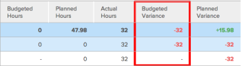
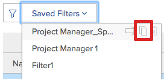
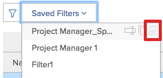

# 자원 가동률 정보 보기 {#view-resource-utilization-information}

>[!CONTEXTUALHELP]
>id="wf-resourcing-utilization"
>title="활용성 보고서"
>abstract="활용성 보고서를 사용하면 프로젝트, 프로그램 또는 포트폴리오의 진행 상황, 비용 또는 수익을 단일 보고서로 볼 수 있습니다. 매출과 원가를 비교할 수도 있습니다."

<!-- Audited: 01/2024 -->

<!--

(NOTE:&nbsp;this is linked to the UI from the Utilization report. ALWAYS keep this information. DO NOT DELETE!!)

-->

활용률 보고서에서 자원의 활용률을 조회할 수 있습니다.

<!--

(NOTE: Vazgen's response about these hours ie below and he asked us to NOT document them:

It queries Assignments first to get the tasks, issues, projects to display in the view. And then from those gets the hours.

In some cases, like for Planned Hours, it takes them from Assignments

But Budgeted Hours come from projects.

And Actual Hours are their own object - Hour)

-->

<!--

This report displays information about the assignments on work items for projects in your environment, like Planned, Actual, and Budgeted Hours, FTE, or Cost.&nbsp;These are hours,&nbsp;FTE, or costs associated with the assignments and not with the tasks and issues themselves.(PRIVATE NOTE:&nbsp;Vazgen's response about these hours: It queries Assignments first to get the tasks, issues, projects to display in the view. And then from those gets the hours. In some cases, like for Planned Hours, it takes them from Assignments; But Budgeted Hours come from projects. And Actual Hours are their own object - Hour.)

-->

## 액세스 요구 사항

+++ 을 확장하여 이 문서의 기능에 대한 액세스 요구 사항을 봅니다.

활용률 보고서에 액세스하려면 다음 항목이 있어야 합니다.

<table style="table-layout:auto"> 
 <col> 
 <col> 
 <tbody> 
  <tr> 
   <td role="rowheader">Adobe Workfront 플랜</td> 
   <td>
새로 만들기: 모두

       
또는

       
현재: Pro 이상
 </td> 
  </tr> 
  <tr> 
   <td role="rowheader">Adobe Workfront 라이선스</td> 
   <td>
새로운 기능: 표준

       
또는

       
현재: 플랜
 </td> 
  </tr> 
  <tr> 
   <td role="rowheader">액세스 수준 구성</td> 
   <td> 
다음에 대한 액세스 권한 이상:
 
    <ul> 
     <li> 
리소스 관리 
 </li> 
     <li> 
프로젝트
 </li> 
     <li> 
포트폴리오
 </li> 
     <li> 
프로그램
 </li> 
     <li> 
재무 데이터(원가별로 정보를 조회하려는 경우)
 </li> 
    </ul> </td> 
  </tr> 
  <tr> 
   <td role="rowheader">개체 권한</td> 
   <td> 
프로젝트, 포트폴리오 및 프로그램에 대한 액세스를 보고 리소스 조달 영역의 활용률 섹션에 액세스합니다
 
  
 
프로젝트에 대한 액세스 권한을 관리하여 프로젝트의 사용률 섹션에 액세스합니다.
 
  </td> 
  </tr> 
 </tbody> 
</table>

이 표의 정보에 대한 자세한 내용은 [Workfront 설명서의 액세스 요구 사항](/help/quicksilver/administration-and-setup/add-users/access-levels-and-object-permissions/access-level-requirements-in-documentation.md)을 참조하십시오.

+++

<!--

You must have View access to the projects you want to view utilization information for as described in this section. If you are still unable to access this information, contact your Workfront administrator. (NOTE:&nbsp;replaced with above table)

-->

<!--

<h2>Prerequisites for accessing utilization information</h2>

(NOTE: drafted, replaced with above table)

To access utilization information as described in this section, ensure that the following conditions are met:

<ul>
<li>You have at least&nbsp;View access to the project, program, or portfolio for which you want to view the utilization information.</li>
<li>Your Workfront administrator must grant you at least View access to&nbsp;Financial&nbsp;Data in your Access Level to be able to view cost and revenue information in the Utilization report. The Workfront administrator must enable both View Role Billing & Cost Rates as well as View User Billing &&nbsp;Cost Rates when they grant you the View access to Financial Data. For information about granting access to&nbsp;Financial&nbsp;Data, see <a href="../../administration-and-setup/add-users/configure-and-grant-access/grant-access-financial.md" class="MCXref xref">Grant access to financial data</a>. </li>
<li>

(NOTE:&nbsp;drafted. No longer the case.) 

The Utilization tab is included on any layout template that is assigned to you and that is applied to either the projects you view or to the Reporting area. 

The Utilization section is included on any layout template that is assigned to you and that is applied to either the projects you view or to the Resourcing area. 

</li>
<li>

The Utilization tab is available by default in the Reporting area if the system administrator has not assigned a custom layout template to you. 

The Utilization section is available by default in the Resourcing area if the system administrator has not assigned a custom layout template to you. 

</li>
</ul>

-->

## 활용성 보고서 개요 {#overview-of-the-utilization-report}

활용성 보고서를 사용하면 프로젝트, 프로그램 또는 포트폴리오의 진행 상황, 비용 또는 수익을 단일 보고서로 볼 수 있습니다. 매출과 원가를 비교할 수도 있습니다.

자원 조달 영역에서 활용률 보고서를 조회하여 여러 프로젝트의 활용률을 표시하거나 한 프로젝트 수준에서 이를 조회하여 해당 프로젝트와 연관된 개별 자원(작업 역할 및 사용자)의 활용률을 표시할 수 있습니다.

사용률 보고서에 액세스하고 사용하는 방법에 대한 자세한 내용은 이 문서의 [사용률 보고서를 사용하여 진행 상황, 비용 및 수익 추적](#track-progress-cost-and-revenue-with-the-utilization-report) 섹션을 참조하십시오.

### 시간 추적(진행률) {#track-hours-progress}

예산 및 계획된 시간이 실제 시간과 어떻게 비교되는지 확인하여 진행률을 추적할 수 있습니다.

프로젝트, 프로그램 또는 포트폴리오의 진행 상황을 추적할 때 작업과 문제에 대한 진행 상황이 활용률 보고서에 포함됩니다.

시간 추적 시 활용성 보고서에서 다음 정보를 사용할 수 있습니다.

<table style="table-layout:auto"> 
 <col> 
 <col> 
 <thead> 
  <tr> 
   <th><strong>시간을 볼 때 열 제목</strong> </th> 
   <th><strong>함수</strong> </th> 
  </tr> 
 </thead> 
 <tbody> 
  <tr> 
   <td scope="col"><strong>예산 시간</strong> </td> 
   <td scope="col"> 
포함된 프로젝트의 총 예산 시간. 포함된 프로젝트의 전체 수명에 대한 총 예산 시간을 보거나 지정된 날짜 범위에 대한 총 예산 시간만 볼 수 있습니다(개별 주 또는 월을 지정할 수 있음). 
 
예산 시간은 비즈니스 사례 또는 리소스 플래너 <em>의 리소스 예산 영역에서 사용할 수 있는 정보로 채워집니다.</em>
 
예산 시간은 다음 행 중 하나의 활용성 보고서에 표시됩니다.
 
    <ul> 
     <li> 예산 시간은 활용률 보고서에서 각 사용자에 대해 다음과 같이 작업 역할 및 개별 사용자별로 요약됩니다. <strong>개별 사용자:</strong> 예산 시간은 활용률 보고서에서 각 사용자에 대해 요약됩니다. 이러한 예산 시간은 포함된 프로젝트에서 사용자에게 할당된 작업 및 문제와 관련되어 있습니다. (해당 작업 역할의 행을 확장하여 해당 작업 역할이 있는 사용자 목록을 볼 수 있습니다.) <strong>작업 역할:</strong> 예산 시간은 사용률 보고서에서 작업 역할별로 요약되어 있습니다. 다음 시나리오의 결과로 특정 작업 역할에 예산 시간이 표시됩니다.
     <ul>
     <li>작업 역할은 예산 시간이 연계된 작업 또는 문제에 할당된 사용자의 기본 작업 역할로 정의됩니다. </li> 
       <li>단일 프로젝트에 대한 활용성 정보를 조회할 때 작업 또는 문제에 할당이 없든 시간을 할당받은 사용자의 작업 역할이 사용되거나 작업 역할 할당이 없든 다른 사용자에게 할당되거나 다른 사용자에게 다른 작업 역할이 할당되거나 다른 팀에 할당됩니다.</li> 
       <li>여러 프로젝트, 프로그램 또는 포트폴리오에 대한 활용률 정보를 볼 때 시간이 할당된 사용자의 작업 역할은 프로젝트의 작업 또는 문제에 역할이 할당된 경우에만 사용됩니다. </li> 
       <li>예산 시간이 연결된 작업 또는 문제에 작업 역할이 할당되고 작업 또는 문제에 할당된 사용자에게 시스템에 정의된 작업 역할이 없습니다.</li> 
      </ul></li> 
    </ul> 
    <ul> 
     <li> 
<strong>미할당 시간</strong>: 예산 시간이 작업 또는 문제와 연결되어 있고 작업 또는 문제에 할당된 사용자 또는 역할이 없는 경우 미할당 시간 섹션의 활용성 보고서에 예산 시간이 표시됩니다. 이 섹션은 프로젝트에 이 설명과 일치하는 시간이 있고 프로젝트별 또는 프로젝트별 사용률 보고서를 볼 때만 나타납니다. 
 
이 섹션은 프로젝트에 이 설명과 일치하는 시간이 있는 경우와 프로젝트별 또는 프로젝트별 활용성 보고서를 볼 때만 나타납니다. 
 </li> 
    </ul> 
예산 시간에 대한 자세한 내용은 <a href="/help/quicksilver/manage-work/projects/project-finances/budgeted-labor-cost.md">프로젝트 예산 인건비 및 예산 시간 이해</a>에서 <a href="/help/quicksilver/manage-work/projects/project-finances/budgeted-labor-cost.md#locate-the-budgeted-hours-of-a-project">프로젝트 예산 시간 찾기</a>를 참조하십시오.
 </td> 
  </tr> 
  <tr> 
   <td scope="col"><strong>계획된 시간</strong> </td> 
   <td scope="col">

각 작업 및 문제의 할당과 연결된 포함된 프로젝트의 계획된 시간입니다. 포함된 프로젝트의 전체 수명 동안 프로젝트에 대한 모든 할당의 총 계획된 시간을 보거나 지정된 날짜 범위에 대한 총 계획된 시간만 볼 수 있습니다(개별 주 또는 월을 지정할 수 있음).

<strong>팁 </strong>

기간이 0인 항목의 계획된 시간은 고려되지 않습니다. 

활용성 보고서의 계획된 시간은 작업 또는 문제 기간 동안 계획된 시간이 다시 할당되었는지 여부를 고려합니다. 

업무 균형자 를 사용하여 시간에 대한 사용자 일일 할당을 수정한 경우 [활용률] 보고서에서 선택한 날짜에 작업 또는 문제의 기간만 포함된 경우 [활용률] 보고서의 데이터에 영향을 줄 수 있습니다. 

사용자 할당을 수정하는 방법에 대한 자세한 내용은 <a href="../workload-balancer/manage-user-allocations-workload-balancer.md">업무 균형자에서 사용자 할당 관리</a>를 참조하십시오.

계획된 시간은 다음 행 중 하나의 활용률 보고서에 표시됩니다.

<ul>

<li>계획 시간은 다음과 같이 활용성 보고서에서 작업 역할 및 개별 사용자별로 요약됩니다. 
<ul>

<li><strong>개별 사용자</strong>: 사용 보고서에서 각 사용자에 대한 계획된 시간이 요약됩니다. 이러한 계획된 시간은 포함된 프로젝트에서 사용자에게 할당된 작업 및 문제와 관련되어 있습니다. (해당 작업 역할의 행을 확장하여 해당 작업 역할이 있는 사용자 목록을 볼 수 있습니다.)

<li><strong>작업 역할</strong>: 계획된 시간은 단일 프로젝트의 사용률 보고서에서 작업 역할별로 요약됩니다. 다음 시나리오의 결과로 특정 작업 역할에 계획된 시간이 표시됩니다.  
<ul>

<li>작업 역할은 계획된 시간이 연관된 작업 또는 문제에 할당된 사용자의 기본 작업 역할로 정의됩니다.

<li>단일 프로젝트에 대한 활용률 정보를 볼 때 다음 시나리오에서 작업 역할과 연관된 시간이 작업 역할에 대해 표시되지 않습니다.   
<ul>

<li>작업 또는 문제에 대한 할당이 없습니다.

<li>사용자에게 작업 역할 할당이 없습니다.

<li>사용자에게 다른 작업 역할이 할당됨

<li>팀이 작업 또는 문제에 할당됨
</li>   
</ul>

<li>여러 프로젝트, 프로그램 또는 포트폴리오에 대한 활용률 정보를 볼 때 시간이 할당된 사용자의 작업 역할은 프로젝트의 작업 또는 문제에 역할이 할당된 경우에만 사용됩니다. 여러 프로젝트에 대한 활용성 보고서를 볼 때 작업 역할 시간이 별도로 표시되지 않습니다.

<li>작업 역할이 계획된 시간이 연결된 작업 또는 문제에 할당되고, 작업 또는 문제에 할당된 사용자에게 시스템에 정의된 작업 역할이 없습니다.
</li>  
</ul>

<li><strong>미할당 시간</strong>: 계획된 시간이 작업 또는 문제와 연결되어 있고 작업 또는 문제에 할당된 사용자 또는 역할이 없는 경우 미할당 시간 섹션의 사용률 보고서에 계획된 시간이 표시됩니다. 이 섹션은 프로젝트에 이 설명과 일치하는 시간이 있고 단일 프로젝트에 대한 활용성 보고서를 볼 때만 나타납니다.  계획된 시간에 대한 자세한 내용은 <a href="../../manage-work/tasks/task-information/planned-hours.md">계획된 시간 개요</a>를 참조하십시오.
</li> 
</ul>
</li> 
</ul> </td> 
  </tr> 
  <tr> 
   <td><strong>실제 근로시간</strong> </td> 
   <td> 
 포함된 프로젝트의 작업, 문제,  및 에 기록된 총 시간입니다. 포함된 프로젝트의 전체 수명에 대한 총 실제 시간을 보거나 지정된 날짜 범위에 대한 총 실제 시간만 볼 수 있습니다(개별 주 또는 월을 지정할 수 있음). 
 
<strong>경고:</strong> 사용률 보고서에는 프로젝트에 기록된 시간, 하위 작업, 문제 및 하나 이상의 할당이 있는 상위 작업이 포함됩니다. 할당이 없는 상위 작업에 기록된 시간은 포함되지 않습니다. 상위 작업을 작업 작업으로 사용하지 않고 하위 작업만 리소스에 할당하는 것이 좋습니다. 
 
실제 시간은 다음 행 중 하나의 활용성 보고서에 표시됩니다.
 
    <ul> 
     <li> 실제 시간은 다음과 같이 프로젝트의 사용률 보고서에서 작업 역할 및 개별 사용자별로 요약됩니다. <strong>개별 사용자:</strong> 실제 시간은 시간을 기록한 사용자의 행에 있는 사용률 보고서에 표시됩니다. (해당 작업 역할의 행을 확장하여 시간을 기록한 해당 작업 역할의 사용자 목록을 볼 수 있습니다.) <strong>작업 역할:</strong> 해당 역할과 관련된 사용자가 기록한 실제 시간은 해당 작업 역할의 행에 있는 사용률 보고서에 요약되어 있습니다. 다음 시나리오의 결과로 특정 작업 역할에 실제 시간이 표시됩니다. 
      <ul> 
       <li>작업 역할은 시간을 기록한 사용자의 기본 작업 역할로 정의됩니다</li> 
       <li>작업 또는 문제에 대한 할당이 없습니다.</li> 
       <li>다른 사용자에게 작업 역할이 할당되지 않은 상태로 할당됨</li> 
       <li>다른 사용자에게 다른 작업 역할이 할당됨</li> 
       <li> 
팀이 할당되었습니다.
 </li> 
      </ul></li>  
     
시간을 기록하는 사용자에게 해당 프로필과 연관된 작업 역할이 없는 경우 활용률 보고서에 사용되는 작업 역할은 시간이 기록되는 작업 또는 문제에 할당된 작업 역할이거나 작업 또는 문제의 기본 소유자와 연관된 작업 역할입니다. 
 
     <li><strong>다른 시간:</strong> 실제 시간은 해당 시간에 로그인한 사용자의 행에서 다른 시간 섹션의 사용률 보고서에 표시됩니다.시간을 기록한 사용자에게 시스템에 정의된 작업 역할이 없을 때  시간이 이 섹션에 표시됩니다. 이 섹션은 이 설명과 일치하는 시간이 프로젝트에 있는 경우에만 나타납니다. </li> 
    </ul> </td> 
  </tr> 
  <tr> 
   <td><strong>예산 차이(시간)</strong> </td> 
   <td> 
포함된 프로젝트의 총 예산 시간에서 총 실제 시간을 뺀 값입니다. 포함된 프로젝트의 전체 수명에 대한 총 예산 차이를 보거나 지정된 일자 범위에 대한 총 예산 차이를 볼 수 있습니다(개별 주 또는 월을 지정할 수 있음). 
 
값이 양수이면 녹색으로 표시됩니다. 이는 총 예산 시간이 실제 시간보다 크다는 것을 나타냅니다.
 
값이 음수이면 빨간색으로 표시됩니다. 이는 총 예산 시간이 실제 시간보다 작음을 나타냅니다.
 
  
 </td> 
  </tr> 
  <tr> 
   <td><strong>계획된 차이(시간)</strong> </td> 
   <td> 
포함된 프로젝트의 총 계획된 시간에서 총 실제 시간을 뺀 수입니다. 포함된 프로젝트의 전체 수명에 대한 총 계획된 차이를 보거나 지정된 날짜 범위에 대한 총 계획된 차이를 볼 수 있습니다(개별 주 또는 월을 지정할 수 있음).
 
값이 양수이면 녹색으로 표시됩니다. 총 계획된 시간이 실제 시간보다 길다는 의미입니다.
 
값이 음수이면 빨간색으로 표시됩니다. 총 계획된 시간이 실제 시간보다 작음을 나타냅니다.
 </td> 
  </tr> 
 </tbody> 
</table>

### 비용 추적 {#track-cost}

예산 비용 및 계획된 비용이 실제 비용과 어떻게 비교되는지 확인하여 비용을 추적할 수 있습니다.

프로젝트, 프로그램 또는 포트폴리오의 비용을 추적할 때 활용성 보고서의 정보는 작업에서 가져옵니다. 작업의 비용 정보는 항상 활용률 보고서에서 사용할 수 있습니다. 작업의 비용은 작업의 비용 유형을 기반으로 계산됩니다. 작업의 비용 유형에 대한 자세한 내용은 [비용 추적](/help/quicksilver/manage-work/projects/project-finances/track-costs.md)에서 [Workfront에서 작업의 비용 유형을 계산하는 방법](/help/quicksilver/manage-work/projects/project-finances/track-costs.md#how-workfront-calculates-cost-types-for-tasks)을 참조하십시오.

다음과 같은 방법으로 활용률 보고서에 원가 정보를 표시할 수 있습니다.

* 주어진 주 또는 월, 전체 프로젝트, 프로그램 또는 포트폴리오에 대해
* 역할별 또는 개인별(프로젝트의 경우)

활용성 보고서의 통화는 프로젝트에 설정된 통화로 결정됩니다. 프로젝트 통화를 조정하는 방법에 대한 자세한 내용은 [프로젝트 통화 변경](../../manage-work/projects/project-finances/change-project-currency.md)을 참조하십시오.

비용 추적 시 활용성 보고서에서 다음 정보를 사용할 수 있습니다.

<table style="table-layout:auto"> 
 <col> 
 <col> 
 <thead> 
  <tr> 
   <th><strong>비용을 볼 때의 열 제목</strong> </th> 
   <th> 
<strong>함수</strong> 
 </th> 
  </tr> 
 </thead> 
 <tbody> 
  <tr> 
   <td scope="col"><strong>예산 비용</strong> </td> 
   <td scope="col"> 
포함된 프로젝트의 예산 비용. 포함된 프로젝트의 전체 수명에 대한 총 예산 원가를 조회하거나 지정된 일자 범위에 대한 총 예산 원가만 조회할 수 있습니다(개별 주 또는 월을 지정할 수 있음).
 
활용성 보고서의 예산 원가는 역할별 원가에 중점을 두기 때문에 Workfront의 다른 영역 내에서 예산 인건비와 동일한 계산입니다. 예산 인건비 계산 방법에 대한 자세한 내용은 <a href="../../manage-work/projects/project-finances/budgeted-labor-cost.md" class="MCXref xref">프로젝트 예산 인건비 및 예산 시간 이해</a>를 참조하십시오.
 </td> 
  </tr> 
  <tr> 
   <td scope="col"><strong>계획된 비용</strong> </td> 
   <td scope="col"> 
포함된 프로젝트의 총 계획된 비용. 포함된 프로젝트의 전체 수명에 대한 총 계획된 비용을 보거나 지정된 날짜 범위에 대한 총 계획된 비용만 볼 수 있습니다(개별 주 또는 월을 지정할 수 있음).
 
주, 월 및 분기별 보기의 경우, 계획된 비용은 작업 역할 또는 사용자의 비용 비율이 유효 일자일 때 선택된 기간의 평균으로 계산됩니다.

프로젝트의 계획된 비용이 계산되는 방법에 대한 자세한 내용은 <a href="/help/quicksilver/manage-work/projects/project-finances/track-costs.md">비용 추적</a>에서 <a href="/help/quicksilver/manage-work/projects/project-finances/track-costs.md#how-workfront-calculates-planned-budgeted-and-actual-costs">Workfront에서 계획된 비용, 예산 비용 및 실제 비용을 계산하는 방법</a>을 참조하십시오.
 </td>
  </tr> 
  <tr> 
   <td scope="col"><strong>실제 비용</strong> </td> 
   <td scope="col"> 
포함된 프로젝트의 총 실제 비용. 포함된 프로젝트의 전체 수명에 대한 총 실제 비용을 보거나 지정된 날짜 범위에 대한 총 실제 비용만 볼 수 있습니다(개별 주 또는 월을 지정할 수 있음).
 
프로젝트의 실제 비용을 계산하는 방법에 대한 자세한 내용은 <a href="/help/quicksilver/manage-work/projects/project-finances/track-costs.md">비용 추적</a>에서 <a href="/help/quicksilver/manage-work/projects/project-finances/track-costs.md#how-workfront-calculates-planned-budgeted-and-actual-costs">Workfront에서 계획된 비용, 예산 비용 및 실제 비용을 계산하는 방법</a>을 참조하십시오.
 </td>
  </tr> 
  <tr> 
   <td><strong>예산 차이(비용)</strong> </td> 
   <td scope="col"> 
총 예산 비용에서 포함된 프로젝트의 총 실제 비용을 뺀 값입니다. 포함된 프로젝트의 전체 수명에 대한 총 예산 차이를 보거나 지정된 일자 범위에 대한 총 예산 차이를 볼 수 있습니다(개별 주 또는 월을 지정할 수 있음).
 
값이 양수이면 녹색으로 표시됩니다. 이는 총 예산 비용이 실제 비용보다 크다는 것을 나타냅니다.
 
값이 음수이면 빨간색으로 표시됩니다. 총 예산 비용이 실제 비용보다 작음을 나타냅니다.
 </td>
  </tr> 
  <tr> 
   <td><strong>계획된 차이(비용)</strong> </td> 
   <td> 
총 계획된 비용에서 포함된 프로젝트의 총 실제 비용을 뺀 값입니다. 포함된 프로젝트의 전체 수명에 대한 총 계획된 차이를 보거나 지정된 날짜 범위에 대한 총 계획된 차이를 볼 수 있습니다(개별 주 또는 월을 지정할 수 있음). 
 
값이 양수이면 녹색으로 표시됩니다. 총 계획된 비용이 실제 비용보다 크다는 것을 나타냅니다.
 
값이 음수이면 빨간색으로 표시됩니다. 총 계획된 비용이 실제 비용보다 작음을 나타냅니다.
 </td> 
  </tr> 
 </tbody> 
</table>

### 매출 추적 {#track-revenue}

예산 및 계획 수익이 실제 수익과 어떻게 비교되는지 확인하여 수익을 추적할 수 있습니다.

프로젝트, 프로그램 또는 포트폴리오의 수익을 추적할 때 작업의 수익만 활용률 보고서에 포함됩니다.

다음 테이블의 정보는 수익 추적 시 활용성 보고서에서 사용할 수 있습니다.

특정 필드 및 Workfront에서 이러한 필드를 계산하는 방법에 대한 자세한 내용은 [비용 추적](../../manage-work/projects/project-finances/track-costs.md) 및 [청구 및 수익 개요](../../manage-work/projects/project-finances/billing-and-revenue-overview.md)를 참조하십시오.

<table style="table-layout:auto"> 
 <col> 
 <col> 
 <thead> 
  <tr> 
   <th><strong>매출을 볼 때 열 제목</strong> </th> 
   <th> <strong>함수</strong></th> 
  </tr> 
 </thead> 
 <tbody> 
  <tr> 
   <td scope="col"><strong>예산 수익</strong> </td> 
   <td scope="col"> 
포함된 프로젝트의 총 예산 시간에 역할 청구 요율을 곱한 값입니다. 포함된 프로젝트의 전체 수명에 대한 총 예산 수익을 보거나 지정된 날짜 범위에 대한 총 예산 수익만 볼 수 있습니다(개별 주 또는 월을 지정할 수 있음).
 </td> 
  </tr> 
  <tr> 
   <td scope="col"><strong>계획된 수익</strong> </td> 
   <td scope="col"> 
활용성 보고서의 계획된 수익은 프로젝트의 작업에 할당된 자원에 할당된 계획된 시간과 연관된 수익입니다.
 
Workfront은 다음 공식을 사용하여 활용성 보고서에 대한 프로젝트 계획 수익을 계산합니다.
 
<code>Project Planned Revenue = SUM (All Tasks Planned Revenue)</code> 
 
   
<b>참고</b>
   
활용률 보고서에 표시되는 프로젝트 계획 수익은 프로젝트 세부 정보 영역 및 프로젝트 보고서에 표시되는 계획 수익과 다릅니다. 
 
프로젝트 세부 정보 영역의 계획된 수익에는 프로젝트 고정 수익과 작업 수익이 반영됩니다. 활용성 보고서의 계획된 수익에는 프로젝트의 작업에만 연관된 계획된 수익이 표시됩니다. 
 
     
Example: </b>">  
      
프로젝트에 10시간의 작업이 1개 있고 시간당 비율이 $20인 컨설턴트에게 할당되어 있으며 프로젝트에 $100의 고정 수익이 있는 경우, 활용률 보고서에는 계획된 수익(작업의 시간과 연결된 계획된 수익)에 대해 $200가 표시됩니다. 프로젝트 세부 정보 섹션에는 $300(작업의 계획된 수익 및 프로젝트에 대한 고정 수익)이 표시됩니다. 
 
     
 
사용률 보고서 외부의 작업 및 프로젝트 계획 수익에 대한 자세한 내용은 <a href="../../manage-work/projects/project-finances/billing-and-revenue-overview.md" class="MCXref xref">청구 및 수익 개요</a>를 참조하십시오.
 
 
활용성 보고서가 포함된 프로젝트에 대해 계획된 수익을 계산하고 표시하는 방식은 작업에 설정된 수익 유형을 고려합니다. 
 
프로젝트에 있는 각 작업의 수익 유형에 따라 다음과 같은 시나리오가 존재합니다. 
 
<strong>고정 수입:</strong> 작업 할당에 관계없이 작업의 수입은 항상 작업에 지정된 고정 금액을 사용하여 계산됩니다.
 
<b>중요 사항</b>

Workfront의 다른 영역과는 달리, 활용성 보고서는 고정 수익을 작업의 계획된 시간 수로 균등하게 나누어 고정 수익 작업에 대한 계획된 수익을 계산합니다. 
 
예를 들어, 작업의 매출은 $200입니다. 작업에 계획된 시간이 4개인 경우 각 시간은 50달러입니다. 이는 사용자 및 역할 수준에 배포됩니다. 이 분배는 활용률 보고서에 고유합니다.
 
<b>참고</b>

고정 수익 작업이 있고 작업에 대해 계획된 시간이 없는 경우 수익을 시간에 분배할 방법이 없으므로 수익이 활용성 보고서에 표시되지 않습니다. 고정 수익이 있고 할당이 없는 작업에 계획된 시간이 있는 경우 수익이 미할당 수익으로 표시됩니다. 
 
<strong>시간당 역할:</strong> 작업의 매출은 특정 역할에 설정된 청구 요금에 해당 역할에 연결된 계획된 시간을 곱한 값을 사용하여 계산됩니다. Workfront에서는 다음 공식을 사용합니다.
 
<code>역할 시간당 계획된 수익 = SUM(모든 작업에 대한 역할의 계획된 시간) * 역할 청구 요금</code>

<b>참고:</b> 공식의 청구 시간당 요금은 날짜 유효 요금의 변경 사항을 고려합니다.
   
<strong>시간별 사용자:</strong> 작업의 매출은 특정 사용자에 대해 설정된 청구 요금에 해당 사용자와 연결된 계획된 시간을 곱한 값을 사용하여 계산됩니다. Workfront에서는 다음 공식을 사용합니다.
 
<code>사용자 시간당 계획된 수익 = SUM(모든 작업에 대한 사용자의 계획된 시간) * 사용자 청구 요금</code> 
 
<b>참고:</b> 공식의 청구 시간당 요금은 날짜 유효 요금의 변경 사항을 고려합니다.
 
<b>시간별 또는 사용자별 + 고정 역할</b> 
 
<b>중요</b>

Workfront의 다른 영역과는 달리 활용성 보고서는 고정 수익을 작업의 계획된 시간 수로 균등하게 나누어 계획된 수익을 계산합니다. 
 
다음과 같은 경우: 

<ul>
<li> 
<strong>시간별 + 고정 역할:</strong> 작업의 매출은 특정 역할에 설정된 청구 요금에 역할과 연결된 계획된 시간을 곱한 값을 사용하여 계산됩니다. 또한 작업에 지정된 고정 금액이 역할 비율에 추가됩니다. Workfront에서는 다음 공식을 사용합니다.
 
<code>역할 시간당 + 고정 계획 수익 = [SUM(모든 작업에 대한 역할의 계획된 시간) * 역할 청구 요금] + SUM(최대 작업 또는 고정 금액/작업의 계획된 시간)</code> 
 </li>
<li> 
<strong>시간별 + 고정 사용자:</strong> 특정 사용자에 대해 설정된 청구 요금에 해당 사용자의 작업에 대한 계획된 시간을 곱한 값입니다. 또한 작업에 지정된 고정 금액이 사용자 비율에 추가됩니다. Workfront에서는 다음 공식을 사용합니다.
 
<code>시간별 사용자 + 고정 계획 수익 = [SUM(모든 작업에 대해 사용자의 계획된 시간) * 사용자 청구 요금] + SUM(최대 작업 또는 고정 금액/작업의 계획된 시간)</code> 
 </li>
</ul> 
<b>시간별 역할 또는 사용자(상한 포함)</b> 
 
<b>중요</b>

Workfront의 다른 영역과는 달리 계획된 수익이 상한을 초과하는 경우 상한 금액을 초과하는 금액은 고정 수익으로 간주됩니다. 계획된 수익은 고정 수익을 작업의 계획된 시간 수로 균등하게 나눈 다음 캡 금액과 역할 또는 사용자 시간당 수익에 추가하여 계산됩니다.  
 
다음과 같은 경우: 

<ul>
<li> 
<strong>시간당 역할(상한 포함):</strong> 작업은 시간별 역할에서처럼 시간별로 청구되지만 지정할 수 있는 최대 상한이 있습니다. Workfront에서는 다음 공식을 사용합니다.
 
<code>시간당 역할(상한 계획 수익 포함) = [SUM(모든 작업 및 문제에 대한 역할의 계획된 시간) * 역할 청구 요금] + 작업의 상한 금액 + SUM(상한 금액 초과/작업의 계획된 시간)</code> 
 </li>
<li> 
<strong>시간별 사용자(상한 포함):</strong> 작업은 시간별 사용자에서와 같이 시간별로 청구되지만 지정할 수 있는 최대 상한이 있습니다. Workfront에서는 다음 공식을 사용합니다. 
 
<code>시간당 사용자(상한 계획 수익 포함) = [SUM(모든 작업에 대해 사용자로부터 계획된 시간) * 사용자 청구 요금] + 최대 작업 금액 + SUM(상한 금액 초과/작업 계획된 시간)</code> 
 </li>
</ul> 
계획된 수익을 계산할 때 고려되는 역할 또는 사용자에 대한 자세한 내용은 <a href="../../manage-work/projects/project-finances/billing-and-revenue-overview.md" class="MCXref xref">청구 및 수익 개요</a>를 참조하십시오.
 </td>
</tr> 
  <tr> 
   <td><strong>실제 수익</strong> </td>
   <td> 
실제 수익 은 작업 및 프로젝트의 실제 시간과 관련된 수익입니다. 실제 매출에 대한 자세한 내용은 <a href="/help/quicksilver/manage-work/projects/project-finances/billing-and-revenue-overview.md">청구 및 매출 개요</a>의 <a href="/help/quicksilver/manage-work/projects/project-finances/billing-and-revenue-overview.md#track-revenue-amounts">매출 금액 추적</a>을 참조하십시오.

활용성 보고서에서 포함된 프로젝트에 대한 실제 수익을 계산하는 방법은 다음과 같이 작업에 설정된 수익 유형에 따라 다릅니다.
 
<strong>고정 수입:</strong> 작업 할당에 관계없이 작업의 수입은 항상 작업에 지정된 고정 금액을 사용하여 계산됩니다.
 
<b>중요 사항</b>

Workfront의 다른 영역과는 달리, 활용성 보고서는 고정 수익을 작업에 기록된 시간으로 균등하게 나누어 실제 수익을 계산합니다. 
 
 
 
예를 들어, 작업의 실제 매출은 $200입니다. 작업에 실제 시간이 4시간이면 각 시간은 50달러가 됩니다. 이는 사용자 및 역할 수준에 배포됩니다. 이 분배는 활용률 보고서에 고유합니다.
 
<b>참고</b>

고정 수익 작업이 있고 작업에 실제 시간이 없는 경우 시간을 분배할 방법이 없으므로 실제 수익이 활용성 보고서에 표시되지 않습니다. 
 
<strong>시간당 역할:</strong> 작업의 매출은 특정 역할에 대해 설정된 청구 요금에 실제 시간을 곱한 값을 사용하여 계산됩니다.
 
Workfront에서는 다음 공식을 사용합니다.
 
<code>역할 시간당 실제 수익 = SUM(모든 작업에 대한 역할의 실제 시간) * 역할 청구 요금</code> 
 
<b>참고:</b> 공식의 청구 시간당 요금은 날짜 유효 요금의 변경 사항을 고려합니다.
 
<strong>시간별 사용자:</strong> 작업에 대한 매출은 특정 사용자에 대해 설정된 청구 요금에 해당 사용자의 작업에 대해 기록된 시간을 곱한 값을 사용하여 계산됩니다. Workfront에서는 다음 공식을 사용합니다.
 
<code>사용자 시간당 실제 수익 = SUM(모든 작업에 대한 사용자의 실제 시간) * 사용자 청구 요금</code>
 
<b>참고:</b> 공식의 청구 시간당 요금은 날짜 유효 요금의 변경 사항을 고려합니다.
 
<b>역할 또는 사용자 시간별 + 고정</b> 
 
<b>중요</b>

Workfront의 다른 영역과는 달리, 활용성 보고서는 고정 수익을 작업에 기록된 시간으로 균등하게 나누어 실제 수익을 계산합니다. 
 
다음과 같은 경우: 

<ul>
<li> 
<strong>시간별 + 고정 역할:</strong> 특정 역할에 대해 설정된 청구 요금에 해당 역할을 가진 사용자의 작업에 대해 기록된 시간을 곱한 값입니다. 또한 작업에 지정된 고정 금액이 역할 비율에 추가됩니다. 
 
Workfront에서는 다음 공식을 사용합니다.
 
<code>역할 시간당 + 고정 실제 수익 = [SUM(모든 작업에 대한 역할의 실제 시간) * 역할 청구 요금] + SUM(최대 작업 또는 고정 금액/작업의 실제 시간)</code> 
 </li>
<li> 
<strong>시간별 + 고정 사용자:</strong> 특정 사용자에 대해 설정된 청구 요금에 해당 사용자의 작업에 대해 기록된 시간을 곱한 값입니다. 또한 작업에 지정된 고정 금액이 사용자 비율에 추가됩니다. 
 
Workfront에서는 다음 공식을 사용합니다.
 
<code>시간당 사용자 + 고정 실제 수익 = [SUM(모든 작업에 대한 역할의 실제 시간) * 사용자 청구 요금] + SUM(최대 작업 또는 고정 금액/작업의 사용자 시간)</code> 
 </li>
</ul> 
<b>시간별 역할 또는 사용자(상한 포함)</b> 
 
<b>중요</b>

Workfront의 다른 영역과는 달리 계획된 수익이 상한을 초과하는 경우 상한 금액을 초과하는 금액은 고정 수익으로 간주됩니다. 계획된 수익은 고정 수익을 작업의 계획된 시간 수로 균등하게 나눈 다음 캡 금액과 역할 또는 사용자 시간당 수익에 추가하여 계산됩니다.  
 
다음과 같은 경우:

<ul>
<li> 
<strong>시간당 역할(상한 포함):</strong> 작업은 시간별 역할에서처럼 시간별로 청구되지만 지정할 수 있는 최대 상한이 있습니다. Workfront에서는 다음 공식을 사용합니다.
 
<code>시간당 역할(상한 실제 수익 포함) = [SUM(모든 작업 및 문제에 대한 역할의 실제 시간) * 역할 청구 요금] + 최대 작업 금액 + SUM(상한 금액 초과/실제 작업 시간)</code>
 </li>
<li> 
<strong>시간별 사용자(상한 포함):</strong> 작업은 시간별 사용자에서와 같이 시간별로 청구되지만 지정할 수 있는 최대 상한이 있습니다.
 
 Workfront에서는 다음 공식을 사용합니다.
 
<code>시간당 사용자(상한 실제 수익 포함) = [SUM(모든 작업 및 문제에 대한 역할의 실제 시간) * 사용자 청구 요금] + 작업의 상한 금액 + SUM(상한 금액을 초과하는 금액/작업의 실제 시간)</code> 
 </li>
</ul>

<strong>프로젝트 매출</strong>: 프로젝트에 기록된 시간과 관련된 매출은 시간을 기록한 사용자의 기본 작업 역할의 시간당 청구 금액을 고려하여 계산됩니다. 프로젝트에서 시간을 기록하지 않는 것이 좋습니다. 

<b>참고</b>

사용자가 작업 역할과 연결되어 있지 않거나 기본 역할의 시간당 청구가 0인 경우 Workfront은 사용자에 대한 시간당 청구액을 사용하여 실제 수익을 계산합니다. 프로필에 시간당 청구 금액이 없는 경우 실제 매출은 0입니다. 

</td> 
  </tr> 
  <tr> 
   <td><strong>예산 차이(매출액)</strong> </td> 
   <td> 
포함된 프로젝트의 총 실제 수익에서 예산 수익을 뺀 것입니다. 포함된 프로젝트의 전체 수명에 대한 총 예산 차이를 보거나 지정된 날짜 범위에 대한 총 예산 차이를 볼 수 있습니다(개별 주 또는 월을 지정할 수 있음).
 
값이 양수이면 녹색으로 표시됩니다. 이는 총 예산 수익이 실제 수익보다 크다는 것을 나타냅니다.
 
값이 음수이면 빨간색으로 표시됩니다. 이는 총 예산 수익이 실제 수익보다 작음을 나타냅니다.
 </td>
  </tr> 
  <tr> 
   <td><strong>계획된 차이(매출액)</strong> </td> 
   <td> 
총 실제 수익에서 포함된 프로젝트의 총 계획된 수익을 뺀 수입니다. 포함된 프로젝트의 전체 수명에 대한 총 계획된 변량을 보거나 지정된 날짜 범위에 대한 총 계획된 변량만 볼 수 있습니다(개별 주 또는 월을 지정할 수 있음). 
 
값이 양수이면 녹색으로 표시됩니다. 총 계획된 수익이 실제 수익보다 큼을 나타냅니다.
 
값이 음수이면 빨간색으로 표시됩니다. 총 계획된 수익이 실제 수익보다 작음을 나타냅니다.
 </td>
  </tr> 
 </tbody> 
</table>

<!--Note from the table about Actual revenue: 
     
Actual Revenue is displayed in the Utilization report only after the task is marked as Complete or Done (or a status that equates with Complete).

    -->

<!--More notes from the table: 
     
(NOTE:&nbsp;the note below is duplicated in this article: /Content/Manage work/Projects/Project Finances/billing-and-revenue-overview.html and in the glossary)

   -->

### 수익 대 계획 및 실제 비용 비교 {#compare-revenue-against-planned-and-actual-costs}

계획된 수익과 함께 계획된 또는 실제 비용을 볼 수 있습니다. 마진(%)도 표시됩니다(마진은 수익 - 비용 / 수익으로 계산됨).

계획 및 실제 원가와 수익을 비교할 때 활용성 보고서에서 다음 정보를 사용할 수 있습니다.

<table style="table-layout:auto"> 
 <col> 
 <col> 
 <thead> 
  <tr> 
   <th><strong>매출과 비용을 볼 때의 열 제목(예정)</strong> </th> 
   <th> <strong>함수</strong></th> 
  </tr> 
 </thead> 
 <tbody> 
  <tr> 
   <td scope="col"><strong>계획된 비용</strong> </td> 
   <td scope="col"> 포함된 프로젝트의 총 계획된 비용. 포함된 프로젝트의 전체 수명에 대한 총 계획된 비용을 보거나 지정된 날짜 범위에 대한 총 계획된 비용만 볼 수 있습니다(개별 주 또는 월을 지정할 수 있음). </td> 
  </tr> 
  <tr> 
   <td scope="col"><strong>계획된 수익</strong> </td> 
   <td scope="col"> 
계획된 수익이란 작업의 계획된 시간과 관련된 수익입니다. 
 
이 문서의 <a href="#track-revenue" class="MCXref xref">수익 추적</a> 섹션에 설명된 대로 활용성 보고서가 포함된 프로젝트에 대해 계획된 수익을 계산하고 표시하는 방식은 작업에 설정된 수익 유형에 따라 다릅니다.
 </td> 
  </tr> 
  <tr> 
   <td scope="col"><strong>여백</strong> </td> 
   <td scope="col"> 
마진 퍼센트는 다음과 같이 계산됩니다.
 
<code>Planned Revenue - Planned Cost / Planned Revenue * 100. </code>
 
<b>메모</b>

계획된 수익이 0인 경우 마진이 0으로 표시됩니다. 
 </td>
</tr> 
  <tr> 
   <td scope="col"> 
<strong>매출과 비용 비교 시 열 제목(실제)</strong> 
  </td> 
   <td scope="col">
<strong>함수</strong>
</td> 
  </tr> 
  <tr> 
   <td scope="col"><strong>실제 비용</strong> </td> 
   <td scope="col"> 
포함된 프로젝트의 총 실제 비용. 포함된 프로젝트의 전체 수명에 대한 총 실제 비용을 보거나 지정된 날짜 범위에 대한 총 실제 비용만 볼 수 있습니다(개별 주 또는 월을 지정할 수 있음).
 </td> 
  </tr> 
  <tr> 
   <td scope="col"><strong>실제 수익</strong> </td> 
   <td> 
실제 매출은 작업의 실제 시간과 관련된 매출입니다.
 
실제 수익은 작업이 완료 또는 완료(또는 완료와 동일한 상태)로 표시된 후에만 활용률 보고서에 표시됩니다.
 
이 문서의 <a href="#track-revenue" class="MCXref xref">수익 추적</a> 섹션에 설명된 대로 활용성 보고서에서 포함된 프로젝트에 대한 실제 수익을 계산하는 방식이 작업에 설정된 수익 유형에 따라 다릅니다. 
 </td> 
  </tr> 
  <tr> 
   <td scope="col"><strong>여백</strong> </td> 
   <td> 
마진 퍼센트는 다음과 같이 계산됩니다.
 
실제 수익 - 실제 원가/실제 수익 * 100. 
 
<b>메모</b>

실제 수익이 0이면 마진이 0으로 표시됩니다. 
 </td>
</tr> 
 </tbody> 
</table>

<!--Note from the table from above "Function" header in the middle of the table; right after the "Planned Revenue"/"Margin" definition: 
     
(NOTE: This needs to be either split in two tables of formatted differently)

    -->

## 활용성 보고서를 사용하여 진행 상황, 비용 및 수익 추적 {#track-progress-cost-and-revenue-with-the-utilization-report}

프로젝트, 프로그램 또는 포트폴리오의 진행 상황이나 비용을 추적할 수 있습니다.

주어진 주 또는 월 또는 프로젝트의 전체 수명 동안 활용성 보고서에 대한 정보를 표시할 수 있습니다.

활용성 보고서를 사용하여 하나 이상의 프로젝트의 진행 상황이나 비용을 추적하려면

1. 개별 프로젝트, 여러 프로젝트, 프로그램 또는 포트폴리오에 대한 활용성 정보를 보고 있는지 여부에 따라 다음 중 하나를 수행합니다.

   * 단일 프로젝트에 대한 활용성 정보를 보려면

      1. 사용률 정보를 보려는 프로젝트로 이동한 다음 **자세히 표시> 사용률**&#x200B;을 클릭합니다.
      1. 활용성 정보는 개별 프로젝트를 볼 때 자동으로 표시되며 필터 적용은 필요하지 않습니다.\
         사용률 보고서를 필터링하려면 필터를 적용한 다음 **실행**&#x200B;을 클릭합니다.\
         사용률 보고서를 필터링하는 방법에 대한 자세한 내용은 이 문서에서 [사용률 정보 필터링](#filter-utilization-information)을 참조하십시오.\
         활용성 정보는 개별 사용자 및 역할(사용자는 연관된 역할 내에서 그룹화됨)에 대해 표시됩니다.

   * 복수 프로젝트에 대한 활용성 정보를 조회하려면

     {{step1-to-utilization-report}}

      1. 사용률 보고서에 필터를 적용한 다음 **실행**을 클릭합니다.
활용률 보고서를 실행하기 전에 필터에서 하나 이상의 프로젝트를 지정해야 합니다. 사용률 보고서를 필터링하는 방법에 대한 자세한 내용은 이 문서에서 [사용률 정보 필터링](#filter-utilization-information)을 참조하십시오.\
         개별 역할 및 프로젝트(역할은 연관된 프로젝트 내에서 그룹화됨)에 대한 활용률 정보가 표시됩니다.

   * 프로그램에 대한 활용률 정보를 조회하려면

     {{step1-to-utilization-report}}

      1. **표시**>**프로그램**&#x200B;을 클릭합니다.
      1. 사용률 보고서에 필터를 적용한 다음 **실행**&#x200B;을 클릭합니다.\
         활용성 보고서를 실행하기 전에 필터에 프로그램을 하나 이상 지정해야 합니다. 사용률 보고서를 필터링하는 방법에 대한 자세한 내용은 이 문서에서 [사용률 정보 필터링](#filter-utilization-information)을 참조하십시오.\
         개별 프로젝트 및 프로그램(프로젝트는 관련 프로그램 내에 그룹화됨)에 대한 활용성 정보가 표시됩니다.

   * 포트폴리오에 대한 활용률 정보를 조회하려면

     {{step1-to-utilization-report}}

      1. **표시**>**포트폴리오**&#x200B;를 클릭합니다.
      1. 사용률 보고서에 필터를 적용한 다음 **실행**&#x200B;을 클릭합니다.\
         활용률 보고서를 실행하기 전에 필터에 하나 이상의 포트폴리오를 지정해야 합니다. 사용률 보고서를 필터링하는 방법에 대한 자세한 내용은 이 문서에서 [사용률 정보 필터링](#filter-utilization-information)을 참조하십시오.\
         개별 프로젝트, 프로그램 및 포트폴리오에 대한 활용성 정보가 표시됩니다(프로젝트는 연결된 프로그램 내에 그룹화되고 프로그램은 연결된 포트폴리오 내에 그룹화됨).

1. 사용률 보고서의 오른쪽 상단 모서리에서 **보기**&#x200B;를 클릭한 다음, 메뉴에서 다음 중 하나를 선택합니다.

   * **비용**
   * **시간**
   * **매출**
   * **수익 대 비용(계획)**
   * **수익 대 비용(실제)**

   선택하는 옵션은 보고서에서 사용할 수 있는 열과 정보를 결정합니다.
   

1. (선택사항) 활용률 정보가 표시되는 일자 범위를 선택합니다. **전체** 열 왼쪽에 주어진 주 또는 월에 대한 정보를 표시할 수 있습니다. 전체 프로젝트, 프로그램 또는 포트폴리오에 대한 정보는 항상 **전체** 열에 표시됩니다.\
   자세한 내용은 이 문서에서 [정보가 표시되는 날짜 범위 조정](#adjust-the-date-range-for-which-information-is-displayed)을 참조하십시오.

1. (선택 사항) 열 제목을 눌러 해당 열의 정보를 기준으로 활용률 보고서를 정렬합니다. 정렬은 보고서에 여러 항목을 포함하는 경우에만 작동합니다. 예를 들어 둘 이상의 프로젝트(또는 포트폴리오 또는 프로그램)를 보고 있는 경우 보고서의 결과를 정렬할 수 있습니다. 한 번에 하나의 프로젝트(또는 하나의 포트폴리오 또는 하나의 프로그램)만 보는 경우에는 결과를 정렬할 수 없습니다.
1. 이 문서의 [활용성 보고서 개요](#overview-of-the-utilization-report) 섹션에 있는 정보를 사용하여 활용성 보고서의 각 열에 대해 알아보십시오.

## 필터 사용률 정보 {#filter-utilization-information}

프로젝트의 활용성 보고서에 표시되는 콘텐츠를 필터링할 수 있습니다. 작업, 문제, 역할 및 사용자 지정 데이터를 필터링할 수 있습니다. 필터를 적용하면 활용성 보고서에는 선택한 기준에 따른 정보가 포함됩니다.

새 필터를 만들거나 이전에 만든 필터를 적용할 수 있습니다.

### 필터 만들기 또는 수정 {#create-or-modify-a-filter}

필터를 만들면 활용성 보고서에 액세스할 수 있는 모든 Workfront 사용자도 사용자가 만드는 필터에 액세스할 수 있습니다. 마찬가지로 기존 필터를 수정하면 활용성 보고서에 액세스할 수 있는 모든 사용자에 대해 필터가 수정됩니다.

필터를 만들거나 수정하려면 다음과 같이 하십시오.

1. 활용성 보고서를 엽니다.
이를 수행하려면 [사용률 보고서를 사용하여 진행 상황, 비용 및 수익 추적](#track-progress-cost-and-revenue-with-the-utilization-report)을 참조하십시오.

1. **필터** 아이콘을 클릭하여 필터 옵션을 표시합니다.
1. (조건부) 기존 필터를 수정하려면 **필터** 드롭다운 메뉴를 클릭한 다음 수정할 필터를 선택합니다.
1. 다음 정보를 지정하여 필터를 만들거나 수정합니다.

   * **포트폴리오:** 사용률 보고서에 포함할 정보가 포함된 포트폴리오의 이름을 입력한 다음 드롭다운 목록에 표시될 때 이름을 클릭합니다\
     활용률 보고서에 여러 포트폴리오의 정보를 포함하려면 이 프로세스를 반복합니다.\
     시스템의 모든 포트폴리오를 필터에 포함하려면 **모두 추가**&#x200B;를 클릭하십시오. (이 옵션은 시스템에 10개 미만의 포트폴리오가 있는 경우에만 사용할 수 있습니다.)

   * **프로그램:** 사용률 보고서에 포함할 정보가 포함된 프로그램 이름을 입력한 다음 드롭다운 목록에 나타나면 이름을 클릭합니다.\
     활용률 보고서에 여러 작업의 정보를 포함하려면 이 프로세스를 반복합니다.\
     필터에서 이미 포트폴리오를 지정한 경우, 지정한 프로그램은 필터에 이미 포함된 포트폴리오에서 가져온 것이어야 합니다. 그렇지 않은 경우 프로그램의 데이터는 활용성 보고서에 포함되지 않습니다.\
     시스템의 모든 프로그램을 필터에 포함하려면 **모두 추가**&#x200B;를 클릭하십시오. (이 옵션은 시스템에 20개 이하의 프로그램이 있는 경우에만 사용할 수 있습니다.)

   * **프로젝트:** 사용률 보고서에 포함할 정보가 포함된 프로젝트 이름을 입력한 다음 드롭다운 목록에 나타나면 이름을 클릭합니다.\
     활용성 보고서에 여러 프로젝트의 정보를 포함하려면 이 프로세스를 반복합니다.\
     필터에서 이미 포트폴리오 또는 프로그램을 지정한 경우 지정한 프로젝트는 필터에 이미 포함된 포트폴리오 또는 프로그램 중 하나여야 합니다. 그렇지 않은 경우 프로젝트의 데이터가 활용률 보고서에 포함되지 않습니다.\
     시스템의 모든 프로젝트를 필터에 포함하려면 **모두 추가**&#x200B;를 클릭하십시오. (이 옵션은 시스템에 250개 미만의 프로젝트가 있는 경우에만 사용할 수 있습니다.)

   * **작업:** 사용률 보고서에 포함할 정보가 포함된 작업 이름을 입력한 다음 드롭다운 목록에 나타나면 이름을 클릭합니다.\
     활용률 보고서에 여러 작업의 정보를 포함하려면 이 프로세스를 반복합니다.\
     필터에서 이미 포트폴리오, 프로그램 또는 프로젝트를 지정한 경우, 지정한 작업은 필터에 이미 포함된 포트폴리오, 프로그램 또는 프로젝트 중 하나의 작업이어야 합니다. 그렇지 않은 경우 작업의 데이터가 활용률 보고서에 포함되지 않습니다.

   * **문제:** 사용률 보고서에 포함할 정보가 포함된 문제의 이름을 입력한 다음 드롭다운 목록에 나타나면 이름을 클릭합니다.\
     활용성 보고서에 여러 문제의 정보를 포함하려면 이 프로세스를 반복합니다.\
     필터에서 이미 포트폴리오, 프로그램 또는 프로젝트를 지정한 경우, 지정하는 문제는 필터에 이미 포함된 포트폴리오, 프로그램 또는 프로젝트 중 하나의 문제여야 합니다. 그렇지 않은 경우 해당 문제의 데이터가 활용률 보고서에 포함되지 않습니다.\
     문제에 대한 비용 정보가 활용률 보고서에 항상 포함되는 것은 아닙니다. 문제에 대한 비용 정보가 사용률 보고서에 포함되는 시기에 대한 자세한 내용은 이 문서의 [사용률 보고서를 사용하여 진행 상황, 비용 및 수익 추적](#track-progress-cost-and-revenue-with-the-utilization-report)을 참조하십시오.

   * **역할:** 사용률 보고서에 나타낼 역할 이름을 입력한 다음 드롭다운 목록에 표시될 때 해당 이름을 클릭합니다. 추가 역할을 포함하려면 이 프로세스를 반복합니다.
활용성 보고서에는 지정한 역할에 대한 정보만 포함됩니다. 예를 들어 작업에 10개의 실제 시간이 포함되어 있습니다. 이 중 6시간은 Designer 역할에서 나왔고 4시간은 개발자 역할에서 왔습니다. Designer에 대한 역할별로 활용성 보고서를 필터링하면 개발자 역할의 4시간이 보고서에서 제외됩니다.

   * **필터 규칙 추가:** **필터 규칙 추가**&#x200B;를 클릭하고 텍스트 필드를 클릭한 다음 필터링할 필드 이름을 입력하십시오. 필드를 사용할 수 있는 경우 해당 필드는 연결할 수 있는 각 오브젝트에 대해 채워집니다. 필드 이름을 클릭하여 필터에 추가합니다.

     >[!IMPORTANT]
     >
     >필드 레이블이 아니라 필드 이름을 입력해야 합니다. 필드 레이블은 오브젝트에 첨부된 사용자 정의 양식에 표시됩니다. 레이블과 사용자 지정 필드의 이름 간의 차이에 대한 자세한 내용은 [사용자 지정 양식 만들기](/help/quicksilver/administration-and-setup/customize-workfront/create-manage-custom-forms/form-designer/design-a-form/design-a-form.md)를 참조하십시오.

     열에 표시되는 필드에 대한 자세한 내용은 [Adobe Workfront 용어](../../workfront-basics/navigate-workfront/workfront-navigation/workfront-terminology-glossary.md)를 참조하십시오.\
     필터에 대한 필터 및 조건 수정자를 선택합니다. 사용 가능한 수정자는 [필터 및 조건 수정자](../../reports-and-dashboards/reports/reporting-elements/filter-condition-modifiers.md)에 설명되어 있습니다.

1. 새 필터를 만들려면 **필터 저장**&#x200B;을 클릭합니다.\
   또는\
   기존 필터를 수정하려면 **필터 저장** 단추 옆에 있는 화살표를 클릭한 다음 **새 필터 저장**을 클릭합니다.
**필터 이름** 필드에 필터 이름을 입력하고 **저장**을 클릭합니다.
사용률 영역은 필터에 포함한 정보로 필터링됩니다.

### 저장된 필터 적용 {#apply-a-saved-filter}

1. 활용성 보고서를 엽니다.
이를 수행하려면 [사용률 보고서를 사용하여 진행 상황, 비용 및 수익 추적](#track-progress-cost-and-revenue-with-the-utilization-report)을 참조하십시오.

1. **저장한 필터**&#x200B;를 클릭한 다음 드롭다운 목록에서 적용할 필터를 선택합니다.

### 필터 복제 {#duplicate-a-filter}

1. 활용성 보고서를 엽니다.
이를 수행하려면 [사용률 보고서를 사용하여 진행 상황, 비용 및 수익 추적](#track-progress-cost-and-revenue-with-the-utilization-report)을 참조하십시오.

1. **저장한 필터**&#x200B;를 클릭하고 복제할 필터를 마우스로 가리킨 다음 **복제** 아이콘을 클릭합니다.

   

   [중복 필터] 대화 상자가 표시됩니다.

1. **필터 이름** 필드에 새 필터의 이름을 입력하고 **저장**&#x200B;을 클릭합니다.

### 필터 이름 바꾸기 {#rename-a-filter}

필터 이름을 바꾸면 활용성 보고서에 액세스할 수 있는 모든 Workfront 사용자에게 입력한 새 이름이 표시됩니다.

필터 이름을 바꾸려면 다음을 수행합니다.

1. 활용성 보고서를 엽니다.
이를 수행하려면 [사용률 보고서를 사용하여 진행 상황, 비용 및 수익 추적](#track-progress-cost-and-revenue-with-the-utilization-report)을 참조하십시오.

1. **저장된 필터**&#x200B;를 클릭하고 이름을 바꿀 필터를 마우스로 가리킨 다음 **이름 바꾸기** 아이콘을 클릭합니다.

   

   [필터 이름 바꾸기] 대화 상자가 표시됩니다.

1. **필터 이름** 필드에 새 필터의 이름을 입력하고 **저장**&#x200B;을 클릭합니다.

### 필터 삭제 {#delete-a-filter}

필터를 삭제하면 활용성 보고서에 액세스할 수 있는 모든 Workfront 사용자에 대한 필터가 삭제됩니다.

필터를 삭제하려면 다음 작업을 수행하십시오.

1. 활용성 보고서를 엽니다.
이를 수행하려면 [사용률 보고서를 사용하여 진행 상황, 비용 및 수익 추적](#track-progress-cost-and-revenue-with-the-utilization-report)을 참조하십시오.

1. **저장한 필터**&#x200B;를 클릭하고 삭제할 필터 위로 마우스를 가져간 다음 **삭제** 아이콘을 클릭합니다.

   

1. 필터를 삭제할 것인지 묻는 메시지가 나타나면 **삭제**&#x200B;를 클릭합니다.

## 정보가 표시되는 날짜 범위 조정 {#adjust-the-date-range-for-which-information-is-displayed}

활용성 정보가 표시되는 날짜 범위를 조정할 수 있습니다. 과거 또는 미래 날짜를 선택할 수 있습니다. 변경한 내용은 귀하에게만 표시됩니다.

1. 활용성 보고서를 엽니다.
이를 수행하려면 [사용률 보고서를 사용하여 진행 상황, 비용 및 수익 추적](#track-progress-cost-and-revenue-with-the-utilization-report)을 참조하십시오.

1. **내보내기** 단추 옆에 있는 날짜 범위를 클릭합니다.

   기본적으로 현재 주가 선택됩니다.

1. 다음 옵션 중에서 선택합니다.

   * **주:** 주어진 주(일요일부터 토요일까지)를 선택하려면 이 옵션을 선택하십시오.
   * **월:** 지정된 월을 선택하려면 이 옵션을 선택하십시오.

   선택한 날짜 범위는 **전체** 열 왼쪽에 있는 [사용률] 보고서에 표시됩니다.\
   Workfront은 주 보기를 원하는지 월 보기를 원하는지 기억합니다. 다음에 활용률 보고서에 액세스하면 선택한 옵션에 따라 현재 주 또는 현재 월이 표시됩니다.

## 활용성 정보 내보내기

Workfront에서 프로젝트, 프로그램 또는 포트폴리오에 대한 활용성 정보를 내보낼 수 있습니다. 정보는 XLSX, TSV 및 PDF 형식으로만 내보낼 수 있습니다.

Microsoft Excel에서 보면 음수가 괄호 안에 표시됩니다.

활용성 정보를 익스포트하려면

1. 활용성 보고서를 엽니다.
이를 수행하려면 [사용률 보고서를 사용하여 진행 상황, 비용 및 수익 추적](#track-progress-cost-and-revenue-with-the-utilization-report)을 참조하십시오.

1. 보고서 왼쪽 상단의 **내보내기**&#x200B;를 클릭합니다.

1. 다음 옵션 중에서 선택합니다.

   * **PDF:** 보고서를 PDF 형식으로 내보냅니다. 보고서를 인쇄하려는 경우 권장되는 형식입니다.\
     **글자 - 세로**, **글자 - 가로** 또는 **기타 크기**(Legal(8.5&quot; x 14&quot;), Ledger(11&quot; x 17&quot;) 및 A4에서 내보내기 옵션 제공)를 선택하십시오.
사용하는 운영 체제에 따라 파일을 열거나 저장하는 옵션이 있을 수 있습니다. 연결된 응용 프로그램이 있는 파일을 열거나 컴퓨터에 저장하십시오.

   * **Excel:** 보고서를 XLSX 형식으로 내보냅니다. Excel에서 데이터를 추가로 분석하려는 경우 권장되는 형식입니다.
사용하는 운영 체제에 따라 파일을 열거나 저장하는 옵션이 있을 수 있습니다. 연결된 응용 프로그램이 있는 파일을 열거나 컴퓨터에 저장하십시오.

   * **탭으로 구분:** TSV 형식으로 보고서를 내보냅니다. 추가 분석을 위해 데이터를 타사 소프트웨어로 가져오려는 경우 권장되는 형식입니다.
사용하는 운영 체제에 따라 파일을 열거나 저장하는 옵션이 있을 수 있습니다. 연결된 응용 프로그램이 있는 파일을 열거나 컴퓨터에 저장하십시오.

1. 내보낸 파일을 사용하는 방법을 이해하려면 문서 [데이터 내보내기](../../reports-and-dashboards/reports/creating-and-managing-reports/export-data.md)의 정보를 읽어 보십시오.

## 차트에서 사용률 정보 보기

차트 보기에서 활용성 보고서의 데이터를 시각화할 수 있습니다.

1. 활용성 보고서를 엽니다.
이를 수행하려면 [사용률 보고서를 사용하여 진행 상황, 비용 및 수익 추적](#track-progress-cost-and-revenue-with-the-utilization-report)을 참조하십시오.

1. 사용률 보고서의 오른쪽 상단 모서리에서 **차트** 아이콘을 클릭합니다.

   

   활용성 보고서는 차트 뷰에 표시됩니다.

1. (선택 사항) **표시** 드롭다운 메뉴에서 적절한 옵션을 선택하여 프로젝트, 프로그램 또는 포트폴리오를 표시하도록 차트를 구성합니다.
1. (선택 사항) 보고서의 특정 시점을 마우스로 가리키면 해당 시점의 데이터를 볼 수 있습니다.

   

1. (선택 사항) 필터를 조정하여 차트에 표시되는 정보를 변경합니다. 필터 조정에 대한 자세한 내용은 이 문서에서 [필터 사용률 정보](#filter-utilization-information)를 참조하십시오.
1. (선택 사항) 이 문서에서 [정보가 표시되는 날짜 범위를 조정](#adjust-the-date-range-for-which-information-is-displayed)하는 것과 같이 차트 보고서의 시간대를 구성합니다.
