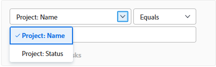

# 업무 균형자 를 사용하여 일괄 작업 할당

<!--Audited: 07/2024-->

Adobe Workfront 업무 균형자 를 사용하여 여러 작업 및 문제에 리소스를 일괄 할당할 수 있습니다.

업무 균형자를 사용하여 사용자에게 작업을 할당하는 방법에 대한 일반 정보는 [업무 균형자에서 작업 할당 개요](../../resource-mgmt/workload-balancer/assign-work-in-workload-balancer.md)를 참조하십시오.

## 액세스 요구 사항

+++ 이 문서의 기능에 대한 액세스 요구 사항을 보려면 확장하십시오.

<table style="table-layout:auto"> 
 <col> 
 <col> 
 <tbody> 
  <tr> 
   <td>Adobe Workfront 패키지</td> 
   <td>
Any
</td>
  </tr>
  <tr> 
   <td>Adobe Workfront 라이선스</td> 
   <td>
표준

       
리소스 영역 내 업무 균형자 사용 시 계획, 팀 또는 프로젝트의 업무 균형자 사용 시 작업
</td>
  </tr>
  <tr> 
   <td>액세스 수준 구성</td> 
   <td> 
다음에 대한 액세스 권한 편집:
 
    <ul> 
     <li>리소스 관리</li> 
     <li>프로젝트</li> 
     <li>작업</li> 
     <li>문제</li> 
    </ul>
   </td> 
  </tr> 
  <tr> 
   <td>개체 권한</td> 
   <td>할당이 포함된 프로젝트, 작업 및 문제에 권한 이상 기여</td> 
  </tr> 
 </tbody> 
</table>

자세한 내용은 [Workfront 설명서의 액세스 요구 사항](/help/quicksilver/administration-and-setup/add-users/access-levels-and-object-permissions/access-level-requirements-in-documentation.md)을 참조하십시오.

+++

## 업무 균형자에서 일괄 할당할 때 고려 사항

* 하나 이상의 프로젝트에서 여러 작업 및 문제에 대한 자원 할당을 신속하게 관리할 수 있습니다. 할당의 변경 사항은 업무 균형자에 즉시 표시됩니다.
* 완료된 작업 항목이나 완료된 프로젝트에 있는 항목에 리소스를 할당할 수 없습니다.
* 작업 역할 및 사용자를 일괄 할당할 때 다음 작업을 수행할 수 있습니다.

   * 유효한 모든 조합에서 사용자와 역할 간의 할당을 바꿉니다.
   * 모든 작업 항목에서 사용자 할당을 취소합니다.

**예**

* 여러 개의 새 프로젝트에서 사용자를 할당할 책임이 있습니다. 프로젝트는 원래 템플릿에서 만들어졌으며 작업 역할은 이미 프로젝트 내의 다양한 작업에 할당되었습니다. 현재 작업 역할에 할당된 모든 작업에 특정 사용자 Jackie Simms를 할당하려고 합니다. Replace 함수를 사용하여 이러한 작업을 Jackie Simm에게 할당할 수 있습니다.
* 3개의 다른 프로젝트에서 45개의 작업이 Jackie Simm에게 할당됩니다. Jackie는 조직을 떠나며 이제 다른 사용자에게 Jackie의 작업을 다시 할당해야 합니다. 바꾸기 기능을 사용하여 이러한 작업을 새 사용자에게 할당할 수 있습니다.
* 두 개의 다른 프로젝트에서 10개의 작업이 다른 사용자인 Rick Kuvec에게 할당됩니다. Rick이 이러한 작업에 잘못 할당되었음을 알 수 있지만 현재 해당 작업을 누구에게 할당해야 하는지 알 수 없습니다. 동시에 Rick을 모든 작업에 할당 해제해야 합니다. 할당 해제 기능을 사용하여 이러한 작업에서 Rick을 제거할 수 있습니다.

## 업무 균형자에서 일괄 작업 할당

1. 작업을 할당할 업무 균형자로 이동합니다.

   리소스 영역, 프로젝트 또는 팀 수준에서 업무 균형자 를 사용하여 사용자에게 작업을 할당할 수 있습니다. Workfront에서 업무 균형자 위치에 대한 자세한 내용은 [업무 균형자 찾기](../../resource-mgmt/workload-balancer/locate-workload-balancer.md)를 참조하십시오.

1. 업무 균형자 상단에서 **일괄 할당** 을 클릭합니다.

   일괄 할당 패널이 업무 균형자 오른쪽에 열립니다.

1. (조건부) 리소스 영역 또는 팀에서 업무 균형자에 액세스하는 경우 **프로젝트: 이름** 드롭다운 메뉴를 확장하고 필터 수정자를 사용하여 할당할 프로젝트를 선택합니다. 이름(기본 옵션) 또는 상태별로 프로젝트를 선택할 수 있습니다.

   Workfront 필터 수정자에 대한 자세한 내용은 [필터 및 조건 수정자](../../reports-and-dashboards/reports/reporting-elements/filter-condition-modifiers.md)를 참조하십시오.

   >[!NOTE]
   >
   >프로젝트에 대한 업무 균형자 를 액세스하면 기본적으로 프로젝트 이름 이 선택됩니다.

   

1. (선택 사항) **프로젝트 작업 선택**&#x200B;을 클릭하여 할당하려는 작업을 선택한 다음 **작업: 이름** 드롭다운 메뉴에서 이름(기본 옵션) 또는 상태별로 작업을 선택하고 필터 수정자를 사용하여 특정 작업을 검색합니다.

   Workfront 필터 수정자에 대한 자세한 내용은 [필터 및 조건 수정자](../../reports-and-dashboards/reports/reporting-elements/filter-condition-modifiers.md)를 참조하십시오.

   >[!NOTE]
   >
   >완료 상태의 작업은 선택할 수 없습니다.

   일괄 할당의 

   >[!TIP]
   >
   >문제와 작업에 일괄 할당하려면 이 선택을 비워 두십시오.

1. (선택 사항) 선택한 기준 중 하나 옆에 있는 **삭제** 아이콘 을 클릭합니다

   또는

   일괄 할당 패널의 오른쪽 상단 모서리에서 **모두 지우기**&#x200B;를 클릭하여 모든 선택 항목을 제거합니다.

1. 다음 옵션 중 하나를 선택하고 아래에 설명된 단계를 계속합니다.

   * [리소스 바꾸기](#replace-user)
   * [리소스 할당 해제](#unassign-user)

   >[!TIP]
   >
   >선택한 필터와 일치하는 항목이 없으면 이 옵션은 흐리게 표시됩니다.

<!--

### Assign user {#assign-user}

When you assign a user using Bulk Assignments in the Workload Balancer, the following things occur:

* A user is assigned to all work items currently assigned to a specified role within the selected projects.
* The user is not assigned to the following types of work items:

   * Items that are already assigned to a user.
   * Completed items.

* If the user you selected is not associated with the specified role, the role is replaced by the user in the user's Primary Role.

To assign a user to work items previously assigned to job roles:

1. Start assigning work items using Bulk Assignments in the Workload Balancer as described above and select **Assign**. 

1. In the **Role assignment** field, click the drop-down arrow to choose from a list of roles. Only roles currently assigned within the specified projects are displayed. This is a required field. 

   

1. In the **User to assign** field, click the drop-down arrow to choose from a list of suggested users or to type another user's name.

   Select users from the following areas:

   * **Suggested Assignments**: Users who can fulfill the selected role and who match the criteria for Smart Assignments. For more information, see [Smart assignments overview](../../manage-work/tasks/assign-tasks/smart-assignments.md).
   * **Other Assignments**: All users in the system who can fulfill the selected role. 
   
      >[!TIP]
      >
      >Only the first 50 users are listed in the Other Assignments area.

   After selecting a user, Workfront displays a note about the number of items where the user you specified will be assigned and what job role they will replace.

   >[!TIP]
   >
   >All the roles of the user display in the list, under the user's name.

1. Click **Assign**.

   The specified roles are replaced with the users that you selected.

   You receive a confirmation about how many work items have had the selected role replaced with the selected user.

   

-->

### 리소스 대체 {#replace-user}

작업 항목에 이미 할당된 리소스를 선택한 프로젝트의 다른 리소스로 바꿀 수 있습니다.

자원 대체 유형은 다음과 같습니다.

* 역할이 있는 역할
* 사용자가 있는 사용자
* 역할이 있는 사용자
* 사용자가 있는 역할

업무 균형자에서 일괄 할당을 사용하여 리소스를 다른 리소스로 대체할 때 다음과 같은 문제가 발생합니다.

* 대체 리소스는 선택한 프로젝트 내의 원래 리소스에 현재 지정된 모든 작업 항목에 할당됩니다.
* 새 리소스는 이미 완료로 표시된 작업 항목에 할당되지 않았습니다.
* 사용자 대 사용자 교체의 경우, 첫 번째 사용자와 연관된 역할이 두 번째 사용자의 역할과 일치하지 않으면 두 번째 사용자가 기본 역할에 할당됩니다.

리소스를 다른 리소스로 바꾸려면 다음을 수행합니다.

1. 위에서 설명한 대로 업무 균형자 일괄 할당 영역에서 작업 항목을 선택하고 **리소스 바꾸기**&#x200B;를 선택합니다.
1. **현재 할당된 리소스** 필드에서 드롭다운 화살표를 클릭하여 리소스 목록에서 선택합니다. 지정된 프로젝트 내의 미완료 작업 항목에 현재 할당된 리소스만 표시됩니다. 필수 필드입니다.

   

1. **할당할 리소스** 필드에서 드롭다운 화살표를 클릭하여 제안된 리소스 목록에서 선택하거나 다른 작업 역할 또는 사용자 이름을 입력합니다. 기본적으로 처음 나열된 리소스는 스마트 할당 기준과 일치합니다. 자세한 내용은 [스마트 할당 개요](../../manage-work/tasks/assign-tasks/smart-assignments.md)를 참조하십시오.

   Workfront은 현재 할당된 리소스가 두 번째 리소스를 대체할 항목 수에 대한 메모를 표시합니다.

1. **바꾸기**&#x200B;를 클릭합니다.

   선택한 프로젝트 또는 작업의 모든 작업 항목에서 첫 번째 리소스가 두 번째 리소스로 대체됩니다.

   선택한 두 번째 리소스로 최초 할당이 대체된 작업 항목 수에 대한 확인이 수신됩니다.

### 리소스 할당 해제 {#unassign-user}

선택한 프로젝트에서 리소스를 할당한 모든 작업 항목에서 리소스 할당을 취소할 수 있습니다.

업무 균형자에서 일괄 할당을 사용하여 모든 할당에서 사용자를 할당 해제할 경우 다음과 같은 문제가 발생합니다.

* 지정된 사용자가 할당된 모든 작업 항목에서 제거됩니다.
* 미할당 사용자가 작업 역할과 연관되어 있으면 사용자가 제거될 때 작업 역할이 작업 항목에 할당된 상태로 유지됩니다.

* 지정된 사용자가 완료된 작업 항목에 할당되면 해당 사용자는 해당 작업 항목에 할당된 상태로 유지됩니다.

사용자 및 작업 역할 할당에 대한 자세한 내용은 [업무 균형자에서 작업 할당 개요](../../resource-mgmt/workload-balancer/assign-work-in-workload-balancer.md)를 참조하십시오.

선택한 프로젝트 또는 할당된 작업 또는 문제에 대해 사용자를 작업 항목에서 할당 해제하려면 다음을 수행합니다.

1. 위에서 설명한 대로 업무 균형자 일괄 할당 영역에서 작업 항목을 선택하고 **리소스 할당 해제**&#x200B;를 선택합니다.

1. **할당 해제할 사용자** 필드에서 드롭다운 화살표를 클릭하여 사용자 목록에서 선택합니다. 지정된 프로젝트 내의 미완료 작업 항목에 현재 할당된 사용자만 표시됩니다. 필수 필드입니다.

   

   Workfront은 현재 할당된 사용자가 할당 해제될 항목 수에 대한 메모를 표시합니다.

1. **할당 해제**&#x200B;를 클릭합니다.\
   지정된 사용자가 제거된 작업 항목 수에 대한 확인을 받습니다.

