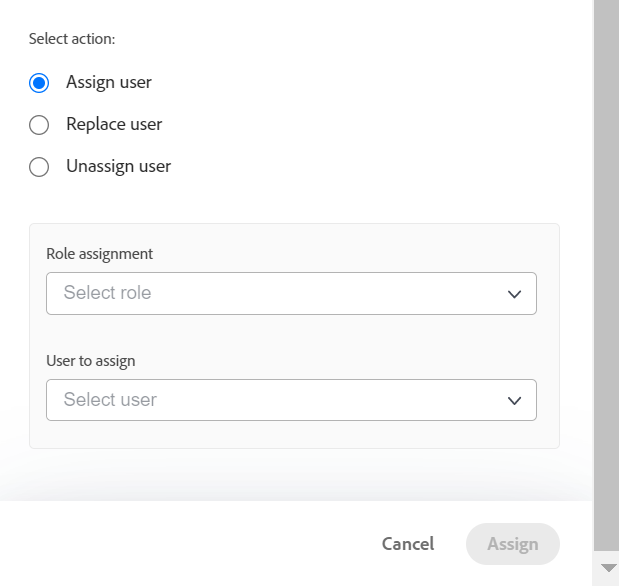
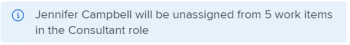

# 작업 로드 밸런서를 사용하여 일괄 작업 할당

<!--drafted
The highlighted information on this page refers to functionality not yet generally available. It is available only in the Preview environment. 
-->

Adobe Workfront 작업 로드 밸런서를 사용하여 사용자에게 작업 항목을 수동으로 할당할 수 있습니다.

작업 로드 밸런서를 사용하여 사용자에게 작업을 지정하는 방법에 대한 일반적인 정보는 [작업 로드 밸런서에서 작업 할당 개요](../../resource-mgmt/workload-balancer/assign-work-in-workload-balancer.md).

## 액세스 요구 사항

이 문서의 절차를 수행하려면 다음 액세스 권한이 있어야 합니다.

<table style="table-layout:auto"> 
 <col> 
 <col> 
 <tbody> 
  <tr> 
   <td role="rowheader">Adobe Workfront 플랜*</td> 
   <td> 
모든 
 </td> 
  </tr> 
  <tr> 
   <td role="rowheader">Adobe Workfront 라이선스*</td> 
   <td> 
리소스 영역에서 작업 로드 밸런서를 사용할 계획

   
작업, 팀 또는 프로젝트의 작업 로드 밸런서를 사용할 때

</td> 
  </tr> 
  <tr> 
   <td role="rowheader">액세스 수준*</td> 
   <td> 
다음에 대한 액세스 편집:
 
    <ul> 
     <li> 
리소스 관리
 </li> 
     <li> 
프로젝트
 </li> 
     <li> 
작업
 </li> 
     <li> 
문제
 </li> 
    </ul> 
<b>메모</b>

여전히 액세스 권한이 없는 경우 Workfront 관리자에게 액세스 수준에서 추가 제한 사항을 설정하는지 문의하십시오. Workfront 관리자가 액세스 수준을 변경하는 방법에 대한 자세한 내용은 <a href="../../administration-and-setup/add-users/configure-and-grant-access/create-modify-access-levels.md" class="MCXref xref">사용자 정의 액세스 수준 만들기 또는 수정</a>.
 </td>
</tr> 
  <tr> 
   <td role="rowheader">개체 권한</td> 
   <td> 
지정 작업을 포함하는 프로젝트, 작업 및 문제에 대한 권한 이상의 기여
 
추가 액세스 요청에 대한 자세한 내용은 <a href="../../workfront-basics/grant-and-request-access-to-objects/request-access.md" class="MCXref xref">개체에 대한 액세스 요청 </a>.
 </td> 
  </tr> 
 </tbody> 
</table>

&#42;어떤 계획, 라이선스 유형 또는 액세스 권한을 보유하고 있는지 알아보려면 Workfront 관리자에게 문의하십시오.

## 작업 로드 밸런서에서 벌크 지정을 위한 고려 사항

* 하나 이상의 프로젝트에서 여러 작업 및 문제에 대한 사용자 지정을 빠르게 관리할 수 있습니다. 할당 변경 사항은 작업 로드 밸런서에 즉시 표시됩니다.
* 완료된 작업 항목 또는 완료된 프로젝트에 있는 항목에 자원을 할당할 수 없습니다.
* 사용자를 일괄 할당할 때 다음 작업을 수행할 수 있습니다.

   * 현재 작업 역할에 지정된 모든 작업 항목에 사용자를 할당합니다.
   * 사용자 간 사용자 할당 바꾸기
   * 모든 작업 항목에서 사용자 할당을 취소합니다.

**예**

* 여러 새 프로젝트에 대해 사용자 지정을 수행해야 합니다. 원래 프로젝트는 템플릿에서 만들어졌고 작업 역할은 프로젝트 내의 다양한 작업에 이미 할당됩니다. 특정 사용자 Jackie Simms를 현재 Job 역할에 할당된 모든 작업에 할당하려고 합니다. 지정 기능을 사용하여 재키 심스에 이러한 작업을 할당할 수 있습니다.
* 재키 심즈에게 3개의 다른 프로젝트에서 45개의 작업이 할당됩니다. 재키가 조직을 떠나 이제 다른 사용자에게 그녀의 업무를 재할당해야 합니다. 바꾸기 기능을 사용하여 이러한 작업을 새 사람에게 할당할 수 있습니다.
* 2개의 다른 프로젝트에서 10개의 작업이 다른 사용자 Rick Kuvec에 할당됩니다. Rick이 잘못 이러한 작업에 할당되었다는 것을 알고 있지만, 현재 누가 이러한 작업에 할당되어야 하는지 확신할 수 없습니다. 모든 작업에 Rick의 할당을 동시에 취소해야 합니다. 할당 취소 기능을 사용하여 이러한 작업에서 Rick를 제거할 수 있습니다.

## 작업 로드 밸런서에서 일괄 작업 할당

1. 작업을 할당하려는 작업 로드 밸런서로 이동합니다.

   자원 조정 영역, 프로젝트 또는 팀 레벨에서 작업 로드 밸런서를 사용하여 사용자에게 작업을 할당할 수 있습니다. 작업 로드 밸런서가 Workfront에 있는 위치에 대한 자세한 내용은 [작업 로드 밸런서를 찾습니다.](../../resource-mgmt/workload-balancer/locate-workload-balancer.md).

1. 클릭 **일괄 지정**  작업 로드 밸런서의 맨 위에 있습니다.

   [벌크 할당] 패널이 작업 로드 밸런서의 오른쪽에 열립니다.

1. (조건부) 리소스 영역 또는 팀을 위해 작업 로드 밸런서에 액세스하는 경우 **프로젝트: 이름** 드롭다운 메뉴 및 필터 수정자를 사용하여 지정할 프로젝트 또는 프로젝트를 선택합니다. 이름별(기본 옵션) 또는 상태별로 프로젝트를 선택할 수 있습니다.

Workfront 필터 수정자에 대한 자세한 내용은 [필터 및 조건 수정자](../../reports-and-dashboards/reports/reporting-elements/filter-condition-modifiers.md).

>[!NOTE]
>
>프로젝트에 대한 작업 로드 밸런서에 액세스할 때 기본적으로 프로젝트 이름이 선택됩니다.

1. (선택 사항) **프로젝트 작업 선택** 할당하려는 태스크나 태스크를 선택하려면 **작업: 이름** 드롭다운 메뉴에서 이름별 작업(기본 옵션) 또는 상태를 선택하고 필터 수정자를 사용하여 특정 작업을 검색합니다.

Workfront 필터 수정자에 대한 자세한 내용은 [필터 및 조건 수정자](../../reports-and-dashboards/reports/reporting-elements/filter-condition-modifiers.md).

>[!NOTE]
>
>완료 상태에서는 작업을 선택할 수 없습니다.

>[!TIP]
>
>문제뿐만 아니라 작업에 대해 일괄 할당을 하려면 이 선택 사항을 비워 둡니다.

1. (선택 사항) **삭제** 아이콘  선택한 기준 중 하나 옆에 있습니다.

   또는

   클릭 **모두 지우기** [벌크 지정] 패널의 오른쪽 위 모서리에서 모든 선택 항목을 제거할 수 있습니다.

1. 다음 옵션 중 하나를 선택하고 아래 설명된 단계를 계속 진행합니다.

   * [사용자 할당](#assign-user)
   * [사용자 바꾸기](#replace-user)
   * [사용자 할당 해제](#unassign-user)

   >[!TIP]
   >
   >선택한 필터와 일치하는 항목이 없으면 이러한 옵션은 흐리게 표시됩니다.

### 사용자 할당 {#assign-user}

작업 로드 밸런서에서 일괄 지정을 사용하여 사용자를 지정할 때 다음과 같은 상황이 발생합니다.

* 사용자는 선택한 프로젝트 내에서 지정된 역할에 현재 지정된 모든 작업 항목에 할당됩니다.
* 사용자는 다음 유형의 작업 항목에 할당되지 않습니다.

   * 사용자에게 이미 할당된 항목입니다.
   * 완료된 항목.

* 선택한 사용자가 지정된 역할과 연관되지 않은 경우 해당 역할은 사용자의 기본 역할에 있는 사용자로 대체됩니다.

이전에 작업 역할에 할당된 작업 항목에 사용자를 할당하려면

1. 위에서 설명한 대로 작업 로드 밸런서에서 일괄 지정을 사용하여 작업 항목 지정을 시작하고 선택합니다 **지정**.

1. 에서 **역할 할당** 필드에서 드롭다운 화살표를 클릭하여 역할 목록에서 선택합니다. 지정한 프로젝트 내에 현재 지정된 역할만 표시됩니다. 필수 필드입니다.

   

1. 에서 **할당할 사용자** 필드에서 드롭다운 화살표를 클릭하여 추천 사용자 목록에서 선택하거나 다른 사용자 이름을 입력합니다.

   다음 영역에서 사용자를 선택합니다.

   * **제안된 지정**: 선택한 역할을 이행할 수 있고 Smart Assignment의 기준과 일치하는 사용자입니다. 자세한 내용은 [스마트 할당 개요](../../manage-work/tasks/assign-tasks/smart-assignments.md).
   * **기타 지정**: 선택한 역할을 수행할 수 있는 시스템의 모든 사용자입니다.

      >[!TIP]
      >
      >처음 50명의 사용자만 기타 지정 영역에 나열됩니다.
   사용자를 선택하면 Workfront에 지정된 사용자가 지정될 항목의 수와 사용자가 대체할 작업 역할에 대한 메모가 표시됩니다.

   >[!TIP]
   >
   >사용자의 모든 역할이 사용자 이름 아래에 목록에 표시됩니다.

1. 클릭 **지정**.

   지정한 역할이 선택한 사용자로 대체됩니다.

   선택한 사용자로 선택된 역할을 교체한 작업 항목 수에 대한 확인이 제공됩니다.

   

### 사용자 바꾸기 {#replace-user}

작업 항목에 이미 할당된 사용자를 선택한 프로젝트의 다른 사용자로 바꿀 수 있습니다.

작업 로드 밸런서에서 일괄 할당을 사용하여 사용자를 다른 사용자로 대체하면 다음과 같은 상황이 발생합니다.

* 대체 사용자는 선택한 프로젝트 내에서 원래 사용자에게 현재 할당된 모든 작업 항목에 할당됩니다.

* 새 사용자가 이미 완료로 표시된 작업 항목에 할당되지 않았습니다.
* 첫 번째 사용자와 연관된 역할이 두 번째 사용자의 역할과 일치하지 않으면 두 번째 사용자가 기본 역할에 할당됩니다.

사용자를 다른 사용자로 교체하려면

1. 위에서 설명한 대로 작업 로드 밸런서에서 작업 항목 지정을 시작하고 을 선택합니다 **바꾸기**.
1. 에서 **현재 할당된 사용자** 필드에서 드롭다운 화살표를 클릭하여 사용자 목록에서 선택합니다. 지정한 프로젝트 내의 불완전한 작업 항목에 현재 지정된 사용자만 표시됩니다. 필수 필드입니다.

   

1. 에서 **할당할 사용자** 필드에서 드롭다운 화살표를 클릭하여 추천 사용자 목록에서 선택하거나 다른 사용자 이름을 입력합니다. 기본적으로 목록에 나열된 사용자는 Smart Assignments의 기준과 일치합니다. 자세한 내용은 [스마트 할당 개요](../../manage-work/tasks/assign-tasks/smart-assignments.md).

   Workfront에는 현재 지정된 사용자가 두 번째 사용자를 대체하게 될 항목 수와 대체할 역할에 대한 메모가 표시됩니다.

   

1. 클릭 **바꾸기**.

   선택한 첫 번째 사용자가 선택한 프로젝트의 모든 작업 항목에서 두 번째 사용자로 대체됩니다.

   선택한 두 번째 사용자로 원래 사용자 할당을 대체한 작업 항목의 수에 대한 확인을 받습니다.

### 사용자 할당 해제 {#unassign-user}

선택한 프로젝트에서 사용자가 지정된 모든 작업 항목에서 사용자 할당을 취소할 수 있습니다.

작업 로드 밸런서에서 일괄 지정을 사용하여 모든 발령에서 사용자 할당을 취소할 경우 다음과 같은 상황이 발생합니다.

* 지정된 사용자가 할당된 모든 작업 항목에서 제거됩니다.
* 할당되지 않은 사용자가 작업 역할과 연관된 경우 사용자가 제거될 때 작업 역할이 작업 항목에 할당된 상태로 유지됩니다.

* 지정된 사용자가 완료된 작업 항목에 지정된 경우 해당 작업 항목에 지정된 상태로 유지됩니다.

사용자 및 Job 역할 지정에 대한 자세한 내용은 [작업 로드 밸런서에서 작업 할당 개요](../../resource-mgmt/workload-balancer/assign-work-in-workload-balancer.md).

선택한 프로젝트의 작업 항목이나 사용자가 지정된 작업 또는 문제에 대해 사용자의 할당을 취소하려면,

1. 위에서 설명한 대로 작업 로드 밸런서에서 작업 항목 지정을 시작하고 을 선택합니다 **할당 취소**.

1. 에서 **사용자 할당 취소** 필드에서 드롭다운 화살표를 클릭하여 사용자 목록에서 선택합니다. 지정한 프로젝트 내의 불완전한 작업 항목에 현재 지정된 사용자만 표시됩니다. 필수 필드입니다.

   

   Workfront에는 현재 지정된 사용자가 할당되지 않을 항목의 수에 대한 메모가 표시됩니다.

   

1. 클릭 **할당 취소**.\
   지정된 사용자가 제거된 작업 항목 수에 대한 확인이 제공됩니다.

 
