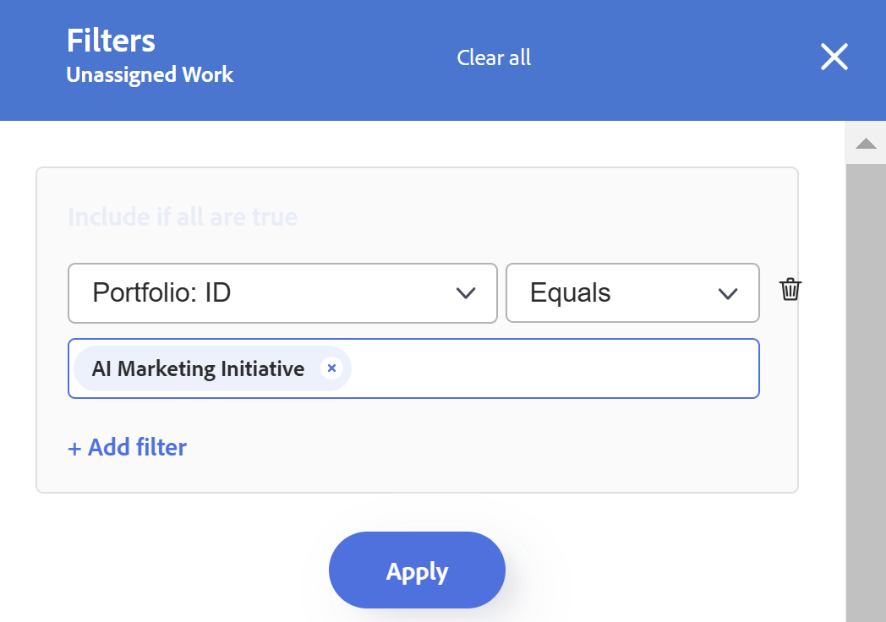
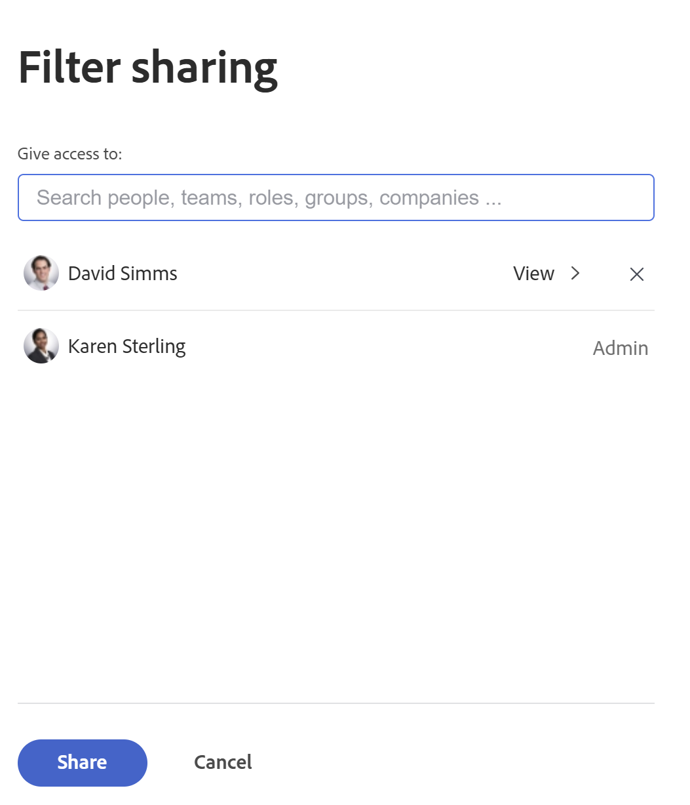

# 업무 균형자에서 정보 필터링

<!--
(when they add custom fields to fitlering, add the caveat you added for the Resource Planner : only field NAMES and not LABELS are to be found in the drop-down >> ADD THIS IN THE STEP BELOW WHEN ADDING A FILTER)
-->

리소스 관리자는 업무 균형자 를 사용하여 사용자의 업무 로드를 보고 관리할 수 있습니다. 업무 균형자에 대한 자세한 내용은 다음 문서를 참조하십시오.

* [업무 균형자 개요](../../resource-mgmt/workload-balancer/overview-workload-balancer.md)
* [업무 균형자 탐색](../../resource-mgmt/workload-balancer/navigate-the-workload-balancer.md)

>[!IMPORTANT]
>
>작업 항목을 효율적으로 찾고 관리하는 사용자 또는 항목에 집중하려면 업무 균형자에서 필터를 사용하는 것이 좋습니다. 이렇게 하면 자원 할당을 관리하기 전에 올바른 정보를 표시할 수 있습니다.
>
>새 필터를 저장하고 적용한 다음 업무 균형자에서 벗어나면 로그오프했다가 다시 로그온한 후에도 필터가 유지됩니다.

이 문서에는 업무 균형자 의 필터에 대한 정보가 포함되어 있습니다. Workfront의 필터에 대한 자세한 내용은 [필터 개요](../../reports-and-dashboards/reports/reporting-elements/filters-overview.md)를 참조하십시오.

## 액세스 요구 사항

다음 항목이 있어야 합니다.

<table style="table-layout:auto"> 
 <col> 
 </col> 
 <col> 
 </col> 
 <tbody> 
  <tr> 
   <td role="rowheader">Adobe Workfront 플랜*</td> 
   <td> 
모든 플랜
 </td> 
  </tr> 
  <tr> 
   <td role="rowheader">Adobe Workfront 라이센스*</td> 
   <td> 
리소스 조달 영역에서 업무 균형자 를 사용할 때 계획

   
팀 또는 프로젝트의 업무 균형자 를 사용할 때 작업

 </td> 
  </tr> 
  <tr> 
   <td role="rowheader">액세스 수준*</td> 
   <td> 
다음에 대한 액세스 권한 이상:
 
    <ul> 
     <li> 
리소스 관리
 </li> 
     <li> 
프로젝트
 </li> 
     <li> 
작업
 </li> 
     <li> 
문제
 </li> 
     <li data-mc-conditions="QuicksilverOrClassic.Quicksilver"> 
필터, 보기 및 그룹화
 </li> 
    </ul> 
필터를 빌드하거나 편집할 때 필터, 보기 및 그룹화에 대한 액세스 편집 
 
<b>메모</b>

여전히 액세스 권한이 없는 경우 Workfront 관리자에게 액세스 수준에 추가 제한을 설정하는지 문의하십시오. Workfront 관리자가 액세스 수준을 변경하는 방법에 대한 자세한 내용은 <a href="../../administration-and-setup/add-users/configure-and-grant-access/create-modify-access-levels.md" class="MCXref xref">사용자 지정 액세스 수준 만들기 또는 수정</a>을 참조하십시오.
 </td>
</tr> 
  <tr> 
   <td role="rowheader">개체 권한</td> 
   <td> 
프로젝트, 작업, 문제에 대한 이상의 권한 보기

   
편집하거나 삭제할 필터에 대한 권한 관리

     
 
추가 액세스 요청에 대한 자세한 내용은 <a href="../../workfront-basics/grant-and-request-access-to-objects/request-access.md" class="MCXref xref">개체 </a>에 대한 액세스 요청 을 참조하십시오.
 </td> 
  </tr> 
 </tbody> 
</table>

*보유 중인 플랜, 라이선스 유형 또는 액세스 권한을 확인하려면 Workfront 관리자에게 문의하십시오.

## 업무 균형자 의 필터 개요

업무 균형자에서 필터를 사용할 때는 다음 사항을 고려하십시오.

* 에서 업무 균형자에 액세스하는 위치에 따라 Workfront에서 이미 정보를 필터링하고 있을 수 있습니다. 사전 적용된 필터에 대한 자세한 내용은 이 문서의 [업무 균형자에서 사전 적용된 필터](#pre-applied-filters-in-the-workload-balancer) 섹션을 참조하십시오.
* 필터를 저장하지 않고 만들어 적용하거나, 나중에 다시 사용하도록 필터를 저장할 수 있습니다.
* 필터를 저장하지 않고 적용하면 페이지를 새로 고쳐 원래 목록으로 되돌릴 수 있습니다.
* 사용자가 만든 필터 또는 다른 사용자가 만들고 사용자와 공유한 필터를 볼 수 있습니다.
* 공유 필터를 삭제하거나 편집할 때 공유 필터가 공유된 모든 사용자에 대해 삭제되거나 편집됩니다.
* 한 영역의 업무 균형자에서 필터를 만들면 다른 영역에서는 사용할 수 없습니다.

  예를 들어 리소스 조달 영역에서 만든 필터는 프로젝트 또는 팀의 업무 균형자에서 사용할 수 없습니다.

  업무 균형자 위치에 대한 자세한 내용은 [업무 균형자 찾기](../../resource-mgmt/workload-balancer/locate-workload-balancer.md)를 참조하십시오.

* 업무 균형자 화면에 표시된 타임라인 내의 날짜와 일치하는 선택한 필터와 일치하는 항목만 볼 수 있습니다.

## 업무 균형자에서 사전 적용된 필터 {#pre-applied-filters-in-the-workload-balancer}

업무 균형자 는 두 개의 별도 영역에 정보를 표시합니다.

* **할당 해제된 작업 영역**: 사용자에게 아직 할당되지 않은 작업 항목입니다.
* **할당된 작업 영역**: 사용자에게 할당된 작업 항목입니다.

  각 영역에 표시되는 내용에 대한 자세한 내용은 [업무 균형자 탐색](../../resource-mgmt/workload-balancer/navigate-the-workload-balancer.md)을 참조하십시오.

>[!IMPORTANT]
>
>업무 균형자의 각 영역에는 서로 독립적으로 작동하는 자체 필터 세트가 있습니다. 각 영역에서 보려는 정보를 나타내도록 두 필터를 모두 구성해야 합니다.

업무 균형자에 사용자와 사용자의 작업 항목이 표시됩니다.
사용자에게 할당된 작업 항목은 항목의 날짜가 화면에 표시되는 시간 프레임과 일치하는 경우에만 표시됩니다.

에서 업무 균형자에 액세스하는 위치에 따라 미할당 및 할당 영역이 이미 다음 표에 설명된 대로 특정 기준으로 필터링됩니다.

<table style="table-layout:auto"> 
 <col> 
 <col> 
 <col> 
 <tbody> 
  <tr> 
   <td role="rowheader"><strong>업무 균형자에 액세스하는 Workfront 영역</strong></td> 
   <td><b>기본적으로 할당 해제된 작업 영역에 표시되는 항목</b> </td> 
   <td><b>기본적으로 할당된 작업 영역에 표시되는 항목</b> </td> 
  </tr> 
  <tr> 
   <td role="rowheader">리소스 조달 영역</td> 
   <td>기본적으로 여기에 표시되는 항목이 없습니다. 이 영역의 작업 항목을 보려면 필터를 사용자 정의해야 합니다.</td> 
   <td>귀하의 팀 및 해당 작업 항목에 속하는 사용자입니다. </td> 
  </tr> 
  <tr> 
   <td role="rowheader">팀</td> 
   <td>팀 또는 팀에 할당된 작업 항목과 작업 역할입니다. </td> 
   <td> 
선택한 팀의 멤버인 사용자 및 해당 작업 항목입니다.
 </td> 
  </tr> 
  <tr> 
   <td role="rowheader">프로젝트</td> 
   <td> 
할당 해제된 작업 항목이나 선택한 프로젝트의 팀이나 작업 역할에 할당된 항목이 이 영역에 표시됩니다.
 </td> 
   <td> 
시스템 기본 필터 <b>이 프로젝트의 작업 항목</b>을(를) 선택할 때 선택한 프로젝트에서 하나 이상의 작업 항목과 해당 프로젝트의 작업 항목에 할당된 사용자입니다. 

시스템 기본 필터 <b>이 프로젝트의 작업 항목</b>을(를) 선택 취소하면 프로젝트의 할당된 작업 영역에 선택한 프로젝트에서 하나 이상의 항목에 할당된 사용자의 작업 항목이 모두 표시됩니다.  
 이 필터는 기본적으로 선택 해제되어 있습니다.

<b>참고</b>

프로젝트의 업무 균형자에서 모든 사용자 표시 옵션을 활성화하면 시스템의 모든 사용자가 표시됩니다. 자세한 내용은 <a href="../workload-balancer/navigate-the-workload-balancer.md" class="MCXref xref">업무 균형자 탐색</a>을 참조하십시오.

</td> 
  </tr> 
 </tbody> 
</table>

## 업무 균형자 필터 만들기

업무 균형자에서 미할당 작업 및 할당된 작업 영역에 대한 필터를 만드는 프로세스는 업무 균형자에 액세스하는 위치에 관계없이 동일합니다. 업무 균형자 찾기에 대한 자세한 내용은 [업무 균형자 찾기](../../resource-mgmt/workload-balancer/locate-workload-balancer.md)를 참조하십시오.

필터를 처음부터 만들거나 미리 정의된 필터 중 하나를 편집할 수 있습니다. 편집할 수 있는 기존 필터에 대한 자세한 내용은 이 문서의 [업무 균형자에서 기존 필터 편집](#edit-an-existing-filter-in-the-workload-balancer) 섹션을 참조하십시오.

1. 업무 균형자로 이동합니다.

   업무 균형자 액세스에 대한 자세한 내용은 [업무 균형자 탐색](../../resource-mgmt/workload-balancer/navigate-the-workload-balancer.md)을 참조하십시오.

1. **할당 해제된 작업** 또는 **할당된 작업** 영역의 오른쪽 위 모서리에 있는 **필터** 아이콘 을(를) 클릭합니다.

   필터 빌더 상자가 오른쪽에 표시됩니다. 필터를 만드는 영역의 이름이 상자의 헤더에 표시됩니다.

   

1. (선택 사항 및 조건부) 리소스 영역의 업무 균형자에 액세스하는 경우 미리 정의된 기본 필터가 할당된 작업 영역에 이미 적용되었을 수 있습니다. 기본 필터의 복사본을 편집하고 저장할 수 있습니다.

   >[!TIP]
   >
   >기본 필터는 팀 및 해당 작업 항목에 속하는 사용자를 표시합니다. 이 필터의 복사본을 편집할 수 있습니다.

   프로젝트에서 [!UICONTROL 업무 균형자]에 액세스하는 경우 &quot;[!UICONTROL 이 프로젝트의 작업 항목]&quot; 필터가 이미 적용되었을 수 있습니다. 이 프로젝트의 사용자에게 할당된 작업 항목만 표시됩니다. 이 필터의 복사본을 복제하고 저장할 수 있습니다.

   기본적으로 프로젝트의 [!UICONTROL 업무 균형자]에는 프로젝트의 모든 사용자에게 할당된 모든 작업 항목이 표시됩니다.

1. **새 필터를 클릭합니다.**

   

1. 필터를 만들려면 다음을 수행하십시오.

   1. 첫 번째 드롭다운 메뉴에서 필드 이름을 선택하거나 **필드 찾아보기**&#x200B;를 클릭하여 기본적으로 표시되지 않는 필드 이름을 입력하십시오.

      >[!IMPORTANT]
      >
      >사용자 정의 필드를 참조할 때는 필드 레이블이 아니라 필드 이름을 입력해야 합니다. 필드 레이블은 오브젝트에 첨부된 사용자 정의 양식에 표시됩니다. 사용자 지정 필드의 레이블과 이름 간의 차이에 대한 자세한 내용은 [양식 디자이너를 사용하여 양식 디자인](/help/quicksilver/administration-and-setup/customize-workfront/create-manage-custom-forms/form-designer/design-a-form/design-a-form.md)을 참조하십시오.

   1. (조건부) **필드 찾아보기**&#x200B;를 클릭한 경우 **검색** 필드에 필드 이름을 입력하고 목록에 표시될 때 선택합니다.

      

      >[!TIP]
      >
      >다음 섹션에서 필드를 선택할 수 있습니다.
      >
      >* **최근 선택 항목**: 최근에 필터링한 필드입니다.
      >* **제안된 필드**: 가장 일반적으로 사용되는 필드입니다.

   1. 두 번째 드롭다운 메뉴에서 수정자를 선택합니다. Workfront 필터 수정자에 대한 자세한 내용은 [필터 및 조건 수정자](../../reports-and-dashboards/reports/reporting-elements/filter-condition-modifiers.md)를 참조하십시오.
   1. 필터링할 필드의 값을 선택하거나 입력합니다.

      >[!NOTE]
      >
      > 특정 포트폴리오의 작업 오브젝트를 표시하려는 경우 다음 필터를 적용할 수 있습니다. &quot;Portfolio 이름에 마케팅이 포함되어 있습니다.&quot; 이름에 &quot;marketing&quot;이 포함된 포트폴리오에 속하는 작업 항목이 표시됩니다.
      >
      >

      >[!NOTE]
      >
      >보류 중 상태의 프로젝트를 제외하려면 &quot;프로젝트: 상태가 보류 중과 같지 않음&quot; 필터를 적용해야 합니다. 이렇게 하면 보류 중 프로젝트의 작업 항목이 업무 균형자에 표시되지 않습니다.

   1. (선택 사항) 필터 조건을 제거하려면 **삭제** 아이콘 을(를) 클릭합니다.

1. (선택 사항) **필터 추가**&#x200B;를 클릭하여 다른 필터 조건을 추가한 다음 4단계의 작업을 반복합니다.

   <!--(NOTE: ensure this stays correct)-->

1. 필터 결과를 저장하지 않고 선택한 업무 균형자 영역에 적용하려면 **적용**&#x200B;을 클릭하십시오.

   왼쪽에 작업 항목 목록이 업데이트됩니다.

   >[!IMPORTANT]
   >
   >추가한 모든 필터 문이 동시에 true일 때 결과가 업무 균형자에 표시됩니다.

   필터는 페이지를 새로 고칠 때까지 유지됩니다.

   **적용** 단추가 **새 항목으로 저장** 단추로 바뀌었습니다.

1. 나중에 사용할 수 있도록 필터를 저장하려면 **새 이름으로 저장**&#x200B;을 클릭하세요.

   

   >[!TIP]
   >
   >언제든지 **취소**&#x200B;를 클릭하면 필터 빌드 영역으로 돌아갑니다.

1. **제목 없는 필터**&#x200B;를 선택하고 대신 새 필터의 이름을 입력하십시오.
1. **아이콘** 드롭다운 메뉴에서 새 필터의 아이콘을 선택합니다.

   

1. (선택 사항) 필터에 대한 설명을 추가하여 필터의 고유한 내용을 나타냅니다. 설명은 필터 목록의 필터 이름 아래에 표시됩니다.
1. **저장**&#x200B;을 클릭합니다.

   저장된 필터는 필터 상자의 내 필터 영역에 표시됩니다.

   저장된 필터를 적용하는 방법에 대한 자세한 내용은 이 문서의 [업무 균형자에서 저장된 필터 삭제](#delete-a-saved-filter-in-the-workload-balancer) 섹션을 참조하십시오.

1. (조건부) **할당 해제된 작업** 또는 **할당된 작업** 영역의 오른쪽 위 모서리에 있는 **필터 아이콘**  위로 마우스를 가져가면 현재 적용된 필터 이름이나 개수의 도구 설명이 표시됩니다.

   

## 필터 복제

필터를 복제하고 편집하여 새 필터를 만들 수 있습니다.

1. 업무 균형자로 이동합니다.

   업무 균형자 액세스에 대한 자세한 내용은 [업무 균형자 탐색](../../resource-mgmt/workload-balancer/navigate-the-workload-balancer.md)을 참조하십시오.

1. **할당 해제된 작업** 또는 **할당된 작업** 영역의 오른쪽 위 모서리에 있는 **필터** 아이콘 을(를) 클릭합니다.

   필터 빌더 상자가 오른쪽에 표시됩니다. 필터를 만드는 영역의 이름이 상자의 헤더에 표시됩니다.

1. 기존 필터 위로 마우스를 가져간 후 **자세히** 메뉴 을(를) 클릭한 다음 **복제**&#x200B;를 클릭합니다.

   

   >[!TIP]
   >
   > 필터를 편집하는 동안 필터 편집 상자의 왼쪽 아래 모서리에 있는 **자세히** 메뉴를 클릭한 다음 **복제**&#x200B;를 클릭할 수 있습니다.

1. 복제된 필터에 대한 다음 정보를 편집합니다.

   * 이름

     기본적으로 새 필터 이름은 &quot;(원래 필터 이름) 사본&quot;입니다.

   * 아이콘
   * 설명
   * 모든 필드, 수정자 또는 값

1. (선택 사항) **필터 추가**&#x200B;를 클릭하여 중복된 필터에 문을 더 추가합니다.
1. **저장**&#x200B;을 클릭하여 **내 필터** 영역에 중복된 필터를 저장합니다.

   원본 필터는 변경되지 않고 복제된 필터는 새 필터로 저장됩니다.

## 업무 균형자에서 기존 필터 편집 {#edit-an-existing-filter-in-the-workload-balancer}

업무 균형자에서 저장된 필터를 편집할 수 있습니다.

>[!TIP]
>
>다른 사용자와 공유되는 필터를 편집하면 변경한 사항도 표시됩니다.

1. 업무 균형자로 이동합니다.

   업무 균형자 액세스에 대한 자세한 내용은 [업무 균형자 탐색](../../resource-mgmt/workload-balancer/navigate-the-workload-balancer.md)을 참조하십시오.

1. **미할당** 또는 **할당된 작업** 영역의 오른쪽 위 모서리에 있는 **필터 아이콘** 을(를) 클릭합니다.\
   필터 빌더가 오른쪽에 표시됩니다.

1. 편집할 필터 위로 마우스를 가져간 다음 **편집** 을(를) 클릭합니다.

   

1. 다음 중 하나를 수행하십시오.

   * 필터 문 수정
   * 새 필터 문을 추가하려면 **필터 추가**&#x200B;를 클릭하십시오.
   * 기존 필터 문을 제거하려면 **삭제** 아이콘 을(를) 클릭하십시오.

1. (선택 사항) **적용**&#x200B;을 클릭합니다.

   필터의 변경 사항을 설명하기 위해 왼쪽의 업무 균형자에서 결과가 업데이트됩니다.

1. **저장**&#x200B;을 클릭합니다.

   왼쪽의 업무 균형자에서 결과가 업데이트되고 선택한 새 정보로 필터가 업데이트됩니다.

## 업무 균형자에서 저장된 필터 삭제 {#delete-a-saved-filter-in-the-workload-balancer}

필터를 삭제하기 전에 다음 사항을 고려하십시오.

* 삭제된 필터는 복구할 수 없습니다.
* 사전 정의된 필터는 삭제할 수 없습니다.
* 저장하지 않은 필터는 삭제할 수 없습니다. Workfront에서 로그아웃했다가 다시 로그인하면 자동으로 제거됩니다.
* 공유 필터를 삭제하면 공유 필터가 공유된 모든 사용자에 대해서도 삭제됩니다.
* 저장된 필터를 모두 삭제하면 업무 균형자 가 원래 기본값에 따라 표시됩니다.

>[!NOTE]
>
>다른 사용자와 공유된 필터를 삭제하면 해당 사용자에 대해서도 삭제됩니다.

1. 업무 균형자로 이동
1. **할당 해제된 작업** 또는 **할당된 작업** 영역의 오른쪽 위 모서리에 있는 **필터 아이콘** 을(를) 클릭합니다.\
   필터 빌더 상자가 오른쪽에 표시됩니다.

1. 필터 위로 마우스를 가져간 후 **자세히** 메뉴 을(를) 클릭한 다음 **삭제**를 클릭합니다.
   

   >[!TIP]
   >
   >필터를 편집하는 동안 필터 편집 상자의 왼쪽 아래 모서리에 있는 **자세히** 메뉴를 클릭한 다음 **삭제**&#x200B;를 클릭할 수 있습니다.

1. (선택 사항) 삭제를 방지하고 필터 목록으로 돌아가려면 **취소**&#x200B;를 클릭합니다.
1. **삭제**&#x200B;를 클릭하여 삭제를 확인합니다.

   사용자 및 이 필터에 대한 권한이 있는 모든 사용자에 대해 필터가 삭제됩니다.

## 업무 균형자에서 필터 공유

직접 만들었거나 다른 사용자가 공유한 필터를 공유할 수 있습니다.

업무 균형자에서 필터를 공유할 때는 다음 사항을 고려하십시오.

* 활성 사용자, 팀, 역할 및 회사와 필터를 공유하거나 Workfront 인스턴스의 모든 사용자에게 표시되도록 할 수 있습니다.
* 리소스 조달 영역에서 공유하는 필터는 프로젝트 또는 팀의 업무 균형자에 표시되지 않습니다.
* 다른 사용자와 공유하는 업무 균형자 필터는 Workfront의 다른 영역에 표시되지 않습니다.

필터를 공유하려면 다음을 수행하십시오.

1. 업무 균형자로 이동
1. **할당 해제된 작업** 또는 **할당된 작업** 영역의 오른쪽 위 모서리에 있는 **필터 아이콘** 을(를) 클릭합니다.\
   필터 빌더 상자가 오른쪽에 표시됩니다.

1. 필터 위로 마우스를 가져간 후 **자세히** 메뉴 을(를) 클릭한 다음 **공유**&#x200B;를 클릭합니다.

   

   >[!TIP]
   >
   > 필터를 편집하는 동안 필터 편집 상자의 왼쪽 아래 모서리에 있는 **자세히** 메뉴를 클릭한 다음 **공유**&#x200B;를 클릭할 수 있습니다.

   필터 공유 상자가 표시됩니다.

1. **시스템 전체 보기** 설정을 사용하도록 설정합니다. 이렇게 하면 Workfront의 모든 사용자에게 필터를 볼 수 있는 권한이 부여됩니다.

   또는

   **액세스 권한 부여** 필드에 필터를 공유할 사용자, 팀, 역할, 그룹 또는 회사의 이름을 입력하십시오.

   

1. (선택 사항) 엔터티 이름 옆에 있는 오른쪽 화살표를 클릭하여 필터에 대한 권한을 편집한 다음 **보기** 또는 **관리** 옵션을 활성화합니다.

   

1. (선택 사항) 다음 중 하나를 수행하여 엔티티에 대한 추가 권한을 활성화하거나 비활성화합니다.

   1. **보기**&#x200B;를 클릭하고 **공유** 옵션을 비활성화합니다. 기본적으로 활성화되어 있습니다.

   1. **관리**&#x200B;를 클릭하고 **공유** 또는 **삭제** 옵션을 사용하지 않도록 설정합니다. 기본적으로 활성화되어 있습니다.

   >[!TIP]
   >
   >사용자는 액세스 수준보다 높은 권한을 받을 수 없습니다. 액세스 수준의 필터 편집에 액세스할 수 없는 사용자에게는 필터 관리 권한이 부여되지 않습니다. Workfront은 이러한 사용자에 대한 관리 옵션을 비활성화하고 옵션이 흐리게 표시됩니다.

1. **공유**&#x200B;를 클릭합니다. 필터는 지정한 엔티티와 공유됩니다.

   공유한 필터가 필터 상자의 **나와 공유** 영역에 표시됩니다.

   

<!--   

## Add a filter to your favorites list

You can mark a filter as a favorite for quicker access to it. 

The filters that you mark as a favorite do not count towards your system Favorites list. There is no limit for how many filters you can favorite. 

1. Go to the Workload Balancer
1. Click the **Filter** icon  in the upper-right corner of the **Unassigned Work** or **Assigned Work** areas. The filter builder box displays on the right. 
1. Mouse over a filter, then click the **Favorite** . 
(NOTE: insert screen shot here with Favorite as part of this menu - same as above ones but with Favorite)
1. The filter is listed in the **Favorited** section inside the filter panel. 
1. (Optional) Click the **Favorite** icon again to remove the filter from the list of favorite filters
(I logged bugs for "Favorited" and "Unfavorite" wordings - make sure these have not updated)
-->
