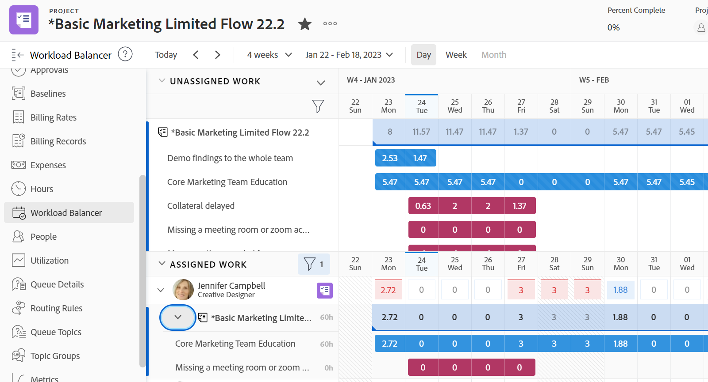

# 업무 균형자 찾기

업무 균형자 를 사용하여 작업에 대한 리소스를 예약하거나 해당 리소스의 가용성 및 현재 할당을 검토할 수 있습니다.

다음과 같은 방법으로 업무 균형자에 액세스할 수 있습니다.

* Adobe Workfront에서 사전 정의한 여러 영역
* 사용자 정의 섹션에 추가

이 문서에서는 업무 균형자에 액세스할 수 있는 영역에 대해 설명합니다.

>[!NOTE]
>
>업무 균형자에 액세스하는 데 사용하는 방법에 관계없이, 업무 균형자를 탐색하고 리소스를 관리하는 것은 동일합니다.
>
>업무 균형자 와 이를 사용하여 작업 리소스를 관리하고 예약하는 방법에 대한 자세한 내용은 다음 문서를 참조하십시오.
>
>* [업무 균형자 개요](../../resource-mgmt/workload-balancer/overview-workload-balancer.md)
>* [업무 균형자 탐색](../../resource-mgmt/workload-balancer/navigate-the-workload-balancer.md)
>* [업무 균형자에서 작업 할당 개요](../../resource-mgmt/workload-balancer/assign-work-in-workload-balancer.md)
>* [업무 균형자에서 사용자 할당 관리](../../resource-mgmt/workload-balancer/manage-user-allocations-workload-balancer.md)

## 액세스 요구 사항

+++ 을 확장하여 이 문서의 기능에 대한 액세스 요구 사항을 봅니다.

이 문서의 단계를 수행하려면 다음 액세스 권한이 있어야 합니다.

<table style="table-layout:auto"> 
 <col> 
 <col> 
 <tbody> 
  <tr> 
   <td role="rowheader">Adobe Workfront 플랜</td> 
   <td> 
임의 
 </td> 
  </tr> 
  <tr> 
   <td role="rowheader">Adobe Workfront 라이선스</td> 
   <td>
새로운 기능: 표준

       
또는

       
현재: 리소스 조달 영역에서 업무 균형자 사용 시 계획; 
       팀 또는 프로젝트의 업무 균형자 를 사용할 때 작업
</td>
  </tr> 
   <td role="rowheader">액세스 수준 구성</td> 
   <td> 
다음에 대한 액세스 권한 이상:
 
    <ul> 
     <li>리소스 관리</li> 
     <li>프로젝트</li> 
     <li>작업</li> 
     <li>문제</li> 
    </ul> </td> 
  </tr> 
  <tr> 
   <td role="rowheader">개체 권한</td> 
   <td>프로젝트, 작업 및 문제에 대한 권한 이상 보기</td> 
  </tr> 
 </tbody> 
</table>

이 표의 정보에 대한 자세한 내용은 [Workfront 설명서의 액세스 요구 사항](/help/quicksilver/administration-and-setup/add-users/access-levels-and-object-permissions/access-level-requirements-in-documentation.md)을 참조하십시오.

+++

## 사전 정의된 영역의 업무 균형자에 액세스

다음 섹션에서는 Workfront 내의 업무 균형자에 액세스할 수 있는 위치를 설명합니다.

### 리소스 조달 영역의 여러 프로젝트에 대한 업무 균형자 액세스

{{step1-to-resourcing}}

1. 왼쪽 패널에서 **업무 균형자**&#x200B;를 클릭합니다.

   

   업무 균형자 는 기본적으로 다음 정보를 리소스 조달 영역에 표시합니다.

   * **할당 해제된 작업**: 할당 해제된 작업 항목이 없습니다.
   * **할당된 작업**: 시스템의 모든 활성 사용자.

     할당된 작업 영역에 사용자를 표시할 때는 필터를 사용하는 것이 좋습니다. 자세한 내용은 [업무 균형자에서 정보 필터링](../workload-balancer/filter-information-workload-balancer.md)을 참조하십시오.

### 팀의 업무 균형자 액세스

Workfront의 팀에 대한 자세한 내용은 [팀 개요](/help/quicksilver/people-teams-and-groups/create-and-manage-teams/teams-overview.md)를 참조하십시오.

{{step1-to-team}}

홈 팀의 페이지가 표시됩니다.

1. 왼쪽 패널에서 **업무 균형자**&#x200B;를 클릭합니다.

   

   팀의 업무 균형자 에는 기본적으로 다음 정보가 표시됩니다.

   * **할당 해제된 작업**: 팀에 할당되고 사용자에게 할당되지 않은 항목입니다.
   * **할당된 작업**: 모든 할당이 있는 모든 팀원

     >[!TIP]
     >
     >팀원에게도 팀에 할당된 작업 또는 다른 팀이나 역할에 할당된 작업에 할당되었을 수 있습니다.

### 프로젝트의 업무 균형자 액세스

{{step1-to-projects}}

1. 프로젝트 이름을 클릭하여 프로젝트 페이지를 엽니다.
1. 왼쪽 패널에서 **업무 균형자**&#x200B;를 클릭합니다.

   프로젝트에 대한 업무 균형자 가 표시됩니다.

   

   프로젝트의 업무 균형자 에는 기본적으로 다음 정보가 표시됩니다.

   * **할당 해제된 작업**: 작업 역할 또는 팀에 할당되고 사용자에게 할당되지 않은 프로젝트의 항목입니다.
   * **할당된 작업**: 프로젝트의 항목에 할당된 사용자.

     >[!TIP]
     >
     >모든 사용자 표시 옵션을 활성화하면 프로젝트(할당된 작업 영역)의 사용자만 표시하지 않고 시스템의 모든 사용자를 표시할 수 있습니다. 자세한 내용은 [업무 균형자 탐색](../workload-balancer/navigate-the-workload-balancer.md)을 참조하십시오.

## 사용자 정의 섹션에 업무 균형자 추가

업무 균형자 를 모든 사용자 정의 섹션에 추가할 수 있습니다.

업무 균형자에 이미 적용한 대부분의 사용자 지정은 사용자 지정 섹션에 추가할 때 유지됩니다.

1. 다음 영역으로 이동하여 업무 균형자에 액세스합니다.

   * 리소스 조달 영역
   * 팀
   * 프로젝트

1. [링크와 업무 균형자 공유](../../resource-mgmt/workload-balancer/share-link-for-workload-balancer.md)에 설명된 대로 공유 가능한 링크를 가져와 클립보드에 복사합니다.
1. [외부 웹 페이지를 대시보드에 포함](../../reports-and-dashboards/dashboards/creating-and-managing-dashboards/embed-external-web-page-dashboard.md)에 설명된 대로 외부 페이지를 사용하여 대시보드를 만듭니다. 2단계에서 얻은 공유 가능한 링크를 외부 페이지에 사용합니다.

   <!--
      (NOTE: ensure this stays correct)
      -->

1. [사용자 지정 탭 또는 섹션 만들기](../../workfront-basics/manage-your-account-and-profile/configuring-your-user-profile/create-custom-tabs.md)에 설명된 대로 사용자 지정 섹션을 만들어 대시보드를 사용자 지정 탭에 배치합니다.

   사용자 정의 섹션에서 업무 균형자에 액세스할 때 1단계에 나열된 원래 영역 중 하나에서 직접 액세스하는 것처럼 볼 수 있습니다.

   <!--
      (NOTE: ensure this stays correct)
     -->

1. (선택 사항) [레이아웃 템플릿을 사용하여 왼쪽 패널 사용자 지정](../../administration-and-setup/customize-workfront/use-layout-templates/customize-left-panel.md)에 설명된 대로 레이아웃 템플릿에서 사용자 지정 탭을 공유합니다.

<!--
For a team:

* From the Workload Balancer section of a team.

  You can adjust allocations and review or assign work from multiple projects to individual team members.

For a project:

  You can do the following when you use the Workload Balancer within a project:

   * Assign work on the project to users already assigned other work on the project.
   * Assign work to any user that might not be on the project.

   * View additional work that users are assigned to on other projects.
   * Adjust user allocations to work items.-->
