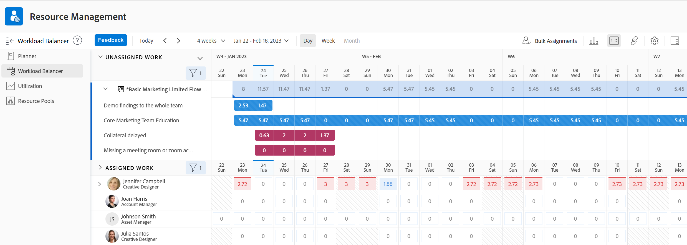

# 업무 균형자 찾기

업무 균형자 를 사용하여 작업에 대한 리소스를 예약하거나 해당 리소스의 가용성 및 현재 할당을 검토할 수 있습니다.

다음과 같은 방법으로 업무 균형자에 액세스할 수 있습니다.

* Adobe Workfront에서 사전 정의한 여러 영역
* 사용자 정의 섹션에 추가

이 문서에서는 업무 균형자에 액세스할 수 있는 영역에 대해 설명합니다.

>[!NOTE]
>
>업무 균형자에 액세스하는 데 사용하는 방법에 관계없이, 업무 균형자를 탐색하고 리소스를 관리하는 것은 동일합니다.
>
>업무 균형자 와 이를 사용하여 작업 리소스를 관리하고 예약하는 방법에 대한 자세한 내용은 다음 문서를 참조하십시오.
>
>* [업무 균형자 개요](../../resource-mgmt/workload-balancer/overview-workload-balancer.md)
>* [업무 균형자 탐색](../../resource-mgmt/workload-balancer/navigate-the-workload-balancer.md)
>* [업무 균형자에서 작업 할당 개요](../../resource-mgmt/workload-balancer/assign-work-in-workload-balancer.md)
>* [업무 균형자에서 사용자 할당 관리](../../resource-mgmt/workload-balancer/manage-user-allocations-workload-balancer.md)
>

## 액세스 요구 사항

이 문서의 단계를 수행하려면 다음 액세스 권한이 있어야 합니다.

<table style="table-layout:auto"> 
 <col> 
 <col> 
 <tbody> 
  <tr> 
   <td role="rowheader">Adobe Workfront 플랜*</td> 
   <td> 
임의 
 </td> 
  </tr> 
  <tr> 
   <td role="rowheader">Adobe Workfront 라이센스*</td> 
   <td> 
리소스 조달 영역에서 업무 균형자 를 사용할 때 계획

   
팀 또는 프로젝트의 업무 균형자 를 사용할 때 작업

 </td> 
  </tr> 
  <tr> 
   <td role="rowheader">액세스 수준*</td> 
   <td> 
다음에 대한 액세스 권한 이상:
 
    <ul> 
     <li> 
리소스 관리
 </li> 
     <li> 
프로젝트
 </li> 
     <li> 
작업
 </li> 
     <li> 
문제
 </li> 
    </ul> 
<b> 메모</b>

여전히 액세스 권한이 없는 경우 Workfront 관리자에게 액세스 수준에 추가 제한을 설정하는지 문의하십시오. Workfront 관리자가 액세스 수준을 변경하는 방법에 대한 자세한 내용은 <a href="../../administration-and-setup/add-users/configure-and-grant-access/create-modify-access-levels.md" class="MCXref xref">사용자 정의 액세스 수준 만들기 또는 수정</a>.
 </td>
</tr> 
  <tr> 
   <td role="rowheader">개체 권한</td> 
   <td> 
프로젝트, 작업 및 문제에 대한 권한 이상 보기 
 
추가 액세스 요청에 대한 자세한 내용은 <a href="../../workfront-basics/grant-and-request-access-to-objects/request-access.md" class="MCXref xref">오브젝트에 대한 액세스 요청 </a>.
 </td> 
  </tr> 
 </tbody> 
</table>

*보유 중인 플랜, 라이선스 유형 또는 액세스 권한을 확인하려면 Workfront 관리자에게 문의하십시오.

## 사전 정의된 영역의 업무 균형자에 액세스

다음 섹션에서는 Workfront 내의 업무 균형자에 액세스할 수 있는 위치를 설명합니다.

### 리소스 조달 영역의 여러 프로젝트에 대한 업무 균형자 액세스

1. 다음을 클릭합니다. **메인 메뉴** 아이콘 을 클릭한 다음 을 클릭합니다 **리소스 조달**.
1. 클릭 **업무 균형자** 왼쪽 패널에서

   

   업무 균형자 는 기본적으로 다음 정보를 리소스 조달 영역에 표시합니다.

   * **할당 해제된 작업**: 할당 해제된 작업 항목이 없습니다.
   * **할당된 작업**: 시스템의 모든 활성 사용자.

     할당된 작업 영역에 사용자를 표시할 때는 필터를 사용하는 것이 좋습니다. 자세한 내용은 [업무 균형자에서 정보 필터링](../workload-balancer/filter-information-workload-balancer.md).

### 팀의 업무 균형자 액세스

1. 다음을 클릭합니다. **메인 메뉴** 아이콘 을 클릭한 다음 팀을 클릭합니다.
홈 팀의 페이지가 표시됩니다.

   팀에 대한 업무 균형자 가 기본적으로 표시됩니다.

   

   팀의 업무 균형자 에는 기본적으로 다음 정보가 표시됩니다.

   * **할당 해제된 작업**: 팀에 할당되고 사용자에게는 할당되지 않은 항목.
   * **할당된 작업**: 모든 할당이 있는 팀의 모든 구성원입니다.

     >[!TIP]
     >
     >팀원에게도 팀에 할당된 작업 또는 다른 팀이나 역할에 할당된 작업에 할당되었을 수 있습니다.

### 프로젝트의 업무 균형자 액세스

1. 다음을 클릭합니다. **메인 메뉴** 아이콘 을 클릭한 다음 을 클릭합니다 **프로젝트**.
1. 프로젝트 이름을 클릭하여 프로젝트 페이지를 엽니다.
1. 클릭 **업무 균형자** 왼쪽 패널에서 다음을 클릭해야 할 수 있습니다. **더 보기**, 그런 다음 **업무 균형자**.

   프로젝트에 대한 업무 균형자 가 표시됩니다.

   

   프로젝트의 업무 균형자 에는 기본적으로 다음 정보가 표시됩니다.

   * **할당 해제된 작업**: 작업 역할 또는 팀에 할당되고 사용자에게 할당되지 않은 프로젝트의 항목입니다.
   * **할당된 작업**: 프로젝트의 항목에 할당된 사용자.

     >[!TIP]
     >
     >모든 사용자 표시 옵션을 활성화하면 프로젝트(할당된 작업 영역)의 사용자만 표시하지 않고 시스템의 모든 사용자를 표시할 수 있습니다. 자세한 내용은 [업무 균형자 탐색](../workload-balancer/navigate-the-workload-balancer.md).

## 사용자 정의 섹션에 업무 균형자 추가

업무 균형자 를 모든 사용자 정의 섹션에 추가할 수 있습니다.

업무 균형자에 이미 적용한 대부분의 사용자 지정은 사용자 지정 섹션에 추가할 때 유지됩니다.

1. 다음 영역으로 이동하여 업무 균형자에 액세스합니다.

   * 리소스 조달 영역
   * 팀
   * 프로젝트

1. 에 설명된 대로 공유 가능한 링크를 가져와서 클립보드에 복사합니다. [링크를 사용하여 업무 균형자 공유](../../resource-mgmt/workload-balancer/share-link-for-workload-balancer.md).
1. 에 설명된 대로 외부 페이지로 대시보드를 만듭니다. [외부 웹 페이지를 대시보드에 포함](../../reports-and-dashboards/dashboards/creating-and-managing-dashboards/embed-external-web-page-dashboard.md). 2단계에서 얻은 공유 가능한 링크를 외부 페이지에 사용합니다.

   <!--
      (NOTE: ensure this stays correct)
      -->

1. 에 설명된 대로 사용자 정의 섹션을 만듭니다. [사용자 정의 탭 또는 섹션 만들기](../../workfront-basics/manage-your-account-and-profile/configuring-your-user-profile/create-custom-tabs.md) 을 클릭하여 사용자 지정 탭에 대시보드를 배치합니다.

   사용자 정의 섹션에서 업무 균형자에 액세스할 때 1단계에 나열된 원래 영역 중 하나에서 직접 액세스하는 것처럼 볼 수 있습니다.

   <!--
      (NOTE: ensure this stays correct)
     -->

1. (선택 사항) 의 설명에 따라 레이아웃 템플릿에서 사용자 정의 탭을 공유합니다.  [레이아웃 템플릿을 사용하여 왼쪽 패널 사용자 정의](../../administration-and-setup/customize-workfront/use-layout-templates/customize-left-panel.md) .

<!--
For a team:

* From the Workload Balancer section of a team.

  You can adjust allocations and review or assign work from multiple projects to individual team members.

For a project:

  You can do the following when you use the Workload Balancer within a project:

   * Assign work on the project to users already assigned other work on the project.
   * Assign work to any user that might not be on the project.

   * View additional work that users are assigned to on other projects.
   * Adjust user allocations to work items.-->