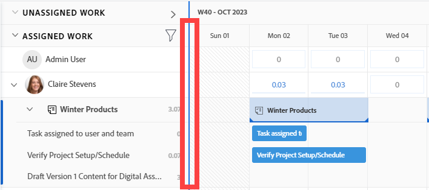

# 업무 균형자 탐색

<!--Audited: 12/2024-->

Adobe Workfront의 업무 균형자 를 사용하여 가용성에 따라 사용자에게 작업을 할당할 수 있습니다. 이 문서에서는 설정 및 옵션을 사용하여 업무 균형자 를 탐색하고 사용자와 관련된 정보를 표시하는 방법에 대해 설명합니다. 여기에 나열된 추가 문서에서는 업무 균형자 를 사용하여 리소스 및 작업 할당을 관리하는 방법을 설명합니다.

업무 균형자 는 Adobe Workfront의 여러 영역에서 사용할 수 있습니다. 탐색하는 것은 모든 영역에서 유사합니다.

업무 균형자 위치에 대한 자세한 내용은 [업무 균형자 찾기](https://experienceleague.adobe.com/en/docs/workfront/using/manage-resources/the-workload-balancer/locate-workload-balancer)를 참조하십시오.

## 액세스 요구 사항

+++ 이 문서의 기능에 대한 액세스 요구 사항을 보려면 확장하십시오.

<table style="table-layout:auto"> 
 <col> 
 <col> 
 <tbody> 
  <tr> 
   <td>Adobe Workfront 패키지</td> 
   <td>
Any
</td>
  </tr>
  <tr> 
   <td>Adobe Workfront 라이선스</td> 
   <td>
표준

       
리소스 영역 내 업무 균형자 사용 시 계획, 팀 또는 프로젝트의 업무 균형자 사용 시 작업
</td>
  </tr>
  <tr> 
   <td>액세스 수준 구성</td> 
   <td> 
다음에 대한 액세스 권한 이상:
 
    <ul> 
     <li>리소스 관리</li> 
     <li>프로젝트</li> 
     <li>작업</li> 
     <li>문제</li> 
    </ul>
   </td> 
  </tr> 
  <tr> 
   <td>개체 권한</td> 
   <td>프로젝트, 작업 및 문제에 대한 이상의 권한 보기</td> 
  </tr> 
 </tbody> 
</table>

자세한 내용은 [Workfront 설명서의 액세스 요구 사항](/help/quicksilver/administration-and-setup/add-users/access-levels-and-object-permissions/access-level-requirements-in-documentation.md)을 참조하십시오.

+++

## 업무 균형자에서 항목을 보기 위한 고려 사항

업무 균형자 를 볼 때는 다음 사항을 고려하십시오.

* 업무 균형자 는 할당에 따라 두 개의 별도 영역에 작업 항목을 표시합니다. 작업 항목 및 사용자는 다음 영역에 표시됩니다.

  * **할당 해제된 작업**: 할당이 없거나 작업 역할 또는 팀에만 할당된 항목입니다.
  * **할당된 작업**: 하나 이상의 사용자에게 할당된 항목입니다. 할당된 항목이 할당된 사용자의 이름 아래에 표시됩니다.

  >[!NOTE]
  >
  >* 작업 역할이나 팀에 할당되고 사용자에게도 할당된 작업 항목은 미할당 작업 영역과 할당된 작업 영역의 할당된 사용자 이름 아래에 모두 표시됩니다.
  >* 사용자 및 작업 역할에 할당된 작업 항목(작업 역할이 항목의 기본 할당자로 선택됨)이 미할당 작업 영역에 표시됩니다.
  >* 두 명 이상의 사용자에게 할당된 작업 항목은 할당된 작업 영역의 할당된 모든 사용자 이름 아래에 표시됩니다.
  >* 역할 할당 표시 설정이 활성화된 경우 역할 할당은 미할당 작업 영역의 작업 항목 아래에 표시됩니다. 자세한 내용은 이 문서에서 [보기 사용자 지정](#customize-the-view) 섹션을 참조하십시오.

  자세한 내용은 [업무 균형자 할당 개요](/help/quicksilver/resource-mgmt/workload-balancer/assign-work-in-workload-balancer.md)의 [업무 균형자의 할당 영역](/help/quicksilver/resource-mgmt/workload-balancer/assign-work-in-workload-balancer.md#assignment-areas-in-the-workload-balancer)을 참조하십시오.

* 일정 기간 동안 프로젝트에 작업이 없으면 해당 시간 동안 프로젝트 수준의 표시줄이 비어 있습니다.

  

* 특정 항목을 볼 수 있는 권한이 없으면 **액세스할 수 없는 작업 항목** 또는 **액세스할 수 없는 프로젝트**&#x200B;로 표시됩니다.

  

* 작업 항목의 이름은 왼쪽에 표시되고 타임라인은 오른쪽에 표시됩니다.
* 각 작업 항목에 대한 총 계획된 시간은 작업 항목 이름 오른쪽과 작업 항목의 타임라인을 나타내는 막대 왼쪽에 표시됩니다.
* 각 프로젝트에 대한 총 계획된 시간은 프로젝트 이름 오른쪽과 프로젝트 타임라인을 나타내는 막대 왼쪽에 표시됩니다.

  프로젝트의 계획된 시간 정보는 업무 균형자에 나열된 모든 항목의 총 계획된 시간이며, 프로젝트의 총 계획된 시간은 아닙니다.

업무 균형자에서 정보를 보는 방법에 대한 자세한 내용은 다음 문서를 참조하십시오.

* [업무 균형자 찾기](../workload-balancer/locate-workload-balancer.md)
* [업무 균형자에서 정보 필터링](../workload-balancer/filter-information-workload-balancer.md)
* [링크를 사용하여 업무 균형자 공유](../workload-balancer/share-link-for-workload-balancer.md)
* [요약을 사용하여 업무 균형자에서 작업 항목 업데이트](../workload-balancer/update-items-in-summary-panel-in-workload-balancer.md)

업무 균형자 를 사용한 리소스 관리에 대한 자세한 내용은 다음 문서를 참조하십시오.

* [업무 균형자에서 작업 할당 개요](https://experienceleague.adobe.com/en/docs/workfront/using/manage-resources/the-workload-balancer/assign-work-in-workload-balancer)
* [업무 균형자에서 사용자 할당 관리](https://experienceleague.adobe.com/en/docs/workfront/using/manage-resources/the-workload-balancer/manage-user-allocations-workload-balancer)

## 리소스 조달 영역에서 여러 프로젝트에 대한 업무 균형자 탐색

업무 균형자 탐색은 액세스하는 모든 영역에서 유사합니다.

다음 하위 섹션에서는 여러 프로젝트에 대한 업무 균형자에서 정보를 보는 방법을 설명합니다.

업무 균형자에서 여러 설정과 옵션을 조정하여 가장 적합한 시간대에 집중해야 하는 정보를 표시할 수 있습니다.

보기에 적용할 설정을 선택한 후 업무 균형자 는 브라우저 또는 장치에서 액세스할 때마다 이러한 설정을 기억합니다.

### 리소스 조달 영역의 여러 프로젝트에 대한 업무 균형자 액세스

여러 프로젝트에 대한 업무 균형자 를 탐색하려면 다음을 수행하십시오.

{{step1-to-resourcing}}

1. 왼쪽 패널에서 **업무 균형자**&#x200B;를 클릭합니다.

   

   업무 균형자에 현재 주부터 시작되는 작업 할당 정보가 다음 두 영역에 표시됩니다.

   * **할당 해제된 작업** 영역에 다음 작업 항목이 표시됩니다.

     * 역할, 팀 또는 할당되지 않은 작업 항목(작업 및 문제)은 필터를 적용한 후 표시됩니다.
       미할당 작업 영역에는 기본적으로 작업 항목이 표시되지 않습니다. 필터를 사용하여 이 영역에 관련 정보를 표시하는 것이 좋습니다.

       필터 사용에 대한 자세한 내용은 [업무 균형자에서 필터 정보](../workload-balancer/filter-information-workload-balancer.md)를 참조하십시오.

     * 작업 항목 아래의 역할 할당은 역할 할당 표시 설정을 활성화한 경우에만 표시됩니다. 자세한 내용은 이 문서에서 [보기 사용자 지정](#customize-the-view) 섹션을 참조하십시오.

     * 프로젝트별 그룹 설정을 활성화한 경우에만 프로젝트가 표시됩니다. 자세한 내용은 이 문서에서 [보기 사용자 지정](#customize-the-view) 섹션을 참조하십시오.

   * **할당된 작업** 영역에 다음 작업 항목이 표시됩니다.

     * 시스템의 모든 활성 사용자가 기본적으로 이 영역에 표시됩니다. 필터를 사용하여 이 영역의 정보 양을 제한하는 것이 좋습니다. 사용자가 항목에 할당되면 작업 항목도 해당 이름으로 표시됩니다.

     * 하나 이상의 사용자에게 할당된 작업 및 문제가 사용자 이름 아래에 표시됩니다.

       할당된 작업 영역의 사용자 이름 아래에 있는 작업 항목은 다음 기준에 따라 이 순서로 정렬됩니다.

       1. 계획된 시작 일자(가장 오래된 날짜 먼저)
       1. 계획된 완료 일자(가장 오래된 항목 먼저)
       1. 프로젝트별 알파벳(여러 작업 항목에 대해 처음 두 기준이 동일한 경우에만)

          >[!TIP]
          >
          >* 프로젝트 정렬 기준 설정에서 옵션을 선택하여 프로젝트 정렬을 사용자 지정할 수 있습니다.
          >
          >* 프로젝트는 &quot;프로젝트별 그룹&quot; 설정을 활성화한 경우에만 표시됩니다.
          > 
          >설정 사용자 지정에 대한 자세한 내용은 이 문서에서 [보기 사용자 지정](#customize-the-view) 섹션을 참조하십시오.

1. (선택 사항) **할당된 작업** 영역에서 **필터** 아이콘 을 클릭한 다음 필터 상자의 **제안** 영역에서 **기본 필터**&#x200B;을 선택합니다.

   기본 필터를 적용하면 팀에 속한 사용자와 해당 작업 항목이 표시됩니다. 이 필터의 복사본을 편집할 수 있습니다.

   >[!TIP]
   >
   >기본 필터는 리소스 조달 영역의 업무 균형자에서만 사용할 수 있습니다.

1. 업무 균형자 를 탐색하려면 다음 단계를 계속 수행하십시오.

   * [업무 균형자에서 시간대 선택](#select-a-time-frame-in-the-workload-balancer)
   * [보기 사용자 지정](#customize-the-view)
   * [작업 항목 할당 및 사용자 할당 조정](#assign-work-items-and-adjust-user-allocations)
   * [차트에서 할당 보기](#view-allocations-in-a-chart)

### 업무 균형자에서 시간대 선택

1. 이 문서의 [리소스 조달 영역의 여러 프로젝트에 대한 업무 균형자 액세스](#access-the-workload-balancer-for-multiple-projects-in-the-resourcing-area) 섹션에 설명된 대로 **리소스 조달** 영역의 업무 균형자에 액세스하십시오.

   업무 균형자에 현재 주부터 시작되는 작업 할당 정보가 표시됩니다.

1. 가로 스크롤을 사용하여 화면 제한을 초과하는 작업 항목의 타임라인을 봅니다.
1. 왼쪽 상단의 **뒤로 또는 앞으로** 아이콘 을 클릭하여 타임라인을 탐색한 다음 **오늘**&#x200B;을 클릭하여 현재 주로 돌아갑니다.
1. 도구 모음에서 **기간 드롭다운 메뉴**&#x200B;를 클릭한 다음 표시할 기간의 시작 날짜를 클릭합니다. 기본적으로 캘린더에서 선택한 첫 번째 주는 탐색한 주입니다.

   

1. 다음 선택 사항에서 업무 균형자에 한 번에 표시할 주 수를 선택합니다.
   * 1주
   * 2주
   * 4주. 기본 설정입니다.
   * 6주
   * 3개월

   

1. 도구 모음에서 다음 옵션 중 하나를 클릭하여 시간대별로 정보를 표시합니다.
   * **일**: 기본적으로 오늘 날짜부터 시작하여 4주 동안 일별로 정보를 표시합니다.
   * **주**: 4주 동안 주별로 정보를 표시합니다.
   * **월**: 3개월 동안 월별 정보를 표시합니다.

1. 다음 섹션에 설명된 대로 업무 균형자 를 계속 탐색합니다.

### 보기 사용자 지정

1. 이 문서의 [리소스 조달 영역의 여러 프로젝트에 대한 업무 균형자 액세스](#access-the-workload-balancer-for-multiple-projects-in-the-resourcing-area) 섹션에 설명된 대로 **리소스 조달** 영역의 업무 균형자에 액세스하십시오.

   작업 항목의 이름은 왼쪽에 나열되며 업무 균형자 오른쪽에 막대로 표시됩니다. 막대 길이는 작업 항목의 타임라인을 나타냅니다.

1. (선택 사항 및 권장) 미할당 및 할당된 작업 영역에서 필터를 사용하여 사용자와 관련된 작업 항목이나 사용자만 표시합니다.

   자세한 내용은 [업무 균형자에서 정보 필터링](../workload-balancer/filter-information-workload-balancer.md)을 참조하십시오.

   기본적으로 파란색 막대는 프로젝트 및 작업의 타임라인을 나타내고 세로줄 막대는 문제를 나타냅니다.

   프로젝트와 일치하도록 색상 테마를 선택할 때 프로젝트 및 작업의 막대 색상을 변경할 수 있습니다. 자세한 내용은 이 절차를 계속 참조하십시오.

   할당된 작업 영역의 작업 항목은 다음 기준에 따라 프로젝트별로 이 순서로 정렬됩니다.
   1. 계획된 시작 일자(가장 오래된 날짜 먼저)
   1. 계획된 완료 일자(가장 오래된 항목 먼저)
   1. 프로젝트별 알파벳(여러 작업 항목에 대해 처음 두 기준이 동일한 경우에만)

1. 미할당 또는 할당 영역 왼쪽의 **오른쪽 방향 화살표**&#x200B;를 클릭하여 프로젝트 이름(미할당 영역) 및 사용자 이름(할당 영역) 아래의 모든 항목을 확장합니다.

   >[!TIP]
   >
   >&quot;프로젝트별 그룹&quot; 설정을 활성화한 경우에만 작업 항목이 미할당 영역의 프로젝트 이름 아래에 나열됩니다.

1. 프로젝트 이름(미할당 영역) 및 사용자 이름(할당 영역) 아래의 모든 항목을 축소하려면 미할당 또는 할당 영역 왼쪽에 있는 **아래쪽 방향 화살표**&#x200B;를 클릭합니다.

1. 마우스를 위에 올린 다음 왼쪽 패널과 타임라인 영역 사이의 **분리선**&#x200B;을 끌어서 놓아 왼쪽 패널의 크기를 조정합니다.

   

1. **설정** 아이콘 을 클릭합니다.

   설정 패널이 오른쪽에 표시됩니다.

   

   아래 나열된 옵션 중에서 선택하여 업무 균형자에서 보는 정보를 업데이트한 다음 설정 상자의 오른쪽 상단에 있는 **X 아이콘**&#x200B;을 클릭하여 닫습니다.

   * **프로젝트별 그룹화**: 이 옵션을 선택하면 미할당 및 할당된 작업 영역의 항목이 프로젝트별로 그룹화됩니다. 이 옵션은 기본적으로 선택되어 있습니다.

   * **문제의 시간 포함**: 이 옵션을 선택하면 사용자에게 할당된 문제가 할당된 작업 영역에 사용자 이름으로 표시되고 사용자에게 할당되지 않은 문제는 미할당 작업 영역에 표시됩니다. 문제의 계획된 시간은 할당된 작업 영역의 프로젝트 및 사용자에 대한 계획된 시간에 계산됩니다.
   * **예상 일자 표시**: 이 옵션을 선택하면 계획된 타임라인과 함께 작업 항목의 예상 타임라인이 표시됩니다. 다음 사항에 주목하십시오.
     * 프로젝트, 작업 및 문제의 예상 타임라인이 작업, 문제 및 프로젝트 막대 위에 짙은 파란색 선으로 표시됩니다.
     * 아래 설명된 대로 색상 테마를 업데이트하는 경우에도 계획된 타임라인의 외부에 있는 예상 타임라인이 연한 파란색으로 표시됩니다.
     * 볼 수 있는 액세스 권한이 없는 항목에 대한 예상 타임라인은 아래에 선이 있는 밝은 회색으로 표시됩니다.
     * 작업 또는 문제가 계획된 완료 기한 이전에 완료되면 나머지 일수에 대한 할당 번호를 통과하고 사용자의 할당에 계산되지 않습니다. 예상 일자 표시 설정과 할당 표시 아이콘이 모두 활성화된 경우에만 표시됩니다.

     >[!TIP]
     >
     >계획된 또는 예상 타임라인(반드시 동시에 발생하지는 않음)이 선택한 기간 동안 발생할 때 작업 항목이 업무 균형자에 표시됩니다.

   * **완료된 작업 표시**: 이 기능이 활성화되면 완료된 작업 및 문제가 할당된 작업 영역에 표시됩니다. 이 기능은 기본적으로 활성화되어 있습니다.

     작업이 완료되면 작업 또는 문제 표시줄의 오른쪽 상단에 녹색 확인 표시 아이콘이 표시됩니다. 프로젝트의 선택한 시간대에 대한 작업 또는 문제가 완료되면 프로젝트에 대해 동일한 아이콘이 표시됩니다.

     >[!NOTE]
     >
     >업무 균형자에서의 작업 가시성은 할당 수준 완료가 아닌 작업 수준 완료에 의해 결정됩니다. 작업에 여러 명의 피할당자가 있고 한 명 이상의 피할당자가 &quot;내 부품으로 완료&quot;를 선택했지만 전체 작업 상태가 완료되지 않은 경우 작업이 완료되지 않은 작업으로 간주됩니다. **완료된 작업 표시 옵션**&#x200B;이 꺼져 있으면 작업이 완전히 완료되지 않았으므로 계속 표시됩니다.

   * **남은 시간 표시**: 이 옵션이 활성화되면 Workfront은 사용자의 일정에 따라 사용자가 작업할 수 있는 일별 시간과 사용자에게 할당된 작업 영역에 할당된 시간 간의 차이를 표시합니다. 이 기능은 기본적으로 비활성화되어 있으며 할당된 시간이 기본적으로 표시됩니다.
   * **역할 할당 표시**: 이 옵션이 활성화되면 할당된 작업 항목 아래의 미할당 작업 영역에 역할 할당이 표시됩니다. 이 기능은 기본적으로 활성화되어 있습니다.

   * **색상 테마 선택** 섹션에서 프로젝트 및 작업 표시줄에 사용할 색상을 선택합니다.

     >[!TIP]
     >
     >색상 테마를 선택하는 설정은 문제 막대의 색에 영향을 주지 않습니다. 문제는 항상 고색 막대에 표시됩니다.

     다음 중에서 선택합니다.
     * **기본값**: 모든 프로젝트와 해당 작업 항목의 표시줄이 파란색으로 표시됩니다.
     * **프로젝트**: 각 프로젝트와 관련된 막대 및 해당 작업이 프로젝트 이름에 따라 변경됩니다. 프로젝트에 속한 모든 작업은 프로젝트 색상과 일치하는 막대로 표시됩니다. 프로젝트 막대는 작업과 구분하기 위해 더 밝은 음영으로 표시됩니다. 할당을 표시하지 않도록 선택할 때 프로젝트 표시줄에 프로젝트 아이콘도 포함됩니다.
     * **프로젝트 상태**: 각 프로젝트 및 해당 작업 항목과 연결된 막대가 프로젝트 상태의 색상으로 변경됩니다.

       프로젝트 상태는 프로젝트 그룹과 연결된 상태입니다. 그룹에 그룹별 상태가 없는 경우 작업 항목 막대의 색상은 시스템 레벨 프로젝트 상태의 색상입니다. 시스템 및 사용자 정의 상태가 모두 표시됩니다. 그룹 상태에 대한 자세한 내용은 [그룹 상태 만들기 또는 편집](../../administration-and-setup/manage-groups/manage-group-statuses/create-or-edit-a-group-status.md)을 참조하세요.

   * **사용자 할당 표시** 섹션에서 다음 중 하나를 선택합니다.
     * **시간**: 할당된 시간을 시간으로 표시합니다. 이것이 기본값입니다.
     * **백분율**: 할당된 시간을 총 사용 가능한 시간의 백분율로 표시합니다.
   * **정렬 환경 설정** 섹션에서 업무 균형자에서 항목을 정렬하는 방법을 선택합니다. 다음 옵션 중에서 선택합니다.
     * **기본 역할별로 사용자 정렬**: 사용자는 할당된 작업 영역에 기본 역할의 알파벳 순서로 표시됩니다.
     * **사용자를 알파벳순으로 정렬**: 사용자가 할당된 작업 영역에 이름의 알파벳순으로 표시됩니다.
     * **프로젝트 정렬 기준**: 드롭다운 메뉴에서 프로젝트 필드를 선택하여 미할당 또는 할당된 작업 영역의 해당 필드를 기준으로 알파벳순으로 프로젝트를 정렬합니다.

   >[!TIP]
   >
   >프로젝트별 그룹 설정이 활성화된 경우에만 프로젝트별로 정렬할 수 있습니다. 그렇지 않으면 이 설정은 흐리게 표시됩니다.

1. (선택 사항 및 조건부) 색상 테마를 프로젝트 상태로 변경할 때 왼쪽의 프로젝트 이름을 마우스로 가리키면 프로젝트의 상태가 표시됩니다.

   

### 작업 항목 할당 및 사용자 할당 조정

1. 이 문서의 [리소스 조달 영역의 여러 프로젝트에 대한 업무 균형자 액세스](#access-the-workload-balancer-for-multiple-projects-in-the-resourcing-area) 섹션에 설명된 대로 리소스 조달 영역의 업무 균형자에 액세스하십시오.
1. 작업 항목에 대한 일별 또는 주별 계획된 시간을 보려면 **할당 표시 아이콘** 을 클릭하십시오.

   이 옵션은 작업 항목 막대의 이름을 미할당 및 할당된 작업 영역의 일일 또는 주간 계획 시간으로 바꿉니다. 이 설정은 기본적으로 비활성화되어 있습니다.

   초과 할당을 표시하는 날짜가 빨간색으로 표시됩니다.

   >[!TIP]
   >
   >* 할당 표시 옵션은 프로젝트, 작업, 문제 및 액세스할 수 없는 항목에 대해서만 영향을 줍니다. 사용자의 일별 계획된 시간은 기본적으로 표시되며 숨길 수 없습니다.
   >* 프로젝트의 일일 계획된 시간을 표시하려면 프로젝트별 그룹 설정을 활성화해야 합니다.
   >* 주별 업무 균형자 를 볼 때 표시되는 시간은 주별 계획된 시간입니다.

1. (선택 사항) 사용자 라인에서 할당된 시간 위로 마우스를 가져가면 사용자의 용량 및 할당을 이해할 수 있습니다. 용량은 사용자가 일정에 따라 사용할 수 있는 용량입니다.

   

1. (선택 사항) **할당 숨기기 아이콘** 을 클릭하여 작업 항목의 막대에 작업 및 문제의 이름을 표시합니다.
1. 작업, 문제 또는 역할 이름 오른쪽의 **기타 메뉴** 아이콘 을 클릭한 다음 아래 옵션 중 하나를 클릭합니다.

   

   * **할당 대상**&#x200B;을 지정한 다음 **사람, 역할 또는 팀 검색** 필드에 작업 항목을 할당할 사용자, 역할 또는 팀의 이름을 입력하세요.

     **고급**&#x200B;을 클릭하여 작업 항목에 대한 고급 할당 화면에 액세스합니다. 자세한 내용은 [고급 할당 만들기](/help/quicksilver/manage-work/tasks/assign-tasks/create-advanced-assignments.md)를 참조하십시오.

     다음 단축키를 사용하여 작업 또는 문제를 할당할 수도 있습니다.

     * Windows의 경우: CTRL 키를 누른 상태에서 작업 또는 문제 표시줄 클릭
     * Mac에서 CMD+작업 또는 문제 표시줄을 클릭합니다.

     업무 균형자에서 사용자에게 작업 항목을 할당하는 방법에 대한 자세한 내용은 [업무 균형자에서 작업 할당 개요](../workload-balancer/assign-work-in-workload-balancer.md)를 참조하십시오.

     >[!NOTE]
     >
     >역할 할당 표시 설정이 활성화된 경우 역할 할당은 미할당 작업 영역의 작업 항목 아래에만 표시됩니다. 자세한 내용은 이 문서에서 [보기 사용자 지정](#customize-the-view) 섹션을 참조하십시오. 역할 할당에는 **추가 메뉴**&#x200B;의 **할당 대상** 옵션만 있습니다.

     >[!TIP]
     >
     >Workfront 또는 그룹 관리자가 사용자 환경에서 위임을 활성화한 경우 할당 탭을 사용하여 사용자를 작업 또는 문제에 할당합니다. 작업 위임에 대한 자세한 내용은 [작업 및 문제 위임](../../manage-work/delegate-work/how-to-delegate-work.md)을 참조하세요.

   * **할당을 편집**&#x200B;한 다음 사용자에 대한 일별 또는 주별 할당을 편집합니다. 사용자 할당 관리에 대한 자세한 내용은 [업무 균형자에서 사용자 할당 관리](../workload-balancer/manage-user-allocations-workload-balancer.md)를 참조하십시오.

   * **요약 열기**. [요약] 패널이 오른쪽에 열린 다음 [할당] 필드를 클릭하고 **사람, 역할 또는 팀 검색** 필드에 사용자, 역할 또는 팀의 이름을 입력하여 항목을 할당합니다. 자세한 내용은 이 문서에서 [작업 및 문제에 대한 자세한 정보 표시](#display-more-information-about-tasks-and-issues) 섹션을 참조하십시오.

1. (선택 사항) 작업 항목의 막대 내에서 사용자에 대한 일별 또는 주별 할당을 두 번 클릭하여 할당된 시간을 편집한 다음 **저장** 아이콘 을 클릭하여 할당을 저장하거나 **취소** 아이콘 을 클릭하여 조정된 할당을 제거합니다.

   >[!TIP]
   >
   >작업 또는 문제의 타임라인 표시줄의 끝에 저장 및 취소 아이콘이 표시됩니다.
   >
   >

   사용자 할당 관리에 대한 자세한 내용은 [업무 균형자에서 사용자 할당 관리](../workload-balancer/manage-user-allocations-workload-balancer.md)를 참조하십시오.

1. 작업 항목을 일괄적으로 할당하려면 **일괄 할당**&#x200B;을 클릭하십시오.

   자세한 내용은 [업무 균형자 사용 일괄 작업 할당](../workload-balancer/assign-work-in-workload-balancer-in-bulk.md)을 참조하십시오.
1. **할당 해제된 작업** 영역 또는 사용자의 항목을 드래그하여 다른 사용자에게 놓아 할당하십시오.

   자세한 내용은 [드래그 앤 드롭하여 업무 균형자에서 작업 할당](../workload-balancer/assign-work-in-workload-balancer-by-drag-and-drop.md)을 참조하십시오.

### 차트에서 할당 보기

일별 또는 주별 숫자로 할당을 보는 대신 차트에서 할당을 볼 수 있습니다.

1. 이 문서의 [리소스 조달 영역의 여러 프로젝트에 대한 업무 균형자 액세스](#access-the-workload-balancer-for-multiple-projects-in-the-resourcing-area) 섹션에 설명된 대로 리소스 조달 영역의 업무 균형자에 액세스하십시오.
1. **차트 아이콘** 을 클릭하여 사용자 할당을 차트 형식으로 표시합니다.

   사용자가 초과 할당된 일수는 빨간색 블록으로 표시되고, 사용자가 과소 할당되거나 최대 용량에 할당된 일수는 파란색 블록으로 표시됩니다.

   블록의 크기는 할당량을 나타냅니다. 상자가 클수록 사용자가 해당 일 또는 주에 대한 작업 항목에 더 많은 시간이 할당됩니다.

   

### 작업 및 문제에 대한 추가 정보 표시

업무 균형자에서 작업 및 문제에 대한 자세한 정보를 볼 수 있습니다.

1. 이 문서의 [리소스 조달 영역의 여러 프로젝트에 대한 업무 균형자 액세스](#access-the-workload-balancer-for-multiple-projects-in-the-resourcing-area) 섹션에 설명된 대로 리소스 조달 영역의 업무 균형자에 액세스하십시오.
1. 요약 패널에서 자세한 정보를 보려면 다음 중 하나를 수행합니다.

   * 작업 또는 문제의 막대를 클릭하여 오른쪽의 요약 패널을 엽니다.
   * **요약 열기** 아이콘 을 클릭한 다음 작업 또는 문제의 막대를 클릭하여 요약 패널을 엽니다.
   * 작업 또는 문제의 오른쪽에 있는 **자세히** 메뉴를 클릭한 다음 **요약 열기**&#x200B;를 클릭합니다.

   업무 균형자 요약에서 작업 정보를 업데이트하는 방법에 대한 자세한 내용은 [요약을 사용하여 업무 균형자에서 작업 항목 업데이트](../workload-balancer/update-items-in-summary-panel-in-workload-balancer.md)를 참조하십시오.

1. 작업 또는 문제에 대한 자세한 내용을 보려면 해당 이름 위로 마우스를 가져갑니다. 작업 또는 문제 위에 다음 정보가 포함된 상자가 표시됩니다.

   * 작업 또는 문제의 이름.
   * 프로젝트의 이름입니다.
   * 계획된 시작 및 완료 일자.
   * 계획된 시간 수.
   * 작업의 경우 전임 작업 번호입니다.
   * 작업의 경우 작업 준비 여부를 나타내는 상자 상단 모서리에 있는 표시기입니다.

   

1. 왼쪽에 있는 작업 항목의 이름을 클릭하여 액세스합니다. 작업 항목이 새 브라우저 탭에서 열립니다.

### 전체 화면에 업무 균형자 표시

1. 이 문서의 [리소스 조달 영역의 여러 프로젝트에 대한 업무 균형자 액세스](#access-the-workload-balancer-for-multiple-projects-in-the-resourcing-area) 섹션에 설명된 대로 리소스 조달 영역의 업무 균형자에 액세스하십시오.

1. **전체 화면** 아이콘 을 클릭하여 업무 균형자를 전체 화면으로 표시합니다.

   업무 균형자 가 전체 화면을 차지합니다. 브라우저 창과 탭은 보기에서 제외됩니다.

1. **전체 화면 종료** 아이콘 을 클릭하여 기본 화면으로 돌아가서 브라우저 탭 내에서 업무 균형자 를 봅니다.

## 팀의 업무 균형자 탐색

팀의 업무 균형자 탐색은 여러 프로젝트에 대한 업무 균형자 탐색 방법과 유사합니다. 자세한 내용은 이 문서의 [여러 프로젝트에 대한 업무 균형자 탐색](#navigate-the-workload-balancer-for-multiple-projects-in-the-resourcing-area) 섹션을 참조하십시오.

{{step1-to-team}}

홈 팀의 페이지가 기본적으로 표시됩니다.

1. 왼쪽 패널에서 **업무 균형자**&#x200B;를 클릭합니다.

   

   팀의 업무 균형자 에는 기본적으로 다음 정보가 표시됩니다.

   * **할당 해제된 작업** 영역에서: 팀이나 팀 및 작업 역할에 할당되고 사용자에게 할당되지 않은 작업 항목입니다. 역할 할당 표시 설정이 활성화된 경우 역할 할당은 미할당 작업 영역의 작업 항목 아래에 표시됩니다.
   * **할당된 작업** 영역에서 사용자에게 할당된 작업 항목이 사용자 이름 아래에 표시됩니다.

1. 이 문서의 [리소스 조달 영역의 여러 프로젝트에 대한 업무 균형자 탐색](#navigate-the-workload-balancer-for-multiple-projects-in-the-resourcing-area) 섹션에 설명된 대로 팀의 업무 균형자 탐색을 계속합니다.

## 단일 프로젝트의 업무 균형자 탐색

{{step1-to-projects}}

1. 프로젝트 이름을 클릭하여 프로젝트 페이지를 엽니다.
1. 왼쪽 패널에서 **업무 균형자**&#x200B;를 클릭합니다.

   

   프로젝트에 대한 업무 균형자 에는 기본적으로 다음 정보가 표시됩니다.

   * **할당 해제된 작업** 영역의 역할 또는 팀에 할당되고 사용자에게 할당되지 않은 프로젝트의 작업 항목입니다. 역할 할당 표시 설정이 활성화된 경우 역할 할당은 미할당 작업 영역의 작업 항목 아래에 표시됩니다.
   * **할당된 작업** 영역의: 하나 이상의 사용자에게 할당된 프로젝트의 작업 항목입니다.

   본인에게 중요한 사용자만 표시하려면 필터를 사용하는 것이 좋습니다.

   예를 들어, 팀이나 그룹에 속한 사용자만 표시하는 것을 고려할 수 있습니다. 자세한 내용은 [업무 균형자에서 정보 필터링](../workload-balancer/filter-information-workload-balancer.md)을 참조하십시오.

1. (선택 사항) 할당된 작업 영역에서 **필터** 아이콘 을 클릭하고 필터 패널의 **추천** 영역에서 **이 프로젝트의 작업 항목** 옵션을 선택합니다. 이 필터는 기본적으로 선택 해제되어 있습니다.

   이 옵션을 선택하면 선택한 프로젝트의 사용자에게 할당된 항목만 표시됩니다.

   이 옵션을 선택하지 않으면 항목이 속한 프로젝트에 관계없이 프로젝트의 사용자에게 할당된 모든 항목이 표시됩니다.

1. (선택 사항 및 권장) 할당된 작업 영역에 필터를 적용하여 자신에게 중요하지만 프로젝트의 항목에 할당되지 않을 수 있는 사용자를 표시한 다음 **모든 사용자 표시** 아이콘 을 클릭합니다.

   모든 사용자를 표시하면 프로젝트의 작업 또는 다른 역할에 아직 할당되지 않은 Workfront의 모든 사용자를 표시할 수 있습니다.

   먼저 필터를 적용하여 표시하는 사용자 수를 줄일 수 있습니다.

   예를 들어, 팀이나 그룹에 속하는 사용자를 먼저 필터링한 다음 해당 사용자를 모두 표시할 수 있습니다.

   필터 빌드 방법에 대한 자세한 내용은 [업무 균형자에서 필터 정보](../workload-balancer/filter-information-workload-balancer.md)를 참조하십시오.

   >[!NOTE]
   >
   > 모든 사용자 표시 옵션은 프로젝트의 업무 균형자에 대해서만 사용할 수 있습니다.

1. (선택 사항) **역할 할당 표시** 아이콘 을 클릭합니다.

   역할 할당 패널이 표시됩니다.

   시나리오 플래너에서 프로젝트의 작업 역할과 연관된 계획된 시간 및 프로젝트에 연결된 이니셔티브와 연관된 작업 역할에 대한 정보를 볼 수 있습니다.

   자세한 내용은 [프로젝트 및 이니셔티브 간 리소스 할당 조정 개요](../../scenario-planner/overview-reconcile-allocations-between-projects-initiatives.md)를 참조하십시오.

   >[!NOTE]
   >
   >조직에서 Workfront 시나리오 플래너에 대한 라이선스를 구매하지 않은 경우 이니셔티브 작업 역할 정보를 볼 수 없습니다. 이 경우 프로젝트의 작업 역할과 연관된 계획된 시간만 볼 수 있습니다. 자세한 내용은 [시나리오 플래너를 사용하는 데 필요한 액세스](../../scenario-planner/access-needed-to-use-sp.md)를 참조하십시오.

1. 이 문서의 [여러 프로젝트에 대한 업무 균형자 탐색](#navigate-the-workload-balancer-for-multiple-projects-in-the-resourcing-area) 섹션에 설명된 대로 프로젝트의 업무 균형자를 계속 탐색합니다.

## 사용자의 업무 균형자 탐색

사용자 프로필에서 업무 균형자에 액세스할 수 있습니다.

{{step1-click-profile-pic}}

1. 왼쪽 패널에서 **업무 균형자**&#x200B;를 클릭합니다.

   사용자의 업무 균형자 가 표시됩니다.

   

   사용자의 업무 균형자 는 기본적으로 다음 정보를 표시합니다.

   * **할당된 작업**: 특정 사용자에게 할당된 작업 및 문제입니다.

   >[!NOTE]
   >
   >사용자 프로필의 업무 균형자 는 읽기 전용이며 할당 및 할당을 변경할 수 없습니다.

1. 이 문서의 [여러 프로젝트에 대한 업무 균형자 탐색](#navigate-the-workload-balancer-for-multiple-projects-in-the-resourcing-area) 섹션에 설명된 대로 사용자의 업무 균형자 탐색을 계속합니다.

