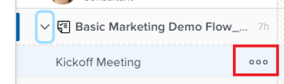
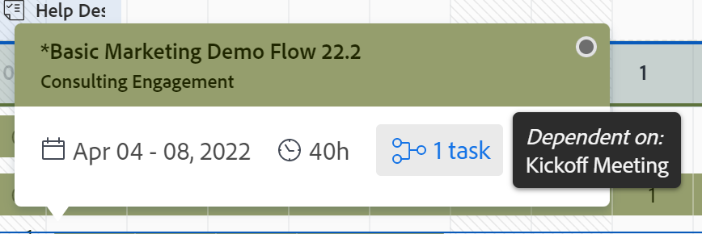
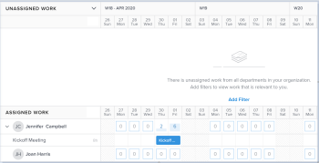

# 업무 균형자 탐색

Adobe Workfront의 업무 균형자 를 사용하여 가용성에 따라 사용자에게 작업을 할당할 수 있습니다. 이 문서에서는 설정 및 옵션을 사용하여 업무 균형자 를 탐색하고 사용자와 관련된 정보를 표시하는 방법에 대해 설명합니다. 여기에 나열된 추가 문서에서는 업무 균형자 를 사용하여 리소스 및 작업 할당을 관리하는 방법을 설명합니다.

업무 균형자 는 Adobe Workfront의 여러 영역에서 사용할 수 있습니다. 탐색하는 것은 모든 영역에서 유사합니다.

업무 균형자 위치에 대한 자세한 내용은 [업무 균형자 찾기](https://experienceleague.adobe.com/docs/workfront/using/manage-resources/the-workload-balancer/locate-workload-balancer.html?lang=en).

## 액세스 요구 사항

<!--drafted - replace table for P&P:

<table style="table-layout:auto"> 
 <col> 
 <col> 
 <tbody> 
  <tr> 
   <td role="rowheader">Adobe Workfront plan*</td> 
   <td> 
Any 
 </td> 
  </tr> 
  <tr> 
   <td role="rowheader">Adobe Workfront license*</td> 
<td>
Current license: Standard 

    Or 

Legacy license:

    <ul>
    <li>
Plan, when using the Workload Balancer for a team or in the Resourcing area 
</li>
    <li>
Work, when using the Workload Balancer of a project 
</li>
    </ul>
 </td> 
  </tr> 
  <tr> 
   <td role="rowheader">Access level configurations*</td> 
   <td> 
View or higher access to the following:
 
    <ul> 
     <li> 
Resource Management
 </li> 
     <li> 
Projects
 </li> 
     <li> 
Tasks
 </li> 
     <li> 
Issues
 </li> 
    </ul> 
If you still don't have access, ask your Workfront administrator if they set additional restrictions in your access level. For information on how a Workfront administrator can change your access level, see <a href="../../administration-and-setup/add-users/configure-and-grant-access/create-modify-access-levels.md" class="MCXref xref">Create or modify custom access levels</a>.
 </td> 
  </tr> 
  <tr> 
   <td role="rowheader">Object permissions</td> 
   <td> 
View or higher permissions to the projects, tasks, and issues 
 
For information on requesting additional access, see <a href="../../workfront-basics/grant-and-request-access-to-objects/request-access.md" class="MCXref xref">Request access to objects </a>.
 </td> 
  </tr> 
 </tbody> 
</table>
-->

이 문서의 단계를 수행하려면 다음 액세스 권한이 있어야 합니다.

<table style="table-layout:auto"> 
 <col> 
 <col> 
 <tbody> 
  <tr> 
   <td role="rowheader">Adobe Workfront 플랜*</td> 
   <td> 
임의 
 </td> 
  </tr> 
  <tr> 
   <td role="rowheader">Adobe Workfront 라이센스*</td> 
   <td> 
리소스 조달 영역에서 업무 균형자 를 사용할 때 계획

   
팀 또는 프로젝트의 업무 균형자 를 사용할 때 작업

 </td> 
  </tr> 
  <tr> 
   <td role="rowheader">액세스 수준 구성*</td> 
   <td> 
다음에 대한 액세스 권한 이상:
 
    <ul> 
     <li> 
리소스 관리
 </li> 
     <li> 
프로젝트
 </li> 
     <li> 
작업
 </li> 
     <li> 
문제
 </li> 
    </ul> 
여전히 액세스 권한이 없는 경우 Workfront 관리자에게 액세스 수준에 추가 제한을 설정하는지 문의하십시오. Workfront 관리자가 액세스 수준을 변경하는 방법에 대한 자세한 내용은 <a href="../../administration-and-setup/add-users/configure-and-grant-access/create-modify-access-levels.md" class="MCXref xref">사용자 정의 액세스 수준 만들기 또는 수정</a>.
 </td> 
  </tr> 
  <tr> 
   <td role="rowheader">개체 권한</td> 
   <td> 
프로젝트, 작업 및 문제에 대한 이상의 권한 보기 
 
추가 액세스 요청에 대한 자세한 내용은 <a href="../../workfront-basics/grant-and-request-access-to-objects/request-access.md" class="MCXref xref">오브젝트에 대한 액세스 요청 </a>.
 </td> 
  </tr> 
 </tbody> 
</table>

*보유 중인 플랜, 라이선스 유형 또는 액세스 권한을 확인하려면 Workfront 관리자에게 문의하십시오.

## 업무 균형자에서 항목을 보기 위한 고려 사항

업무 균형자 를 볼 때는 다음 사항을 고려하십시오.

* 업무 균형자 는 할당에 따라 두 개의 별도 영역에 작업 항목을 표시합니다. 작업 항목 및 사용자는 다음 영역에 표시됩니다.

   * **할당 해제된 작업**: 할당이 없거나 작업 역할 또는 팀에만 할당된 항목.
   * **할당된 작업**: 하나 이상의 사용자에게 할당된 항목. 할당된 항목이 할당된 사용자의 이름 아래에 표시됩니다.

  >[!NOTE]
  >
  >* 작업 역할이나 팀에 할당되고 사용자에게도 할당된 작업 항목은 미할당 작업 영역과 할당된 작업 영역의 할당된 사용자 이름 아래에 모두 표시됩니다.
  >* 사용자 및 작업 역할에 할당된 작업 항목(작업 역할이 항목의 기본 할당자로 선택됨)이 미할당 작업 영역에 표시됩니다.
  >* 두 명 이상의 사용자에게 할당된 작업 항목은 할당된 작업 영역의 할당된 모든 사용자 이름 아래에 표시됩니다.

  자세한 내용은 의 &quot;업무 균형자 의 할당 영역&quot;을 참조하십시오. [업무 균형자에서 작업 할당 개요](/help/quicksilver/resource-mgmt/workload-balancer/assign-work-in-workload-balancer.md).

* 일정 기간 동안 프로젝트에 작업이 없으면 해당 시간 동안 프로젝트 수준의 표시줄이 비어 있습니다.

  

* 특정 항목을 볼 수 있는 권한이 없는 경우 다음과 같이 표시됩니다. **액세스할 수 없는 작업 항목** 또는 **액세스할 수 없는 프로젝트**.

  

* 작업 항목의 이름은 왼쪽에 표시되고 타임라인은 오른쪽에 표시됩니다.
* 각 작업 항목에 대한 총 계획된 시간은 작업 항목 이름 오른쪽과 작업 항목의 타임라인을 나타내는 막대 왼쪽에 표시됩니다.
* 각 프로젝트에 대한 총 계획된 시간은 프로젝트 이름 오른쪽과 프로젝트 타임라인을 나타내는 막대 왼쪽에 표시됩니다.

  프로젝트의 계획된 시간 정보는 업무 균형자에 나열된 모든 항목의 총 계획된 시간이며, 프로젝트의 총 계획된 시간은 아닙니다.

업무 균형자에서 정보를 보는 방법에 대한 자세한 내용은 다음 문서를 참조하십시오.

* [업무 균형자 찾기](../workload-balancer/locate-workload-balancer.md)
* [업무 균형자에서 정보 필터링](../workload-balancer/filter-information-workload-balancer.md)
* [링크를 사용하여 업무 균형자 공유](../workload-balancer/share-link-for-workload-balancer.md)
* [요약을 사용하여 업무 균형자에서 작업 항목 업데이트](../workload-balancer/update-items-in-summary-panel-in-workload-balancer.md)

업무 균형자 를 사용한 리소스 관리에 대한 자세한 내용은 다음 문서를 참조하십시오.

* [업무 균형자에서 작업 할당 개요](https://experienceleague.adobe.com/docs/workfront/using/manage-resources/the-workload-balancer/assign-work-in-workload-balancer.html?lang=en)
* [업무 균형자에서 사용자 할당 관리](https://experienceleague.adobe.com/docs/workfront/using/manage-resources/the-workload-balancer/manage-user-allocations-workload-balancer.html?lang=en)

## 리소스 조달 영역에서 여러 프로젝트에 대한 업무 균형자 탐색

업무 균형자 탐색은 액세스하는 모든 영역에서 유사합니다.

다음 하위 섹션에서는 여러 프로젝트에 대한 업무 균형자에서 정보를 보는 방법을 설명합니다.

업무 균형자에서 여러 설정과 옵션을 조정하여 가장 적합한 시간대에 집중해야 하는 정보를 표시할 수 있습니다.

보기에 적용할 설정을 선택한 후 업무 균형자 는 브라우저 또는 장치에서 액세스할 때마다 이러한 설정을 기억합니다.

### 리소스 조달 영역의 여러 프로젝트에 대한 업무 균형자 액세스

여러 프로젝트에 대한 업무 균형자 를 탐색하려면 다음을 수행하십시오.

1. 다음을 클릭합니다. **메인 메뉴** 아이콘  Workfront의 오른쪽 상단에서 을(를) 클릭한 다음 **리소스 조달**.
1. 클릭 **업무 균형자** 왼쪽 패널에서

   

   업무 균형자에 현재 주부터 시작되는 작업 할당 정보가 다음 두 영역에 표시됩니다.

   * 다음 **할당 해제된 작업** 영역에는 다음 작업 항목이 표시됩니다.

      * 역할, 팀 또는 할당되지 않은 작업 항목(작업 및 문제)은 필터를 적용한 후 표시됩니다.
미할당 작업 영역에는 기본적으로 작업 항목이 표시되지 않습니다. 필터를 사용하여 이 영역에 관련 정보를 표시하는 것이 좋습니다.

        필터 사용에 대한 자세한 내용은 [업무 균형자에서 정보 필터링](../workload-balancer/filter-information-workload-balancer.md).

      * 프로젝트별 그룹 설정을 활성화한 경우에만 프로젝트가 표시됩니다. 자세한 내용은 섹션을 참조하십시오 [보기 사용자 지정](#customize-the-view) 이 문서에서.

   * 다음 **할당된 작업** 영역에는 다음 작업 항목이 표시됩니다.

      * 시스템의 모든 활성 사용자가 기본적으로 이 영역에 표시됩니다. 필터를 사용하여 이 영역의 정보 양을 제한하는 것이 좋습니다. 사용자가 항목에 할당되면 작업 항목도 해당 이름으로 표시됩니다.

      * 하나 이상의 사용자에게 할당된 작업 및 문제가 사용자 이름 아래에 표시됩니다.

        할당된 작업 영역의 사용자 이름 아래에 있는 작업 항목은 다음 기준에 따라 이 순서로 정렬됩니다.

         1. 계획된 시작 일자(가장 오래된 날짜 먼저)
         1. 계획된 완료 일자(가장 오래된 항목 먼저)
         1. 프로젝트별 알파벳(여러 작업 항목에 대해 처음 두 기준이 동일한 경우에만)

            >[!TIP]
            >
            >* 프로젝트 정렬 기준 설정에서 옵션을 선택하여 프로젝트 정렬을 사용자 지정할 수 있습니다.
            >
            >* 프로젝트는 &quot;프로젝트별 그룹&quot; 설정을 활성화한 경우에만 표시됩니다.
            > 
            >설정 사용자 지정에 대한 자세한 내용은 섹션을 참조하십시오 [보기 사용자 지정](#customize-the-view) 이 문서에서.

1. (선택 사항) **필터** 아이콘  다음에서 **할당된 작업** 영역을 선택한 다음 **기본 필터** 다음에서 **제안됨** 필터 상자의 영역입니다.

   기본 필터를 적용하면 팀에 속한 사용자와 해당 작업 항목이 표시됩니다. 이 필터의 복사본을 편집할 수 있습니다.

   >[!TIP]
   >
   >기본 필터는 리소스 조달 영역의 업무 균형자에서만 사용할 수 있습니다.

1. 업무 균형자 를 탐색하려면 다음 단계를 계속 수행하십시오.

   * [업무 균형자에서 시간대 선택](#select-a-time-frame-in-the-workload-balancer)
   * [보기 사용자 지정](#customize-the-view)
   * [작업 항목 할당 및 사용자 할당 조정](#assign-work-items-and-adjust-user-allocations)
   * [차트에서 할당 보기](#view-allocations-in-a-chart)

### 업무 균형자에서 시간대 선택

1. 에서 업무 균형자에 액세스 **리소스 조달** 섹션에 설명된 대로 영역 [리소스 조달 영역의 여러 프로젝트에 대한 업무 균형자 액세스](#access-the-workload-balancer-for-multiple-projects-in-the-resourcing-area) 이 문서에서.

   업무 균형자에 현재 주부터 시작되는 작업 할당 정보가 표시됩니다.

1. 가로 스크롤을 사용하여 화면 제한을 초과하는 작업 항목의 타임라인을 봅니다.
1. 다음을 클릭합니다. **뒤로 또는 앞으로** 아이콘  왼쪽 위 모서리에서 타임라인을 탐색한 다음 **오늘** 현재 주로 돌아갑니다.
1. 다음을 클릭합니다. **시간대 드롭다운 메뉴** 도구 모음에서 표시할 기간의 시작 날짜를 클릭합니다. 기본적으로 캘린더에서 선택한 첫 번째 주는 탐색한 주입니다.

   

1. 다음 선택 사항에서 업무 균형자에 한 번에 표시할 주 수를 선택합니다.
   * 1주
   * 2주
   * 4주. 기본 설정입니다.
   * 6주
   * 3개월

   

1. 도구 모음에서 다음 옵션 중 하나를 클릭하여 시간대별로 정보를 표시합니다.
   * **일**: 기본적으로 오늘 날짜부터 시작하여 4주 동안 일별로 정보를 표시합니다.
   * **주**: 4주 동안 주별로 정보를 표시합니다.
   * **월**: 3개월 동안 월별 정보를 표시합니다.

1. 다음 섹션에 설명된 대로 업무 균형자 를 계속 탐색합니다.

### 보기 사용자 지정

1. 에서 업무 균형자에 액세스 **리소스 조달** 섹션에 설명된 대로 영역 [리소스 조달 영역의 여러 프로젝트에 대한 업무 균형자 액세스](#access-the-workload-balancer-for-multiple-projects-in-the-resourcing-area) 이 문서에서.

   작업 항목의 이름은 왼쪽에 나열되며 업무 균형자 오른쪽에 막대로 표시됩니다. 막대 길이는 작업 항목의 타임라인을 나타냅니다.

1. (선택 사항 및 권장) 미할당 및 할당된 작업 영역에서 필터를 사용하여 사용자와 관련된 작업 항목이나 사용자만 표시합니다.

   자세한 내용은 [업무 균형자에서 정보 필터링](../workload-balancer/filter-information-workload-balancer.md).

   기본적으로 파란색 막대는 프로젝트 및 작업의 타임라인을 나타내고 세로줄 막대는 문제를 나타냅니다.

   프로젝트와 일치하도록 색상 테마를 선택할 때 프로젝트 및 작업의 막대 색상을 변경할 수 있습니다. 자세한 내용은 이 절차를 계속 참조하십시오.

   할당된 작업 영역의 작업 항목은 다음 기준에 따라 프로젝트별로 이 순서로 정렬됩니다.
   1. 계획된 시작 일자(가장 오래된 날짜 먼저)
   1. 계획된 완료 일자(가장 오래된 항목 먼저)
   1. 프로젝트별 알파벳(여러 작업 항목에 대해 처음 두 기준이 동일한 경우에만)

1. 다음을 클릭합니다. **오른쪽 방향 화살표** 프로젝트 이름(미할당 영역) 및 사용자 이름(할당 영역) 아래의 모든 항목을 확장하려면 미할당 또는 할당 영역 왼쪽에 있는

   >[!TIP]
   >
   >&quot;프로젝트별 그룹&quot; 설정을 활성화한 경우에만 작업 항목이 미할당 영역의 프로젝트 이름 아래에 나열됩니다.

1. 다음을 클릭합니다. **아래쪽 방향 화살표** 프로젝트 이름(미할당 영역) 및 사용자 이름(할당 영역) 아래의 모든 항목을 축소하려면 미할당 또는 할당 영역 왼쪽에

1. 을(를) 끌어다 놓습니다. **분리선** 왼쪽 패널과 타임라인 영역 사이에서 왼쪽 패널의 크기를 조정합니다.

   

1. 다음을 클릭합니다. **설정** 아이콘 .

   설정 패널이 오른쪽에 표시됩니다.

   

   아래 나열된 옵션 중에서 선택하여 업무 균형자에서 보는 정보를 업데이트한 다음 **X 아이콘** 설정 상자의 오른쪽 상단에서 닫습니다.

   * **프로젝트별 그룹화**: 이 옵션을 선택하면 미할당 및 할당된 작업 영역의 항목이 프로젝트별로 그룹화됩니다. 이 옵션은 기본적으로 선택되어 있습니다.

   * **문제의 시간 포함**: 이 옵션을 선택하면 사용자에게 할당된 문제가 할당된 작업 영역에 사용자 이름 아래에 표시되고 사용자에게 할당되지 않은 문제가 미할당 작업 영역에 표시됩니다. 문제의 계획된 시간은 할당된 작업 영역의 프로젝트 및 사용자에 대한 계획된 시간에 계산됩니다.
   * **예상 일자 표시**: 이 옵션을 선택하면 계획된 타임라인과 함께 작업 항목의 예상 타임라인이 표시됩니다. 다음 사항에 주목하십시오.
      * 프로젝트, 작업 및 문제의 예상 타임라인이 작업, 문제 및 프로젝트 막대 위에 짙은 파란색 선으로 표시됩니다.
      * 아래 설명된 대로 색상 테마를 업데이트하는 경우에도 계획된 타임라인의 외부에 있는 예상 타임라인이 연한 파란색으로 표시됩니다.
      * 볼 수 있는 액세스 권한이 없는 항목에 대한 예상 타임라인은 아래에 선이 있는 밝은 회색으로 표시됩니다.
      * 작업 또는 문제가 계획된 완료 기한 이전에 완료되면 나머지 일수에 대한 할당 번호를 통과하고 사용자의 할당에 계산되지 않습니다. 예상 일자 표시 설정과 할당 표시 아이콘이 모두 활성화된 경우에만 표시됩니다.

     >[!TIP]
     >
     >계획된 또는 예상 타임라인(반드시 동시에 발생하지는 않음)이 선택한 기간 동안 발생할 때 작업 항목이 업무 균형자에 표시됩니다.

   * **완료된 작업 표시**: 활성화되면 완료된 작업 및 문제가 할당된 작업 영역에 표시됩니다. 이 기능은 기본적으로 활성화되어 있습니다.

     작업이 완료되면 작업 또는 문제 표시줄의 오른쪽 상단에 녹색 확인 표시 아이콘이 표시됩니다. 프로젝트의 선택한 시간대에 대한 작업 또는 문제가 완료되면 프로젝트에 대해 동일한 아이콘이 표시됩니다.
   * **남은 시간 표시**: 이 옵션이 활성화되면 Workfront은 사용자의 일정에 따라 사용자가 작업할 수 있는 일별 시간과 사용자에게 할당된 작업 영역에 할당된 시간 간의 차이를 표시합니다. 이 기능은 기본적으로 비활성화되어 있으며 할당된 시간이 기본적으로 표시됩니다.
   * 다음에서 **색상 테마 선택** 섹션에서 프로젝트 및 작업 막대에 사용할 색상을 선택합니다.

     >[!TIP]
     >
     >색상 테마를 선택하는 설정은 문제 막대의 색에 영향을 주지 않습니다. 문제는 항상 고색 막대에 표시됩니다.

     다음 중에서 선택합니다.
      * **기본값**: 모든 프로젝트 및 해당 작업 항목의 막대가 파란색으로 표시됩니다.
      * **프로젝트**: 각 프로젝트 및 해당 작업과 연결된 막대가 프로젝트 이름에 따라 변경됩니다. 프로젝트에 속한 모든 작업은 프로젝트 색상과 일치하는 막대로 표시됩니다. 프로젝트 막대는 작업과 구분하기 위해 더 밝은 음영으로 표시됩니다. 할당을 표시하지 않도록 선택할 때 프로젝트 표시줄에 프로젝트 아이콘도 포함됩니다.
      * **프로젝트 상태**: 각 프로젝트 및 해당 작업 항목과 연결된 막대가 프로젝트 상태의 색상으로 변경됩니다.

        프로젝트 상태는 프로젝트 그룹과 연결된 상태입니다. 그룹에 그룹별 상태가 없는 경우 작업 항목 막대의 색상은 시스템 레벨 프로젝트 상태의 색상입니다. 시스템 및 사용자 정의 상태가 모두 표시됩니다. 그룹 상태에 대한 자세한 내용은 [그룹 상태 만들기 또는 편집](../../administration-and-setup/manage-groups/manage-group-statuses/create-or-edit-a-group-status.md).

   * 다음에서 **에 사용자 할당 표시** 섹션에서 다음 중 하나를 선택합니다.
      * **시간**: 할당된 시간을 시간으로 표시합니다. 이것이 기본값입니다.
      * **백분율**: 할당된 시간을 총 사용 가능한 시간의 백분율로 표시
   * 다음에서 **정렬 환경 설정** 섹션에서는 업무 균형자에서 항목을 정렬하는 방법을 선택합니다. 다음 옵션 중에서 선택합니다.
      * **기본 역할별 사용자 정렬**: 사용자가 할당된 작업 영역에서 기본 역할의 알파벳 순서로 표시됩니다.
      * **사용자를 알파벳순으로 정렬**: 사용자가 할당된 작업 영역에 이름의 알파벳 순서로 표시됩니다.
      * **프로젝트 정렬 기준**: 드롭다운 메뉴에서 프로젝트 필드를 선택하여 미할당 또는 할당된 작업 영역의 해당 필드를 기준으로 알파벳순으로 프로젝트를 정렬합니다.

   >[!TIP]
   >
   >프로젝트별 그룹 설정이 활성화된 경우에만 프로젝트별로 정렬할 수 있습니다. 그렇지 않으면 이 설정은 흐리게 표시됩니다.

1. (선택 사항 및 조건부) 색상 테마를 프로젝트 상태로 변경할 때 왼쪽의 프로젝트 이름을 마우스로 가리키면 프로젝트의 상태가 표시됩니다.

   

### 작업 항목 할당 및 사용자 할당 조정

1. 섹션에 설명된 대로 리소스 조달 영역의 업무 균형자에 액세스합니다 [리소스 조달 영역의 여러 프로젝트에 대한 업무 균형자 액세스](#access-the-workload-balancer-for-multiple-projects-in-the-resourcing-area) 이 문서에서.
1. 다음을 클릭합니다. **할당 표시 아이콘**  작업 항목에 대한 일별 또는 주별 계획된 시간을 조회합니다.

   이 옵션은 작업 항목 막대의 이름을 미할당 및 할당된 작업 영역의 일일 또는 주간 계획 시간으로 바꿉니다. 이 설정은 기본적으로 비활성화되어 있습니다.

   초과 할당을 표시하는 날짜가 빨간색으로 표시됩니다.

   >[!TIP]
   >
   >* 할당 표시 옵션은 프로젝트, 작업, 문제 및 액세스할 수 없는 항목에 대해서만 영향을 줍니다. 사용자의 일별 계획된 시간은 기본적으로 표시되며 숨길 수 없습니다.
   >* 프로젝트의 일일 계획된 시간을 표시하려면 프로젝트별 그룹 설정을 활성화해야 합니다.
   >* 주별 업무 균형자 를 볼 때 표시되는 시간은 주별 계획된 시간입니다.

1. (선택 사항) 사용자 라인에서 할당된 시간 위로 마우스를 가져가면 사용자의 용량 및 할당을 이해할 수 있습니다. 용량은 사용자가 일정에 따라 사용할 수 있는 용량입니다.

   

1. (선택 사항) **할당 숨기기 아이콘**  작업 항목의 막대에 작업 및 문제의 이름을 표시합니다.
1. 다음을 클릭합니다. **기타 메뉴** 아이콘  작업 또는 문제 이름 오른쪽에서 아래 옵션 중 하나를 클릭합니다.

   

   * **할당 대상:**&#x200B;을(를) 시작한 다음 작업 항목을 지정할 사용자, 역할 또는 팀의 이름을 **사람, 역할 또는 팀 검색** 필드.

     다음 단축키를 사용하여 작업 또는 문제를 할당할 수도 있습니다.

      * Windows의 경우: CTRL 키를 누른 상태에서 작업 또는 문제 표시줄 클릭
      * Mac에서 CMD+작업 또는 문제 표시줄을 클릭합니다.

     업무 균형자에서 사용자에게 작업 항목을 지정하는 방법에 대한 자세한 내용은 [업무 균형자에서 작업 할당 개요](../workload-balancer/assign-work-in-workload-balancer.md).

     >[!TIP]
     >
     >Workfront 또는 그룹 관리자가 사용자 환경에서 위임을 활성화한 경우 할당 탭을 사용하여 사용자를 작업 또는 문제에 할당합니다. 작업 위임에 대한 자세한 내용은 [작업 및 문제 위임 관리](../../manage-work/delegate-work/how-to-delegate-work.md).

   * **할당 편집**&#x200B;를 클릭한 다음 사용자의 일별 또는 주별 할당을 편집합니다. 사용자 할당 관리에 대한 자세한 내용은 [업무 균형자에서 사용자 할당 관리](../workload-balancer/manage-user-allocations-workload-balancer.md).

   * **요약 열기**. 오른쪽에 요약 패널이 열린 다음 할당 필드를 클릭하고 의 사용자, 역할 또는 팀 이름을 입력합니다 **사람, 역할 또는 팀 검색** 항목을 지정할 필드입니다. 자세한 내용은 섹션을 참조하십시오 [작업 및 문제에 대한 추가 정보 표시](#display-more-information-about-tasks-and-issues) 이 문서에서.

1. (선택 사항) 작업 항목의 막대 내에서 사용자에 대한 일별 또는 주별 할당을 두 번 클릭하여 할당된 시간 수를 편집한 다음 **저장** 아이콘  할당 또는 을 저장하려면 **취소** 아이콘  조정된 할당을 제거합니다.

   >[!TIP]
   >
   >작업 또는 문제의 타임라인 표시줄의 끝에 저장 및 취소 아이콘이 표시됩니다.
   >
   >

   사용자 할당 관리에 대한 자세한 내용은 [업무 균형자에서 사용자 할당 관리](../workload-balancer/manage-user-allocations-workload-balancer.md).

1. 클릭 **일괄 할당** 작업 항목을 일괄 할당합니다.

   자세한 내용은 [업무 균형자 를 사용하여 일괄 작업 할당](../workload-balancer/assign-work-in-workload-balancer-in-bulk.md).
1. 에서 항목 드래그 **할당 해제된 작업** 사용자 또는 의 영역을 지정하고 다른 사용자에게 드롭하여 지정합니다.

   자세한 내용은 [드래그 앤 드롭으로 업무 균형자에서 작업 할당](../workload-balancer/assign-work-in-workload-balancer-by-drag-and-drop.md).

### 차트에서 할당 보기

일별 또는 주별 숫자로 할당을 보는 대신 차트에서 할당을 볼 수 있습니다.

1. 섹션에 설명된 대로 리소스 조달 영역의 업무 균형자에 액세스합니다 [리소스 조달 영역의 여러 프로젝트에 대한 업무 균형자 액세스](#access-the-workload-balancer-for-multiple-projects-in-the-resourcing-area) 이 문서에서.
1. 다음을 클릭합니다. **차트 아이콘**  을 눌러 사용자 할당을 차트 형식으로 표시합니다.

   사용자가 초과 할당된 일수는 빨간색 블록으로 표시되고, 사용자가 과소 할당되거나 최대 용량에 할당된 일수는 파란색 블록으로 표시됩니다.

   블록의 크기는 할당량을 나타냅니다. 상자가 클수록 사용자가 해당 일 또는 주에 대한 작업 항목에 더 많은 시간이 할당됩니다.

   

### 작업 및 문제에 대한 추가 정보 표시

업무 균형자에서 작업 및 문제에 대한 자세한 정보를 볼 수 있습니다.

1. 섹션에 설명된 대로 리소스 조달 영역의 업무 균형자에 액세스합니다 [리소스 조달 영역의 여러 프로젝트에 대한 업무 균형자 액세스](#access-the-workload-balancer-for-multiple-projects-in-the-resourcing-area) 이 문서에서.
1. 요약 패널에서 자세한 정보를 보려면 다음 중 하나를 수행합니다.

   * 작업 또는 문제의 막대를 클릭하여 오른쪽의 요약 패널을 엽니다.
   * 다음을 클릭합니다. **요약 열기** 아이콘 을 클릭한 다음 작업 또는 문제의 막대를 클릭하여 요약 패널을 엽니다.
   * 다음을 클릭합니다. **자세히** 작업 또는 문제의 오른쪽에 있는 메뉴를 클릭한 다음 **요약 열기**.

   업무 균형자 의 요약에서 작업 정보를 업데이트하는 방법에 대한 자세한 내용은 [요약을 사용하여 업무 균형자에서 작업 항목 업데이트](../workload-balancer/update-items-in-summary-panel-in-workload-balancer.md).

1. 작업 또는 문제에 대한 자세한 내용을 보려면 해당 이름 위로 마우스를 가져갑니다. 작업 또는 문제 위에 다음 정보가 포함된 상자가 표시됩니다.

   * 작업 또는 문제의 이름.
   * 프로젝트의 이름입니다.
   * 계획된 시작 및 완료 일자.
   * 계획된 시간 수.
   * 작업의 경우 전임 작업 번호입니다.
   * 작업의 경우 작업 준비 여부를 나타내는 상자 상단 모서리에 있는 표시기입니다.

   

1. 왼쪽에 있는 작업 항목의 이름을 클릭하여 액세스합니다. 작업 항목이 새 브라우저 탭에서 열립니다.

### 전체 화면에 업무 균형자 표시

1. 섹션에 설명된 대로 리소스 조달 영역의 업무 균형자에 액세스합니다 [리소스 조달 영역의 여러 프로젝트에 대한 업무 균형자 액세스](#access-the-workload-balancer-for-multiple-projects-in-the-resourcing-area) 이 문서에서.

1. 다음을 클릭합니다. **전체 화면** 아이콘  전체 화면에 업무 균형자 를 표시합니다.

   업무 균형자 가 전체 화면을 차지합니다. 브라우저 창과 탭은 보기에서 제외됩니다.

1. 다음을 클릭합니다. **전체 화면 종료** 아이콘  기본 화면으로 돌아가서 브라우저 탭 내부에 있는 업무 균형자 를 봅니다.

## 팀의 업무 균형자 탐색

팀의 업무 균형자 탐색은 여러 프로젝트에 대한 업무 균형자 탐색 방법과 유사합니다. 자세한 내용은 섹션을 참조하십시오 [여러 프로젝트에 대한 업무 균형자 탐색](#navigate-the-workload-balancer-for-multiple-projects-in-the-resourcing-area) 이 문서에서.

1. 다음을 클릭합니다. **메인 메뉴** 아이콘 을 클릭한 다음 을 클릭합니다 **팀**.
홈 팀의 페이지가 기본적으로 표시됩니다.
1. 클릭 **업무 균형자** 왼쪽 패널에서 기본적으로 팀의 업무 균형자 가 표시되어야 합니다.

   

   팀의 업무 균형자 에는 기본적으로 다음 정보가 표시됩니다.

   * 다음에서 **할당 해제된 작업** 영역: 팀이나 팀 및 작업 역할에 할당되고 사용자에게 할당되지 않은 작업 항목입니다.
   * 다음에서 **할당된 작업** 영역: 사용자에게 할당된 작업 항목이 사용자 이름 아래에 표시됩니다.

1. 에 설명된 대로 팀의 업무 균형자 를 계속 탐색합니다. [리소스 조달 영역에서 여러 프로젝트에 대한 업무 균형자 탐색](#navigate-the-workload-balancer-for-multiple-projects-in-the-resourcing-area) 이 문서의 섹션.

## 단일 프로젝트의 업무 균형자 탐색

1. 다음을 클릭합니다. **메인 메뉴** 아이콘 을 클릭한 다음 을 클릭합니다 **프로젝트**.
1. 프로젝트 이름을 클릭하여 프로젝트 페이지를 엽니다.
1. 클릭 **업무 균형자** 왼쪽 패널에서 다음을 클릭해야 할 수 있습니다. **더 보기**, 그런 다음 **업무 균형자**.

   

   프로젝트에 대한 업무 균형자 에는 기본적으로 다음 정보가 표시됩니다.

   * 다음에서 **할당 해제된 작업** 영역: 역할 또는 팀에 할당되고 사용자에게 할당되지 않은 프로젝트의 작업 항목입니다.
   * 다음에서 **할당된 작업** 영역: 하나 이상의 사용자에게 할당된 프로젝트의 작업 항목입니다.

   본인에게 중요한 사용자만 표시하려면 필터를 사용하는 것이 좋습니다.

   예를 들어, 팀이나 그룹에 속한 사용자만 표시하는 것을 고려할 수 있습니다. 자세한 내용은 [업무 균형자에서 정보 필터링](../workload-balancer/filter-information-workload-balancer.md).

1. (선택 사항) **필터** 아이콘  할당된 작업 영역에서 **이 프로젝트의 작업 항목** 옵션에서 **제안됨** 필터 패널의 영역입니다. 이 필터는 기본적으로 선택 해제되어 있습니다.

   이 옵션을 선택하면 선택한 프로젝트의 사용자에게 할당된 항목만 표시됩니다.

   이 옵션을 선택하지 않으면 항목이 속한 프로젝트에 관계없이 프로젝트의 사용자에게 할당된 모든 항목이 표시됩니다.

1. (선택 사항 및 권장) 할당된 작업 영역에서 필터를 적용하여 자신에게 중요하지만 프로젝트의 항목에 할당되지 않을 수 있는 사용자를 표시한 다음, **모든 사용자 표시** 아이콘 .

   모든 사용자를 표시하면 프로젝트의 작업 또는 다른 역할에 아직 할당되지 않은 Workfront의 모든 사용자를 표시할 수 있습니다.

   먼저 필터를 적용하여 표시하는 사용자 수를 줄일 수 있습니다.

   예를 들어, 팀이나 그룹에 속하는 사용자를 먼저 필터링한 다음 해당 사용자를 모두 표시할 수 있습니다.

   필터 빌드 방법에 대한 자세한 내용은 [업무 균형자에서 정보 필터링](../workload-balancer/filter-information-workload-balancer.md).

   >[!NOTE]
   >
   > 모든 사용자 표시 옵션은 프로젝트의 업무 균형자에 대해서만 사용할 수 있습니다.

1. (선택 사항) **역할 할당 표시** 아이콘 .

   역할 할당 패널이 표시됩니다.

   시나리오 플래너에서 프로젝트의 작업 역할과 연관된 계획된 시간 및 프로젝트에 연결된 이니셔티브와 연관된 작업 역할에 대한 정보를 볼 수 있습니다.

   자세한 내용은 [프로젝트와 이니셔티브 간 리소스 할당 조정 개요](../../scenario-planner/overview-reconcile-allocations-between-projects-initiatives.md).

   >[!NOTE]
   >
   >조직에서 Workfront 시나리오 플래너에 대한 라이선스를 구매하지 않은 경우 이니셔티브 작업 역할 정보를 볼 수 없습니다. 이 경우 프로젝트의 작업 역할과 연관된 계획된 시간만 볼 수 있습니다. 자세한 내용은 [시나리오 플래너를 사용하는 데 필요한 액세스](../../scenario-planner/access-needed-to-use-sp.md).

1. 에 설명된 대로 프로젝트의 업무 균형자 를 계속 탐색합니다. [여러 프로젝트에 대한 업무 균형자 탐색](#navigate-the-workload-balancer-for-multiple-projects-in-the-resourcing-area) 이 문서의 섹션.

<!--old content below - this used to be a one-large-procedure article - outdated, and rewrote it above with several smaller procedures: 

# Navigate the Workload Balancer

<!-drafted note for 22.4 release: remove all production/ preview references at Prod release>

The highlighted information on this page refers to functionality not yet generally available. It is available only in the Preview environment. 

Use the Workload Balancer to understand the availability of your resources as well as to assign work to your users. This article walks you through using the icons and settings available to update the view for and navigate the Workload Balancer.

>[!NOTE]
>
>The Workload Balancer is a resource scheduling tool that will eventually replace the current resource scheduling tools which are currently deprecated. 
>
>For more information about removing the resource scheduling tools and replacing them with the Workload Balancer, see [Deprecation of Resource Scheduling tools in Adobe Workfront](../../resource-mgmt/resource-mgmt-overview/deprecate-resource-scheduling.md).
>
>We recommend that you use the Workload Balancer for scheduling your resources.

The Workload Balancer is available in multiple areas of Adobe Workfront. Navigating it is similar in all areas. This article describes how to navigate the Workload Balancer for multiple projects in the Resourcing area. For more information about where the Workload Balancer is located, see [Locate the Workload Balancer](../../resource-mgmt/workload-balancer/locate-workload-balancer.md).

For information about managing resources using the Workload Balancer, also consider reading the following articles:

* [Overview of assigning work in the Workload Balancer](../../resource-mgmt/workload-balancer/assign-work-in-workload-balancer.md)
* [Manage user allocations in the Workload Balancer](../../resource-mgmt/workload-balancer/manage-user-allocations-workload-balancer.md)

## Access requirements

You must have the following access to perform the steps in this article:

<table style="table-layout:auto"> 
 <col> 
 <col> 
 <tbody> 
  <tr> 
   <td role="rowheader">Adobe Workfront plan*</td> 
   <td> 
Any 
 </td> 
  </tr> 
  <tr> 
   <td role="rowheader">Adobe Workfront license*</td> 
   <td> 
Plan, when using the Workload Balancer in all areas in the Production environment

   
Work, when using the Workload Balancer of a project, in the Preview environment 
 </td> 
  </tr> 
  <tr> 
   <td role="rowheader">Access level configurations*</td> 
   <td> 
View or higher access to the following:
 
    <ul> 
     <li> 
Resource Management
 </li> 
     <li> 
Projects
 </li> 
     <li> 
Tasks
 </li> 
     <li> 
Issues
 </li> 
    </ul> 
If you still don't have access, ask your Workfront administrator if they set additional restrictions in your access level. For information on how a Workfront administrator can change your access level, see <a href="../../administration-and-setup/add-users/configure-and-grant-access/create-modify-access-levels.md" class="MCXref xref">Create or modify custom access levels</a>.
 </td> 
  </tr> 
  <tr> 
   <td role="rowheader">Object permissions</td> 
   <td> 
View or higher permissions to the projects, tasks, and issues 
 
For information on requesting additional access, see <a href="../../workfront-basics/grant-and-request-access-to-objects/request-access.md" class="MCXref xref">Request access to objects </a>.
 </td> 
  </tr> 
 </tbody> 
</table>

*To find out what plan, license type, or access you have, contact your Workfront administrator.

## Considerations for viewing items in the Workload Balancer

Consider the following when viewing the Workload Balancer:

* Projects display in the Workload Balancer only when the Group by Project setting is enabled. This setting is enabled by default.
* Mousing over a task or an issue displays the following additional information about the task or issue:

  * Project name

  * Task or issue name

  * Parent task

  * Planned Start and Completion Dates

  * Number of Planned Hours

  * Ready to start or Not ready status

  

* When a project has no tasks during a period of time, the bar at the project level becomes a dimmed color.

  

* When you don't have permissions to see certain items, they display as **Inaccessible work items** or **Inaccessible projects**.

  

* The names of the work items display on the left and within the timeline selected on the right. 
* The total of Planned Hours for each work item displays to the right of the name of the work items on the left. 
* The total of the Planned Hours for each project displays to the right of the name of the project on the left.

  The Planned Hours information for the project is a total of Planned Hours from all items listed in the Workload Balancer, and not a total of Planned Hours on the project.

## Overview of the Unassigned Work and Assigned Work areas

The Workload Balancer displays work items in two separate areas, depending on their assignments.

The two areas of the Workload Balancer display the following information:

<table style="table-layout:auto"> 
 <col> 
 <col> 
 <tbody> 
  <tr> 
   <td role="rowheader">Unassigned Work</td> 
   <td> 
This area displays tasks and issues unassigned to users. 
 
Projects display when the Group by Project setting is enabled.
 
This area does not display any work items by default. We recommend using filters to display relevant information for you in this area.
 
After you apply a filter, this area displays the following work items:
 
    <ul> 
     <li>unassigned</li> 
     <li>assigned to a team </li> 
     <li>assigned to a job role</li> 
     <li> 
assigned to a team and a role at the same time
 </li> 
    </ul> 
Tip: Items assigned to a user as the primary assignee do not display in the Unassigned Work area. 
 </td> 
  </tr> 
  <tr> 
   <td role="rowheader">Assigned Work</td> 
   <td> 
 All active users in the system display in this area by default. We recommend using filters to limit the amount of information in this area.  
 
Both tasks and issues display in the Assigned Work area. 
 
Projects display when the Group by Project setting is enabled.
 
The work items that the users are assigned to display under their names. 
 
If a work item is assigned to multiple users, the item displays under each assigned user. 
 </td> 
  </tr> 
 </tbody> 
</table>

For information about applying a filter in the Workload Balancer, see [Filter information in the Workload Balancer](../../resource-mgmt/workload-balancer/filter-information-workload-balancer.md).

## Navigate the Workload Balancer

You can update the view in the Workload Balancer to display exactly the information you need to focus on in the time frame that makes the most sense to you.

After selecting the settings you want to apply to your view, the Workload Balancer remembers these settings every time you access it from any browser or device.

1. Click the **Main Menu** icon  in the upper-right corner of Workfront, then click **Resourcing**.
1. Click **Workload Balancer** in the left panel.

   The Workload Balancer displays work assignment information starting with the current week. The names of work items are listed on the left side as well as represented by bars on the right side of the of the Workload Balancer within their respective timelines. By default, blue bars represent the timelines of projects and tasks and maroon bars represent issues.

   >[!TIP]
   >
   >You can change the color of the bars for projects and tasks when you select your color scheme to match the project. For more information, continue reading this procedure.

   The work items that display under the name of users in the Workload Balancer are sorted by the following criteria, in this order:

   1. Planned Start Date (oldest first)
   1. Planned Completion Date (oldest first)
   1. Alphabetical by project (only when the first two criteria are identical for multiple work items)

1. Click the right-pointing arrow to the left of the Unassigned or Assigned areas to expand all items under the project names (in the Unassigned area) and under the user names (in the Assigned area).
1. Click the down-pointing arrow to the left of the Unassigned or Assigned areas to collapse all items under the project names (in the Unassigned area) and under the user names (in the Assigned area).
1. Use the horizontal scroll to navigate the timelines of work items that extends beyond the limits of the screen. 
1. Use the vertical scroll to display additional users and work items. 
1. Drag and drop the separation line between the left panel and the timeline areas to adjust the size of the left panel.

   

1. Click the **Filter icon**  in the upper-right corner of the **Unassigned Work** or the **Assigned Work** areas to select the type of information to display in the Workload Balancer.

   For information about filtering information in the Workload Balancer, see [Manage filters in the Workload Balancer](../../resource-mgmt/workload-balancer/filter-information-workload-balancer.md). 

1. Click the right-pointing arrow next to **Unassigned Work** to expand this area or the down-pointing arrow to collapse it.

   >[!TIP]
   >
   >No items display in this area by default. You must apply a filter to view unassigned work items.

1. Drag and drop the separation line between the **Unassigned Work** and **Assigned Work** areas to adjust their size.

   

1. Click the back or forward icons  to navigate the timeline, then click **Today** to return to the current week. 

1. Click the **time frame drop-down menu** on the toolbar, then click the beginning date of the period you want to display. By default, the first week selected on the calendar is the week you navigated to.

   

1. Click one of the following options in the toolbar to display information by different time frames:

   <table style="table-layout:auto"> 
    <col> 
    <col> 
    <tbody> 
     <tr> 
      <td role="rowheader">Day</td> 
      <td>Displays information by day for four weeks starting with today's date, by default. </td> 
     </tr> 
     <tr> 
      <td role="rowheader">Week</td> 
      <td>Displays information by week for four weeks. </td> 
     </tr> 
     <tr data-mc-conditions=""> 
      <td role="rowheader">Month</td> 
      <td> 
Displays information by month for three months. 
 </td> 
     </tr> 
    </tbody> 
   </table>

1. Select the number of weeks you want to display at one time in the Workload Balancer from the following options:

   * 1 week
   * 2 weeks
   * 4 weeks. This is the default setting.
   * 6 weeks
   * 3 months
        

1. Click the **Settings** icon .

   The Settings panel displays.

   

   Select from the options listed below to update the information you view in the Workload Balancer, then click the **X icon** in the upper-right of the Settings box to close it.

   * **Group by Project**: When this is selected, the items in the Unassigned and Assigned Work areas are grouped by project. This is selected by default.

     

   * **Include hours from issues**: When this is selected, issues assigned to users display under the user's name in the Assigned Work area and issues that are not assigned to users display in the Unassigned Work area. The Planned Hours from the issues count towards the Planned Hours for the project and for the user in the Assigned Work area. 

        

   
      * **Show Projected Dates**: When this is selected, the projected timeline of work items displays in addition to the planned timeline. Notice the following:

         * The projected timeline of project, tasks, and issues displays as a dark blue line above the task, issue, and project bars.
         * The projected timeline that is outside of the planned timeline displays in light blue, even when you update the color theme, as described below.
         * The projected timeline for the items that you have no access to view displays in light gray with a line underneath.
         * When a task or issue completes before the due Planned Completion Date the allocation numbers for the remaining days are struck through and do not count towards the user's allocation. This displays only when both the Show Projected Dates setting and the Show allocation icon are enabled.

         

         >[!TIP]
         >
         >Notice that work items display in the Workload Balancer when either their planned or the projected timelines (not necessarily both at the same time) occur during the timeframe selected.

   * **Show completed work**: When this is enabled, tasks and issues that are completed display in the Assigned Work area. This is enabled by default.

     A green checkmark icon  displays to the upper-right corner of a task or issue bar when they are completed. The same icon displays for a project when the tasks or issues for the selected time frame of the project are completed. 
   
   * **Show remaining time**: When this is enabled, Workfront displays the difference between the daily time for which the user is available to work based on their schedules and the hours for which they are allocated in the Assigned Work area for the users. This is disabled by default and allocated time displays by default.

   * In the **Select color theme** section, select the color that you want for the project and task bars.  

      >[!NOTE]
      >
      >The setting for selecting the color theme  does not affect the color of the issue bars. Issues always display in a maroon-color bar. 

      Select from the following:

      * **Default**: The bars for all projects and their work items display in blue.  
      * **Project**: The bars associated with each project and its tasks change according to the name of the project. All tasks that belong to the project display in bars that match the color of the project. The project bars display in a lighter shade to distinguish them from the tasks. The project bars also include a project icon when choosing not to display allocations.
      * **Project Status**: The bars associated with each project and its work items change to the color of the status of the project.

        >[!TIP]
        >
        >* The project status is that associated with the Group of the project. If the Group does not have group-specific statuses, the color of the work item bars is that of the system-level project status. Both system as well as custom statuses display. For information about group statuses, see [Create or edit a group status](../../administration-and-setup/manage-groups/manage-group-statuses/create-or-edit-a-group-status.md).
        
   * In the **Display user allocation in** section, select from the following:

      * **Hours**: Displays allocated time as hours. This is the default. 
      * **Percentage**: Displays allocated time as a percentage of the total available time

   * In the **Sorting preferences** section, select how you want the items to be sorted in the Workload Balancer. Select from the following options: 

      * **Sort users by Primary Role**: Users display in the alphabetical order of their Primary Roles in the Assigned Work area.

      * **Sort users alphabetically**: Users display in the alphabetical order of their first names in the Assigned Work area.

      * **Sort projects by**: Select a project field from the drop-down menu to sort projects alphabetically by that field in the Unassigned or Assigned Work areas. 

      >[!TIP]
      >
      >You can sort by projects only when the Group by Project setting is enabled. Otherwise, this setting is dimmed.

1. (Optional and conditional) If you changed the color theme to Project Status, hover over the name of a project on the left to view the status of the project.

   

1. (Conditional and recommended) In the Workload Balancer of a project, apply a filter in the Assigned Work area to display users that are important to you but might not be assigned to items on the project, then click the **Show all users** icon . This displays other users in the system that are not yet assigned on the project. For information about how to build a filter, see [Manage filters in the Workload Balancer](../workload-balancer/filter-information-workload-balancer.md).

 
   >[!TIP]
   >
   >The Show all users icon is available only for the Workload Balancer of a project. 

1. Click the **Chart icon**  to display the user allocation in a chart format. Days where the user is overallocated display as red blocks, and days where the user is underallocated or at capacity display as blue blocks. The size of the blocks indicates the amount of the allocation: the larger the box, the more time the user is allocated to work items for that day or week.

   

1. Click the **Show allocations icon**  to view the daily or weekly Planned Hours for work items.

   This replaces the name in the bars of the work items with the amount of daily or weekly Planned Hours in the Unassigned and Assigned Work areas. This setting is disabled by default.

   >[!TIP]
   >
   >* The Show allocations setting only affects what displays for projects, tasks, issues and inaccessible items. Daily Planned Hours for users display by default and cannot be hidden.
   >* You must enable the Group by Project setting to display daily Planned Hours for projects. 
   >* When you view the Workload Balancer by week, the hours displayed are the weekly Planned Hours. 

   Days that show overallocations display in red. 

1. (Optional) Hover over the allocated time in the user line to understand what the capacity and allocation of the user. The capacity is the availability of the user according to their schedule.

   

1. (Optional) Click the **Hide allocations icon**  to display the name of the tasks in the bars of the work items. 
1. Click the **More menu** icon  to the right of a task or issue name, then click one of options below. 

   

      * **Assign this to**, then start typing the name of a user, role, or team you want to assign the work item to in the **Search people, role, or teams** field.
    
      >[!TIP]
      >
      >You can also use the following shortcuts to assign tasks or issues:
      >
      >* In Windows: CTRL+click the task or issue bar.
      >* In Mac: CMD+click the task or issue bar.

      For more information about assigning work items to users in the Workload Balancer, see [Overview of assigning work in the Workload Balancer](../../resource-mgmt/workload-balancer/assign-work-in-workload-balancer.md). 

      >[!TIP]
      >
      >If your Workfront or group administrator enabled delegations in your environment, use the Assignments tab to assign users to the task or issue. For information about delegating work, see [Manage task and issue delegation](../../manage-work/delegate-work/how-to-delegate-work.md).

   * **Edit allocations**, then edit the daily or weekly allocations for the user. For information about managing user allocations, see [Manage user allocations in the Workload Balancer](../../resource-mgmt/workload-balancer/manage-user-allocations-workload-balancer.md).

1. Click the bar of a task or issue to open the Summary panel on the right

   Or

   Click **Open Summary** icon , then click the bar of a task or issue to open the Summary panel

   Or

   Click the **More** menu  to the right of a task or issue, then click **Open Summary**.

   For information about updating task information in the Summary in the Workload Balancer, see [Update work items in the Workload Balancer using the Summary](../../resource-mgmt/workload-balancer/update-items-in-summary-panel-in-workload-balancer.md).

    The Summary panel opens on the right. 

1. Click **Bulk Assignments** to assign work items in bulk.

   For more information, see [Assign work in bulk using the Workload Balancer](../../resource-mgmt/workload-balancer/assign-work-in-workload-balancer-in-bulk.md). 

1. Click the **Full screen** icon  to display the Workload Balancer in full screen, then click the **Exit full screen** icon  to return to the default screen. 
1. (Optional) Double-click a daily or weekly allocation for a user inside the bar of a work item to edit the number of allocated hours, then click the **Save** icon  to save the allocations or the **Cancel** icon  to remove the allocations you adjusted.

   >[!TIP]
   >
   >The Save and Cancel icons display towards the end of a task or an issue's timeline bar.

   For information about managing user allocations, see [Manage user allocations in the Workload Balancer](../../resource-mgmt/workload-balancer/manage-user-allocations-workload-balancer.md). 

1. Click the name of a work item on the left to access it. 
1. Click the **Shareable link icon**  to copy the direct URL for the Workload Balancer to your clipboard. 
1. (Optional) Share the link with any user who does not have direct access to the Workload Balancer.

   For information about sharing the Workload Balancer with a link, see [Share the Workload Balancer with a link](../../resource-mgmt/workload-balancer/share-link-for-workload-balancer.md). 

1. (Conditional) From the Workload Balancer of a project, click the **Show role allocations** icon .

   The Role Allocation panel displays. You can view information about Planned Hours associated with job roles on the project and job roles associated with initiatives from the Scenario Planner. For more information, see [Overview of reconciling resource allocations between projects and initiatives](../../scenario-planner/overview-reconcile-allocations-between-projects-initiatives.md).

   >[!TIP]
   >
   >You cannot view initiative job role information if your organization has not purchased a license for the Workfront Scenario Planner. In this case, you can only view the planned hours associated with job roles on the project. For more information, see [Access needed to use the Scenario Planner](../../scenario-planner/access-needed-to-use-sp.md).

-->