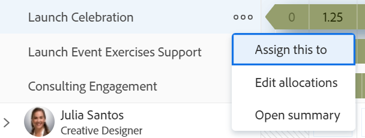

# 업무 균형자에서 작업 할당 해제

Adobe Workfront 업무 균형자 의 할당된 작업 영역에서 작업 항목에서 사용자 할당을 해제하거나 다른 사용자, 역할 또는 팀에 재할당할 수 있습니다.

사용자를 수동으로 끌어다 놓거나 일괄적으로 지정하여 작업 항목에서 할당 해제할 수 있습니다. 이 문서에서는 사용자를 수동으로 할당 해제하는 방법을 설명합니다.

끌어다 놓기로 사용자 할당을 취소하는 방법에 대한 자세한 내용은 [끌어다 놓기로 업무 균형자에서 작업 할당](../../resource-mgmt/workload-balancer/assign-work-in-workload-balancer-by-drag-and-drop.md)을 참조하십시오.

사용자를 일괄 할당 해제하는 방법에 대한 자세한 내용은 [업무 균형자를 사용하여 작업 일괄 할당](../../resource-mgmt/workload-balancer/assign-work-in-workload-balancer-in-bulk.md)을 참조하십시오.

## 액세스 요구 사항

+++ 이 문서의 기능에 대한 액세스 요구 사항을 보려면 확장하십시오.

<table style="table-layout:auto"> 
 <col> 
 <col> 
 <tbody> 
  <tr> 
   <td>Adobe Workfront 패키지</td> 
   <td>
Any
</td>
  </tr>
  <tr> 
   <td>Adobe Workfront 라이선스</td> 
   <td>
표준

       
리소스 영역 내 업무 균형자 사용 시 계획, 팀 또는 프로젝트의 업무 균형자 사용 시 작업
</td>
  </tr> 
  <tr> 
   <td>액세스 수준 구성</td> 
   <td> 
다음에 대한 액세스 권한 편집:
 
    <ul> 
     <li>리소스 관리</li> 
     <li>프로젝트</li> 
     <li>작업</li> 
     <li>문제</li> 
    </ul></td>
  </tr> 
  <tr> 
   <td>개체 권한</td> 
   <td>할당이 포함된 프로젝트, 작업 및 문제에 권한 이상 기여</td> 
  </tr> 
 </tbody> 
</table>

자세한 내용은 [Workfront 설명서의 액세스 요구 사항](/help/quicksilver/administration-and-setup/add-users/access-levels-and-object-permissions/access-level-requirements-in-documentation.md)을 참조하십시오.

+++

## 업무 균형자에서 작업 항목 할당 해제

사용자의 항목 할당을 해제하고 할당 해제된 작업 영역으로 이동하거나 다른 사용자에게 재할당할 수 있습니다.

사용자로부터 작업 항목 할당을 취소하려면 다음을 수행합니다.

1. 업무 균형자에서 **할당된 작업** 영역으로 이동하여 사용자를 확장합니다.
1. 다음 중 하나를 수행하십시오.

   * 사용자 영역에서 할당 해제할 항목을 찾아 클릭한 다음 할당 해제된 영역 또는 다른 사용자 영역으로 끌어서 놓습니다.
   * 작업 항목 이름 오른쪽에 있는 **자세히** 아이콘 을 클릭하고 **할당 대상**&#x200B;을 클릭한 다음 작업 항목에 할당된 엔터티 이름을 제거하거나 다른 이름을 입력하고 **저장**&#x200B;을 클릭합니다.

     

   항목이 해당 영역의 필터링 기준과 일치하고 다른 사용자에게 할당되지 않은 경우 미할당 작업 영역에 표시되고 다른 사용자에게 할당된 경우 사용자 영역에 표시됩니다.

   업무 균형자에서 정보를 필터링하는 방법에 대한 자세한 내용은 [업무 균형자에서 정보 필터링](../../resource-mgmt/workload-balancer/filter-information-workload-balancer.md)을 참조하십시오.
