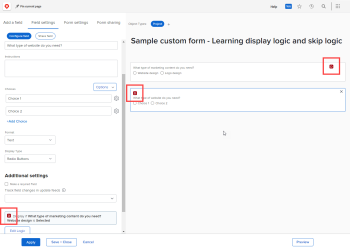

# 사용자 정의 양식에 표시 논리 및 건너뛰기 논리 추가

스마트 규칙을 사용하여 사용자 정의 양식을 동적이고 작성하는 사용자에 대해 보다 연관성이 높은 양식으로 만들 수 있습니다. 사용자가 양식의 다중 선택 필드에 특정 방식으로 응답할 때 스마트 규칙이 해당 응답을 기반으로 하여 다음에 볼 항목을 표시합니다.

다중 선택 필드 유형은 드롭다운, 확인란 및 라디오 버튼입니다.

* **표시 논리**: 사용자가 이전 객관식 필드에서 특정 선택을 선택한 후에만 볼 필드, 위젯 또는 섹션에 표시 논리 규칙을 구성합니다.

  **예:** 조직의 직원들이 새 로고, 웹 사이트 업데이트, 브로슈어 또는 기타 종류의 마케팅 콘텐츠를 요청할 수 있는 마케팅 콘텐츠 요청 양식을 만들고 있습니다. 사용자가 원하는 콘텐츠 유형에 따라 로고가 필요한 경우 색상 및 디자인 아이디어 등 다양한 세부 정보를, 브로셔가 필요한 경우 제품 기능 목록을 표시해야 합니다.

  새 로고에 대한 색상 및 세부 정보를 묻는 필드에서는 사용자가 첫 번째 필드에서 로고 라디오 단추를 선택한 후에만 해당 필드를 표시하는 표시 논리 규칙을 추가할 수 있습니다.

  마찬가지로 제품 기능에 대해 묻는 필드에서 사용자가 첫 번째 필드에서 브로셔 라디오 단추를 선택한 후에만 해당 필드를 표시하는 표시 논리 규칙을 추가할 수 있습니다.

  

  객관식 필드 다음에 오는 사용자 지정 필드, 위젯 또는 섹션 구분에 대해 표시 논리 규칙을 구성할 수 있습니다.

* **논리 규칙 건너뛰기**: 사용자가 필요하지 않은 양식의 일부를 숨기도록 이 규칙을 구성합니다. 사용자가 이전 객관식 필드에서 특정 항목을 선택하면 건너뛰기 논리 규칙이 해당 항목을 양식의 끝이나 사용자가 보려는 사용자 지정 필드, 위젯 또는 섹션으로 건너뜁니다.

  **예:** 누군가 위의 마케팅 콘텐츠 요청 양식을 사용하여 백서를 요청하는데, 이 백서는 마케팅이 아니라 영업부에서 제공합니다. 이 사용자의 경우 건너뛰기 논리 규칙은 세부 사항을 묻는 질문을 숨기고 필요한 부서를 참조하는 텍스트 줄로 건너뛸 수 있습니다.

  

  이 경우 사용자를 영업 부서에 안내하는 설명 텍스트 필드를 추가할 수 있습니다. 사용자에게 필요한 마케팅 콘텐츠 유형을 묻는 첫 번째 사용자 지정 필드에서 사용자가 첫 번째 필드에서 백서 라디오 단추를 선택할 때 텍스트 줄만 표시하는 건너뛰기 논리 규칙을 추가할 수 있습니다.

  이 기능은 이 사용자가 볼 필요가 없는 로고, 웹 사이트 업데이트 및 브로셔에 대한 다른 필드를 많이 추가하는 경우 특히 유용합니다.
건너뛰기 논리 규칙은 위젯 또는 섹션이 아닌 사용자 정의 필드에만 적용할 수 있습니다.

## 액세스 요구 사항

이 문서의 단계를 수행하려면 다음이 있어야 합니다.

<table style="table-layout:auto"> 
 <col> 
 <col> 
 <tbody> 
  <tr data-mc-conditions=""> 
   <td role="rowheader"> 
Adobe Workfront 플랜*
 </td> 
   <td>임의</td> 
  </tr> 
  <tr> 
   <td role="rowheader">Adobe Workfront 라이센스*</td> 
   <td> 
플랜 
 </td> 
  </tr> 
  <tr data-mc-conditions=""> 
   <td role="rowheader">액세스 수준 구성*</td> 
   <td> 
사용자 정의 양식에 대한 관리 액세스
 
Workfront 관리자가 이 액세스 권한을 부여하는 방법에 대한 자세한 내용은 <a href="../../administration-and-setup/add-users/configure-and-grant-access/grant-users-admin-access-certain-areas.md" class="MCXref xref">특정 영역에 대한 관리자 액세스 권한 부여</a>를 참조하십시오.
 </td> 
  </tr>  
 </tbody> 
</table>

&#42;플랜, 라이선스 유형 또는 액세스 수준 구성을 알아보려면 Workfront 관리자에게 문의하세요.

## 표시 및 건너뛰기 논리가 있는 샘플 사용자 정의 양식 만들기

사용자 정의 양식에 디스플레이 및 건너뛰기 논리를 추가하는 방법을 배우는 가장 좋은 방법은 다음 두 섹션에 설명된 실제 예를 사용하는 것입니다.

* [표시 논리 - 실제 예](#display-logic-practical-example)
* [건너뛰기 논리 - 실제 예](#skip-logic-practical-example)

### 디스플레이 논리 - 실제 예 {#display-logic-practical-example}

이 예제에서는 다중 선택 라디오 버튼 필드가 있는 사용자 정의 양식을 만듭니다. 그런 다음 이 필드를 두 번째 필드에 연결하는 표시 논리를 추가합니다.

1. Adobe Workfront 오른쪽 상단의 **기본 메뉴** 아이콘 을(를) 클릭한 다음 **설정** 을(를) 클릭합니다.

1. 왼쪽 패널에서 **사용자 지정 Forms** 을(를) 선택합니다.

1. **새 사용자 정의 양식**&#x200B;을 클릭하고 표시되는 상자에서 **프로젝트**&#x200B;을 선택한 다음 **계속**&#x200B;을 선택합니다.

1. **양식 제목** 텍스트 상자에 **샘플 사용자 정의 양식 - 학습 표시 논리 및 건너뛰기 논리**&#x200B;를 입력하여 양식 이름을 지정합니다.

   

1. 양식에 첫 번째 필드를 추가하려면:

   1. **필드 추가** 탭을 엽니다.

      

   1. **라디오 단추** 필드 유형을 선택한 다음 *필요한 마케팅 콘텐츠 유형을 입력하십시오.필드의&#x200B;**레이블**(으)로*.

   1. **선택 항목**&#x200B;에서 **선택 항목 1** 및 **선택 항목 2**&#x200B;을(를) 다음 텍스트로 바꾸면 사용자가 필드에서 선택할 수 있는 두 가지 옵션을 만들 수 있습니다.

      *웹 사이트 업데이트*

      *로고 디자인*

1. 다음 사용자 지정 필드를 추가하고 표시 논리 규칙을 추가하려면:

   1. **필드 추가** 탭을 다시 열고 *웹 사이트 업데이트 종류*&#x200B;라는 새 **라디오 단추** 필드를 추가합니다.

      나중에 이 필드에 대한 선택 사항을 추가하겠습니다.

   1. **추가 설정** 섹션에서 **논리 추가**&#x200B;를 선택합니다.

      

1. 표시되는 상자에서 **표시 논리** 탭을 연 채 첫 번째 필드에서 *웹 사이트 디자인*&#x200B;을 선택한 사용자에게만 표시되도록 두 번째 필드를 구성합니다.

   1. 첫 번째 드롭다운에서 **필요한 마케팅 콘텐츠 유형을 선택하십시오.**
   1. 두 번째 드롭다운에서 **웹 사이트 디자인**&#x200B;을 선택합니다.
   1. 세 번째 드롭다운을 **선택됨**(으)로 설정한 상태에서 **저장**&#x200B;을(를) 선택합니다.

   두 번째 필드가 첫 번째 필드에서 사용자의 선택에 대한 표시 논리로 연결되어 있음을 나타내는 D가 있는 작은 색상 사각형에 주목합니다.

   

1. **미리 보기**&#x200B;를 선택하여 양식에서 원하는 방식으로 논리가 작동하는지 확인한 다음 **미리 보기 종료**&#x200B;를 선택합니다.

1. **저장 + 닫기**&#x200B;를 클릭하여 양식을 저장한 다음 아래의 [건너뛰기 논리 - 실제 예](#skip-logic-practical-example)를 계속 진행합니다.

### 건너뛰기 논리 - 실제 예 {#skip-logic-practical-example}

건너뛰기 논리는 표시 논리와 유사하게 작동하지만 역으로 작동합니다. 특정 사용자 정의 다중 선택 필드가 이전 사용자 선택 사항을 기반으로 표시되도록 하는 대신, 사용자와 관련이 없으므로 숨겨야(건너뜀) 하는 필드를 결정합니다.

이에 대해 알아보려면 이 문서의 [표시 논리 - 실제 예제](#display-logic-practical-example) 섹션에서 만든 샘플 사용자 정의 양식을 계속 작업하십시오.

1. Adobe Workfront 오른쪽 상단의 **기본 메뉴** 아이콘 을(를) 클릭한 다음 **설정** 을(를) 클릭합니다.

1. **사용자 지정 Forms**&#x200B;을 클릭합니다.
1. **사용자 정의 양식 샘플 - 학습 표시 논리 및 건너뛰기** 양식의 이름을 클릭하여 편집하기 위해 엽니다.
1. 만든 드롭다운 필드 *을(를) 선택하십시오. 필요한 웹 사이트 유형은 무엇입니까?*&#x200B;에서 필드에 대해 다음 선택 사항을 추가한 다음 **적용**&#x200B;을 클릭합니다.

   *전자 상거래*

   *브로셔*

   *멤버십*

1. **필드 추가** 탭을 열고 서식 지정**필드 이름&#x200B;*이 있는 **텍스트 필드를 만드십시오. 웹 사이트의 목표는 무엇입니까?*&#x200B;을(를) 클릭한 다음 **적용**&#x200B;을(를) 클릭합니다.

   이 조직에서는 마케팅 부서가 아닌 기술 문서 작성 팀이 도움말 문서 사이트를 만듭니다. 따라서 두 번째 필드에서 도움말 설명서를 선택하는 사용자는 추가 정보를 필요로 하지 않습니다. 기술 문서 작성 팀을 대신 확인하라는 텍스트 줄(설명 텍스트 필드)을 만듭니다. 또한 해당 사용자를 해당 텍스트 줄로 건너뛰는 건너뛰기 논리 규칙을 사용합니다.

1. 텍스트 줄을 만들려면 다음 작업을 수행하십시오.

   1. **필드 추가** 탭을 열고 **설명 텍스트 필드를 만듭니다**.

   1. **레이블**&#x200B;에 대해 *기술 문서 작성 팀을 입력하십시오*.

   1. **설명 텍스트**&#x200B;에 대해 *온라인 도움말 문서 만들기에 대해 기술 문서 작성팀에 문의하십시오*.

   1. **적용**&#x200B;을 선택합니다.

1. 건너뛰기 논리 규칙을 만들려면 다음을 수행하십시오.

   1. 두 번째 드롭다운 필드를 선택하십시오. *어떤 유형의 웹 사이트가 필요합니까?*
   1. **추가 설정** 섹션에서 **논리 편집**&#x200B;을 선택합니다.
   1. 표시되는 상자에서 **논리 건너뛰기** 탭을 엽니다.
   1. 첫 번째 드롭다운을 **도움말 설명서**(으)로 설정하고 두 번째 드롭다운을 **선택됨**(으)로 설정한 후 세 번째 드롭다운을 **기술 문서 작성팀에 문의**(으)로 설정합니다.
   1. **저장**&#x200B;을 선택합니다.

   사용자가 두 번째 필드에서 특정 선택을 선택한 후 어떤 항목을 건너뛸 것임을 나타내는 S가 있는 작은 건너뛰기 논리 사각형에 주목합니다.

   

1. **미리 보기** 클릭  원하는 대로 논리가 적용되는지 확인하십시오.
1. **저장 +닫기**&#x200B;를 클릭합니다.

이러한 양식을 작성하면 두 번째 필드에서 전자 상거래 또는 브로셔를 선택하는 사용자의 정보를 묻는 텍스트 필드를 더 추가할 수 있습니다. 이러한 필드에서는 웹 사이트에 대한 타겟 대상이 누구인지, 만들기 목표는 무엇인지, 예산은 무엇인지 등을 물을 수 있습니다.

논리 규칙을 사용하여 분기 질문 경로를 생성할 수 있습니다.

예를 들어 전자 상거래를 선택하는 사용자의 경우 제품 사진, 설명, 가격 및 결제 옵션에 대한 질문을 묻는 필드를 만들 수 있습니다. 브로셔를 선택하는 사용자의 경우 콘텐츠에 대해 묻는 필드를 만들 수 있습니다.

도움말 설명서를 선택한 사용자에게는 이러한 추가 필드와 관련이 없는 필드가 표시되지 않습니다.

>[!TIP]
>
>필드에 대한 다음 내용이 모두 참인 경우 표시 논리와 건너뛰기 논리를 모두 사용자 정의 필드에 추가할 수 있습니다.
>
>* 객관식 필드(라디오 버튼, 드롭다운 또는 확인란)입니다
>* 앞에 다중 선택 필드가 옵니다.
>* 뒤에 다른 사용자 지정 필드가 옵니다.
>

<!--
<h2 data-mc-conditions="QuicksilverOrClassic.Draft mode">Multi-field display logic statements</h2>
-->

