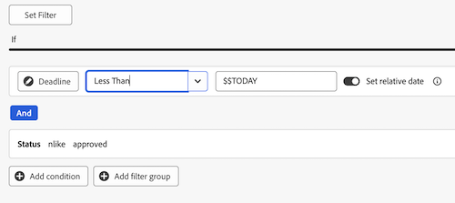
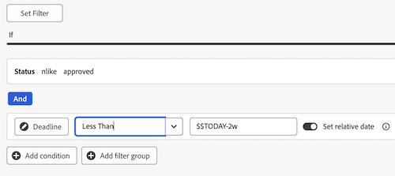
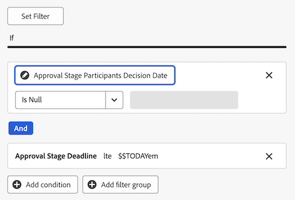

# 검토 및 승인을 위한 보고서 대시보드 만들기

캔버스 대시보드 영역에서 보고서 대시보드를 만들어 통합 승인 기능을 사용하는 검토 및 승인에 대한 고급 정보와 자세한 정보를 모두 표시할 수 있습니다.

>[!IMPORTANT]
>
>이 기능은 통합 승인 서비스를 사용하고 Canvas Dashboards Beta에 등록된 고객에게만 제공됩니다.

## 대시보드 만들기

{{step1-to-dashboards}}

1. 왼쪽 패널에서 **캔버스 대시보드**&#x200B;를 클릭합니다.
1. **새 대시보드**&#x200B;를 클릭합니다.
1. 대시보드 이름을 지정합니다.
1. (선택 사항) 설명을 추가합니다.
1. Click **Create**.
   

대시보드를 만든 후에는 KPI, 차트 및 Tables를 추가할 수 있습니다. 자세한 내용은 다음 섹션을 참조하십시오.

* [KPI 및 차트로 높은 수준의 검토 및 승인 정보 추가](#add-high-level-review-and-approval-information-with-kpis-and-charts)
* [표를 사용하여 자세한 검토 및 승인 정보 추가](#add-detailed-review-and-approval-information-with-tables)

## KPI 및 차트를 사용하여 높은 수준의 검토 및 승인 정보 추가

KPI 및 차트를 사용하여 문서 승인에 대한 높은 수준의 정보를 볼 수 있습니다. 드릴다운 정보는 현재 Beta에서 사용할 수 없습니다.

### KPI

#### 보류 중인 승인

1. 위의 섹션에 설명된 대로 [대시보드를 만듭니다](#create-a-dashboard).
1. **KPI** 카드에서 **추가**&#x200B;를 클릭합니다.
1. **KPI 제목** 텍스트 상자에 _보류 중_&#x200B;을 입력하십시오.
1. **KPI Caption** 텍스트 상자에 _승인 보류 중_&#x200B;을(를) 입력하십시오. 이 텍스트는 KPI에 표시되는 내용을 설명합니다.
1. 페이지 맨 위에서 **KPI 필드 선택**&#x200B;을 클릭합니다.
1. 아래로 스크롤하여 **문서 승인 폴더**&#x200B;를 찾습니다.
1. **상태**&#x200B;를 선택한 다음 드롭다운 메뉴에서 **개수**&#x200B;를 선택합니다.
1. **필터 편집** > **조건 추가**&#x200B;를 클릭합니다.
   1. 빈 조건 필터를 클릭하고 **필드 선택**&#x200B;을 클릭한 다음 **상태**&#x200B;를 선택합니다.
   1. 연산자를 **Equal**(으)로 두고 텍스트 상자에 _검토 보류 중_을(를) 입력하십시오.
      
1. 화면 오른쪽 상단 모서리에서 완료&#x200B;**를 클릭합니다**.

#### 기한이 경과된 승인

1. [위 섹션에 설명된 대로 대시보드](#create-a-dashboard) 를 만들기
1. **KPI** 카드에서 추가&#x200B;**를 클릭합니다**.
1. KPI 제목&#x200B;**텍스트 상자에 기한**_초과를 입력합니다_.
1. KPI 캡션&#x200B;**텍스트 상자에 Approval _Stage Deadline in the past를**입력합니다_. 이 텍스트는 KPI 표시 내용을 설명합니다.
1. 페이지 상단에서 KPI 필드&#x200B;**선택을 클릭합니다**.
1. 아래로 스크롤하여 문서 승인 폴더를&#x200B;**찾습니다**.
1. 상태&#x200B;**를 선택한**&#x200B;다음 드롭다운 메뉴에서 개수를&#x200B;**선택합니다**.
1. **필터 편집** > **조건 추가**&#x200B;를 클릭합니다.
   1. 빈 조건 필터를 클릭하고 **필드 선택**&#x200B;을 클릭한 다음 **기한**&#x200B;을 선택합니다.
   1. 연산자를 **다음보다 작음**(으)로 변경하고 상대적 날짜 설정을 전환한 다음 텍스트 상자에 _$$TODAY_을(를) 입력하십시오.
      
1. **조건 추가**&#x200B;를 클릭합니다.
   1. 빈 조건 필터를 클릭하고 **필드 선택**&#x200B;을 클릭한 다음 **상태**&#x200B;를 선택합니다.
   1. 연산자를 **포함하지 않음**(으)로 변경한 다음 텍스트 상자에 _승인됨_을(를) 입력하십시오.
      
1. 화면 오른쪽 상단에서 **완료**&#x200B;를 클릭합니다.

#### 완료된 승인

1. 위의 섹션에 설명된 대로 [대시보드를 만듭니다](#create-a-dashboard).
1. **KPI** 카드에서 **추가**&#x200B;를 클릭합니다.
1. **KPI 제목** 텍스트 상자에 _완료_&#x200B;을(를) 입력하십시오.
1. **KPI Caption** 텍스트 상자에 _승인 상태 수_&#x200B;를 입력하십시오. 이 텍스트는 KPI에 표시되는 내용을 설명합니다.
1. 페이지 맨 위에서 **KPI 필드 선택**&#x200B;을 클릭합니다.
1. 아래로 스크롤하여 **문서 승인 폴더**&#x200B;를 찾습니다.
1. **상태**&#x200B;를 선택한 다음 드롭다운 메뉴에서 **개수**&#x200B;를 선택합니다.
1. **필터 편집** > **조건 추가**&#x200B;를 클릭합니다.
   1. 빈 조건 필터를 클릭하고 **필드 선택**&#x200B;을 클릭한 다음 **상태**&#x200B;를 선택합니다.
   1. 연산자를 **포함**(으)로 변경하고 텍스트 상자에 _승인됨_을(를) 입력하십시오.
      
1. **조건 추가**&#x200B;를 클릭합니다.
   1. And(및)를 클릭하여 **Or(또는**)로 **** 변경합니다.
   1. 빈 조건 필터를 클릭하고 필드 선택을 클릭한 **다음 상태(Status**)를 선택합니다&#x200B;**.**
   1. 연산자를 **같음**(으)로 변경한 다음 텍스트 상자에 _검토_을(를) 입력하십시오.
      
1. 화면 오른쪽 상단에서 **완료**&#x200B;를 클릭합니다.

#### 중단된 승인

1. [위 섹션에 설명된 대로 대시보드](#create-a-dashboard) 를 만들기
1. **KPI** 카드에서 추가&#x200B;**를 클릭합니다**.
1. KPI 제목&#x200B;**텍스트 상자에 중단**_을 입력합니다_.
1. KPI 캡션&#x200B;**텍스트 상자에 2주 이상 경과&#x200B;_한 승인 기한을**입력합니다_. 이 텍스트는 KPI 표시 내용을 설명합니다.
1. 페이지 맨 위에서 **KPI 필드 선택**&#x200B;을 클릭합니다.
1. 아래로 스크롤하여 **문서 승인 단계 폴더**&#x200B;를 찾습니다.
1. **기한**&#x200B;을 선택한 다음 드롭다운 메뉴에서 **개수**&#x200B;을(를) 선택합니다.
1. **필터 편집** > **조건 추가**&#x200B;를 클릭합니다.
   1. 빈 조건 필터를 클릭하고 **필드 선택**&#x200B;을 클릭한 다음 **상태**&#x200B;를 선택합니다.
   1. 연산자를 **포함하지 않음**(으)로 변경하고 텍스트 상자에 _승인됨_을(를) 입력하십시오.
      
1. **조건 추가**&#x200B;를 클릭합니다.
   1. 빈 조건 필터를 클릭하고 **필드 선택**&#x200B;을 클릭한 다음 **기한**&#x200B;을 선택합니다.
   1. 연산자를 **다음보다 작음**(으)로 변경한 다음 상대적 날짜 설정을 전환하고 텍스트 상자에 _$$TODAY-2w_을(를) 입력하십시오.
      
1. 화면 오른쪽 상단에서 **완료**&#x200B;를 클릭합니다.

### 차트

#### 결정 막대형 차트별 승인

1. 위의 섹션에 설명된 대로 [대시보드를 만듭니다](#create-a-dashboard).
1. **차트** 카드에서 **추가**&#x200B;를 클릭합니다.
1. 이름(Name) **텍스트 상자에 Approvals by decision _을 입력합니다_.**
1. (선택 사항) 설명&#x200B;**텍스트 상자에 설명을**&#x200B;입력합니다. 이 텍스트는 차트 이름 옆에 툴팁으로 표시됩니다.
1. 차트 세부정보&#x200B;**열기를 클릭합니다**.
1. **차트 유형** 드롭다운 메뉴에서 막대 차트를&#x200B;**선택된 상태로 둡니다**.
1. Bar type(막대 유형) **드롭다운 메뉴에서 Simple(단순**)을 선택된 상태로 둡니다&#x200B;**.**
1. 아래쪽(X) 축에 대해 필드&#x200B;**업데이트를 클릭하고**&#x200B;첫 번째 **문서 승인** 폴더를 선택한 다음 **상태** 폴더를 선택합니다.****
1. 집계 유형을 **Count**(으)로 설정합니다.
1. **왼쪽(Y) 축**&#x200B;의 **필드 업데이트**&#x200B;를 클릭하고 첫 번째 **문서 승인** 옵션을 선택한 다음 **상태**&#x200B;를 선택하십시오.
1. 필터 탭 을 클릭합니다.
1. **필터 편집** > **조건 추가**&#x200B;를 클릭합니다.
   1. 빈 조건 필터를 클릭하고 **필드 선택**&#x200B;을 클릭한 다음 **문서 버전**&#x200B;을 선택합니다.
   1. 연산자를 Is Not Null **로**변경합니다.
      
1. 화면 오른쪽 상단에서 **완료**&#x200B;를 클릭합니다.

#### 개정 막대 차트

1. 위의 섹션에 설명된 대로 [대시보드를 만듭니다](#create-a-dashboard).
1. **차트** 카드에서 **추가**&#x200B;를 클릭합니다.
1. **이름** 텍스트 상자에 _Revisions_&#x200B;을(를) 입력하십시오.
1. **설명** 텍스트 상자에 _이번 달 말 이전에 계획된 불완전한 결정이 있는 문서의 수정 버전 수_&#x200B;를 입력하십시오. 이 텍스트는 차트 이름 옆에 툴팁으로 표시됩니다.
1. **차트 세부 정보 열기**&#x200B;를 클릭합니다.
1. **차트 종류** 드롭다운 메뉴에서 **막대 차트**&#x200B;을(를) 선택한 상태로 둡니다.
1. **막대 유형** 드롭다운 메뉴에서 **단순**&#x200B;을(를) 선택한 상태로 둡니다.
1. **아래쪽(X) 축**&#x200B;의 **필드 업데이트**&#x200B;를 클릭하고 첫 번째 **문서 승인** 폴더를 선택한 다음 **문서 버전** > **버전**&#x200B;을 선택합니다.
1. 집계 유형을 **Count**(으)로 설정합니다.
1. **왼쪽(Y) 축**&#x200B;의 **필드 업데이트**&#x200B;를 클릭하고 첫 번째 **문서 승인** 옵션을 선택한 다음 **문서 버전** > **문서** > **이름**&#x200B;을 선택합니다.
1. 필터 탭 을 클릭합니다.
1. **필터 편집** > **조건 추가**&#x200B;를 클릭합니다.
   1. 빈 조건 필터를 클릭하고 **필드 선택**&#x200B;을 클릭한 다음 **승인 단계 참가자 결정 날짜**&#x200B;를 선택합니다.
   1. 연산자를 **Is Null**(으)로 변경하십시오.
      
1. **필터 편집** > **조건 추가**&#x200B;를 클릭합니다.
   1. 빈 조건 필터를 클릭하고 **필드 선택**&#x200B;을 클릭한 다음 **승인 단계 기한**&#x200B;을 선택합니다.
   1. 연산자를 보다 작거나 같음으로 **변경한 다음 상대 날짜 설정을 켜고 텍스트 상자에 $$TODAYem _를 입력합니다_.**
      
1. 화면 오른쪽 상단에서 **완료**&#x200B;를 클릭합니다.

## 표를 사용하여 자세한 검토 및 승인 정보 추가

### 승인 보류 중 목록

1. [위 섹션에 설명된 대로 대시보드](#create-a-dashboard) 를 만들기
1. [테이블] **카드 메뉴에서 [추가**]를 클릭합니다&#x200B;**.**
1. 이름(Name) 텍스트 상자에 Pending Approvals(승인&#x200B;**보류 중)_를**입력합니다_.
1. (선택 사항) 설명&#x200B;**텍스트 상자에 설명을**&#x200B;입력합니다. 이 텍스트는 차트 이름 옆에 툴팁으로 표시됩니다.
1. **열 설정 열기**&#x200B;를 클릭합니다.
1. **열 추가**&#x200B;를 클릭하고 아래로 스크롤하여 첫 번째 **문서 승인** 폴더를 클릭한 다음 **상태**&#x200B;를 선택하십시오.
1. 다음 열을 추가합니다.

   <table>
    <tr>
    <td><strong>프로젝트 이름</strong></td>
    <td>문서 버전 &gt; 문서 &gt; 프로젝트 &gt; 이름</td>
    </tr>
    <tr>
    <td><strong>문서 이름</strong></td>
    <td>문서 버전 &gt; 문서 &gt; 검색 상자에 _Name_을 입력합니다.</td>
    </tr>
    <tr>
    <td><strong>문서 버전</strong></td>
    <td>문서 버전 &gt; 문서 &gt; 버전</td>
    </tr>
    <tr>
    <td><strong>마감</strong></td>
    <td>문서 &gt; 승인 단계 &gt; 기한</td>
    </tr>
    <tr>
    <td><strong>요청한 사람</strong></td>
    <td>문서 &gt; 승인 단계 &gt; 승인 단계 참가자* &gt; 요청자 &gt; 검색 상자에 _Name_을 입력합니다.</td>
    </tr>
     <tr>
    <td><strong>요청한 날짜</strong></td>
    <td>문서 &gt; 승인 단계 &gt; 승인 단계 참가자* &gt; 생성일</td>
    </tr>
     <tr>
    <td><strong>승인자</strong></td>
    <td>문서 &gt; 승인 단계 &gt; 승인 단계 참가자* &gt; 참가자 사용자 &gt; 검색 상자에 _Name_을 입력합니다.</td>
    </tr>
    <table>

   *승인 단계 참가자는 승인 단계 Pa로 잘립니다.

1. [아래에 필요한 필터를 추가](#add-the-required-filter)합니다.

#### 필요한 보류 중인 승인 필터 추가

1. 필터 탭 을 클릭합니다.
1. **필터 편집** > **조건 추가**&#x200B;를 클릭합니다.
   1. 빈 조건 필터를 클릭하고 **필드 선택**&#x200B;을 클릭한 다음 **상태**&#x200B;를 선택합니다.
   1. 연산자를 **Equal**(으)로 변경한 다음 _승인 보류 중_을(를) 입력하십시오.
      
1. 아래 설명에 따라 선택적 필터를 추가하거나 화면 오른쪽 상단의 **완료**&#x200B;를 클릭합니다.

**선택적 필터**

사용 사례에 따라 보다 구체적인 정보를 보려면 필터 조건을 더 추가할 수 있습니다. 테이블을 다시 만들고 사용 사례별로 새 필터 조건을 추가할 수 있습니다.

+++ 를 확장하여 추가 필터 옵션 보기

**내 프로젝트**

1. **필터 편집** > **조건 추가**&#x200B;를 클릭합니다.
   1. 빈 조건 필터를 클릭하고 **필드 선택**&#x200B;을 클릭한 다음 **문서 버전** > **문서** > **프로젝트** > **소유자** > 검색 상자에 _이름_&#x200B;을 선택하세요.
   1. 연산자를 **같음**(으)로 변경한 다음, **나를(로그인한 사용자)**을(를) 선택하여 프로젝트 소유자로 표시된 Workfront의 프로젝트를 표시합니다.
      
1. 화면 오른쪽 상단에서 **완료**&#x200B;를 클릭합니다.

**내가 제출한 승인**

1. **필터 편집** > **조건 추가**&#x200B;를 클릭합니다.
   1. 빈 조건 필터를 클릭하고 **필드 선택**&#x200B;을 클릭한 다음 **승인 단계** > **승인 단계 참가자** > **요청자** > 검색 상자에 _이름_&#x200B;을 선택합니다.
   1. 연산자를 **같음**(으)로 변경한 다음, **나를(로그인한 사용자)**을(를) 선택하여 프로젝트 소유자로 표시된 Workfront의 프로젝트를 표시합니다.
      
1. 화면 오른쪽 상단에서 **완료**&#x200B;를 클릭합니다.

+++

### 기한 경과 승인 목록

1. 위의 섹션에 설명된 대로 [대시보드를 만듭니다](#create-a-dashboard).
1. 표 카드에서 **추가**&#x200B;를 클릭합니다.
1. **이름** 텍스트 상자에 _지연된 승인_&#x200B;을(를) 입력하십시오.
1. (선택 사항) **설명** 텍스트 상자에 설명을 입력합니다. 이 텍스트는 차트 이름 옆에 툴팁으로 표시됩니다.
1. **열 설정 열기**&#x200B;를 클릭합니다.
1. **열 추가**&#x200B;를 클릭하고 아래로 스크롤하여 첫 번째 **문서 승인** 폴더를 클릭한 다음 **상태**&#x200B;를 선택하십시오.
1. 다음 열을 추가합니다.

   <table>
    <tr>
    <td><strong>프로젝트 이름</strong></td>
    <td>문서 버전 &gt; 문서 &gt; 프로젝트 &gt; 이름</td>
    </tr>
    <tr>
    <td><strong>문서 이름</strong></td>
    <td>문서 버전 &gt; 문서 &gt; 검색 상자에 _Name_을 입력합니다.</td>
    </tr>
    <tr>
    <td><strong>문서 버전</strong></td>
    <td>Document 버전 &gt; Document &gt; 버전</td>
    </tr>
    <tr>
    <td><strong>마감</strong></td>
    <td>문서 &gt; 승인 단계 &gt; 기한</td>
    </tr>
    <tr>
    <td><strong>요청한 사람</strong></td>
    <td>문서 &gt; 승인 단계 &gt; 승인 단계 참가자* &gt; 요청자 &gt; 검색 상자에 _Name_을 입력합니다.</td>
    </tr>
     <tr>
    <td><strong>요청한 날짜</strong></td>
    <td>문서 &gt; 승인 단계 &gt; 승인 단계 참가자* &gt; 생성일</td>
    </tr>
     <tr>
    <td><strong>승인자</strong></td>
    <td>문서 &gt; 승인 단계 &gt; 승인 단계 참가자* &gt; 참가자 사용자 &gt; 검색 상자에 _Name_을 입력합니다.</td>
    </tr>
    <table>

   *승인 단계 참가자는 승인 단계 Pa로 잘립니다.

1. [아래에 필요한 필터를 추가](#add-the-required-filter-1)합니다.

#### 필수 기한 경과 승인 필터 추가

1. 필터 탭 을 클릭합니다.
1. **필터 편집** > **조건 추가**&#x200B;를 클릭합니다.
   1. 빈 조건 필터를 클릭하고 **필드 선택**&#x200B;을 클릭한 다음 **승인 단계** > **기한**&#x200B;을 선택합니다.
   1. 연산자를 **다음보다 작음**(으)로 변경하고 **상대적 날짜 설정**&#x200B;을(를) 전환한 다음 _$$TODAY_을(를) 입력하십시오.
      
1. 아래 설명에 따라 선택적 필터를 추가하거나 화면 오른쪽 상단의 **완료**&#x200B;를 클릭합니다.

**선택적 필터**

사용 사례에 따라 보다 구체적인 정보를 보려면 필터 조건을 더 추가할 수 있습니다. 표를 다시 만들고 사용 사례별로 새로운 선택적 필터 조건을 추가할 수 있습니다.

+++ 를 확장하여 추가 필터 옵션 보기

**내 프로젝트**

1. **필터 편집** > **조건 추가**&#x200B;를 클릭합니다.
   1. 빈 조건 필터를 클릭하고 **필드 선택**&#x200B;을 클릭한 다음 **문서 버전** > **문서** > **프로젝트** > **소유자** > 검색 상자에 _이름_&#x200B;을 선택하세요.
   1. 연산자를 **같음**(으)로 변경한 다음, **나를(로그인한 사용자)**을(를) 선택하여 프로젝트 소유자로 표시된 Workfront의 프로젝트를 표시합니다.
      
1. 화면 오른쪽 상단에서 **완료**&#x200B;를 클릭합니다.

**내가 제출한 승인**

1. **필터 편집** > **조건 추가**&#x200B;를 클릭합니다.
   1. 빈 조건 필터를 클릭하고 **필드 선택**&#x200B;을 클릭한 다음 **승인 단계** > **승인 단계 참가자** > **요청자** > 검색 상자에 _이름_&#x200B;을 선택합니다.
   1. 연산자를 **같음**(으)로 변경한 다음, **나를(로그인한 사용자)**을(를) 선택하여 프로젝트 소유자로 표시된 Workfront의 프로젝트를 표시합니다.
      
1. 화면 오른쪽 상단에서 **완료**&#x200B;를 클릭합니다.

**내 팀**

1. 필터링&#x200B;**편집 >**&#x200B;조건&#x200B;**추가를 클릭합니다**.
   1. 빈 조건 필터를 클릭하고 **필드 선택**&#x200B;을 클릭한 다음 **승인 단계** > **승인 단계 참가자** > **참가자 팀** > 검색 상자에 _이름_&#x200B;을 선택합니다.
   1. 연산자를 **같음**(으)로 변경한 다음 **내 기본 팀(로그인한 사용자)** 또는 **내 다른 팀(로그인한 사용자)**을 선택하여 기본 팀이나 진행 중인 다른 팀에 할당된 프로젝트를 표시하십시오.
      
1. 화면 오른쪽 상단에서 **완료**를 클릭합니다.
+++
