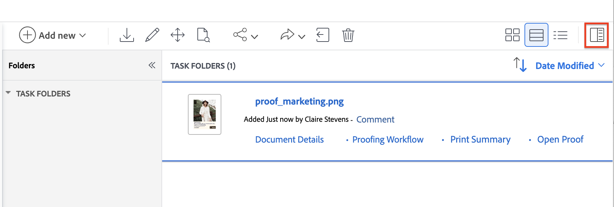

# 통합 승인 및 증명 함께 사용

Workfront의 통합 승인에는 문서를 검토하고 승인하는 데 도움이 되는 새로운 기능 세트가 도입되었습니다. 기존 증명 뷰어와 함께 통합 승인 워크플로를 사용하여 검토 중인 문서에 주석 및 마크업을 추가할 수 있습니다.

통합 승인과 증명을 함께 사용할 때 워크플로에는 다음과 같은 몇 가지 주요 차이점이 있습니다.

* 증명 뷰어에 결정 버튼이 표시되지 않음

* 참가자는 증명 워크플로가 아니라 문서 요약에 표시됩니다

* 문서 목록의 전송됨, 열림, 주석, 결정(SOCD) 세부 사항은 증명 관련이며 문서의 결정 상태를 반영하지 않습니다.

## 문서 업로드 및 증명 만들기

1. 새 문서를 추가할 프로젝트, 작업 또는 문제로 이동합니다.
1. **문서** 탭을 클릭한 다음 **새로 추가** 드롭다운 메뉴를 클릭합니다.
또는
문서를 문서 목록으로 드래그 앤 드롭합니다.

   >[!NOTE]
   >
   >사용자 프로필에 **문서를 업로드할 때 자동으로 증명 생성**&#x200B;이 활성화되어 있으면 간단한 증명이 자동으로 만들어집니다.

1. 문서 위로 마우스를 가져간 다음 문서 이름 아래에 나타나는 **증명 만들기** 링크를 클릭하고 **단순 증명**&#x200B;을 선택합니다. 승인에 증명 워크플로를 사용하지 않으므로 간단한 증명을 만들어야 합니다.

참여자로 할당된 사용자는 증명 뷰어를 사용하여 문서에 주석 및 마크업을 추가할 수 있습니다. 다음 섹션으로 이동하여 검토 참여자를 추가하는 방법을 알아보십시오.

## 요약 문서를 열고 참여자 할당

검토자, 승인자 또는 두 가지 모두를 혼합하여 할당할 수 있습니다.

* **검토자**&#x200B;이(가) 댓글을 추가하고 자산을 표시할 수 있습니다. 완료되면 검토를 완료된 것으로 표시할 수 있습니다. 문서를 승인 프로세스에서 앞으로 이동하려면 검토를 완료로 표시할 필요가 없습니다.
* **승인자**&#x200B;는 댓글을 추가하고 자산을 표시할 수 있습니다. 그들은 승인 절차를 진행하기 위해 결정을 내려야 한다.

참여자를 지정하려면

1. 업로드한 문서를 선택하고 문서 요약을 엽니다.
   

1. 승인 섹션까지 아래로 스크롤한 다음 **추가**&#x200B;를 클릭합니다.

1. (선택사항) 기존 승인 템플리트를 선택합니다. 표준 라이선스가 있는 사용자는 설정 영역에서 재생성 가능한 승인 템플릿을 만들 수 있습니다. 자세한 내용은 [자산 및 문서에 대한 승인 템플릿 만들기](/help/quicksilver/review-and-approve-work/document-reviews-and-approvals/manage-document-approvals/create-approval-template.md)를 참조하십시오.

1. (선택 사항) 승인 기한을 설정합니다. 사용자와 팀은 지정된 기한 24시간 전에 이메일로 72시간 전에 알림을 받습니다.

1. 승인자를 추가하려면 승인자 버튼을 클릭하고 사용자 또는 팀 이름을 입력하십시오.

1. 검토자를 추가하려면 [검토자] 단추를 클릭하고 사용자 또는 팀 이름을 입력하십시오.

   

1. 모든 검토자와 승인자를 추가했으면 **요청 제출**&#x200B;을 클릭합니다. 참가자에게는 이메일을 통해 알림이 전송됩니다.

## 필요에 따라 새 버전 만들기

검토 및 승인을 다시 한 번 받아야 하는 경우 새 증명 버전을 만들 수 있습니다.  <!-- and add the previous participants, new participants, or a mix of both. --> 문서 요약에서 이전 버전 및 참가자에 대한 정보를 볼 수 있습니다.

새 버전을 추가하려면 다음을 수행하십시오.

1. Workfront의 이전 문서 위에 새 파일을 끌어다 놓습니다. 이렇게 하면 새 버전이 자동으로 만들어집니다.

1. 문서 업로드가 완료되면 문서를 선택한 다음 **증명 만들기** > **단순 증명**&#x200B;을 클릭합니다.

1. 문서를 다시 선택하고 문서 요약을 엽니다.
   

1. 승인 섹션까지 아래로 스크롤한 다음 **추가**&#x200B;를 클릭합니다.

1. (선택사항) 기존 승인 템플리트를 선택합니다. 표준 라이선스가 있는 사용자는 설정 영역에서 재생성 가능한 승인 템플릿을 만들 수 있습니다. 자세한 내용은 [자산 및 문서에 대한 승인 템플릿 만들기](/help/quicksilver/review-and-approve-work/document-reviews-and-approvals/manage-document-approvals/create-approval-template.md)를 참조하십시오.

1. (선택 사항) 승인 기한을 설정합니다. 사용자와 팀은 지정된 기한 24시간 전에 이메일로 72시간 전에 알림을 받습니다.

1. 승인자를 추가하려면 [승인자] 단추를 클릭하고 사용자 또는 팀 이름 을(를) 입력하거나 이전 버전에서 승인자를 선택하십시오.

1. 검토자를 추가하려면 [검토자] 단추를 클릭하고 사용자 또는 팀 이름 을(를) 입력하거나 이전 버전에서 검토자를 선택하십시오. 

   

1. 모든 검토자와 승인자를 추가했으면 **요청 제출**&#x200B;을 클릭합니다. 참가자에게는 이메일을 통해 알림이 전송됩니다.

<!-- add info about reusing previous participants once released -->

## 증명 검토 및 결정

지정된 모든 승인자가 &quot;승인됨&quot;을 선택할 때까지 문서가 승인됨 상태로 이동하지 않습니다.

한 승인자가 &quot;작업 필요&quot;를 선택하면 문서의 상태가 즉시 작업 필요 상태로 변경됩니다. 문서를 수정하고 새 승인 워크플로가 있는 새 버전으로 업로드해야 합니다.

>[!IMPORTANT]
>
>증명 뷰어에 문서 결정 버튼이 표시되지 않습니다. 결정을 내리거나 검토를 완료로 표시하려면 문서 요약 또는 문서 세부 정보 페이지로 돌아가야 합니다.

문서를 검토하고 승인하려면 다음과 같이 하십시오.

1. 리뷰 전자 메일 알림으로 이동한 다음 **리뷰로 이동**&#x200B;을 클릭합니다.

1. Workfront에 있으면 **증명으로 이동**&#x200B;을 클릭하세요.

1. 콘텐츠를 검토하고 주석 또는 마크업을 추가합니다. 증명 뷰어를 사용하는 방법에 대한 자세한 내용은 [Adobe Workfront에서 증명 검토: 문서 인덱스](/help/quicksilver/review-and-approve-work/proofing/reviewing-proofs-within-workfront/review-proofs-in-wf.md)를 참조하십시오.

1. 검토를 마치면 증명 뷰어를 닫습니다.

1. 문서 세부 정보 페이지에 있는 경우 결정 버튼이 화면 오른쪽 상단에 있습니다.

1. 다음 결정 중 하나를 선택합니다.

   * **승인**: 문서를 변경할 필요가 없으며 사용할 준비가 되었습니다.
   * **변경 사항과 함께 승인**: 문서를 변경해야 하며, 문서를 사용할 준비가 되었습니다. 추가 승인이 필요하지 않습니다.
   * **작업 필요**: 문서를 변경해야 하며 사용할 준비가 되지 않았습니다. 지정된 변경 사항이 적용되면 문서를 새 버전으로 업로드하고 다른 승인을 거쳐야 합니다. 새 버전을 업로드하는 방법에 대한 자세한 내용은 이 문서에서 [필요에 따라 새 버전 만들기](#create-a-new-version-as-needed)를 참조하십시오.

결정을 내리면 문서 소유자에게 이메일을 통해 알림이 전송됩니다.
