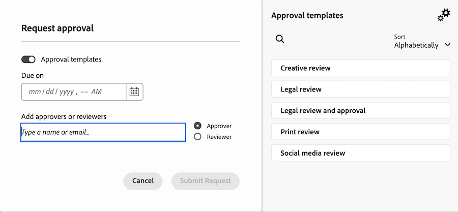

# Frame.io로 자산 검토 및 승인 시작

새로운 에셋 검토 및 승인 워크플로우는 Workfront과 Frame.io 간의 긴밀한 통합을 기반으로 구축됩니다. 이 통합은 각 제품이 제공하는 기능을 최대한 활용하고 이를 결합하여 컨텐츠 작성에 참여하는 모든 사람이 원하는 도구로 작업하면서 주석, 파일 및 상태 업데이트에 액세스할 수 있는 환경을 만듭니다. 이 모든 작업은 두 시스템 모두에서 실시간으로 동기화됩니다.

Frame.io에 대한 자세한 내용은 [Frame.io 시작하기](https://support.frame.io/en/collections/49298-getting-started).

## Workfront의 작업 시작 및 계획

Workfront 관리자는 설정 영역에서 기본 Frame.io 계정을 구성한 다음 Workfront에서 Frame.io 사용자를 지정하여 Workfront과 Frame.io 간을 통합할 수 있습니다. 이를 통해 코디네이터는 Workfront 프로젝트 및 공식 검토 및 승인 워크플로를 사용하여 작업을 계획하고 시작할 수 있습니다.

### 기본 Frame.io 계정 구성 [!BADGE 곧 출시 예정]{type=Informative}

Workfront 관리자는 Workfront의 설정 영역에서 기본 Frame.io 계정을 추가하여 Workfront 및 Frame.io 통합을 시작합니다. 기본 Frame.io 계정이 설정되면 Workfront에서 만든 모든 프로젝트에 Frame.io에서 만든 미러 프로젝트가 있습니다.

>[!IMPORTANT]
>
>이 기능은 곧 제공될 예정입니다. 현재 Frame.io 계정은 Workfront 팀에서 수동으로 추가합니다. 도움이 필요하면 Adobe 계정 담당자에게 문의하십시오.

<!--For more information, see [Configure the [!DNL Workfront] and [!DNL Frame.io] integration](/help/quicksilver/administration-and-setup/configure-integrations/configure-wf-and-frame.md).

 in procedure article we need to cover how groups work with projects and how the frame account is associated with a group. And that accounts other than the default can be added on a 1:1 basis using the dev token. -->

### Frame.io 사용자 활성화 현재 사용 가능

Frame.io를 정기적으로 사용하는 Workfront 사용자는 Frame.io 사용자로 표시되어야 합니다. Workfront 관리자는 Workfront 사용자 프로필에서 Frame.io 사용자를 지정할 수 있습니다.

>[!TIP]
>
>크리에이티브 도구에서 정기적으로 작업하고 검토 및 승인을 위해 에셋을 업로드하는 사용자를 Frame.io 사용자로 활성화하는 것이 좋습니다.

사용자가 Workfront에서 Frame.io 사용자로 표시되고 프로젝트에 추가되면 다음과 같이 됩니다.

* Frame.io에서 공동 작업자로 추가됩니다.
* 정식 검토 및 승인을 위해 Frame.io에서 Workfront으로 자산을 전송할 수 있습니다.
* Workfront의 단방향 동기화 폴더에서 정보를 볼 수 있습니다. [!BADGE 곧 출시 예정]{type=Informative}

자세한 내용은 [구성 [!DNL Workfront] 및 [!DNL Frame.io] 통합](/help/quicksilver/administration-and-setup/configure-integrations/configure-wf-and-frame.md).

### Frame.io와 연결된 프로젝트 만들기

기본 Frame.io 계정이 추가되고 Frame.io 사용자가 지정되면 프로젝트 코디네이터는 Frame.io와 연결된 Workfront 프로젝트를 만들 수 있습니다. 연결된 프로젝트를 만들 때 다음과 같은 작업을 수행할 수 있습니다

* **작업에 Frame.io 사용자 할당**: Frame.io를 사용하는 사용자는 Workfront 작업에 할당되면 이메일로 알림이 전송되어 완료할 작업이 있음을 나타냅니다.
* **Frame.io 사용자와 프로젝트 공유**: 프로젝트가 Frame.io를 사용하는 사용자와 공유되면 Workfront 및 Frame.io 내의 프로젝트에 액세스할 수 있습니다.
* **Frame.io와 크리에이티브 자료 공유**: 프로젝트 코디네이터는 단방향 동기화 프로젝트 폴더를 사용하여 Workfront의 지침과 자료를 Frame.io의 크리에이티브 사용자에게 직접 보낼 수 있습니다. [!BADGE 곧 출시 예정]{type=Informative}
* **작업 진행 추적**: 크리에이티브는 Frame.io를 종료하지 않고 완료된 에셋을 보내고 작업을 완료로 표시할 수 있습니다.

자세한 내용은 [Frame.io와 연결된 프로젝트 만들기](/help/quicksilver/manage-work/projects/create-projects/create-frame-connected-project.md).

## Frame.io의 컨텐츠 제작 및 공동 작업

크리에이티브는 자신이 선택한 도구에 머무르며 Frame.io 내에서 동료 리뷰를 만들고 반복하고 수행할 수 있는 자유를 가질 수 있습니다.

크리에이티브가 연결된 프로젝트에 추가되면 Frame.io에서 다음 작업을 수행할 수 있습니다.

<!--* Access instructions from the project coordinator -->
* 비공식 동료 검토 수행
* 공식적인 검토 및 승인을 위해 완료된 에셋을 Workfront으로 전송
* 작업 상태 변경 또는 완료 표시
* 새 버전을 업로드한 후 승인을 위해 다시 제출합니다. <!--do they have to send to frame.io again?-->

Frame.io에 대한 자세한 내용은 [프로젝트에 공동 작업자로 초대되었습니다.](https://support.frame.io/en/articles/11125-i-ve-been-invited-to-collaborate-on-a-project).

## 에셋 검토 및 승인

크리에이티브가 완성된 에셋을 Frame.io에서 Workfront으로 전송하면 프로젝트 코디네이터는 Workfront에서 공식 검토 및 승인 프로세스를 시작할 수 있습니다.

승인 워크플로가 만들어지면 검토자와 승인자는 Frame.io로 돌아가서 설명을 추가하고 에셋을 표시합니다. Frame.io 뷰어에서 승인 결정을 내릴 수도 있습니다.

### Workfront에서 공식 검토 및 승인 시작

프로젝트 코디네이터는 일회성 검토 및 승인 또는 재생성 가능한 승인 템플릿을 생성할 수 있습니다. Frame.io의 모든 검토 및 승인 활동도 Workfront에 기록됩니다.

프로젝트 코디네이터에게는 검토자, 승인자 또는 두 가지 모두를 할당할 수 있는 옵션이 있습니다.

* **검토자** 주석을 추가하고 에셋에 표시할 수 있습니다. 완료되면 검토를 완료된 것으로 표시할 수 있습니다. 에셋이 승인 프로세스에서 앞으로 이동하기 위해서는 검토를 완료로 표시할 필요가 없습니다.
* **승인자** 주석을 추가하고 에셋에 표시할 수 있습니다. 그들은 승인 절차를 진행하기 위해 결정을 내려야 한다.

#### 검토 및 승인 워크플로우 만들기

검토자와 승인자를 일회용 승인 워크플로 또는 재사용 가능한 승인 템플릿에 추가할 수 있습니다.

* **일회용 승인**: 에셋이 있는 프로젝트 또는 작업에서 프로젝트 코디네이터는 검토자와 승인자를 할당하고 완료 기한을 설정할 수 있습니다. 검토자와 승인자는 기한 자체뿐만 아니라 기한 72시간 및 24시간 전에 이메일로 알림을 받습니다.

  자세한 내용은 [문서 검토 또는 승인 요청 만들기](/help/quicksilver/review-and-approve-work/document-reviews-and-approvals/manage-document-approvals/create-a-document-approval.md). <!--I think this needs to be renamed? -->

* **승인 템플릿**: Workfront 설정 영역에서 프로젝트 코디네이터는 재생성 가능한 승인 템플릿을 만들 수 있습니다. 템플릿 내에서 검토자와 승인자를 추가하고 완료 기간을 지정할 수 있습니다. 승인 템플릿이 에셋에 적용되면 기한은 지정된 시간대에서 계산됩니다.

  템플릿이 생성되면 Frame.io에서 전송된 자산에 적용하여 Workfront에서 공식 검토 및 승인 프로세스를 시작할 수 있습니다.

  자세한 내용은 [승인 템플릿 만들기](/help/quicksilver/review-and-approve-work/document-reviews-and-approvals/manage-document-approvals/create-approval-template.md)

#### Frame.io 뷰어 액세스

사용자는 다음과 같은 방법으로 Frame.io 뷰어에 액세스할 수 있습니다.

* Workfront 이메일 알림
* 새 Workfront 홈 영역의 내 승인 대기 중 위젯
  

>[!NOTE]
>
>외부 Workfront 사용자는 이메일을 통해 알림을 받으며 에셋을 검토하고 승인하기 위해 Frame.io 로그인을 만들라는 요청을 받게 됩니다.

#### 댓글 추가 및 자산 표시

Frame.io 뷰어에서 작성한 모든 주석은 Workfront 업데이트 탭에도 기록됩니다. Workfront에서 만든 답글은 Frame.io에 표시되지 않습니다. Frame.io 뷰어에 댓글이 &quot;Team only&quot;로 표시된 경우 Workfront 업데이트 탭에 댓글이 표시되지 않습니다.

#### 결정

모든 검토 활동이 완료되면 승인자는 다음 결정 중 하나를 내려야 합니다.

* **승인**: 자산은 변경할 필요가 없으며 사용할 준비가 되었습니다.
* **변경 사항과 함께 승인**: 자산은 변경이 필요하며 자산이 만들어지면 사용할 수 있습니다. 추가 승인이 필요하지 않습니다.
* **작업 필요**: 자산에 변경이 필요하며 사용할 준비가 되지 않았습니다. 지정된 변경 사항이 적용되면 에셋을 새 버전으로 업로드하고 다른 승인을 거쳐야 합니다. <!--is the same approval workflow automatically applied? Does the coordinator have to do anything to get the approval going? -->

검토자는 Frame.io 뷰어 내부에 검토 완료를 표시할 수 있지만 승인 프로세스에서 에셋이 앞으로 이동하는 데는 필요하지 않습니다.

Workfront의 의사 결정에 대한 자세한 내용은 [문서 의사 결정 상태 개요](/help/quicksilver/review-and-approve-work/document-reviews-and-approvals/manage-document-approvals/document-approval-status.md).

<!-- upload assets directly to workfront to be reviewed in Frame.io/ Will have to send manually at first

Reviewer/approver needs to go through email to get to frame vier
-->

### 검토 및 승인 지표 추적

프로젝트 코디네이터는 다음 위젯을 사용하여 Workfront 홈 영역에서 모든 진행 중인 승인의 진행률을 모니터링할 수 있습니다.

* **모든 승인**: 평균 승인 시간 및 의사 결정과 보류 중 및 지연 승인의 목록 보기에 대한 정보가 포함된 2개의 차트를 표시합니다.
  