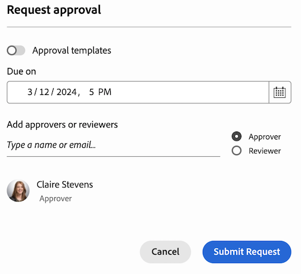

# 문서 검토 또는 승인 요청 만들기

Adobe Workfront에서 문서에 대한 다른 사용자 또는 팀의 승인을 요청하거나 승인할 필요 없이 문서를 검토하도록 요청할 수 있습니다.

>[!IMPORTANT]
>
>이 문서의 내용은 특정 계정에만 사용할 수 있는 업데이트된 문서 승인 기능에 적용됩니다. 표준 승인 프로세스에 대한 정보는 다음 목록에 있는 문서를 참조하십시오. [작업 승인](/help/quicksilver/review-and-approve-work/manage-approvals/manage-approvals.md).

## 액세스 요구 사항

이 문서의 단계를 수행하려면 다음 액세스 권한이 있어야 합니다.

<table style="table-layout:auto"> 
 <col> 
 <col> 
 <tbody> 
  <tr> 
   <td role="rowheader">Adobe Workfront 플랜*</td> 
   <td> 
임의
 </td> 
  </tr> 
  <tr> 
   <td role="rowheader">Adobe Workfront 라이센스*</td>  
   <td> 
검토 이상
 </td> 
  </tr> 
  <tr> 
   <td role="rowheader">액세스 수준 구성*</td> 
   <td> 
프로젝트, 작업, 문제, 템플릿, Portfolio, 프로그램, 보고서, 대시보드 및 캘린더, 문서에 대한 보기 또는 상위 액세스 권한
 
참고: 여전히 액세스 권한이 없는 경우 Workfront 관리자에게 액세스 수준에서 추가 제한을 설정하는지 문의하십시오. Workfront 관리자가 액세스 수준을 수정하는 방법에 대한 자세한 내용은 <a href="/help/quicksilver/administration-and-setup/add-users/configure-and-grant-access/create-modify-access-levels.md" class="MCXref xref">사용자 정의 액세스 수준 만들기 또는 수정</a>.
 </td> 
  </tr>
  <tr> 
   <td role="rowheader">개체 권한</td> 
   <td> 
액세스 또는 승인 요청과 연결된 개체에 대한 액세스 관리 
 
추가 액세스 요청에 대한 자세한 내용은 <a href="/help/quicksilver/workfront-basics/grant-and-request-access-to-objects/request-access.md" class="MCXref xref">오브젝트에 대한 액세스 요청 </a>.
 </td> 
  </tr> 
 </tbody> 
</table>

&#42;보유 중인 플랜, 라이선스 유형 또는 액세스 권한을 확인하려면 Workfront 관리자에게 문의하십시오.

## 문서 페이지에서 문서 검토 또는 승인 요청 만들기

1. 문서 위로 마우스를 가져간 다음 문서 세부 정보 를 클릭합니다.
   

1. 문서 이름 근처에서 버전 드롭다운에서 승인을 만들려는 문서 버전을 선택합니다. 기본적으로 최신 버전이 선택됩니다.

1. 클릭 **승인** 왼쪽 창에서 을 클릭합니다.

1. (선택 사항) 승인 기한을 설정합니다. 사용자와 팀은 지정된 기한 24시간 전에 이메일로 72시간 전에 알림을 받습니다.

1. 승인자를 추가하려면 **승인자** 을 클릭하고 사용자 또는 팀 이름을 입력하십시오.

1. 검토자를 추가하려면 **검토자** 확인란을 선택하고 사용자 또는 팀 이름을 입력하십시오.

   

1. 이전 단계를 반복하여 승인자 또는 검토자를 추가합니다.

## 문서 요약 창에서 문서 검토 또는 승인 요청 만들기

1. 문서가 포함된 프로젝트, 작업 또는 문제로 이동한 다음 선택 **문서**.

1. 필요한 문서를 클릭하면 해당 문서에 대한 문서 요약 창이 열립니다.

1. 버전 드롭다운에서 승인을 생성할 문서 버전을 선택합니다. 기본적으로 최신 버전이 선택됩니다.

1. 아래로 스크롤하여 **승인** 문서 요약 창에서 섹션을 **추가**.

1. (선택 사항) 승인 기한을 설정합니다. 사용자와 팀은 지정된 기한 24시간 전에 이메일로 72시간 전에 알림을 받습니다.

1. 승인자를 추가하려면 **승인자** 을 클릭하고 사용자 또는 팀 이름을 입력하십시오.

1. 검토자를 추가하려면 **검토자** 확인란을 선택하고 사용자 또는 팀 이름을 입력하십시오.

   

1. 이전 단계를 반복하여 승인자 또는 검토자를 추가합니다.

<!--
## Resubmit an approval on a new version

Document approval decisions are not automatically reset when you upload a new version. For example, if your document is approved with changes, the decision will show "changes" as the decision, even if you upload a new version with the specified changes. You can clear the decision on a new version if you manually resubmit the approval.

1. Go to the project, task, or issue that contains the document, then select **Documents**.
1. Find the document you need.

1. Scroll down to the **Approvals** section in the Summary, click the More icon, then click Resubmit.

   
-->
