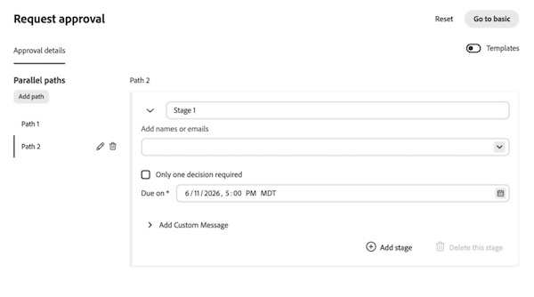

# 문서 승인 워크플로 만들기

Adobe Workfront에서 문서에 대한 다른 사용자 또는 팀의 승인을 요청하거나 승인할 필요 없이 문서를 검토하도록 요청할 수 있습니다.

>[!IMPORTANT]
>
>이 문서의 내용은 특정 계정에만 사용할 수 있는 업데이트된 문서 승인 기능에 적용됩니다. 표준 승인 프로세스에 대한 자세한 내용은 [작업 승인](/help/quicksilver/review-and-approve-work/manage-approvals/manage-approvals.md)에 나열된 문서를 참조하십시오.

## 액세스 요구 사항

+++ 이 문서의 기능에 대한 액세스 요구 사항을 보려면 확장하십시오.

<table style="table-layout:auto"> 
 <col> 
 <col> 
 <tbody> 
  <tr> 
   <td role="rowheader">Adobe Workfront 패키지</td> 
   <td> 
기존 Workfront 스토리지를 사용하여 승인을 관리하는 모든 Workfront 패키지

Adobe 클라우드 스토리지를 사용하여 승인을 관리하는 모든 워크플로우 패키지
 </td> 
  </tr> 
  <tr> 
   <td role="rowheader">Adobe Workfront 라이선스</td>  
   <td>
   
기여자 이상

   
검토 이상

   
Frame.io 통합을 사용하는 경우 승인 워크플로를 만들려면 표준 라이선스가 있어야 합니다.

   </td> 
  </tr> 
  <tr> 
   <td role="rowheader">액세스 수준 구성</td> 
   <td> 
프로젝트, 작업, 문제, 템플릿, 포트폴리오, 프로그램, 보고서, 대시보드 및 캘린더, 문서에 대한 보기 또는 상위 액세스 권한
 </td> 
  </tr>
  <tr> 
   <td role="rowheader">개체 권한</td> 
   <td> 
액세스 또는 승인 요청과 연결된 개체에 대한 액세스 관리 
 </td> 
  </tr> 
 </tbody> 
</table>

자세한 내용은 [Workfront 설명서의 액세스 요구 사항](/help/quicksilver/administration-and-setup/add-users/access-levels-and-object-permissions/access-level-requirements-in-documentation.md)을 참조하십시오.

+++

<!--

## Create an approval workflow in the legacy documents area in Production

If your organization is on Workfront storage, you will see the legacy documents area when you access documents in Workfront. For more information about Workfront storage, see [Differences between Adobe cloud storage and legacy Workfront storage](/help/quicksilver/review-and-approve-work/esm-overview.md#differences-between-adobe-cloud-storage-and-legacy-workfront-storage).

To create an approval workflow:

1. Go to the project, task, or issue that contains the document, then select **Documents** in the left panel.

1. Click on the document you need and the Document Summary panel for that document opens.

1. Select the version of the document you would like to create an approval for in the version dropdown. The latest version is selected by default.

1. Scroll down to the **Approvals** section, then click **Create workflow**.

1. Fill in the following details:

   <table>
   <tr>
   <td><strong>Stage name</strong></td>
   <td>Add a stage name. You can change the name to something more descriptive, such as <em>Initial Review</em> or <em>Final Approval</em>.</td>
   </tr>
   <tr>
   <td><strong>Add names or emails</strong></td>
   <td>Begin typing a user or team name to add as an approver or reviewer. If you only have reviewers, they will be notified and have the option to complete the review but no decision will be required or made.</td>
   </tr>
   <tr>
   <td><strong>One decision required (optional)</strong></td>
   <td>The first person who makes a decision completes the stage.</td>
   </tr>
   <tr>
   <td><strong>Due date (optional)</strong></td>
   <td>Set a due date for the approval. Users and teams are notified by email 72 hours, then 24 hours before the specified due date.</td>
   </tr>
   </table>

1. (Optional) Repeat the previous step to add additional stages as needed.

   >[!NOTE]
   >
   >If you add multiple stages, the approval workflow proceeds in the order the stages are listed. When all required decisions are made, the next stage begins and the previous stage is locked.

   

-->

## 기존 문서 영역에 승인 작업 과정 만들기

조직이 Workfront 스토리지에 있는 경우 Workfront의 문서에 액세스할 때 기존 문서 영역이 표시됩니다. Workfront 저장소에 대한 자세한 내용은 [Adobe 클라우드 저장소와 레거시 Workfront 저장소 간의 차이점](/help/quicksilver/review-and-approve-work/esm-overview.md#differences-between-adobe-cloud-storage-and-legacy-workfront-storage)을 참조하십시오.

### 기본 승인 작업 과정 만들기

단일 단계 승인 워크플로를 만들려면 다음 작업을 수행하십시오.

1. 문서가 포함된 프로젝트, 작업 또는 문제로 이동한 다음 왼쪽 패널에서 **문서**&#x200B;을(를) 선택합니다.

1. 필요한 문서를 클릭하면 해당 문서에 대한 [문서 요약] 패널이 열립니다.

1. 버전 드롭다운 메뉴에서 승인을 생성할 문서 버전을 선택합니다. 기본적으로 최신 버전이 선택됩니다.

1. **승인** 섹션까지 아래로 스크롤한 다음 **워크플로 만들기**&#x200B;를 클릭합니다. **승인 요청** 대화 상자가 기본 모드에서 열립니다.

1. 다음 세부 정보를 입력합니다.

   <table>
   <tr>
   <td><strong>승인 템플릿 사용(선택 사항)</strong></td>
   <td>드롭다운 메뉴에서 템플릿을 선택합니다. 템플릿에 하나의 경로와 스테이지가 있는 경우 기본 모드에서 적용됩니다. 템플릿에 둘 이상의 스테이지 또는 경로가 있는 경우 대화 상자가 자동으로 고급 모드로 전환되고 기본 모드에서 입력한 모든 입력은 템플릿의 콘텐츠로 대체됩니다.</td>
   </tr>
   <tr>
   <td><strong>이름 또는 이메일 추가</strong></td>
   <td>승인자 또는 검토자로 추가할 사용자 또는 팀 이름을 입력하십시오. 검토자만 있는 경우 알림을 받고 검토를 완료할 수 있는 옵션이 있지만 결정이 필요하거나 수행되지 않습니다.</td>
   </tr>
   <tr>
   <td><strong>필요한 결정은 단 하나입니다(선택 사항).</strong></td>
   <td>가장 먼저 결정을 내리는 사람이 단계를 완료합니다.</td>
   </tr>
   <tr>
   <td><strong>기한(선택 사항)</strong></td>
   <td>승인에 대한 기한을 설정하십시오. 사용자와 팀은 지정된 기한으로부터 24시간 전에 이메일로 72시간 전에 알림을 받습니다.</td>
   </tr>
   <tr>
   <td><strong>사용자 지정 메시지 추가(선택 사항)</strong></td>
   <td><strong>사용자 지정 메시지 추가</strong> 텍스트 상자에 메시지를 입력하십시오. 이 메시지는 승인 이메일 알림과 Workfront의 승인 탭에 표시됩니다.
   
참고: 승인 워크플로우가 만들어진 후 사용자 지정 메시지를 편집하면 업데이트된 이메일 알림이 기존 참여자에게 전송됩니다. 나중에 참가자를 추가하면 해당 이메일 알림에 사용자 지정 메시지가 포함됩니다.

   </td>
   </tr>
   </table>

1. **승인 요청**&#x200B;을 클릭합니다.

   

### 고급 승인 작업 과정 만들기

고급 모드는 병렬 경로뿐만 아니라 여러 단계를 지원합니다. 각 경로는 독립적으로 실행되며 하나 이상의 순차적 단계를 포함합니다. 단계의 모든 필수 결정이 내려지면 해당 경로의 다음 단계가 시작되고 이전 단계가 잠기며 새 단계의 검토자 및 승인자가 이메일 알림을 받습니다.

작업 필요 결정은 해당 경로가 중지되지만 다른 경로의 승인 워크플로에는 영향을 주지 않습니다. 최대 30개의 경로 및 총 100개의 단계를 구성할 수 있습니다.

고급 승인 워크플로를 만들려면 다음 작업을 수행하십시오.

1. 문서가 포함된 프로젝트, 작업 또는 문제로 이동한 다음 왼쪽 패널에서 **문서**&#x200B;을(를) 선택합니다.

1. 필요한 문서를 클릭하면 해당 문서에 대한 [문서 요약] 패널이 열립니다.

1. 버전 드롭다운 메뉴에서 승인을 생성할 문서 버전을 선택합니다. 기본적으로 최신 버전이 선택됩니다.

1. **승인** 섹션까지 아래로 스크롤한 다음 **워크플로 만들기**&#x200B;를 클릭합니다.

1. **승인 요청** 대화 상자의 오른쪽 상단에서 **고급으로 이동**&#x200B;을 클릭합니다. 기본 모드로 입력한 모든 입력이 유지되어 **경로 1**, **단계 1**&#x200B;에 적용됩니다.

   >[!TIP]
   >
   >승인을 만드는 동안 오른쪽 상단의 **기본 모드로 이동**&#x200B;을 클릭하여 기본 모드로 돌아갈 수 있습니다. **승인 요청**&#x200B;을 클릭한 후 **기본으로 이동** 옵션을 더 이상 사용할 수 없습니다.

1. 경로 1의 단계 1에 대한 세부 정보 입력:

   <table>
   <tr>
   <td><strong>단계 이름</strong></td>
   <td>단계 이름은 기본적으로 <em>단계 1</em>, <em>단계 2</em> 등으로 지정됩니다. <em>초기 검토</em> 또는 <em>최종 승인</em>과 같이 보다 설명적인 단계로 단계 이름을 바꾸십시오.</td>
   </tr>
   <tr>
   <td><strong>이름 또는 이메일 추가</strong></td>
   <td>승인자 또는 검토자로 추가할 사용자 또는 팀 이름을 입력하십시오. 검토자만 있는 경우 알림을 받고 검토를 완료할 수 있는 옵션이 있지만 결정이 필요하거나 수행되지 않습니다.
참고: 검토자 또는 승인자는 동일한 에셋에서 한 번에 하나의 진행 단계에만 할당할 수 있습니다. 여러 병렬 단계가 동시에 열려 있는 경우 동일한 사람을 둘 이상의 단계에 추가할 수 없습니다.
</td>
   </tr>
   <tr>
   <td><strong>필요한 결정은 단 하나입니다(선택 사항).</strong></td>
   <td>가장 먼저 결정을 내리는 사람이 단계를 완료합니다.</td>
   </tr>
   <tr>
   <td><strong>기한(선택 사항)</strong></td>
   <td>각 경로의 첫 번째 단계는 절대 기한을 지원합니다. 경로의 후속 각 단계는 상대적 기한(해당 단계가 열린 날짜로부터 경과된 일 수)을 지원합니다. 사용자와 팀은 72시간 전에 이메일로 통보를 받은 후 기한으로부터 24시간 전에 알림을 받습니다.</td>
   </tr>
   <tr>
   <td><strong>사용자 지정 메시지 추가(선택 사항)</strong></td>
   <td><strong>사용자 지정 메시지 추가</strong> 텍스트 상자에 메시지를 입력하십시오. 이 메시지는 승인 이메일 알림과 Workfront의 승인 탭에 표시됩니다.
두 번째 단계를 추가하면 기본적으로 <strong>모든 단계에서 이 메시지 표시</strong>가 선택됩니다. 모든 단계에서 동일한 메시지를 사용하도록 선택한 상태로 둡니다. 각 단계에 대해 다른 메시지를 사용하려면 <strong>모든 단계에서 이 메시지 표시</strong>의 선택을 취소한 다음 각 단계의 <strong>사용자 지정 메시지 추가</strong> 텍스트 상자에 단계별 메시지를 입력하십시오.
</td>
   </tr>
   </table>

1. (선택 사항) 경로에 다른 단계를 추가하려면 **단계 추가**&#x200B;를 클릭합니다. 경로 내의 단계는 나열된 순서대로 순차적으로 실행됩니다. 한 경로에서 다른 경로로 단계를 이동할 수는 없지만 경로 내의 단계를 재정렬할 수는 있습니다. 각 경로에는 서로 다른 스테이지 수가 있을 수 있습니다.

1. (선택 사항) **병렬 경로**&#x200B;에서 **경로 추가**&#x200B;를 클릭하여 다른 경로를 추가합니다. 새 경로는 하나의 빈 단계로 시작하여 선택한 경로가 됩니다. 경로의 이름을 바꾸려면 경로 레이블을 마우스로 가리키고 연필 아이콘을 클릭한 다음 새 이름을 입력합니다.

1. (선택 사항) 경로를 제거하려면 경로 레이블을 마우스로 가리키고 휴지통 아이콘을 클릭합니다. **경로 1**&#x200B;을(를) 제거할 수 없으며 경로의 순서를 변경할 수 없습니다. 경로 내의 스테이지가 잠겨 있지 않거나 완료된 경우에만 다른 경로를 제거할 수 있습니다.

   

1. (선택 사항) 모든 경로와 단계를 지우고 다시 시작하려면 오른쪽 상단의 **재설정**&#x200B;을 클릭합니다.

1. **승인 요청**&#x200B;을 클릭합니다.

<!--

## Create an approval workflow in the new Documents area in Production

If your organization uses Adobe cloud storage, you will see the new Documents area when you access documents in Workfront. For more information about Adobe cloud storage, see [Adobe cloud storage overview](/help/quicksilver/review-and-approve-work/esm-overview.md).

To create an approval workflow:

1. Go to the project, task, or issue that contains the document, then select **Documents** in the left panel.

1. Click on the document, then click the **Approvals** icon on the right side of the page.

   

1. Click **Create workflow**, then fill in the following details:

   <table>
   <tr>
   <td><strong>Stage name</strong></td>
   <td>Add a stage name. You can change the name to something more descriptive, such as <em>Initial Review</em> or <em>Final Approval</em>.</td>
   </tr>
   <tr>
   <td><strong>Add names or emails</strong></td>
   <td>Begin typing a user or team name to add as an approver or reviewer. If you only have reviewers, they will be notified and have the option to complete the review but no decision will be required or made.</td>
   </tr>
   <tr>
   <td><strong>One decision required (optional)</strong></td>
   <td>The first person who makes a decision completes the stage.</td>
   </tr>
   <tr>
   <td><strong>Due date (optional)</strong></td>
   <td>Set a due date for the approval. Users and teams are notified by email 72 hours, then 24 hours before the specified due date.</td>
   </tr>
   </table>

1. (Optional) Repeat the previous step to add additional stages as needed.

   >[!NOTE]
   >
   >If you add multiple stages, the approval workflow proceeds in the order the stages are listed. When all required decisions are made, the next stage begins and the previous stage is locked.

   
   
-->

## 새 문서 영역에 승인 작업 과정 만들기

조직에서 Adobe 클라우드 스토리지를 사용하는 경우 Workfront의 문서에 액세스할 때 새 문서 영역이 표시됩니다. Adobe 클라우드 저장소에 대한 자세한 내용은 [Adobe 클라우드 저장소 개요](/help/quicksilver/review-and-approve-work/esm-overview.md)를 참조하십시오.

**승인 요청** 대화 상자는 기본적으로 **기본** 모드로 열립니다. 기본 모드는 한 세트의 승인자 또는 검토자가 있는 단일 단계입니다. 다단계 승인 또는 병렬 경로를 구성하려면 **고급** 모드로 전환하십시오.

### 기본 승인 작업 과정 만들기

단일 단계 승인 워크플로를 만들려면 다음 작업을 수행하십시오.

1. 문서가 포함된 프로젝트, 작업 또는 문제로 이동한 다음 왼쪽 패널에서 **문서**&#x200B;을(를) 선택합니다.

1. 문서를 클릭한 다음 페이지 오른쪽의 **승인** 아이콘을 클릭합니다.

   

1. **워크플로 만들기**&#x200B;를 클릭합니다. **승인 요청** 대화 상자가 기본 모드에서 열립니다.

1. 다음 세부 정보를 입력합니다.

   <table>
   <tr>
   <td><strong>승인 템플릿 사용(선택 사항)</strong></td>
   <td>템플릿 필드는 기본적으로 축소됩니다. 필드를 클릭하여 확장한 다음 드롭다운 메뉴에서 템플릿을 선택합니다. 템플릿에 하나의 경로와 스테이지가 있는 경우 기본 모드에서 적용됩니다. 템플릿에 둘 이상의 스테이지 또는 경로가 있는 경우 대화 상자가 자동으로 고급 모드로 전환되고 기본 모드에서 입력한 모든 입력은 템플릿의 콘텐츠로 대체됩니다.</td>
   </tr>
   <tr>
   <td><strong>이름 또는 이메일 추가</strong></td>
   <td>승인자 또는 검토자로 추가할 사용자 또는 팀 이름을 입력하십시오. 검토자만 있는 경우 알림을 받고 검토를 완료할 수 있는 옵션이 있지만 결정이 필요하거나 수행되지 않습니다.</td>
   </tr>
   <tr>
   <td><strong>필요한 결정은 단 하나입니다(선택 사항).</strong></td>
   <td>가장 먼저 결정을 내리는 사람이 단계를 완료합니다.</td>
   </tr>
   <tr>
   <td><strong>기한(선택 사항)</strong></td>
   <td>승인에 대한 기한을 설정하십시오. 사용자와 팀은 지정된 기한으로부터 24시간 전에 이메일로 72시간 전에 알림을 받습니다.</td>
   </tr>
   <tr>
   <td><strong>사용자 지정 메시지 추가(선택 사항)</strong></td>
   <td><strong>사용자 지정 메시지 추가</strong> 텍스트 상자에 메시지를 입력하십시오. 이 메시지는 승인 이메일 알림과 Workfront의 승인 탭에 표시됩니다.</td>
   </tr>
   </table>

1. **승인 요청**&#x200B;을 클릭합니다.

   

>[!NOTE]
>
>* 이전 세션에 관계없이 **승인 요청** 대화 상자가 항상 기본 모드로 열립니다.
>* 승인 워크플로가 만들어진 후 사용자 지정 메시지를 편집하면 업데이트된 이메일 알림이 기존 참여자에게 전송됩니다. 나중에 참가자를 추가하면 해당 이메일 알림에 사용자 지정 메시지가 포함됩니다.
>* 승인이 저장되면 다시 기본 모드로 전환할 수 없습니다. 승인이 잠기거나 완료되지 않는 한 진행 중인 승인을 기본에서 고급으로 전환할 수 있습니다.

### 고급 승인 작업 과정 만들기

고급 모드는 병렬 경로를 지원합니다. 각 경로는 독립적으로 실행되며 하나 이상의 순차적 단계를 포함합니다. 단계의 모든 필수 결정이 내려지면 해당 경로의 다음 단계가 시작되고 이전 단계가 잠기며 새 단계의 검토자 및 승인자가 이메일 알림을 받습니다.

작업 필요 결정은 해당 경로가 중지되지만 다른 경로의 승인 워크플로에는 영향을 주지 않습니다. 최대 30개의 경로 및 총 100개의 단계를 구성할 수 있습니다.

고급 승인 워크플로를 만들려면 다음 작업을 수행하십시오.

1. 문서가 포함된 프로젝트, 작업 또는 문제로 이동한 다음 왼쪽 패널에서 **문서**&#x200B;을(를) 선택합니다.

1. 문서를 클릭한 다음 페이지 오른쪽의 **승인** 아이콘을 클릭합니다.

   

1. **워크플로 만들기**&#x200B;를 클릭합니다.

1. **승인 요청** 대화 상자의 오른쪽 상단에서 **고급으로 이동**&#x200B;을 클릭합니다. 기본 모드로 입력한 모든 입력이 유지되어 **경로 1**, **단계 1**&#x200B;에 적용됩니다.

   >[!TIP]
   >
   >승인을 만드는 동안 오른쪽 상단의 **기본 모드로 이동**&#x200B;을 클릭하여 기본 모드로 돌아갈 수 있습니다. **승인 요청**&#x200B;을 클릭한 후 **기본으로 이동** 옵션을 더 이상 사용할 수 없습니다.

1. 경로 1의 단계 1에 대한 세부 정보 입력:

   <table>
   <tr>
   <td><strong>단계 이름</strong></td>
   <td>단계 이름은 기본적으로 <em>단계 1</em>, <em>단계 2</em> 등으로 지정됩니다. <em>초기 검토</em> 또는 <em>최종 승인</em>과 같이 보다 설명적인 단계로 단계 이름을 바꾸십시오.</td>
   </tr>
   <tr>
   <td><strong>이름 또는 이메일 추가</strong></td>
   <td>승인자 또는 검토자로 추가할 사용자 또는 팀 이름을 입력하십시오. 검토자만 있는 경우 알림을 받고 검토를 완료할 수 있는 옵션이 있지만 결정이 필요하거나 수행되지 않습니다.
참고: 검토자 또는 승인자는 동일한 에셋에서 한 번에 하나의 진행 단계에만 할당할 수 있습니다. 여러 병렬 단계가 동시에 열려 있는 경우 동일한 사람을 둘 이상의 단계에 추가할 수 없습니다.
</td>
   </tr>
   <tr>
   <td><strong>필요한 결정은 단 하나입니다(선택 사항).</strong></td>
   <td>가장 먼저 결정을 내리는 사람이 단계를 완료합니다.</td>
   </tr>
   <tr>
   <td><strong>기한(선택 사항)</strong></td>
   <td>각 경로의 첫 번째 단계는 절대 기한을 지원합니다. 경로의 후속 각 단계는 상대적 기한(해당 단계가 열린 날짜로부터 경과된 일 수)을 지원합니다. 사용자와 팀은 72시간 전에 이메일로 통보를 받은 후 기한으로부터 24시간 전에 알림을 받습니다.</td>
   </tr>
   <tr>
   <td><strong>사용자 지정 메시지 추가(선택 사항)</strong></td>
   <td><strong>사용자 지정 메시지 추가</strong> 텍스트 상자에 메시지를 입력하십시오. 이 메시지는 승인 이메일 알림과 Workfront의 승인 탭에 표시됩니다.
두 번째 단계를 추가하면 기본적으로 <strong>모든 단계에서 이 메시지 표시</strong>가 선택됩니다. 모든 단계에서 동일한 메시지를 사용하도록 선택한 상태로 둡니다. 각 단계에 대해 다른 메시지를 사용하려면 <strong>모든 단계에서 이 메시지 표시</strong>의 선택을 취소한 다음 각 단계의 <strong>사용자 지정 메시지 추가</strong> 텍스트 상자에 단계별 메시지를 입력하십시오.
</td>
   </tr>
   </table>

1. (선택 사항) 경로에 다른 단계를 추가하려면 **단계 추가**&#x200B;를 클릭합니다. 경로 내의 단계는 나열된 순서대로 순차적으로 실행됩니다. 한 경로에서 다른 경로로 단계를 이동할 수는 없지만 경로 내의 단계를 재정렬할 수는 있습니다. 각 경로에는 서로 다른 스테이지 수가 있을 수 있습니다.

1. (선택 사항) **병렬 경로**&#x200B;에서 **경로 추가**&#x200B;를 클릭하여 다른 경로를 추가합니다. 새 경로는 하나의 빈 단계로 시작하여 선택한 경로가 됩니다. 경로의 이름을 바꾸려면 경로 레이블을 마우스로 가리키고 연필 아이콘을 클릭한 다음 새 이름을 입력합니다.

1. (선택 사항) 경로를 제거하려면 경로 레이블을 마우스로 가리키고 휴지통 아이콘을 클릭합니다. **경로 1**&#x200B;을(를) 제거할 수 없으며 경로의 순서를 변경할 수 없습니다. 경로 내의 스테이지가 잠겨 있지 않거나 완료된 경우에만 다른 경로를 제거할 수 있습니다.

   

1. (선택 사항) 모든 경로와 단계를 지우고 다시 시작하려면 오른쪽 상단의 **재설정**&#x200B;을 클릭합니다.

1. **승인 요청**&#x200B;을 클릭합니다.

<!--
## Resubmit an approval on a new version

Document approval decisions are not automatically reset when you upload a new version. For example, if your document is approved with changes, the decision will show "changes" as the decision, even if you upload a new version with the specified changes. You can clear the decision on a new version if you manually resubmit the approval.

1. Go to the project, task, or issue that contains the document, then select **Documents**.
1. Find the document you need.

1. Scroll down to the **Approvals** section in the Summary, click the More icon, then click Resubmit.

   
-->