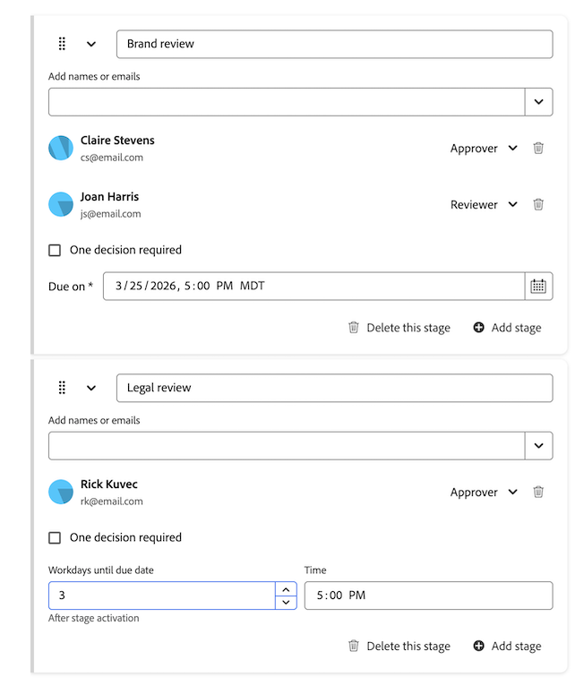

# 문서 승인 워크플로에서 승인자 또는 검토자 제거

에셋 또는 문서에 할당된 개별 승인자 또는 검토자를 제거할 수 있습니다.

>[!IMPORTANT]
>
>이 문서의 내용은 특정 계정에만 사용할 수 있는 업데이트된 문서 승인 기능에 적용됩니다. 표준 승인 프로세스에 대한 자세한 내용은 [작업 승인](/help/quicksilver/review-and-approve-work/manage-approvals/manage-approvals.md)에 나열된 문서를 참조하십시오.

## 액세스 요구 사항

+++ 이 문서의 기능에 대한 액세스 요구 사항을 보려면 확장하십시오.

<table style="table-layout:auto"> 
 <col> 
 <col> 
 <tbody> 
  <tr> 
   <td role="rowheader">Adobe Workfront 패키지</td> 
   <td> 
Any
 </td> 
  </tr> 
  <tr> 
   <td role="rowheader">Adobe Workfront 라이선스</td> 
   <td> 
   
기여자 이상

   
검토 이상

   
Frame.io 통합을 사용하는 경우 승인 워크플로를 만들려면 표준 라이선스가 있어야 합니다.

   </td> 
  </tr> 
  <tr> 
   <td role="rowheader">액세스 수준 구성</td> 
   <td> 
프로젝트, 작업, 문제, 템플릿, 포트폴리오, 프로그램, 보고서, 대시보드 및 캘린더, 문서에 대한 보기 또는 상위 액세스 권한
 </td> 
  </tr> 
  <tr> 
   <td role="rowheader">개체 권한</td> 
   <td> 
액세스 또는 승인 요청과 연결된 개체에 대한 액세스 관리 
  </td> 
  </tr> 
 </tbody> 
</table>

자세한 내용은 [Workfront 설명서의 액세스 요구 사항](/help/quicksilver/administration-and-setup/add-users/access-levels-and-object-permissions/access-level-requirements-in-documentation.md)을 참조하십시오.

+++

## 기존 문서 영역에서 승인 워크플로에서 승인자 또는 검토자 제거

조직이 Workfront 스토리지에 있는 경우 Workfront의 문서에 액세스할 때 기존 문서 영역이 표시됩니다. Workfront 스토리지에 대한 자세한 내용은 [Workfront 스토리지와 Adobe 엔터프라이즈 스토리지 비교](/help/quicksilver/review-and-approve-work/esm-overview.md#workfront-storage-vs-adobe-enterprise-storage)를 참조하십시오.

승인 워크플로에서 승인자 또는 검토자를 제거하려면 다음을 수행합니다.

1. 문서가 포함된 프로젝트, 작업 또는 문제로 이동한 다음 왼쪽 패널에서 **문서**&#x200B;을(를) 선택합니다.

1. 필요한 문서를 클릭하면 해당 문서에 대한 [문서 요약] 패널이 열립니다.

1. 문서 요약 패널에서 **승인** 섹션까지 아래로 스크롤합니다.

1. **워크플로 편집**&#x200B;을 클릭합니다.

1. 제거할 참가자를 찾은 다음 해당 이름 옆에 있는 **제거** 아이콘을 클릭합니다.

   승인 또는 검토 요청이 제거되고 승인자가 더 이상 승인이 필요하지 않다는 알림을 받습니다. 승인 관련 공유 액세스도 제거됩니다.

   

1. (선택 사항) 승인자의 역할을 검토자로 변경하거나 그 반대로 변경하려면 사용자 이름 옆에 있는 드롭다운 메뉴를 클릭하고 새 역할을 선택합니다.

1. 이전 단계를 반복하여 추가 승인자 또는 검토자를 제거합니다.

## 새 문서 영역에서 승인 워크플로에 대한 승인자 또는 검토자 제거

조직에서 엔터프라이즈 스토리지를 사용하는 경우 Workfront의 문서에 액세스할 때 새 문서 영역이 표시됩니다. 엔터프라이즈 스토리지에 대한 자세한 내용은 [엔터프라이즈 스토리지 개요](/help/quicksilver/review-and-approve-work/esm-overview.md)를 참조하십시오.

승인 워크플로우를 만들려면 다음 작업을 수행하십시오.

1. 문서가 포함된 프로젝트, 작업 또는 문제로 이동한 다음 왼쪽 패널에서 **문서**&#x200B;을(를) 선택합니다.

1. 문서를 클릭한 다음 페이지 오른쪽의 **승인** 아이콘을 클릭합니다.

   

1. **워크플로 편집**&#x200B;을 클릭합니다.

1. 제거할 참가자를 찾은 다음 해당 이름 옆에 있는 **제거** 아이콘을 클릭합니다.

   승인 또는 검토 요청이 제거되고 승인자가 더 이상 승인이 필요하지 않다는 알림을 받습니다.

1. (선택 사항) 승인자의 역할을 검토자로 변경하거나 그 반대로 변경하려면 사용자 이름 옆에 있는 드롭다운 메뉴를 클릭하고 새 역할을 선택합니다.

1. 이전 단계를 반복하여 추가 승인자 또는 검토자를 제거합니다.

   

1. **저장**&#x200B;을 클릭합니다.