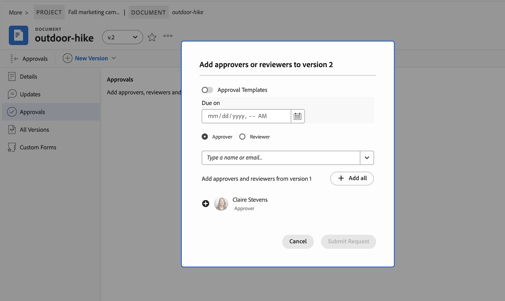

# 새 문서 버전 업로드 및 승인 요청

표시된 문서에 이전 검토 작업이 필요한 경우 원본 문서에 새 버전을 업로드하고 다른 버전의 승인을 시작할 수 있습니다. 새 버전의 문서를 업로드하면 이전 버전이 잠깁니다.

새 버전의 파일 이름이 이전 버전의 파일 이름과 다른 경우 Workfront에 새 파일 이름으로 문서가 표시됩니다.

미결 승인이 있는 문서에 새 버전이 추가되면 이전 버전의 승인이 철회됨으로 표시됩니다. 일부 참가자가 아직 결정을 내리지 않았더라도 기존 승인 절차는 종료된다.

최신 문서 버전을 삭제하면 이전 버전이 잠긴 상태로 유지됩니다. 이전 버전을 편집해야 하는 경우 수동으로 잠금을 해제해야 합니다.

## 액세스 요구 사항

+++ 을 확장하여 이 문서의 기능에 대한 액세스 요구 사항을 봅니다.

<table style="table-layout:auto"> 
 <col> 
 </col> 
 <col> 
 </col> 
 <tbody> 
  <tr> 
   <td role="rowheader">Adobe Workfront 패키지</td> 
   <td> 
 임의
 </td> 
  </tr> 
  <tr> 
   <td role="rowheader">Adobe Workfront 라이센스*</td> 
   <td> 
요청 이상

   
기여자 이상
 </td> 
  </tr> 
  <tr data-mc-conditions=""> 
   <td role="rowheader">액세스 수준 구성</td> 
   <td> 
문서에 대한 액세스 편집
 
참고: 여전히 액세스 권한이 없는 경우 Workfront 관리자에게 액세스 수준에서 추가 제한을 설정하는지 문의하십시오. Workfront 관리자가 액세스 수준을 수정하는 방법에 대한 자세한 내용은 <a href="/help/quicksilver/administration-and-setup/add-users/configure-and-grant-access/create-modify-access-levels.md" class="MCXref xref">사용자 지정 액세스 수준 만들기 또는 수정</a>을 참조하십시오.
 </td> 
  </tr> 
  <tr data-mc-conditions=""> 
   <td role="rowheader">개체 권한</td> 
   <td> 
문서와 연관된 객체에 대한 액세스 편집
 
추가 액세스 요청에 대한 자세한 내용은 <a href="/help/quicksilver/workfront-basics/grant-and-request-access-to-objects/grant-and-request-access-to-objects.md" class="MCXref xref">개체 </a>에 대한 액세스 요청 을 참조하십시오.
 </td> 
  </tr> 
 </tbody> 
</table>

자세한 내용은 [Workfront 설명서의 액세스 요구 사항](/help/quicksilver/administration-and-setup/add-users/access-levels-and-object-permissions/access-level-requirements-in-documentation.md)을 참조하십시오.

+++

## 드래그 앤 드롭을 사용하여 새 버전 추가

>[!NOTE]
>
>드래그 앤 드롭은 Internet Explorer에서 작동하지 않습니다.

문서에 대한 또 다른 검토 및 승인이 필요한 경우 Workfront에서 새 문서 버전을 만들 수 있습니다.

이전 참여자, 새 참여자 또는 두 가지 모두를 혼합하여 추가할 수 있습니다. 문서 세부 정보 페이지에서 이전 버전 및 참여자에 대한 정보를 볼 수 있습니다.

새 버전을 추가하려면 다음을 수행하십시오.

1. Workfront의 문서로 이동합니다.
1. 이전 문서 위에 새 파일을 끌어다 놓습니다. 이렇게 하면 새 버전이 자동으로 만들어집니다.

1. 문서 업로드가 완료되면 문서를 선택한 다음 **문서 세부 정보**를 클릭합니다.
   

1. 왼쪽 패널에서 **승인**&#x200B;을 클릭한 다음 **추가**&#x200B;를 클릭합니다.

1. 모든 이전 참가자를 추가하려면 **모두 추가**&#x200B;를 클릭하세요. 필요에 따라 새 참여자를 추가하거나 이전 참여자를 제거할 수도 있습니다.

1. 기존 승인 템플릿을 추가하려면 템플릿 버튼을 클릭하고 템플릿 이름을 입력하십시오.

   >[!TIP]
   >
   >   표준 라이선스가 있는 사용자는 설정 영역에서 재생성 가능한 승인 템플릿을 만들 수 있습니다. 자세한 내용은 [자산 및 문서에 대한 승인 템플릿 만들기](/help/quicksilver/review-and-approve-work/document-reviews-and-approvals/manage-document-approvals/create-approval-template.md)를 참조하십시오.

1. (선택 사항) 승인 기한을 설정합니다. 사용자와 팀은 지정된 기한 24시간 전에 이메일로 72시간 전에 알림을 받습니다.

1. 모든 검토자와 승인자를 추가했으면 **요청 제출**&#x200B;을 클릭합니다. 참가자에게는 이메일을 통해 알림이 전송됩니다.

   

