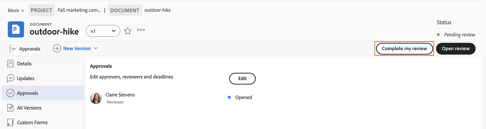

# Review and approve with the Frame.io viewer

You can review and approve documents in Workfront using the Frame.io viewer.

Reviewing Workfront documents with the Frame.io viewer allows you to leave comments or mark up specific sections of a document, image, or video to collaborate efficiently with your team and ensure that feedback is clear and actionable.

For more information on the Frame.io integration with Workfront, see [Unified review and approval overview](/help/quicksilver/review-and-approve-work/document-reviews-and-approvals/document-approvals-overview.md).

## 액세스 요구 사항

+++ 이 문서의 기능에 대한 액세스 요구 사항을 보려면 확장하십시오.

<table style="table-layout:auto"> 
 <col> 
 </col> 
 <col> 
 </col> 
 <tbody> 
  <tr> 
   <td role="rowheader">Adobe Workfront 패키지</td> 
   <td> 
기존 Workfront 스토리지를 사용하여 승인을 관리하는 모든 Workfront 패키지

Adobe 엔터프라이즈 스토리지를 사용하여 승인을 관리하는 모든 워크플로우 패키지
 </td> 
  </tr> 
  <tr> 
   <td role="rowheader">Adobe Workfront 라이선스</td> 
   <td> 
요청 이상

   
기여자 이상
 </td> 
  </tr> 
  <tr data-mc-conditions=""> 
   <td role="rowheader">액세스 수준 구성</td> 
   <td> 
문서에 대한 액세스 편집
 </td> 
  </tr> 
  <tr data-mc-conditions=""> 
   <td role="rowheader">개체 권한</td> 
   <td> 
문서와 연관된 객체에 대한 액세스 편집
 </td> 
  </tr> 
 </tbody> 
</table>

자세한 내용은 [Workfront 설명서의 액세스 요구 사항](/help/quicksilver/administration-and-setup/add-users/access-levels-and-object-permissions/access-level-requirements-in-documentation.md)을 참조하십시오.

+++

## 전제 조건

* You must have the Workfront and Frame.io integration set up in your Workfront instance. For more information, see [Unified review and approval overview](/help/quicksilver/review-and-approve-work/document-reviews-and-approvals/document-approvals-overview.md#integration-requirements).

## 문서 검토

As a reviewer, you can add comments to and mark up assets. Once finished, you can mark your review complete in Workfront. Marking the review as complete is not required for the asset to move forward in the approval process.

1. Go to your review email notification, and click **Go to review**.
또는
Go the Workfront Home page, find the My Approvals widget, then click **Open review**.

   >[!NOTE]
   > 
   >홈 페이지에 내 승인 위젯을 추가해야 할 수 있습니다. 자세한 내용은 [홈에서 위젯 추가, 편집 또는 제거](/help/quicksilver/workfront-basics/using-home/using-the-home-area/add-edit-remove-widgets-in-new-home.md)를 참조하세요.

1. Frame.io에서 댓글 달기 도구를 사용하여 피드백을 남기거나 질문합니다.
주석 및 자산 마크업은 Frame.io 뷰어에서만 볼 수 있습니다. 주석은 Workfront에 표시되지 않습니다. Frame.io 뷰어 사용에 대한 자세한 내용은 [미디어에 주석 달기](https://help.frame.io/en/articles/9105251-commenting-on-your-media)를 참조하십시오.
1. 문서가 만족스러우면 Workfront의 문서 세부 정보 페이지로 다시 이동하여 검토를 완료로 표시하십시오.

   

## 문서 승인

승인자는 주석을 추가하고 에셋에 표시할 수 있습니다. 승인 프로세스를 진행하려면 결정을 내려야 합니다.

지정된 모든 승인자가 &quot;승인됨&quot;을 선택할 때까지 문서가 승인됨 상태로 이동하지 않습니다.

문서에 대해 결정을 내리려면

1. 리뷰 전자 메일 알림으로 이동한 다음 **리뷰로 이동**&#x200B;을 클릭합니다.
또는
Workfront 홈 페이지로 이동하여 내 승인 위젯을 찾은 다음 **검토 열기**&#x200B;를 클릭합니다.

   >[!NOTE]
   > 
   >홈 페이지에 내 승인 위젯을 추가해야 할 수 있습니다. 자세한 내용은 [홈에서 위젯 추가, 편집 또는 제거](/help/quicksilver/workfront-basics/using-home/using-the-home-area/add-edit-remove-widgets-in-new-home.md)를 참조하세요.

1. Frame.io에서 댓글 달기 도구를 사용하여 피드백을 남기거나 질문합니다. 주석 및 에셋 마크업은 Frame.io 뷰어에서만 볼 수 있습니다. Frame.io 뷰어 사용에 대한 자세한 내용은 [미디어에 주석 달기](https://help.frame.io/en/articles/9105251-commenting-on-your-media)를 참조하십시오.
1. 문서에 만족하면 Frame.io 뷰어에서 다음 결정 중 하나를 선택할 수 있습니다.

   * **승인**: 자산은 변경할 필요가 없으며 사용할 준비가 되었습니다.
   * **작업 필요**: 자산을 변경해야 하며 사용할 준비가 되지 않았습니다. 지정된 변경 사항이 적용되면 에셋을 새 버전으로 업로드하고 다른 승인을 거쳐야 합니다. 자세한 내용은 [새 문서 버전 업로드 및 승인 요청](/help/quicksilver/review-and-approve-work/document-reviews-and-approvals/manage-document-approvals/upload-new-doc-version.md)을 참조하십시오. <!--do they need to tell someone it was uploaded via comment tagging?-->

   결정을 내리면 문서 소유자에게 이메일을 통해 알림이 전송됩니다.

   Workfront의 의사 결정에 대한 자세한 내용은 [문서 의사 결정 상태 개요](/help/quicksilver/review-and-approve-work/document-reviews-and-approvals/manage-document-approvals/document-approval-status.md)를 참조하십시오.

   

<!--is document owner the correct term?-->
