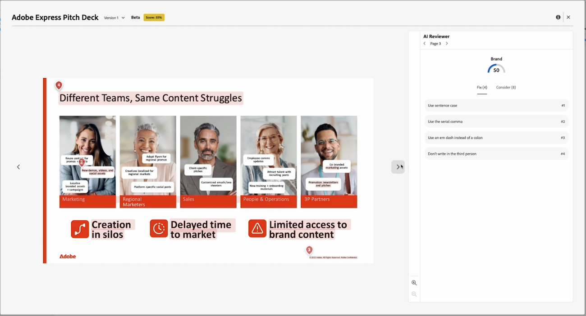

# 콘텐츠 검토자 점수 및 피드백 보기

{{highlighted-preview-article-level}}

검토 및 승인 요청을 제출한 후 몇 초 후에 문서 요약 패널에서 콘텐츠 검토자의 점수와 피드백을 볼 수 있습니다.

콘텐츠 검토자는 검토 및 승인 워크플로에서 의사 결정자가 되도록 설계되지 않았습니다. 지정된 브랜드 요구 사항에 맞게 에셋을 조정하기 위한 점수 및 권장 사항만 제공합니다.

## 점수 및 피드백 보기

문서 요약 패널 또는 문서 세부 정보 페이지의 승인 탭에서 콘텐츠 검토자의 점수와 피드백을 볼 수 있습니다.

1. Workfront 알림 전자 메일에서 **검토로 이동**&#x200B;을 클릭합니다.

   또는

   문서가 업로드된 문서 영역으로 이동하여 문서 요약 패널을 엽니다.
1. **점수**를 클릭합니다.
   

점수 및 피드백 창에서 컨텐츠 검토자는 자산이 지정된 지침을 어떻게 충족하지 못하는지 설명합니다.

## 새 버전 업로드 및 콘텐츠 검토자 다시 추가

콘텐츠 검토자의 피드백을 기반으로 에셋을 조정해야 하는 경우 새 버전을 업로드하고 새 검토를 시작할 수 있습니다.

자세한 내용은 [새 문서 버전 업로드 및 승인 요청](/help/quicksilver/review-and-approve-work/document-reviews-and-approvals/manage-document-approvals/upload-new-doc-version.md)을 참조하십시오.
